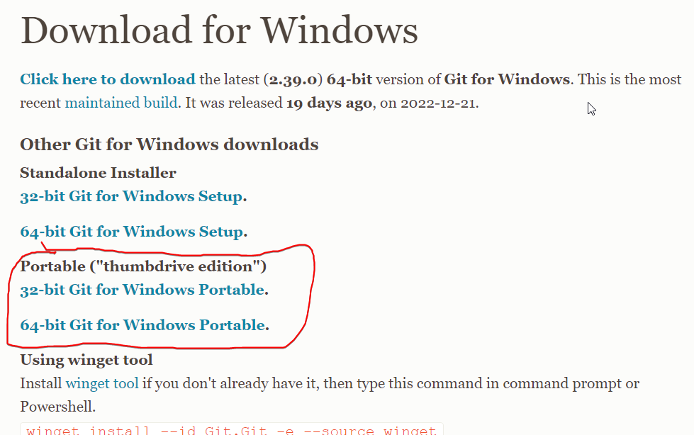
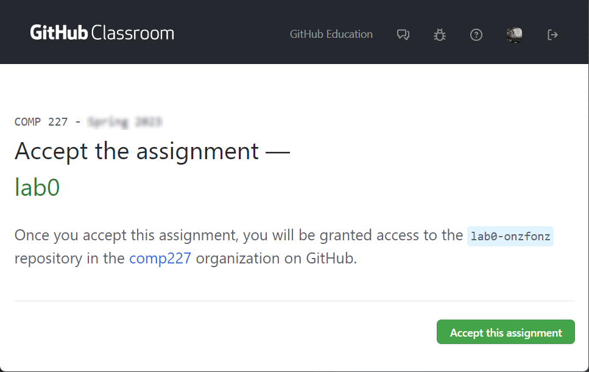
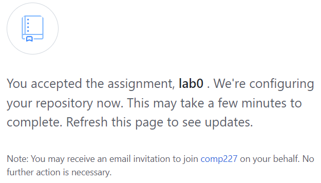
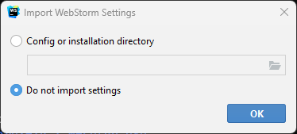
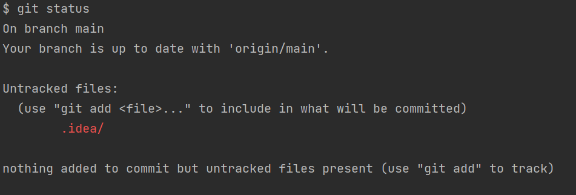
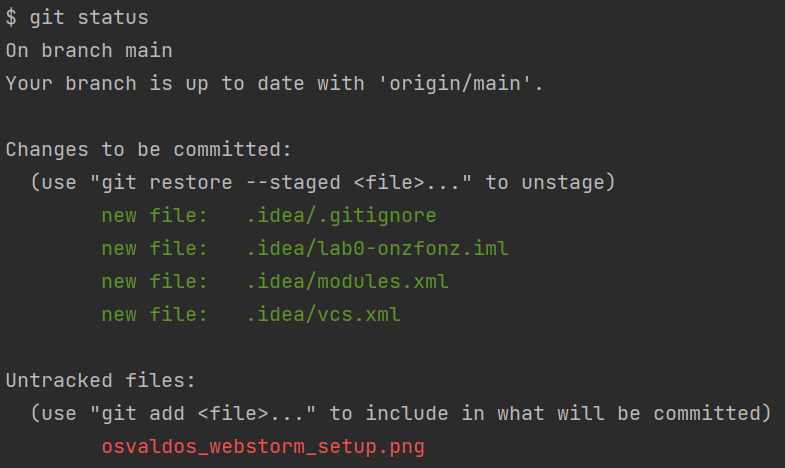

<div class="content">

These next couple of steps are a mishmash of steps that need to be
completed individually to get us ready technically for this course.
These steps allow you to share your work across computers and with me.
Most of you have done some of these things already, so if you have, just make
sure to read through the step to ensure you did all the steps that are here.
*Some of the images that are here are taken directly from or sourced directly from GitHub itself.*

### 1: Setup a GitHub account

Easiest way to do this is by going here:

**<http://education.github.com/pack>**

Verify that you have a student GitHub account.
Even if you have a GitHub account, you need to make sure that your email address is [verified](https://docs.github.com/en/github/getting-started-with-github/verifying-your-email-address)

You can check to see if your email is verified by checking the **Emails** tab of your account settings in GitHub.
If you have a warning icon like this picture, then you’ll want to ask to resend the verification email and verify your email with them.


The other thing you should do is to give youself an icon picture, which is always fun to do and can be done from the profile option in settings.

### 2: Making sure Git is installed

Now we are going to make sure that you have a version of git on your computer

Some of you may already have git setup.  To check, I would type in terminal:

```bash
git config --list
```

If by doing that you get a list of options, two of them being your correct `user.name` and `user.email` (that you have in GitHub),
then you have almost everything you need to [move on to step 4](#4-install-node).
The last thing to check would be if you have a package manager.
We'll explain that below:

#### Using a package manager  

If you saw something like command not found, we'll need to install **[git](https://git-scm.com/downloads)**, which we'll be using to manage our projects.
This will be done via the package manager.
A **package manager** is a piece of software that keeps track of what you've installed and allows you to easily install and uninstall entire programs.
Many can (when you ask them to) also upgrade to new versions when those become available.  
Just make sure your terminal program is open and type (or copy)

|Windows|Mac|
|:---|:--|
|`winget install --id Git.Git -e --source winget`|`brew install git`|

Press enter and wait.  It's not too bad.  If it complains, you may need administrative privileges, but just let it do its work.

Once it finishes, you may need to restart your terminal, but then we'll get to this

---
***Please leave your terminal of choice open (or reopen) as we'll be using it shortly again to install another application.***

Successfully installing git via the package manager means that you can skip to the [next section about configuring git](#3-configure-git).

### 2 Alternative: Traditional git directions

You should really learn [to use a package manager](#2-making-sure-git-is-installed)!
However, if that makes you queasy or you are running into major issues, here's how to install git the regular way.
Go to <https://git-scm.com/downloads> (or search “download git” via
google) Pick your operating system of choice.
If you are on a lab
computer, you may need to select the portable version once you get to
the windows page.



#### Get Git Installed

After downloading the installer open it up and install it on your
computer.
All of the default options should be fine in this situation,
though you can change some options if you feel necessary.
Make sure
though that the **option to commit in Unix Line Endings is enabled**.
Keep that preference.
That will help sure that your files will play nice
with everyone else.
Once you have it installed, go ahead and open it,
and let’s change some user preferences in git.

### 3: Configure Git

To streamline your git activity, let’s add some of your credentials to
git preferences.
I took most of this from the [git-scm book](https://git-scm.com/book/en/v2), but you’ll
want to **set the git preferences on all your computers that you use.**  Let me say that again in big letters

#### Set your git preferences on all computers that you will work on

In addition to installing git, we need to make sure that we outline or configure our setup so that git knows who you are.
With your terminal open, setup the git user email id and username by typing these commands,
making sure to replace the sections with your actual email and username

```bash
git config --global user.email your_github_email@u.pacific.edu
git config --global user.name your_github_username
```

Make sure you press enter after each command.

Vim is the default text editor that is used in the command line.
If you
aren’t comfortable or have never used vim, you can setup other unix text
editors instead.
So if you'd like to use emacs you’d write:

```bash
git config --global core.editor emacs
```

If you’re like me, you’ll want to use something like [notepad++](https://notepad-plus-plus.org/downloads/) or
possibly some other text editor that you love.
In those cases you’d have
to provide the entire path.

```bash
git config --global core.editor "'C:/Program Files/Notepad++/notepad++.exe' -multiInst -nosession"
```

Now to check your preferences, enter the command

```bash
git config --list
```

You should now see your username and email displayed among lots of other options.

### 4: Install Node

Now with our handy package manager, we need to install **[node.js](https://nodejs.org/en/)** AKA **node**.
If you already have node installed,
make sure it is at least version 16.13.2.
We will discuss node.js further in [part 1](../../1/en/part1.md).

I've taken the [installation instructions](https://nodejs.org/en/download/package-manager/) for node and provided the most popular options here.
For now, open up your terminal of choice and type:

|Windows|Mac|
|:---|:--|
|`winget install OpenJS.NodeJS`|`brew install node`|

If we run into issues we may need to install a specific version of node in the future
(since the bulk of this course was written with Node 16.13.2).
If that is the case, you could also install **[NVM](https://github.com/nvm-sh/nvm)**,
which allows us to have different versions of node.js on our computer and to switch between them.

This can be done via these two commands.
|Windows|Mac|
|:---|:--|
|`winget install CoreyButler.NVMforWindows`|`brew install nvm`|

Node package manager [npm](https://www.npmjs.com/get-npm) will be automatically installed with Node.js.
We will be actively using npm throughout the course.
Node also comes with [npx](https://www.npmjs.com/package/npx),
which we'll need a few times.

### 5: Join our Github Classroom

At this point, you have made sure that your git configuration is correct.

Then, you'll visit this URL:

**<http://go.djosv.com/227start>**

Make sure you login and accept any of the authorizations that are present.
Next, Accept the assignment.



This is going to have you enter the comp227
organization.
If you have already signed up for an account it may ask
you to re-enter your credentials.
Once accepted you'll be greeted with this image asking you to refresh.



Wait a minute or two, and then follow the lead given by GitHub, refresh the page, then click on the repo name, which will have your own GitHub handle on it as part of the link.
That will take you to the GitHub site where you will see your repository, with your handle at the end of the repository name.
Click on the green code button 
and then the copy button  to copy the URL,
as shown via this [animation accepting and clicking on the assignment](https://imgur.com/5Tv7mVM)

Make sure to save this URL that was just created specifically for you.
You will need it in the next step, so please also just keep this page open.
Otherwise if you close it', you'll need to navigate back through it by going to <classroom.github.com> and logging yourself in.

### 6: Install WebStorm

For this course, I will be asking that you use [Webstorm](https://www.jetbrains.com/webstorm/download/) from JetBrains.
You can do this with the package manager by merely typing `winget install JetBrains.WebStorm` or `brew install --cask webstorm` in your Terminal depending on your configuration.
While I am OK if you decide to use [VS Code](http://code.visualstudio.com) instead,
please note that I will only be supporting or answering questions about Webstorm.
*Some of the pictures below may be from PHPStorm, which is just like WebStorm, except it's designed for PHP.
If you see pictures below that have PHPStorm, pretend they say Webstorm, they behave similarly.*
This also goes for anything that mentions COMP 127 (Assume it's 227).

[WebStorm](https://www.jetbrains.com/webstorm/download/) is a web development editor from JetBrains
(*Make sure that you activate an [educational license](https://www.jetbrains.com/shop/eform/students) from them*).

If you haven't already, use the command line to download WebStorm.

|Windows|Mac|
|:--|:--|
|`winget install JetBrains.WebStorm`|`brew install --cask webstorm`|

As you are downloading the product, make sure that you fill out the [student application](https://www.jetbrains.com/shop/eform/students).
While WebStorm offers a 30-day free trial, we want to start the application process early to avoid any hiccups.
Jetbrains provides free access to all Jetbrains products while you're a student.

Once it finishes installing and you pass all the permissions, you can open it up.

You'll be greeted with a simple window



Most of you will choose not to import settings and click **OK**.

At this point, you'll now move on to the project page, where you'll need a project.
**Leave Webstorm open for now.**


Before moving on, make sure that you have generated the repository from the GitHub classroom assignment.

Now that we have WebStorm and have a GitHub repo, we are almost ready to connect webstorm to our GitHub profile and to the repo we created via GitHub classroom.

Before we can do that though, we need to generate credentials that the computer can use to login to GitHub via Webstorm.
Let's do that now.  

### 7: Generate a GitHub token

In the past two years, with even more threats to security,
GitHub has moved to having us use tokens to access our projects from our computers.
**Tokens** act like credentials but have much more fine-grained controls on what they can and cannot access.
Tokens are slightly analogous to using like a temporary credit card number for purchases,
instead of giving everyone access to your bank account.
Because Webstorm will be constantly communicating with GitHub, let's generate a token that will be stored on our computer.

Go back to [GitHub](http://github.com) and log in,
then click on your profile icon in the upper right,
and then go to [*Settings->Developer settings->Personal Access Tokens->Tokens (classic)->Generate new token->Generate new token (classic)*](https://imgur.com/S1E0tQc).
Then give the token a name,
set expiration to *Custom* (providing a date up to 1 year from now) and select the ```repo, workflow, read:org and gist``` checkboxes for the scopes.
Once you do that, scroll all the way down and click the green Generate new Token.
[I did another short animation of this as well.](https://imgur.com/LUAt5DU)
You'll then see a page that has the token that says to copy it because you won't be able to see it again.


Make sure to copy it someplace safe or leave the page open for now.
If you do lose the token, you can safely generate a new one.
You may also want to consider deleting the old one, which prevents it from being used anymore.

### 8: Connect Webstorm with GitHub

Now what we will do is:

1. Take the GitHub repo that we generated from classroom
2. Copy the link for it
3. Switch to webstorm and select ***Get From VCS***, using the copied URL from GitHub.
4. After clicking OK, selecting Use Token from the authentication options
5. Switching back to the token page that we just generated and copying that token
6. Pasting that token back in webstorm
7. Trusting and opening the project.  

Following all of these steps would result in the project opening up, with it opening up the *README.md* file.

Here's a recap in a [relooping gif of all of these steps that you should see](https://imgur.com/UDQXB6V)

#### Other permissions

The other permission you may have to set is to allow JetBrains access to comp227's organizational space.
You can do this by [visiting GitHub's apps settings](https://github.com/settings/applications#authorized) and then clicking on **JetBrains IDE Integration**.
Click on that and then you should be able to see the heading ***Organization Access***.
Click on the ***Grant*** button next to comp227, and now try cloning the project again.

Since by this point I have become accustomed to eclipse keyboard shortcuts, WebStorm provides an ability in its settings to use an Eclipse keymap.
They also have other keymaps as well.
For me this allows me to not have to worry about learning new keyboard shortcuts,
I can continue using handy shortcuts from eclipse like:
(***Alt-Up/Down***, ***Ctrl-D***, ***Alt-Shift-R***, ***Ctrl-Shift-Up***, ***Alt-Shift-M***, or ***Alt-Shift-H***, to name a few).

#### Configure your settings

When you have a new dev environment, it often is beneficial to spend a little bit of time tweaking things to your liking
(but not too much initially, spend no more than 10-15 minutes initially.
I'll go over a few different settings that I've found useful.  

To switch your keyboard shortcuts, open settings by selecting *File->Settings* (or do ***Ctrl-Alt-S***) and searching for the **Keymap** tab in Settings.
Pick the file that will work best for you in navigating using keyboard shortcuts.
This [gif will show you how to find and install a keymap like eclipse](https://imgur.com/g7eYe1H)

### 9: Make changes

By this point, your project should be open.

What you should do is to watch
[this animation a few times to see how to make changes to the markdown file](https://imgur.com/blj5aGh)
and how to send those changes so that they are recorded on GitHub.

Because we are editing a markdown file, Webstorm defaults for it to be in preview mode,
but if I were to have clicked the middle button it would have shown a split preview between text and what it looks like. (instead of flipping back and forth)

Also notice the green button up at the top.
That is used to create a commit, which is a record of the changes that you have made.
**You'll want to get in the habit of committing often**.
Committing small changes is a good idea, because then you can more easily keep track of (and potentially revert changes).
It's also a good way to document what has been added or changed as well.

### 10: Submit Assignment

For every project that we have thereafter, there will most likely be a new repo that you'll need to add to Webstorm using some of the steps that we've highlighted here.
For every repo you'll need to accept the assignment and open up a new project from VCS.
You won't need to generate a new token however.
The process that we follow here is merely to get you to understand the workflow for checking out projects from GitHub.

To submit the assignment I would like you to edit the file via Webstorm to add your name.
You should also upload a screenshot of your project open in webstorm to the repo as well.
You can [verify that your changes appear on GitHub in the readme file](#verifying-changes-made-it-to-github).

### Recommended: Learn to use git via the command line

**It's vital that you feel comfortable using git.**

If you have not worked with Git or GitHub at all and/or still feel uneasy about using it,
please follow along with the tutorial below.
For further reinforcement, you may also want to see this [Git and GitHub tutorial for beginners](https://product.hubspot.com/blog/git-and-github-tutorial-for-beginners).

While the workflow in JetBrains is fairly good for what we want,
(especially if you start leaning into keyboard shortcuts),
at some point you are going to want to do something that is beyond what's available.
The best thing that you can do to help yourself is to begint to practice using git on the command line.
It is harder to use.
However, there are many more resources out there (like with stackoverflow) that give you the keyboard combination or command to do some neat things,
like amend your last commit, or to go back a couple of commits, among other things.

For this we'll need to use the command line and the git command tool.
I like git bash.
The first thing that you'll need to do is to ensure that you can navigate to the location of where your project is located.
If you’re not sure how to
use the command line, feel free to ask in the discord, but easiest commands to learn
are:

- ```cd``` (changes the directory to the one specified afterwards, to go up use
```cd ..```)

- ```ls``` (list the files in a directory, if you want to see all files, say ```ls –a```)

- ```mkdir``` (makes a directory with the name you specify afterwards)

And press the tab key to autocomplete any folders and folder paths as
you type so that you don’t misspell things as you go along.
Another
other option you have is, if you are on your own computer, use windows
explorer to get to the directory where you want to download the project,
and then right click and select *Git Bash Here*.
If you are on windows and using the new [Terminal](https://github.com/microsoft/terminal),
you can also click the folder from explorer and drag the folder from windows into Terminal to have it automatically type the path for you.
Once you are inside the correct place that you want to be, then you can move on.

### Some git command line tools

If you didn't want to use the WebStorm Git integration, you could always use git to download the project, if you don't have it on your computer already.
The quickets way to do this would be:

```bash
git clone THE_URL_YOU_COPIED_HERE
```

In many command line tools, you can right
click and it *should* paste the URL that you just copied to the clipboard.
Once it finishes cloning, do a sanity check.
You should see that the command line now shows a
highlight showing you that you are on the main branch, which would be
in a different syntax color: notice how the end of the prompt ends with
main, that lets you know that you are on the main branch of a git
project.
You can take a look at the files either in the command line or
via your explorer of choice.


You'll also notice that for this lab, if you look at the directroy where you cloned into, you should see a file ```.gitignore``` and a folder called ```.git```.
If you do not see these files, then you should
[turn on the visibility for them](https://support.microsoft.com/en-us/windows/show-hidden-files-0320fe58-0117-fd59-6851-9b7f9840fdb2).

**You do not want to play around or modify the .git folder.**

You also want to be careful not to create repositories with git inside of other repositories that have a git folder.
So make sure that any projects that you clone have no nested or cloned projects inside.

For this part, we were only interested in getting you used to the
mechanics of adding, committing and pushing changes up to GitHub.
So here’s what I’m going to ask you to do.

1. Navigate to the directory where your Webstorm project is with the files that you moved over to in git bash.

2. After importing the project via webstorm
type ```git status``` to see what’s changed.
If nothing has changed, you can add a file or make a new file in the directory.



Once you add something, notice the red text and the message that git gives us.
The files you see will be different, as these images are merely samples.
It tells us that there are many files that are **untracked**,
which means that git is not monitoring them for any changes.
When untracked files change, *git knows nothing about them*.
So let's add a set of files so that git starts tracking them for any changes.
Let's practice adding one set of files to what will be our next commit.  You can do this with your uploaded picture of your webstorm setup.

```bash
git add my_personalized_webstorm_setup.png
```

(Don't forget about tab completion!  I almost never type anything out anymore, just a few letters and then press ***Tab*** to have the shell give its best suggestion)

If you type ```git status``` again, you'll notice that now you have a file that is staged, while the other files and folders would still be unstaged.
In the example above if i had added UserSettings, it would look like this:



The files in green are what are called **staged changes**.
What this means is that not only is git going to track them, but they are different than what is currently in the repo,
and so if you **commit**, you would be placing those changes and additions formally into the git record/history.
If you'd like, please add the rest of the files, which you can do by writing

```bash
git add .
```

Once you do a ```git status``` again, you'll now see that all of the files are staged to be committed (lots of green files), while nothing is red anymore.
This means that the next time you say commit via git all of the files will be placed into and tracked by the repository.

In this case let's write this line

```bash
git commit -m "Adding screenshot and other repo files from webstorm"
```

By having the `-m`, we are providing the commit message that we would like to have to help us know what we did in this particular commit.

Let's make one more change to the file so that we can dive a little bit deeper into staged vs unstaged.
Go ahead and open up your README.md and move over to Line 3 or so, where you have the description.
Modify the description one more time, or add in another comment into the file.
Save the file and then back at the command prompt, do a status check via git.
Once you do, you'll see something like this (except yours will be for readme):


While we have this in red text, notice that rather than it saying it is untracked, now it is saying it has been modified, however, if we were to commit right now, nothing would happen.
In git when you save a file, git merely tells you that the file that you have saved is in fact different than what you had before.
If you want that file to become part of the record, you'll need to stage the changes, which you can do again by calling this ambiguous term add.
If you were to add the file, then it would show in green again to let you know that it will be committed.
However, there is a way to automatically commit any of your tracked files into your repository, which is to use the flag -a, so typically when I commit, I do something like this:

```bash
git commit -am "Added another sentence about 227 to test git"
```

While
I typically use the ```-a``` flag to automatically add all my changes to the next commit, one reason for not
automatically adding (or staging) all changes is in order to make multiple commits so that you split
apart multiple changes that you’ve made.
 Leaving files unstaged won’t
make them a part of the commit, so you can commit multiple times and add
the appropriate files to address each bug or feature for example and to provide an appropriate message for each.
Therefore, if you made multiple changes, each commit will have just the files related to that change or improvement instead of a bunch of unrelated things.

However, because I advocate for committing often, I will mostly have you use the -a option so that git commits all changes to tracked files.

Committing will save the changes to the local repository.
The ```–a``` switch
will commit all modified files, both staged and unstaged, while the ```–m```
allows you to type your message as part of the commit, instead of
opening up that text editor option that we had before.
If you have new
files that git has yet to keep track of, then you must say:

```bash
git add NAME_OF_FILE_OR_DIR
```

Again, **you only need to do this last part when you have new files**.

### Pushing the changes

Once you have committed, go ahead and push the files to the server.
Type
```git push origin main``` and read the messages that are given to make sure that the
push was indeed successful.

### Verifying changes made it to GitHub

Once you completed the steps and push, verify that you have in fact finished by visiting **github.com** and clicking on your repository.
Once there, you can click to see [this gif animation that helps you verify that the commits were made on GitHub](https://imgur.com/7rNTgGF)

Like the image, you should see your changes.
If github.com
has the change you pushed that's part of the credit.
The other part of
the credit will come from the settings.
In github.com you can go to your
repository and click on the **commits**, where you'll see a list of the changes that you've made to
the project.
You should see a commit that has your picture and name on
it at the top.

Like the gif above click on the text has your commit message and you'll see the
changes that you committed and how your commit changed the file, which
you can immediately identify.
If you see your custom picture and your
name or id, then you'll get the rest of the credit.
If you don't, then
simply make an additional change to one of the files (adding a line or a
space) while [editing the user preferences as outlined earlier](#3-configure-git).
There's no need to upload anything to canvas as all your changes will be
stored on GitHub.
Hooray!  Now you can go move on to the next parts!

</div>
