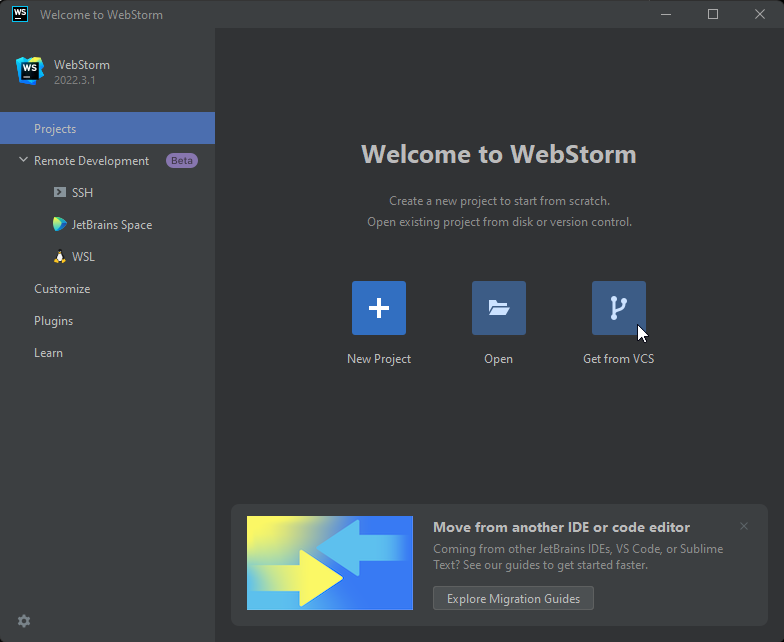
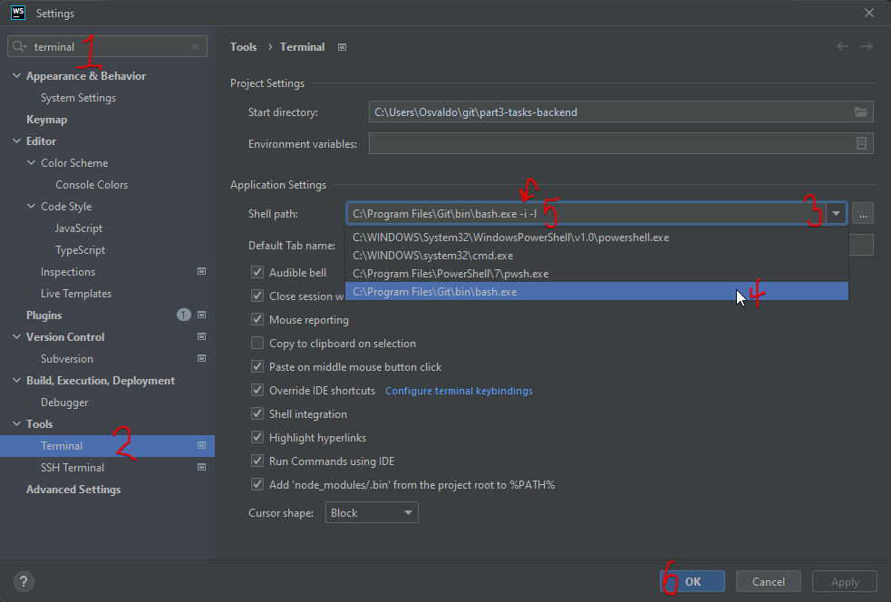
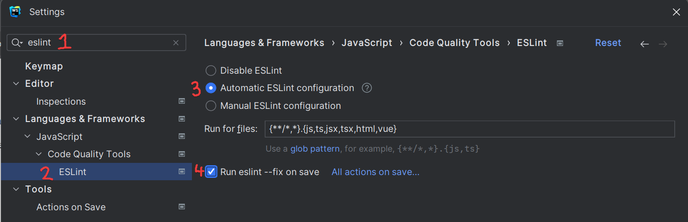
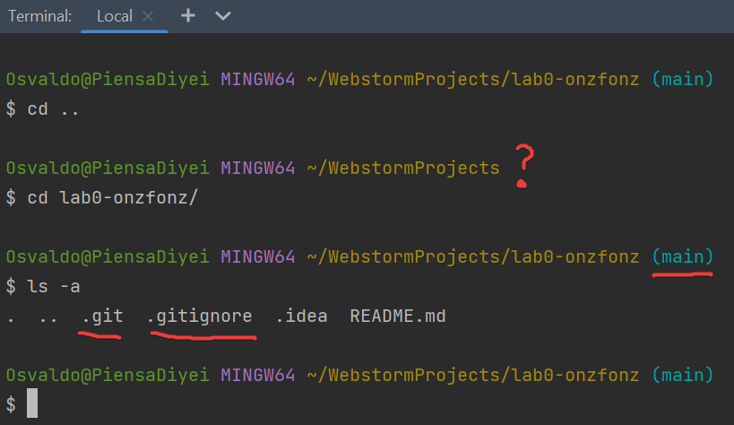

<div class="content">

These next couple of steps are a mishmash of steps that need to be
completed individually to get us ready technically for this course.
These steps allow you to share your work with me for seamless submissions.
Most of you have done some of these things already, so if you have, just make
sure to read through the steps to ensure you did all the steps that are here.
*Some of the images that are here are taken directly from or sourced directly from GitHub itself.*

### 1: Setup a GitHub account

The easiest way to do this is by going here:

**<http://education.github.com/pack>**

Verify that you have a student GitHub account.
Even if you have a GitHub account, you need to make sure that your email address is [verified](https://docs.github.com/en/github/getting-started-with-github/verifying-your-email-address)

You can check to see if your email is verified by checking the **Emails** tab of your account settings in GitHub.
If you have a warning icon like this picture, then you’ll want to ask to resend the verification email and verify your email with them.


The other thing you should do is to give yourself an icon picture, which is always fun to do and can be done from the profile option in settings.

### 2: Making sure Git is installed

Now we are going to make sure that you have a version of Git on your computer

Some of you may already have Git setup.
To check, I would type in Terminal:

```bash
git config --list
```

If by doing that you get a list of options, two of them being your correct `user.name` and `user.email` (that you have in GitHub),
If you do see the options, I'd also like you to verify that you have:

- *git bash* - (a command-line/terminal program) that comes with the git package we'll install
- a package manager - (something like *winget*, *choco*, *scoop* or *brew*)

If you have all of that then you can [move on to step 4](#4-install-nvm).

If this is all foreign to you, then please read on.

#### Using a package manager  

If you see something like *"command not found"*, we'll need to install **[git](https://git-scm.com/downloads)**, which we'll be using to manage our projects.
***We will install git using a package manager.***
A **package manager** is a piece of software that keeps track of what you've installed and allows you to easily install and uninstall entire programs.
Many can (when you ask them to) also upgrade to new versions when those become available.
Just make sure your terminal program is open and type (or copy)

|Windows|Mac|
|:---|:--|
|`winget install --id Git.Git -e --source winget`|`brew install git`|

Press enter and wait.
It's not too bad...unless you are on a Mac and have a slow internet connection.
If it complains, you may need administrative privileges, but just let it do its work.

Once it finishes, you may need to restart your terminal, but then we'll get to this

---
***Please leave your terminal of choice open as we'll be using it shortly again to install other applications.***

Successfully installing git via the package manager means that you can skip to the [next section and move to configure git](#3-configure-git).

### 2 Alternative: Traditional Git directions

You should learn [to use a package manager](#2-making-sure-git-is-installed)!
However, if that makes you queasy or you are running into major issues, here's how to install git the regular way.
Go to <https://git-scm.com/downloads> (or search “download git” via
Google) Pick your operating system of choice.
If you are on a lab
computer, you may need to select the portable version once you get to
the Windows page.


#### Get Git Installed

After downloading the installer open it up and install it on your
computer.
All of the default options should be fine in this situation,
though you can change some options if you feel necessary.
Make sure
though that the **option to commit in Unix Line Endings is enabled**.
Keep that preference.
That will help ensure that your files will play nice
with everyone else.
Once you have it installed, go ahead and open it,
and let’s change some user preferences in Git.

### 3: Configure Git

To streamline your git activity, let’s add some of your credentials to
git preferences.
I took most of this from the [git-scm book](https://git-scm.com/book/en/v2), but you’ll
want to **set the git preferences on all the computers that you use.**  Let me say that again in big letters

#### Set your git preferences on all computers that you will work on

In addition to installing git, we need to make sure that we outline or configure our setup so that git knows who you are.

#### Set your Git Username and Email

With your terminal open, set up the git user email ID and username by typing these commands,
making sure to replace the sections with your actual email and username

```bash
git config --global user.email your_github_email@u.pacific.edu
git config --global user.name your_github_username
```

Make sure you press enter after each command.

#### Create a Git Alias to send all changes to GitHub

In addition to adding your username and password, we are going to use a specific command to streamline our git process for this course.
You may not want to use this command in other situations as you'll want to keep closer track of what you are committing to the repo.
However, for this class, it will be necessary.

This process will:

1. add all files in the repo to be tracked
2. commit those changes using a specified message
3. push those changes to GitHub

To do this all, we will create a git alias.

```bash
git config --global alias.send-all '!f() { git add -A && git commit -m "$@" && git push; }; f'
```

#### Change your default text editor for git commit messages

Vim is the default text editor that is used in the command line.
If you aren’t comfortable or have never used Vim, you can set up other Unix text
editors instead.
So if you'd like to use emacs you’d write:

```bash
git config --global core.editor emacs
```

If you’re like me, you’ll want to use something like [Notepad++](https://notepad-plus-plus.org/downloads/) or
possibly some other text editor that you love.
In those cases, you’d have to provide the entire path.

```bash
git config --global core.editor "'C:/Program Files/Notepad++/notepad++.exe' -multiInst -nosession"
```

#### Confirm your preferences

Now to check your preferences, enter the command

```bash
git config --list
```

You should now see your username and email displayed, as well as the alias that we made and the editor changes.
You can press ***Space*** to continue reviewing the changes, and ***q*** to exit.

### 4: Install NVM

> ***For you to use `nvm`, you may need to uninstall any existing versions of node.js first.***

Now with our handy package manager, we need to install **[node.js](https://nodejs.org/en/)** AKA **node**.
If you already have Node installed,
make sure it is at least version 18.13.0.
We will discuss node.js further in [part 1](/part1).

For this class, I'm going to install nvm first so that we can use a specific version of node.
Specifically, we'll use Node version 18.13.0.
However, the bulk of this course was written and fully tested with Node 16.13.2.
So essentially we want to have two node versions 18.13 (a newer version) and 16.13.2 (as a fallback).
Since that is the case, we will also install **[NVM](https://github.com/nvm-sh/nvm)**,
which allows us to have these two different versions of node.js on our computer and switch between them.

This can be done via one of these commands.
***Remember, all of your terminal commands should be done in git bash at this point!***

|Windows|Mac|
|:---|:--|
|`winget install -e CoreyButler.NVMforWindows`|`brew install nvm`|

After installing *`nvm`*, you could use the `nvm help` to figure out the commands to install a version (like 18.13.0 and 16.13.2), and then use the later version.
I'll provide the commands here, which you'll need to execute separately.

```bash
nvm install 16.13
nvm install 18.13
nvm use 18
```

After this, you should be able to type `node -v` and you'll notice that it should print out *`v18.13.0`*.

To link node to our future IDE WebStorm we'll follow the next couple of instructions.
Here's the first:

```bash
export NVM_SYMLINK_CURRENT=true
```

The above command creates a ***symbolic link*** where WebStorm can find the version of Node we are using.
Then, type:

```bash
nvm use 18
```

> If, after typing this line, you get an error like *`panic: runtime error: slice bounds out of range`*, this is mostly likely due to you already having node installed.
> If you type `nvm list` and you just type the number of one of the versions installed, like say `nvm use 18`, that will also work.

#### 4 Alternate: Installing node directly

Alternatively, you can try to just install Node without using a version manager.
I've taken the [installation instructions](https://nodejs.org/en/download/package-manager/) for Node and provided the most popular options here.

|Windows|Mac|
|:---|:--|
|`winget install -e OpenJS.NodeJS`|`brew install node`|

*You should only use this option if you have trouble doing anything with nvm.*

---

Regardless of which option you choose,
Node package manager [npm](https://www.npmjs.com/get-npm) will be automatically installed with Node.js.
We will be actively using npm throughout the course.
Node also comes with [npx](https://www.npmjs.com/package/npx),
which we'll need a few times.

### 5: Join our GitHub Classroom

At this point, ensure your git configuration is correct.

Next, you'll visit this URL:

**<http://go.djosv.com/227start>**

Make sure you log in and accept any of the authorizations that are present.
Next, Accept the assignment.


This is going to have you enter the *comp227*
organization.
If you have already signed up for an account it may ask
you to re-enter your credentials.
Once accepted you'll be greeted with this image asking you to refresh.


Wait a minute or two, and then follow the lead given by GitHub, refresh the page, then click on the repo name
which will have your own GitHub handle on it as part of the link.
That will take you to the GitHub site where you will see your repository, with your handle at the end of the repository name.
Click on the green code button 
and then the copy button  to copy the URL,
as shown via this [animation accepting and clicking on the assignment](https://imgur.com/5Tv7mVM)

Make sure to save this URL that was just created specifically for you.
You will need it in the next step, so please also just keep this page open.
Otherwise, if you close it, you'll need to navigate back through it by going to <classroom.github.com> and logging in.

### 6: Install WebStorm

For this course, you will be using [WebStorm](https://www.jetbrains.com/webstorm/download/), a web development IDE from JetBrains.

Because there is so much integration that we are doing between WebStorm and Git,
I'm going to ask that you stick to using it.
If you are adamant about using VSCode or another IDE, then please contact me via Discord ***ASAP*** for some additional instructions.

> **FYI:** Some of the pictures below may be from PHPStorm, which is just like WebStorm, except it's designed for PHP.
> *If you see pictures below that have PHPStorm, pretend they say WebStorm, they behave similarly.*
> This also goes for anything that mentions COMP 127 (Assume it's 227).

Use the command line to download WebStorm.

|Windows|Mac|
|:--|:--|
|`winget install -e JetBrains.WebStorm`|`brew install --cask webstorm`|

As you are downloading the product, make sure that you fill out the [student application for the educational license](https://www.jetbrains.com/shop/eform/students).
While WebStorm offers a 30-day free trial, we want to start the application process early to avoid any hiccups.
JetBrains provides free access to all JetBrains products while you're a student.

Once it finishes installing and you pass all the permissions, you can open it up.

You'll be greeted with a simple window.


Most of you will choose not to import settings and click **OK**.

At this point, you'll now move on to the project page, where you'll need a project.
**Leave WebStorm open for now.**



Before moving on, make sure that you have generated the repository from the GitHub Classroom assignment.

Now that we have WebStorm and a GitHub repo, we are almost ready to connect WebStorm to our GitHub profile and to the repo we created via GitHub Classroom.

Before we can do that though, we need to generate credentials that the computer can use to login to GitHub via WebStorm.
Let's do that now.

### 7: Generate a GitHub token

In the past two years, with even more threats to security,
GitHub has moved to have us use tokens to access our projects from our computers.
**Tokens** act like credentials but have much more fine-grained controls on what they can and cannot access.
Tokens are slightly analogous to using a temporary credit card number for purchases,
instead of giving everyone access to your bank account.
Because WebStorm will be constantly communicating with GitHub, let's generate a token that will be stored on our computer.

Go back to [GitHub's new token page](http://github.com/settings/tokens/new) and login.
Alternatively, you can click on your GitHub profile icon in the upper right,
and then go to [*Settings->Developer settings->Personal Access Tokens->Tokens (classic)->Generate new token->Generate new token (classic)*](https://imgur.com/S1E0tQc).
Then give the token a name,
set expiration to *Custom* (providing a date up to 1 year from now) and select the `repo, workflow, read:org and gist` checkboxes for the scopes.
Once you do that, scroll to the bottom and click the green ***Generate Token***.
[I did another short animation of this as well.](https://imgur.com/LUAt5DU)
You'll then see a page that has the token that says to copy it because you won't be able to see it again.


Make sure to copy it somewhere safe or leave the page open for now.
If you do lose the token, you can safely generate a new one.
You may also want to consider deleting the old one, which prevents it from being used anymore.

### 8: Connect WebStorm with GitHub

Now what we will do is:

1. Take the GitHub repo that we generated from GitHub Classroom
2. Copy the link for it
3. Switch to WebStorm and select ***Get From VCS***, using the copied URL from GitHub.
4. After clicking OK, select ***Use Token*** from the authentication options
5. Switch back to the token page that we just generated and copy that token
6. Paste that token back into WebStorm and ***Log In***.
7. Trust and open the project.

Following all of these steps would result in the project opening up, with it opening up the *README.md* file.

Here's a recap in a [re-looping gif of all of these steps that you should see](https://imgur.com/UDQXB6V)

### 9: Additional WebStorm Setup

We'll need to make a few more changes to WebStorm to have it work as we expect.
This is required.

#### Configuring your settings summary

When you have a new dev environment, it often is beneficial to spend a little bit of time tweaking things to your liking
(but not too much initially, spend no more than 10-15 minutes).

I'll go over a few different settings that you will need to change for this course.
You will have an assignment that will show me that you have indeed made all of these changes.

- [Changing the terminal app](#changing-our-default-terminal-app)
- [Enabling autosave](#enabling-autosave)
- [Creating File Watchers](#creating-a-file-watcher-for-our-git-configuration)
- [Enabling ESLint](#enabling-eslint)
- [Linking WebStorm with nvm](#link-webstorm-to-nvm)
- [(Optional) Changing your keyboard shortcuts](#changing-keyboard-shortcuts)

### Changing our default terminal app

While installing the Eclipse keymap is optional, what I would like you to do is change your terminal of choice to ***git bash***.
Just like with the gif from below, open up the settings (***Ctrl-Alt-S***) and search for Terminal.
Navigate to the ***Tools*** on the left sidebar and select the dropdown for the Shell path.
There you should see bash.exe with a path for git.
**Make sure you add the arguments `-i` and `-l` to load your settings correctly**.



### Enabling autosave

Enabling autosave allows me to not have to worry about saving all the time, which is key.
On the other hand, sometimes we have some extra complexity.
Nonetheless, the benefits outweigh any issues.
Head back to the settings (***Ctrl-Alt-S***) and type ***autosave***, and then once you are in **System Settings**,
check the option that says to ***Save files if the IDE is idle for 15 seconds***.

### Creating a File Watcher for our Git Configuration

We will be making one additional required change to repos for projects in this class.
Because of a wealth of issues previously with changes, we are going to install a *file watcher*.
This file watcher will automatically allow us to connect our git repositories with our WebStorm IDE,
Allowing us to commit any changes to git-tracked files when we save.
It is meant merely as an additional backup, though we still need to pull and push, making sure we do not edit the files from the GitHub site directly.
Enabling the file watcher can make things more difficult if you are using multiple machines.
However, if you install the file watcher on both machines and are diligent about pulling before making any changes, and pushing once you are done, you should not run into many issues.
Regardless, please let me know if you run into issues with this, as not having this feature setup correctly impacts your grade.

To start:

1. go to *File->Settings->Tools->File Watchers*.
2. Click the plus (add) button 
3. Choose *`<custom>`*
4. In the *Name* field, type *`COMP 227 Git Watcher`*
5. In the *File Type* field, ***scroll upwards*** and select *`JSX`*
6. In the *Program* field, provide the path to your git executable (something like `C:\Program Files\Git\bin\git.exe`)
7. In the *Arguments* field, type *`send-all "Auto-commit JSX on save for Comp 227"`* (don't forget the quotes!)
8. Expand the *Advanced Options* area, and select *`Trigger the watcher regardless of syntax errors`*
9. Ensure the Scope is on *Project Files*, and that the checkboxes for *auto-save* and *trigger on external* are checked.

Here's what mine looked like, though your Program field may differ:


Make sure to click ***OK*** to add the Watcher.
You should now see it in your list of File Watchers.

We'll need this File Watcher to be enabled for all projects in COMP 227.
One way to make sure that it is enabled for all projects is to have the watcher be set to the Global Level.
This can be done from the list of Watchers Setting, by changing its level category to ***Global***:


If you prefer to not have this be a global setting because you have other projects, then let's export the watcher for future use.
Click the export button and save it in a good location.


Make sure to select a location you'll remember as you'll need it later.

Now once you are back on the list of File Watchers, click ***Apply*** and then ***OK*** to exit out of the Settings Window.

### Enabling ESLint

In Settings (***Ctrl-Alt-S***), type `eslint` in the search bar,
which should allow you to see an ESLint heading under *Languages & Frameworks->JavaScript->Code Quality Tools->EsLint*.
Click on that heading on the left and then select ***Automatic ESLint configuration***, and click the checkbox ***Run eslint --fix on save***.
Click ***Apply*** and then ***OK***.



### Link WebStorm to nvm

This one is important as it tells WebStorm where our node version is, which helps with IDE integration.
Back in the Settings window, type ***Node interpreter*** in the search box, which should lead you to *Languages & Frameworks->Node.js*.
Click on the Node interpreter dropdown, and select ***Add...->Add local...***.
Click the home button, then select ***.nvm/current/bin/node.exe*** and click ***OK*** to close both Windows.

> If you cannot find a *.nvm* folder in your installation directory,
> it may be that *nvm* has automatically created a symbolic link in your Applications directory,
> which would be *`C:\Program Files\nodejs\node.exe` for Windows and somewhere in `Applications` for Mac.

Because we will be working with a lot of repositories, it makes sense that all new projects have these same settings.
Let's ensure that all of these settings show up for new projects, by going to ***File->New Projects Setup->Settings for New Projects***.
Once there, go through each of the settings we just changed and ensure that those options have been enabled.

### Changing keyboard shortcuts

Since by this point I have become accustomed to Eclipse keyboard shortcuts, WebStorm provides an ability in its settings to use an Eclipse keymap.
They also have other keymaps as well.
For me this allows me to not have to worry about learning new keyboard shortcuts,
I can continue using handy shortcuts from Eclipse like:
(***Alt-Up/Down***, ***Ctrl-D***, ***Alt-Shift-R***, ***Alt-Shift-Up***, ***Alt-Shift-M***, or ***Alt-Shift-H***, to name a few).

To switch your keyboard shortcuts, open settings by selecting *File->Settings* (or do ***Ctrl-Alt-S***) and searching for the **Keymap** tab in Settings.
Pick the file that will work best for you in navigating using keyboard shortcuts.
This [gif will show you how to find and install a keymap like eclipse](https://imgur.com/g7eYe1H)

***Remember that you may have to do all of these steps (including the token generation if you don't save the token somewhere) for each computer that you use.***
For the JetBrains settings only, another option that I recommend would be to sync your settings via your JetBrains account.
That setting sync is located in the upper right as a cog icon near the *close window* button.

#### Running into issues?

The other permission you may have to set (if you are running into issues) is to allow JetBrains access to comp227's organizational space.
You can do this by [visiting GitHub's apps settings](https://github.com/settings/applications#authorized) and then clicking on **JetBrains IDE Integration**.
Click on that and then you should be able to see the heading ***Organization Access***.
Click on the ***Grant*** button next to comp227, and now try cloning the project again.

### 10: Make changes

By this point, your project should be open.

What you should do is watch
[this animation a few times to see how to make changes to the markdown file](https://imgur.com/blj5aGh)
and how to send those changes so that they are recorded on GitHub.

Because we are editing a markdown file, WebStorm defaults for it to be in preview mode,
but if I were to have clicked the middle button it would have shown a split preview between the raw text and what it looks like -
(instead of flipping back and forth)

Also, notice the green button at the top - .
That is used to create a commit, which is a record of the changes that you have made.
**You'll want to get in the habit of committing often**.
Committing small changes is a good idea because then you can more easily keep track of (and potentially revert changes).
It's also a good way to document what has been added or changed as well.

As you are toying around, you may get a popup like this in WebStorm.


Like the picture shows, I would check ***Don't ask again*** and then click ***Cancel***.
I like to be purposeful with my commits in Git, so I do not like adding files to Git that may not be necessary.
However, in this class, it will be safer to just add in all files and ensure the file watcher process is working.

### 11: Understand the process

For every project that we have thereafter, there will most likely be a new repo that you'll need to add to WebStorm using some of the steps that we've highlighted here.
For every repo you'll need to accept the assignment, open up a new project from VCS, and import File Watchers (which we'll revisit in the next part)
You won't need to generate a new token, however.
The process that we follow here is merely to get you to understand the workflow for checking out projects from GitHub.

Feel free to make as many changes as you'd like to the repo, just make sure you include the information from the exercises below.
There you'll also see how you can [verify that your changes appear on GitHub](#07---verifying-changes-made-it-to-github).

</div>

<div class="tasks">

### Exercises 0.7-0.9

To submit the assignment you'll be making changes that will appear in your GitHub repo.
For one, I would like you to edit the file that we created via WebStorm and add your name to the markdown file.

#### 0.7 - Verifying changes made it to GitHub

You should have been following along here with the reading.
Once you completed the steps above and push, verify that you have finished by visiting **github.com** and clicking on your repository.
Once there, you can click to see [this gif animation that helps you verify that the commits were made on GitHub](https://imgur.com/fpaI9XK)

Like the image, you should see your changes on github.com and you should see your profile and link as well.

Like the gif above click on the text that has your commit message and you'll see the
changes that you committed and how your commit changed the file, which
you can immediately identify.
If you see your custom picture and your
name or ID, then you'll get the rest of the credit.
If you don't, then
simply make an additional change to one of the files (adding a line or a
space) while [editing the user preferences as outlined earlier](#3-configure-git).

#### 0.8 - Upload exercises from exercises 0.1-0.6

Now that GitHub has been set up correctly,
please upload the materials from the previous section
[Exercises 0.1-0.6](/part0/fundamentals_of_web_apps#exercises-0-1-0-6) into your GitHub repo.
Make sure you put them in a folder and provide them with names that match the exercise that you had.

#### 0.9 - File watcher verification with screenshot

Finally, create a file in your *part0* folder and call it *Hello.jsx*.
As for the code that you put in there, all you will do is write a comment that:

1. has your name
2. has the biggest hurdle you faced in this part

> *Comments in javascript are lines preceded with a `//`*

Once you do that, should you verify that your files have all turned **white in color** in your webstorm files project.

As a final verification, add a screenshot of your WebStorm IDE showing the embedded git bash terminal overlayed at the bottom and having typed `nvm list` and `git status`.
> If you are on a mac, you can have your external editor showing at the bottom of the screen instead, ensure we can still see the rest of webstorm.

Please name the screenshot file with the name *`09`*.
Make sure the file has the correct extension.
Make a new change to your *Hello.jsx* file mentioning you uploaded the picture and then use `git push` in your terminal of choice.

You can verify that you did this correctly by looking at github again!

#### Troubleshooting Exercise 0.9

Are your files still different colors?
You may not have setup the previous parts correctly.
If you missed multiple parts here, then part of this should be a sign that you may need to **slow down while reading this content**.

Here are some things to check:

- Is your file watcher running?
    - You should see a status message at the bottom of WebStorm to let us know the file watcher is in fact running.  You should see the message popup everytime you edit the jsx file.
      
    - If you don't see this popup, please review [the file watcher settings](#9-additional-webstorm-setup)
- Did you create the send-all command?
    - If your terminal pops up with this message:
      
    - Then you did not add the [`send-all` alias](#3-configure-git).
- Did you use the correct alias so that the terminal shows up from within WebStorm? See the #mac discussion in discord for further details, but for now, using `/bin/bash` works.
- Did you login to GitHub using your credentials and told it to always remember?
    If you are getting any popups like this, do not close them, but save your credentials instead.
    
    
- Is `git push` working from your terminal?
    - If you have yet to work with the git terminal, you may need to login for the first time using the command line.
    - You can use your previous token or generate a new one and make sure to store it.

Again, make sure that you pay close attention to any messages that come up!

</div>

<div class="content">

### Recommended: Learn to use git via the command line

**It's vital that you feel comfortable using git.**

If you have not worked with Git or GitHub at all and/or still feel uneasy about using it,
please follow along with the tutorial below.
For further reinforcement, you may also want to see this [Git and GitHub tutorial for beginners](https://product.hubspot.com/blog/git-and-github-tutorial-for-beginners).

While the workflow in JetBrains is fairly good for what we want,
(especially if you start leaning into keyboard shortcuts),
at some point you are going to want to do something that is beyond what's available.
The best thing that you can do to help yourself is to begin to practice using git on the command line.
It is harder to use.
However, there are many more resources out there (like StackOverflow) that give you a git command to do some neat things,
like amend your last commit, or go back a couple of commits, among other things.

For this, we'll continue getting comfortable with git bash.
The first thing that you'll need to do is to ensure that you can navigate to the location of where your project is located.
If you’re not sure how to
use the command line, feel free to ask in the discord, but the easiest commands to learn
are:

- `cd` (changes the directory to the one specified afterward, to go up use
`cd ..`)

- `ls` (list the files in a directory, if you want to see all files, say `ls –a`)

- `mkdir` (makes a directory with the name you specify afterward)

And press the tab key to autocomplete any folders and folder paths as
you type so that you don’t misspell things as you go along.
Another option you have is, if you are on your computer, to use Windows
Explorer to get to the directory where you want to download the project,
and then right-click and select *Git Bash Here*.
If you are on Windows and using the new [Terminal](https://github.com/microsoft/terminal),
you can also click the folder from Explorer and drag the folder from Windows into Terminal to have it automatically type the path for you.
Once you are inside the correct place that you want to be, then you can move on.
Lastly, one of the last ways to do this is merely via WebStorm.
You can right-click on your project and say ***Open In->Terminal***, and the terminal will open down below.

### Learning the git commands in bash

While we will use WebStorms's git integration and tools to help us commit regularly,
knowing a little bit about how to use the command line will be important for this course.
One of the most important parts of knowing how to use the command line is being able to navigate through your folders.

Anytime you make any changes or commands, it's important to understand where you are.
Let's verify that you are in fact in the correct place.
When using git bash, you know you have entered a git repository when you see that the command line shows ***`(name_of_branch)`*** in a different color.
In our case, notice how the end of the prompt ends with
`main`.
That lets you know that you are on the main branch of a git
project.
I will move up a directory and down just so you can see the difference.



You'll also notice that for this lab you should see a file `.gitignore` and a folder called `.git`.
You may not see those files if you type `ls`.

**You do not want to play around or modify the .git folder.**

You also want to be careful not to create repositories with git inside of other repositories that have a git folder.
So make sure that any projects that you clone have no nested or cloned projects inside.

For this part, we were only interested in getting you used to the
mechanics of adding, committing and pushing changes up to GitHub.
So here’s what I’m going to ask you to do.

### `git status` is your friend

1. With the terminal open,
type `git status` to see what’s changed.
If nothing has changed, you can add a file or make a new file in the directory.


Once you add something, notice the red text and the message that git gives us.
It tells us that we have a file (or in this case a folder) that is **untracked**,
which means that git is not monitoring them for any changes.
When untracked files change, *git knows nothing about them*.
So let's add a set of files so that git starts tracking them for any changes.
Let's practice adding one set of files to what will be our next commit.
Part of what you need to do is add a picture or screenshot to the repo, which you can drag into WebStorm on top of your *lab0* folder.
You'll see a *Move* window pop up that you can click ***Refactor***.
Go ahead and do that.
Type `git status` again and you'll now see the file appear as an untracked file.


To get git to start tracking a file, you can say:

```bash
git add path/to/name_of_file.extension
```

***Don't forget about Tab completion!***
I seldom type anything out anymore.
After I type a few letters, I press ***Tab*** to have the shell give its best suggestion and make sure I have the right location and no typos.
You can even press Tab again if you get no further completions to see the list of everything available for files.

If you type `git status` again, you'll notice that now you have a file that is staged, while the other files and folders would still be unstaged.
In the example above, if instead had added the .idea folder (and not the png), it would look like this:


The files in green are what are called **staged changes**.
What this means is that not only is git going to track them, but they are different than what is currently in the repo,
and so if you **commit**, you would be placing those changes and additions formally into the git record/history.
If you'd like, please add the remaining file, which you can do by writing

```bash
git add .
```

Once you do a `git status` again, you'll now see that all of the files are staged to be committed (lots of green files), while nothing is red anymore.
This means that the next time you say commit via git all of the files will be placed into and tracked by the repository.

### Committing via the command line

In this case, let's write this line

```bash
git commit -m "Adding screenshot and other repo files from WebStorm"
```

By having the `-m`, we are providing the commit message that we would like to have to help us know what we did in this particular commit.

Let's make one more change to the file so that we can dive a little bit deeper into staged vs unstaged.
Go ahead and open up your README.md and move over to Line 3 or so, where you have the description.
Modify the description one more time, or add another comment to the file.
Save the file and then back at the command prompt, do a `git status` again.
Once you do, you'll see something like this (except yours will be for readme):


Notice that the red text does not say it is untracked,
but rather that it has been modified.
Furthermore, if we were to commit right now, nothing would happen.
In git when you save a file, git merely tells you that the file that you have saved differs from what you had before.
If you want that file to become part of the record, you'll need to stage the changes, which you can do again by calling this ambiguous term `add`.
If you were to add the file, then it would show in green again to let you know that it will be committed.
However, there is a way to automatically commit any of your tracked files into your repository,
which is to use the flag `-a`, so typically when I commit, I do something like this:

```bash
git commit -am "Personalized the readme with my name Osvaldo"
```

While I typically use the `-a` flag to automatically add all my changes to the next commit, one reason for not
automatically adding (or staging) all changes is to make multiple commits so that you split
apart multiple changes that you’ve made.
Leaving files unstaged won’t make them a part of the commit, so you can commit multiple times and add
the appropriate files to address each bug or feature for example and to provide an appropriate message for each.
Therefore, if you made multiple changes, each commit will have just the files related to that change or improvement instead of a bunch of unrelated things.

However, because I advocate for committing often, I will mostly have you use the `-a` option so that Git commits all changes to tracked files.

Committing will save the changes to the local repository.
The `–a` switch
will commit all modified files, both staged and unstaged, while the `–m`
allows you to type your message as part of the commit, instead of
opening up that text editor option that we had before.
If you have new
files that git has yet to keep track of, then you must say:

```bash
git add NAME_OF_FILE_OR_DIR
```

Again, **you only need to do this last part when you have new files**.

### Pushing the changes via the command line

Once you have committed, go ahead and push the files to the server.
Type
`git push origin main` and read the messages that are given to make sure that the
push was indeed successful.

</div>
