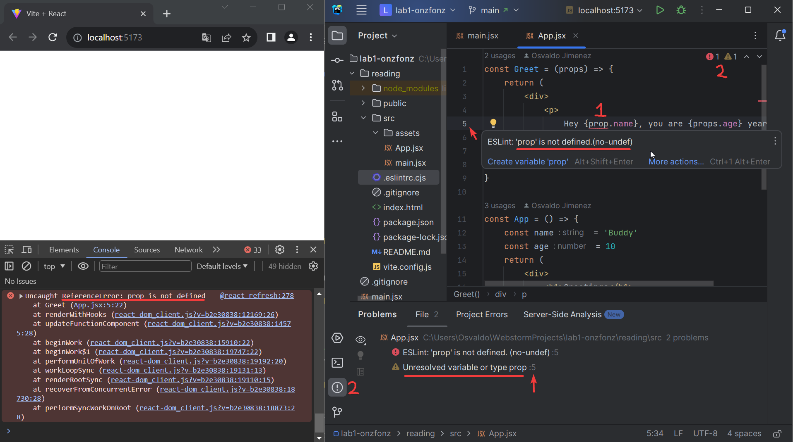

<div class="content">

We will now start getting familiar with probably the most important topic of this course, namely the [React](https://reactjs.org/) library.
Let's start by making a simple React application as well as getting to know the core concepts of React.

The easiest way to get started by far is by using a tool called [create-react-app](https://github.com/facebook/create-react-app).
It is possible (but not necessary) to install *create-react-app* on your machine if the *npm* tool that was installed along with Node has a version number of at least *5.3*.

First, visit the classroom link: <http://go.djosv.com/227lab1>
and use the steps outlined [from part 0c](/part0/configuring_your_machine_for_this_course) to
[accept](https://imgur.com/5Tv7mVM), [download](https://imgur.com/UDQXB6V) and set up the repository from within WebStorm.
The only different step in our [high-level checklist](/part0/configuring_your_machine_for_this_course#8-connect-webstorm-with-github)
is that in step 3 we need to do is say ***File->New Project from Version Control*** from within WebStorm to open the URL prompt.

I would also make sure to check **trust projects** that is presented in the first window so that you don't have to keep doing so.


Lastly, I would choose the option ***New Window*** and check ***don't ask again*** in the next window.
Using a new window with the project will provide you with a new window for every project.
Having a new window is nice for having a separate area but not being confined to having only one project open at a time.
I liked using attach, which puts all the repos in a single folder.
However, this creates more issues in particular views like the git view as it shows you all the same files and you have to keep making sure you have the right path.


You can click on the project bar in the upper right


to return to see that you should now have two sets of folders: *lab0* and *lab1*.

You can now right-click on lab1 and select **Open in->Terminal**.
If you did not review the [part 0c's coverage of git commands and the terminal](/part0/configuring_your_machine_for_this_course#some-git-command-line-tools),
it might make sense to do so now.

With your terminal now open you can type the following:

```bash
npx create-react-app reading
cd reading
```

Say yes to any prompts that appear asking you to update or that ask you to allow access.

Once you are in the reading directory, start our application by typing:

```bash
npm start
```

By default, the application runs on localhost port 3000 with the address <http://localhost:3000>

Your default browser should launch automatically.
Open the browser console (***Ctrl-Shift-I***) **immediately**.
Also, open a text editor so that you can view the code as well as the webpage at the same time on the screen:


You can collapse lab0 and close the README.md from that lab that we had from the previous folder.
Because we attached the projects, you'll need to make sure that you are editing the correct file, which you can check in the upper left breadcrumb trail.

The code of the application resides in the *reading/src* folder.
Let's simplify the default code such that the contents of the file *index.js* looks like this:

```js
import React from 'react'
import ReactDOM from 'react-dom/client'

import App from './App'

ReactDOM.createRoot(document.getElementById('root')).render(<App />)
```

and file *App.js* looks like this

```js
const App = () => (
  <div>
      <p>Hola COMP 227!</p>
  </div>
)

export default App
```

You may delete the files:

- *App.css*
- *App.test.js*
- *index.css*
- *logo.svg*
- *reportWebVitals.js*
- *setupTests.js*

as they are not needed in our application right now.
If you use safe delete, you should not see any warnings about the files being used.

If you do see warnings, then you way want to read [this future section about react version differences](/part1/a_more_complex_state_debugging_react_apps/#old-react).

### Component

The file *App.js* now defines a [React component](https://reactjs.org/docs/components-and-props.html) with the name `App`.
The command on the final line of file *index.js*, namely:

```js
ReactDOM.createRoot(document.getElementById('root')).render(<App />)
```

renders its contents into the file *public/index.html*, inside a `div` element that has the `id` value 'root'.

By default, the file *public/index.html* doesn't contain any HTML markup that is visible to us in the browser.
You can try adding some HTML to the file.
However, when using React, all content that needs to be rendered is usually defined as React components.

Let's take a closer look at the code defining the component:

```js
const App = () => (
  <div>
    <p>Hola COMP 227!</p>
  </div>
)
```

As you probably guessed, the component will be rendered as a `div` tag, which wraps a `p` tag containing the text `Hola COMP 227!`.

Technically the component is defined as a JavaScript function.
The following is a function (which does not receive any parameters):

```js
() => (
  <div>
    <p>Hola COMP 227!</p>
  </div>
)
```

The function is then assigned to a constant variable `App`:

```js
const App = ...
```

There are a few ways to define functions in JavaScript.
Here we will use [arrow functions](https://developer.mozilla.org/en-US/docs/Web/JavaScript/Reference/Functions/Arrow_functions),
which are described in a newer version of JavaScript known as [ECMAScript 6](http://es6-features.org/#Constants), also called ES6.

Because the function consists of only a single expression we have used a shorthand, which represents this piece of code:

| original shorthand | long form |
| --- | --- |
|<pre><code class="languagejs">const App = () => (<br><br>  \<div><br>    \<p>Hola COMP 227!\</p><br>  \</div><br><br>)<br>|<pre><code class="languagejs">const App = () => {<br>  return (<br>    \<div><br>      \<p>Hola COMP 227!\</p><br>    \</div><br>  )<br>}|

**Notice the return and curly braces instead of parenthesis**!
In other words, the function returns the value of the expression.

The function defining the component may contain any kind of JavaScript code.
Modify your component to be as follows and observe what happens in the developer tool's console: (I'll refer to this as the **console** from here on out.)

```js
const App = () => {
  console.log('Hello from the App component')
  return (
    <div>
      <p>Hola COMP 227!</p>
    </div>
  )
}

export default App
```

and observe what happens in the browser console


The first rule of frontend web development:

> *keep the console open all the time*

Let us repeat this together: *I promise to keep the console open all the time* when you are doing web development.

It is also possible to render dynamic content inside of a component.

Modify the component as follows:

```js
const App = () => {
  const now = new Date()
  const a = 18
  const b = 24

  return (
    <div>
      <p>Hola COMP 227! It is {now.toString()}</p>
      <p>
        {a} plus {b} is {a + b}
      </p>
    </div>
  )
}
```

Any JavaScript code within the curly braces is evaluated and the result of this evaluation is embedded into the defined place in the HTML produced by the component.

Note that you should not remove the line at the bottom of the component

```js
export default App
```

The export is not shown in most of the examples of the course material.
Without the export, the component and the whole app breaks down.

Did you remember your promise to keep the console open? What was printed out there?

### JSX

It seems like React components are returning HTML markup.
However, this is not the case.
The layout of React components is mostly written using [JSX](https://reactjs.org/docs/introducing-jsx.html).
Although JSX looks like HTML, we are dealing with a way to write JavaScript.
Under the hood, JSX returned by React components is compiled into JavaScript.

After compiling, our application looks like this:

```js
const App = () => {
  const now = new Date()
  const a = 18
  const b = 24
  return React.createElement(
    'div',
    null,
    React.createElement(
      'p', null, 'Hola COMP 227! It is ', now.toString()
    ),
    React.createElement(
      'p', null, a, ' plus ', b, ' is ', a + b
    )
  )
}
```

The compilation is handled by [Babel](https://babeljs.io/repl/).
Projects created with *create-react-app* are configured to compile automatically.
We will learn more about this topic in [part 7](/part7) of this course.

It is also possible to write React as "pure JavaScript" without using JSX.
Just like it's possible to chisel one of your programs from undergrad into a stone tablet. In either case, I wouldn't recommend it.

In practice, JSX is much like HTML with the distinction that with JSX you can easily embed dynamic content by writing appropriate JavaScript within curly braces.
The idea of JSX is quite similar to many templating languages, such as Thymeleaf used along with Java Spring, which are used on servers.

JSX is "[XML](https://developer.mozilla.org/en-US/docs/Web/XML/XML_introduction)-like", which means that every tag needs to be closed.
For example, a newline is an empty element, which in HTML can be written as follows:

```html
<br>
```

but when writing JSX, the tag needs to be closed:

```html
<br />
```

### Multiple components

Let's modify the file *App.js* as follows:

```js
// highlight-start
const Greet = () => {
  return (
    <div>
      <p>Hola COMP 227!</p>
    </div>
  )
}
// highlight-end

const App = () => {
  return (
    <div>
      <h1>Greetings</h1>
      <Greet /> // highlight-line
    </div>
  )
}
```

(Notice `export` at the bottom is left out in these *examples*, now and in the future.
We still need **`export` for the code to work.**)

We have defined a new component `Greet` and used it inside the component `App`.
Naturally, a component can be used multiple times:

```js
const App = () => {
  return (
    <div>
      <h1>Greetings</h1>
      <Greet />
      // highlight-start
      <Greet />
      <Greet />
      // highlight-end
    </div>
  )
}
```

Writing components with React is easy, and by combining components, even a more complex application can be kept fairly maintainable.
Indeed, a core philosophy of React is composing applications from many specialized reusable components.

Another strong convention is the idea of a **root component** called `App` at the top of the component tree of the application.
Nevertheless, as we will learn in [part 6](/part6),
there are situations where the component `App` is not exactly the root, but is wrapped within an appropriate utility component.

### props: passing data to components

It is possible to pass data to components using so-called [props](https://reactjs.org/docs/components-and-props.html).

Let's modify the component `Greet` as follows:

```js
const Greet = (props) => { // highlight-line
  return (
    <div>
      <p>Hi {props.name}</p> // highlight-line
    </div>
  )
}
```

Now the function defining the component has a parameter **props**.
As an argument, the parameter receives an object, which has fields corresponding to all the "props" the user of the component defines.

The props are defined as follows:

```js
const App = () => {
  return (
    <div>
      <h1>Greetings</h1>
      <Greet name='Luna' /> // highlight-line
      <Greet name='Jordan' /> // highlight-line
    </div>
  )
}
```

There can be an arbitrary number of props and their values can be *hard-coded* strings or the results of JavaScript expressions.
If the value of the prop is achieved using JavaScript it must be wrapped with curly braces.

Let's modify the code so that the component `Greet` uses two props:

```js
const Greet = (props) => {
  return (
    <div>
      <p>
        Hi {props.name}, you are {props.age} years old // highlight-line
      </p>
    </div>
  )
}

const App = () => {
  const name = 'Buddy' // highlight-line
  const age = 10       // highlight-line

  return (
    <div>
      <h1>Greetings</h1>
      <Greet name='Bailey' age={7 + 14} /> // highlight-line
      <Greet name={name} age={age} />     // highlight-line
    </div>
  )
}
```

The props sent by the component `App` are the values of the variables, the result of the evaluation of the sum expression and a regular string.

### Some tips

React generates helpful error messages.
Despite this, you should, at least in the beginning, advance in **very small steps** and make sure that every change works as desired.

**The console should always be open**.
If the browser reports errors, don't continue writing more code, hoping for miracles.
You should instead try to understand the cause of the error and, for example, go back to the previous working state:



While using undo (***Ctrl-Z***) and redo (***Ctrl-Y***) is great,
if you commit often, looking at changes becomes even easier,
as you could always look at the previously recorded changes on any line.

It is good to remember that in React it is possible and worthwhile to write `console.log()` commands (which print to the console) within your code.

Also, keep in mind that **React component names must be capitalized**.
If you try defining a component as follows:

```js
const footer = () => {
  return (
    <div>
      greeting app created by <a href='https://github.com/onzfonz'>onzfonz</a>
    </div>
  )
}
```

and use it like this

```js
const App = () => {
  return (
    <div>
      <h1>Greetings</h1>
      <Greet name='Bailey' age={7 + 14} />
      <footer /> // highlight-line
    </div>
  )
}
```

the page is not going to display the content defined within the Footer component,
and instead React only creates an empty [footer](https://developer.mozilla.org/en-US/docs/Web/HTML/Element/footer) element,
i.e. the built-in HTML element instead of the custom React element of the same name.
If you change the first letter of the component name to a capital letter,
then React creates a `div` element defined in the `Footer` component, which is rendered on the page.

Notice that the content of a React component (usually) needs to contain **one root element**.
If we, for example, try to define the component `App` without the outermost `div` element:

```js
const App = () => {
  return (
    <h1>Greetings</h1>
    <Greet name='Bailey' age={7 + 14} />
    <Footer />
  )
}
```

the result is an error message.


Using a root element is not the only working option.
An *array* of components is also a valid solution:

```js
const App = () => {
  return [
    <h1>Greetings</h1>,
    <Greet name='Bailey' age={7 + 14} />,
    <Footer />
  ]
}
```

However, when defining the root component of the application this is not a particularly wise thing to do, and it makes the code look a bit ugly.

Because the root element is stipulated, we have "extra" div elements in the DOM tree.
This can be avoided by using [fragments](https://reactjs.org/docs/fragments.html#short-syntax),
i.e. by wrapping the elements to be returned by the component with an empty element:

```js
const App = () => {
  const name = 'Buddy'
  const age = 10

  return (
    <>
      <h1>Greetings</h1>
      <Greet name='Bailey' age={7 + 14} />
      <Greet name={name} age={age} />
      <Footer />
    </>
  )
}
```

It now compiles successfully, and the DOM generated by React no longer contains the extra div element.

</div>

<div class="tasks">

### Exercises 1.1-1.2

The exercises are submitted through GitHub and marking them as done on Canvas.

You should submit the exercises in each part with the corresponding repo that is mentioned.
In this case, you will use the repo that was generated from <http://go.djosv.com/227lab1>.

We will use the following file structure for our submission repository:

```text
lab1
  reading
  arcadeinfo
  studytracker
  jokes
```

Each repo will need directories that will be used for an application that will be linked to a series of exercises, like "studytracker" for part 1.

We have provided you with a fairly robust .gitignore file, which ignores things like the *node_modules* directory,
so you should commit and add all of the files that you use in your directories.
***Make sure to remove any files you won't use before committing them!***

Please make sure that you commit often, as that will be the way you show your work and progress through the course.

Notice that in this part, there are more exercises besides those found below.
  
#### 1.1: handheld arcade info, step1

This exercise will start the ongoing development of a small application that will be further developed in a few of the following exercises.
Please make sure to commit often.

Use *create-react-app* in the base folder of lab1 to initialize a new application called **arcadeinfo**.
Make sure that when you type `ls`, you see both the *reading* and *arcadeinfo* folders.
Modify *index.js* to match the following

```js
import React from 'react'
import ReactDOM from 'react-dom/client'

import App from './App'

ReactDOM.createRoot(document.getElementById('root')).render(<App />)
```

and *App.js* to match the following

```js
const App = () => {
  const company = 'Nintendo'
  const handheld1 = 'Game Boy'
  const games1 = 1046
  const handheld2 = 'Game Boy Advance'
  const games2 = 1538
  const handheld3 = 'DS'
  const games3 = 1791

  return (
    <div>
      <h1>{company}</h1>
      <p>
        {handheld1} {games1}
      </p>
      <p>
        {handheld2} {games2}
      </p>
      <p>
        {handheld3} {games3}
      </p>
      <p>Number of games {games1 + games2 + games3}</p>
    </div>
  )
}

export default App
```

and remove extra files (*App.css*, *App.test.js*, *index.css*, *logo.svg*, *setupTests.js*, *reportWebVitals.js*)).

Unfortunately, the entire application is in the same component.
Refactor the code so that it consists of three new components: `Header`, `Content`, and `Total`.
All data still resides in the `App` component, which passes the necessary data to each component using `props`.
`Header` takes care of rendering the name of the course,
`Content` renders the parts and their number of exercises and `Total` renders the total number of exercises.

Define the new components in the file *App.js*.

The `App` component's body will approximately be as follows:

```js
const App = () => {
  // const-definitions

  return (
    <div>
      <Header company={company} />
      <Content ... />
      <Total ... />
    </div>
  )
}
```

**WARNING** make sure that you are back in the base portion of your directory before you use `create-react-app`.
Calling it from inside our repo will do what we want.
If we call it outside of our repo it will automatically make the project a git repository, which we don't want!

Also, do not try to program all the components at the same time.
You need to go in small steps, like first make the component *Header* and when that works, **commit** the change and then ***then*** proceed to the next component.

#### 1.2: handheld arcade info, step2

Refactor the `Content` component so that it does not render any names of handhelds or their number of games by itself.
Instead, it only renders three `Handheld` components of which each renders the name and number of games of one handheld.

```js
const Content = ... {
  return (
    <div>
      <Handheld .../>
      <Handheld .../>
      <Handheld .../>
    </div>
  )
}
```

Our application passes on information in quite a primitive way at the moment, since it is based on individual variables.
We shall fix that in [part 2](/part2).

</div>
