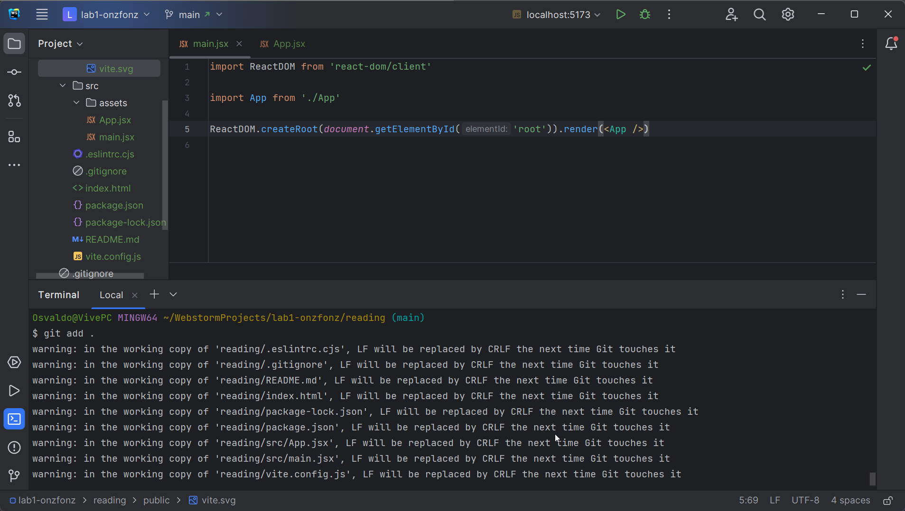

<div class="content">

We will now start getting familiar with probably the most important topic of this course, namely the [React](https://react.dev/) library.
Let's start by making a simple React application as well as getting to know the core concepts of React.

The easiest way to get started by far is by using a tool called
[Vite](https://vitejs.dev/).

First, visit the classroom link: <http://go.djosv.com/227lab1>
and use the steps outlined [in part 0c](/part0/configuring_your_machine_for_this_course) to
[accept](https://imgur.com/5Tv7mVM), [download](https://imgur.com/UDQXB6V) and set up the repository from within WebStorm.
The only different step in our [high-level checklist](/part0/configuring_your_machine_for_this_course#8-connect-webstorm-with-github)
is that in step 3 we need to do is say ***File->New Project from Version Control*** from within WebStorm to open the URL prompt.

I would also make sure to check the option **trust projects** presented in the first window so that you don't have to keep doing so.


Lastly, I would choose the option ***New Window*** and check ***don't ask again*** in the next window.
Using a new window with the project will provide you with a new window for every project.
Having a new window is nice for having a separate area but not being confined to having only one project open at a time.
I liked using attach, which puts all the repos in a single folder.
However, this creates more issues in particular views like the git view as it shows you all the same files and you have to keep making sure you have the right path.


#### Importing File Watcher Settings

One thing we'll need to remember to do is to import our file watcher settings that we created
[when we were configuring our WebStorm](/part0/configuring_your_machine_for_this_course#9-additional-webstorm-setup)

- Open up WebStorm's Settings again, then go to *Tools->File Watchers*, and click the *Import* icon.
- Select the watchers file that you had previously exported
- Once you locate the file, click ***OK***
- You should see *COMP 227 Git Watcher* appear enabled
- Click ***OK*** to close settings.

Some of the images prepared for this class use the classic UI, which you can switch to with the settings icon near the close button.


You can click on the project bar in the upper right


This is what it looks like in the modern UI


### Starting Development

to return to see that you should now have two sets of folders: *lab0* and *lab1*.

You can now right-click on lab1 and select **Open in->Terminal**.
If you did not review [part 0d's coverage of git commands and the terminal](/part0/configuring_your_machine_for_this_course#some-git-command-line-tools),
it might make sense to do so now.

With your terminal now open you can type the following:

```bash
npm create vite@latest reading -- --template react

cd reading
npm i
```

Say yes to any prompts that appear asking you to update or that ask you to allow access.

Once you are in the reading directory, start our application by typing:

```bash
npm run dev
```

The console says that the application has started on localhost port 5173, i.e. the address <http://localhost:5173/>.
> Vite uses the port 5173 [by default](https://vitejs.dev/config/server-options.html#server-port).
> If it's not available, Vite will use the next free port number.


Your default browser may have launched automatically.
If not, click on the localhost address in your terminal.
Once the browser opens, open the console (***Ctrl-Shift-I***) **immediately**.
Also, open a text editor so that you can view the code as well as the webpage at the same time on the screen:


You can close *lab0* and close the *README.md* from that lab that we had from the previous folder.
Because we may be working on multiple projects, you'll need to make sure that you are editing the correct file, which you can check in the lower-left breadcrumb trail.
*You'll also need to add the files to git for this reading, this will be part of the process to get credit for the course*

The code of the application resides in the *reading/src* folder.
Let's simplify the default code such that the contents of *main.jsx* looks like this:

```js
import ReactDOM from 'react-dom/client'

import App from './App'

ReactDOM.createRoot(document.getElementById('root')).render(<App />)
```

and *App.jsx* looks like this

```js
const App = () => (
  <div>
      <p>Hello COMP 227!</p>
  </div>
)

export default App
```

You may delete the files:

- *src/App.css*
- *src/assets/react.svg*
- *src/index.css*

as they are not needed in our application right now.
If you use WebStorm's safe delete feature, you should not see any warnings about the files being used.

If you do see warnings, then you may want to read [this future section about react version differences](/part1/a_more_complex_state_debugging_react_apps/#old-react).

#### Test our file watcher workflow

Remember that as we mentioned before, the goal should not just be to read the material, but to follow along with the material and to perform the steps as you go.

Remember how we used the File Watchers previously?
We're going to make sure that process is working,
as any time that we add files or use `create@vite-latest` app,
we need to make sure that the files we created continue to change back to being white in WebStorm's Project Explorer Window.
This should happen automatically when we edit our code.

Please open up *main.jsx*, if it's not open already, and ensure that all of the text is white and that you see a git repo in the upper left.

> *If you see that all of the files have green or blue text in WebStorm, for a long time,
This means that our file watcher may be working correctly.
> Depending on your configuration, you may get warnings about the line endings.
This is safe to ignore.*



If the files do not change back to white and you feel as though your file watchers are working, if you type

```bash
git status
```

If your file watcher is working correctly, you'll see that the files have turned white again.


For this class, you should not ever really have files in Red, Green or any color in WebStorm for very long, since this will prevent our use of our Auto-Save feature and the File Watchers.
***To test that this is working, please go to *App.jsx* and change the word *`Hello`* to *`Hola`*.***
When you do this, you may notice that *App.jsx* turns blue which means that there are changes that have yet to be committed.


However, the file will not stay blue for long, and our workflow automation will be triggered, which will cause the file to be white again.

The last thing I wanted to point your attention to is to be aware of a green arrow near our main branch at the top.
You should not have one at this moment.
If you do, then you may not have setup file watchers correctly.
You can create that arrow by going to terminal, and creating an empty commit message, which I'll have you do everytime you complete the exercises.

We'll use the empty commits to give us a non-standard way of leaving notes in our code.
Go to terminal and write this line.

```bash
git commit --allow-empty -m "Practicing an empty commit while reading part 1a"
```

After typing that line, do not make any changes in your JSX file, and go back to webstorm, and if you type another git status, you should now see this green arrow appear.


Webstorm uses the arrows to let you know that your github repo and local computer are out of sync.
The green arrow can also happen if you add new files to your project.

To make the arrow go away, we'll **push** the empty commit, which we can do via the terminal or WebStorm.
In Terminal, you can just type:

```bash
git push
```

Once you complete this command, you'll notice that the *main* branch no longer has the green arrow next to it.
You can also ensure that your changes are on GitHub (including your empty commit message)
To ensure that you are working through the material correctly, you will message me directly once you finish this to confirm that you are following the steps.

> ***If you use more than one computer, you'll need to make sure that you pull at the beginning of the session and push at the end***.
> Not following this process will most likely result in you needing to meet with me to fix things.
> ***Let's avoid having unnecessary meetings and promise to follow these instructions***.

### create-react-app

An alternative to Vite is the older generation tool [*create-react-app*](https://github.com/facebookincubator/create-react-app).
This tool was used in previous versions of the course.

Here are some of the most notable differences

|Difference|Vite|create-react-app (AKA ***CRA***)|
|--|--|--|
|Application Startup filename|*main.jsx*|*index.js*|
|Filename for `<App />` component|*App.jsx*|*App.js*|
|command to launch application|`npm run dev`|`npm start`|

This year the course has been updated to Vite,
though some parts may still use the application base created with `create-react-app`.

### Component

*App.jsx* now defines a [React component](https://react.dev/learn/your-first-component) with the name `App`.
The command on the final line of *main.jsx*

```js
ReactDOM.createRoot(document.getElementById('root')).render(<App />)
```

renders its contents into the file *public/index.html*, inside a `div` element that has the `id` value `'root'`.

> **FYI**: By default, the file *public/index.html* doesn't contain any HTML markup that is visible to us in the browser.
>
> ```html
> <!doctype html>
> <html lang="en">
>   <head>
>     <meta charset="UTF-8" />
>     <link rel="icon" type="image/svg+xml" href="/vite.svg" />
>     <meta name="viewport" content="width=device-width, initial-scale=1.0" />
>     <title>Vite + React</title>
>   </head>
>   <body>
>     <div id="root"></div>
>     <script type="module" src="/src/main.jsx"></script>
>   </body>
> </html>
> ```
>
> You can try adding some HTML to the file.
> However, when using React, all content that needs to be rendered is usually defined as React components.

Let's take a closer look at the code defining the component:

```js
const App = () => (
  <div>
    <p>Hola COMP 227!</p>
  </div>
)
```

As you probably guessed, the component will be rendered as a `div` tag, which wraps a `p` tag containing the text `Hola COMP 227!`.

Technically the component is defined as a JavaScript function.
The following is a function (which does not receive any parameters):

```js
() => (
  <div>
    <p>Hola COMP 227!</p>
  </div>
)
```

The function is then assigned to a constant variable `App`:

```js
const App = ...
```

There are a few ways to define functions in JavaScript.
Here we will use [*arrow functions*](https://developer.mozilla.org/en-US/docs/Web/JavaScript/Reference/Functions/Arrow_functions),
which are described in a newer version of JavaScript known as [ECMAScript 6](http://es6-features.org/#Constants), also called ES6.

Because the function consists of only a single expression we have used a shorthand, which represents this piece of code:

| original shorthand | long form |
| --- | --- |
|<pre><code class="languagejs">const App = () => (<br><br>  \<div><br>    \<p>Hola COMP 227!\</p><br>  \</div><br><br>)<br>|<pre><code class="languagejs">const App = () => {<br>  return (<br>    \<div><br>      \<p>Hola COMP 227!\</p><br>    \</div><br>  )<br>}|

**Notice the return and curly braces instead of parenthesis**!
In other words, the function returns the value of the expression.

The function defining the component may contain any kind of JavaScript code.
Modify your component to be as follows and observe what happens in the developer tool's console: (I'll refer to this as the **console** from here on out.)

```js
const App = () => {
  console.log('Hello from the App component')
  return (
    <div>
      <p>Hola COMP 227!</p>
    </div>
  )
}

export default App
```

and observe what happens in the browser console


The first rule of frontend web development:

> *keep the console open all the time*

Let us repeat this together: *I promise to keep the console open all the time* when you are doing web development.

It is also possible to render dynamic content inside of a component.

Modify the component as follows:

```js
const App = () => {
  const now = new Date()
  const a = 18
  const b = 24

  return (
    <div>
      <p>Hola COMP 227! It is {now.toString()}</p>
      <p>
        {a} plus {b} is {a + b}
      </p>
    </div>
  )
}
```

Any JavaScript code within the curly braces is evaluated and that result is embedded into the HTML where the curly braces once were.

Notice that you should not remove the line at the bottom of the component

```js
export default App
```

The export is not shown in most of the examples of the course material.
Without the export, the application breaks.

What was printed out in the console?
Did you keep it open?

### JSX

It seems like React components are returning HTML markup.
However, this is not the case.
The layout of React components is mostly written using [JSX](https://react.dev/learn/writing-markup-with-jsx).
Although JSX looks like HTML, we are dealing with a way to write JavaScript.
Under the hood, JSX returned by React components is compiled into JavaScript.

After compiling, our application looks like this:

```js
const App = () => {
  const now = new Date()
  const a = 18
  const b = 24
  return React.createElement(
    'div',
    null,
    React.createElement(
      'p', null, 'Hola COMP 227! It is ', now.toString()
    ),
    React.createElement(
      'p', null, a, ' plus ', b, ' is ', a + b
    )
  )
}
```

The compilation is handled by [Babel](https://babeljs.io/repl/).
Projects created with *vite* or *create-react-app* are configured to compile automatically.
We will learn more about this topic in [part 7](/part7) of this course.

It is also possible to write React as "pure JavaScript" without using JSX.
Just like it's possible to chisel one of your old programming projects onto a stone tablet.
In either case, I wouldn't recommend it.

In practice, JSX is much like HTML with the distinction that with JSX you can easily embed dynamic content by writing appropriate JavaScript within curly braces.
The idea of JSX is quite similar to other templating languages, such as [Thymeleaf](https://www.thymeleaf.org/) and [Java Spring](https://spring.io/), which are used on servers.

JSX is "[XML](https://developer.mozilla.org/en-US/docs/Web/XML/XML_introduction)-like", which means that *every tag needs to be closed*.
For example, a newline is an empty element, which in HTML can be written as follows:

```html
<br>
```

***Notice the absence of a closing tag with HTML.***
However, when *writing JSX*, **the tag needs to be *closed* with a `/`**:

```html
<br />
```

This is also referred to as a **self-closing tag**.

### Multiple components

Let's modify *App.jsx* as follows:

```js
// highlight-start
const Greet = () => {
  return (
    <div>
      <p>Hola COMP 227!</p>
    </div>
  )
}
// highlight-end

const App = () => {
  return (
    <div>
      <h1>Greetings</h1>
      <Greet /> // highlight-line
    </div>
  )
}
```

> Pertinent: `export` at the bottom will be left out of any future examples.
> We still need **`export` for the code to work.**

We have defined a new component `Greet` and used it inside the component `App`.
Naturally, a component can be used multiple times:

```js
const App = () => {
  return (
    <div>
      <h1>Greetings</h1>
      <Greet />
      // highlight-start
      <Greet />
      <Greet />
      // highlight-end
    </div>
  )
}
```

Writing components with React is easy, and by combining components, even a more complex application can be kept fairly maintainable.
Indeed, a core philosophy of React is composing applications from many specialized reusable components.

Another strong convention is the idea of a **root component** called `App` at the top of the component tree of the application.
Nevertheless, as we will learn in [part 6](/part6),
there are situations where the component `App` is not exactly the root, but is wrapped within an appropriate utility component.

### props: passing data to components

It is possible to pass data to components using so-called [**props**](https://react.dev/learn/passing-props-to-a-component).

Let's modify the component `Greet` as follows:

```js
const Greet = (props) => { // highlight-line
  return (
    <div>
      <p>Hey {props.name}!</p> // highlight-line
    </div>
  )
}
```

Now the function defining the component has the parameter **props**.
As an argument, the parameter receives an object, which has fields corresponding to all the "props" the user of the component defines.

The props are defined as follows:

```js
const App = () => {
  return (
    <div>
      <h1>Greetings</h1>
      <Greet name='Luna' /> // highlight-line
      <Greet name='Jordan' /> // highlight-line
    </div>
  )
}
```

### Possible error message

If you have set everything up correctly you will receive the following error message at this point:


It's not an actual error, but a warning caused by the [ESLint](https://eslint.org/) tool.
You can silence the warning [`react/prop-types`](https://github.com/jsx-eslint/eslint-plugin-react/blob/master/docs/rules/prop-types.md)
by adding to the file *.eslintrc.cjs* the next line

```js
module.exports = {
   root: true,
   env: { browser: true, es2020: true },
   extends: [
     'eslint:recommended',
     'plugin:react/recommended',
     'plugin:react/jsx-runtime',
     'plugin:react-hooks/recommended',
   ],
   ignorePatterns: ['dist', '.eslintrc.cjs'],
   parserOptions: { ecmaVersion: 'latest', sourceType: 'module' },
   settings: { react: { version: '18.2' } },
   plugins: ['react-refresh'],
   rules: {
     'react-refresh/only-export-components': [
       'warn',
       { allowConstantExport: true },
     ],
     'react/prop-types': 0 // highlight-line
   },
}
```

We will get to know ESLint in more detail [in part 3](/part3/validation_and_es_lint#lint).

### Multiple props

There can be an arbitrary number of props and their values can be *hard-coded* strings or the results of JavaScript expressions.
If the value of the prop is achieved using JavaScript it must be wrapped with curly braces.

Let's modify the code so that the component `Greet` uses two props:

```js
const Greet = (props) => {
  return (
    <div>
      <p>
        Hey {props.name}, you are {props.age} years old // highlight-line
      </p>
    </div>
  )
}

const App = () => {
  const name = 'Buddy' // highlight-line
  const age = 10       // highlight-line

  return (
    <div>
      <h1>Greetings</h1>
      <Greet name='Bailey' age={7 + 14} /> // highlight-line
      <Greet name={name} age={age} />     // highlight-line
    </div>
  )
}
```

The props sent by the component `App` are the values of the variables, the result of the evaluation of the sum expression and a regular string.

### Some tips

React, ESLint, & WebStorm generate helpful error messages.
Despite this, you should, at least in the beginning, advance in **very small steps** and make sure that every change works as desired.

**The console should always be open**.
You should also have the problems area view in WebStorm open as well (***Alt-6***).
The arrows in the image below also point you to line numbers, as those can be helpful as well.
If the browser reports errors, don't continue writing more code, hoping for miracles.
Instead, try to understand the cause of the error and, for example, go back to the previous working state:


While using undo (***Ctrl-Z***) and redo (***Ctrl-Y***) is great,
Because we have the file watcher setup, looking at changes becomes even easier,
as you can always look at the previously recorded changes on any line using the git log window. (***Alt-9***)


When you fix a component, you may notice that the page itself comes back to life, rendering what you expect.

Also, keep in mind that **React component names must be capitalized**.
*If you try defining a component* like this:

```js
const footer = () => {
  return (
    <div>
      greeting app created by <a href='https://github.com/onzfonz'>onzfonz</a>
    </div>
  )
}
```

and use it like this

```js
const App = () => {
  return (
    <div>
      <h1>Greetings</h1>
      <Greet name='Bailey' age={7 + 14} />
      <footer /> // highlight-line
    </div>
  )
}
```

the page is not going to display the content defined within the footer component,
and instead React only creates an empty [footer](https://developer.mozilla.org/en-US/docs/Web/HTML/Element/footer) element,
i.e. the built-in HTML element instead of the custom React element of the same name.
If you change the first letter of the component name to a capital letter,
then React creates a `div` element defined in the `Footer` component, which is rendered on the page.

Notice that the content of a React component (usually) needs to contain **one root element**.
If we, for example, try to define the component `App` without the outermost `div` element (which is *the root element*):

```js
const App = () => {
  return (
    <h1>Greetings</h1>
    <Greet name='Bailey' age={7 + 14} />
    <Greet name={name} age={age} />
    <Footer />
  )
}
```

the result is an error message.


Using a root element (*like an outermost `<div>`*) is not the only working option.
An *array* of components is also a valid solution:

```js
const App = () => {
  return [
    <h1>Greetings</h1>,
    <Greet name='Bailey' age={7 + 14} />,
    <Greet name={name} age={age} />,
    <Footer />
  ]
}
```

However, when defining the root component of the application this is not a particularly wise thing to do, and it makes the code look a bit ugly.

Because the root element is stipulated, we have "extra" div elements in the DOM tree.
This can be avoided by using [fragments](https://react.dev/reference/react/Fragment),
i.e. by wrapping the elements to be returned by the component with ***an empty element `<>`***:

```js
const App = () => {
  const name = 'Buddy'
  const age = 10

  return (
    <>
      <h1>Greetings</h1>
      <Greet name='Bailey' age={7 + 14} />
      <Greet name={name} age={age} />
      <Footer />
    </>
  )
}
```

It now compiles successfully, and the DOM generated by React no longer contains the extra `div` element.

### Do not render objects

Consider an application that prints the names and ages of some of our friends on the screen.
Imagine this is the code that you wrote:

```js
const App = () => {
  const friends = [
    { name: 'Monica', age: 24 },
    { name: 'Joey', age: 25 },
  ]

  return (
    <div>
      <p>{friends[0]}</p>
      <p>{friends[1]}</p>
    </div>
  )
}

export default App
```

However, once you try running the code, nothing appears on the screen.
You try to find a problem in the code for 15 minutes, but you can't figure out where the problem could be.

All of a sudden, you remember the promise we made:

> *I promise to keep the console open all the time during this course, and for the rest of my life when I'm doing web development*

The developer console throws a few errors.

> **Pertinent**: At this point, your developer console may be filled with a load of errors.
> This is because the console does not clear fixed errors automatically.
> To have the console show the latest relevant errors, you need to *clear the console by clicking on the 🚫 icon in the developer tools*.
> Then *refresh the browser (**F5**)* so that the newest relevant errors re-appear


The core of the problem is ***Objects are not valid as a React child***, i.e. the application tries to render *objects* and it fails again.

The console also points to where the error occurred, which can be traced to this code:

```js
<p>{friends[0]}</p>
```

and this causes a problem because the item to be rendered in the braces is an object.

```js
{ name: 'Monica', age: 24 }
```

In React, the **individual items rendered in braces must be primitive values**, such as numbers or strings.

Here's the fix:

```js
const App = () => {
  const friends = [
    { name: 'Monica', age: 24 },
    { name: 'Joey', age: 25 },
  ]

  return (
    <div>
      <p>{friends[0].name} {friends[0].age}</p> // highlight-line
      <p>{friends[1].name} {friends[1].age}</p> // highlight-line
    </div>
  )
}

export default App
```

So now our first friend's name is rendered separately inside the curly braces

```js
{friends[0].name}
```

as *`Monica`* and her age

```js
{friends[0].age}
```

as *`24`*.

> React also allows arrays to be rendered *if* the array contains values ​​that are eligible for rendering (such as numbers or strings).
> So the following program would work, although the result might not be what we want:
>
> ```js
> const App = () => {
>   const friends = [ 'Monica', 'Joey']
> 
>   return (
>     <div>
>       <p>{friends}</p>
>     </div>
>   )
> }
> ```

In this part, it is not even worth trying to use the direct rendering of the tables, we will come back to it in the next part.

</div>

<div class="tasks">

### Exercises 1.1-1.2

The exercises are submitted through GitHub and marking them as done on Canvas.

To submit an exercise as completed in GitHub, you will need to manually write this command in your terminal.

```bash
git commit --allow-empty -m "Completed Exercise X.Y"
```

Because we are using file watchers, all changes are uploaded automatically.
So, any time that the reading says to *commit your changes*, **you can use the `--allow-empty` flag to make an empty commit with the desired message**.

Where *`X`* and *`Y`* stand for the part number ane exercise number.
You will know that it is complete because it will parrot it back to you.
**Consider this part of the submission system**.
If you want to be sure that it uploads, you should also do a `git push`, though if you edit your JSX files afterwards, they should be fine.

*This is something that should happen at all times and you are responsible for verifying your changes show up in github.*

You should submit the exercises in each part with the corresponding repo that is mentioned.
In this case, you will use the repo that was generated from <http://go.djosv.com/227lab1>.

We will use Vite in each of the exercises to create the following file structure for our submission repository,
(**do not do this now; you should already have a *reading* rolder from our previous exercises**):

```text
lab1
  reading
  arcadeinfo
  studytracker
  jokes
```

Each repo will need directories that will be used for an application that will be linked to a series of exercises, like "studytracker" for part 1.

We have provided you with a fairly robust *.gitignore* file, which ignores things like the *node_modules* directory,
so you should commit and add all of the files that you use in your directories.
***Make sure to remove any files you won't use before committing them!***

Please make sure that you add all files initially, as that will be the way you show your work and progress through the course.
Please use an appropriate commit message when adding files to the repo.

Remember that your files should all be white in color.

Notice that in this part, there are more exercises besides those found below.
  
#### 1.1: handheld arcade info, Step 1

This exercise will start the ongoing development of a small application that will be further developed in a few of the following exercises.
Please make sure to commit often and that you do not have any files in your project that are any color other than white.

**Use *Vite* in the base folder of *lab1* to initialize a new application called *arcadeinfo***.

> **FYI:** If you don't know how to do this, then you need to [go back and re-read the initial portion where you first setup the reading folder](#starting-development).
> This is something that you will have to do from time to time in the course to get those necessary refreshers, and that's OK!

Commit and add all of the files needed.
**Make sure that when you type `ls`, you see both the *reading* and *arcadeinfo* folders**.
Now, since you have your *reading* folder already,
you'll make changes in your reading folder, and for the exercises, you'll make changes in the named exercise folder (in this case, *arcadeinfo*)

Modify *arcadeinfo/src/main.jsx* to match the following.

```js
import ReactDOM from 'react-dom/client'

import App from './App'

ReactDOM.createRoot(document.getElementById('root')).render(<App />)
```

and *App.jsx* to match the following

```js
const App = () => {
  const company = 'Nintendo'
  const handheld1 = 'Game Boy'
  const games1 = 1046
  const handheld2 = 'Game Boy Advance'
  const games2 = 1538
  const handheld3 = 'DS'
  const games3 = 1791

  return (
    <div>
      <h1>{company}</h1>
      <p>
        {handheld1} {games1}
      </p>
      <p>
        {handheld2} {games2}
      </p>
      <p>
        {handheld3} {games3}
      </p>
      <p>Number of games {games1 + games2 + games3}</p>
    </div>
  )
}

export default App
```

and remove extra files (*App.css*, *index.css*, *logo.svg*)).

Unfortunately, the entire application is in the same component.
Refactor the code so that it consists of three new components: `Header`, `Content`, and `Total`.
All data still resides in the `App` component, which passes the necessary data to each component using `props`.
`Header` takes care of rendering the name of the company,
`Content` renders the handhelds and their number of games and `Total` renders the total number of games.

Define the new components in *App.jsx*.

The `App` component's body will approximately be as follows:

```js
const App = () => {
  // const-definitions

  return (
    <div>
      <Header company={company} />
      <Content ... />
      <Total ... />
    </div>
  )
}
```

> **WARNING** Don't try to program all the components concurrently,
> because that will almost certainly break down the whole app.
> Proceed in small steps, first make e.g. the component *Header* and only when it works for sure, you could proceed to the next component.
>
> Also, do not try to program all the components at the same time.
> You need to go in small steps, like first make the component *Header* and when that works, **commit** the change and then ***then*** proceed to the next component.

***Make sure to type `git commit --allow-empty -m "Completed Exercise 1.1"` in the terminal before moving onto 1.2***

#### 1.2: handheld arcade info, Step 2

Refactor the `Content` component so that it does not render any names of handhelds or their number of games by itself.
Instead, it only renders three `Handheld` components of which each renders the name and number of games of one handheld.

```js
const Content = ... {
  return (
    <div>
      <Handheld .../>
      <Handheld .../>
      <Handheld .../>
    </div>
  )
}
```

Our application passes on information in quite a primitive way at the moment, since it is based on individual variables.

***Make sure to type `git commit --allow-empty -m "Completed Exercise 1.2"` in the terminal before moving on.***
You will not get anymore regular reminders to do this.

We shall fix that in [part 2](/part2).

</div>
