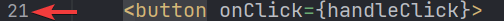
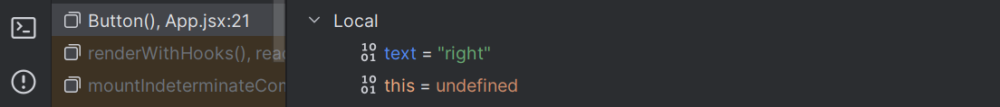

<div class="content">

### Complex state

In our previous example, the application state was simple as it was comprised of a single integer.
What if our application requires a more complex state?

In most cases, the easiest and best way to accomplish this is by *leveraging `useState` **multiple times** to create **separate "pieces"** of state*.

In the following code, we create two pieces of state for the application named `left` and `right` that both get the initial value of *`0`*:

```js
const App = () => {
  const [left, setLeft] = useState(0)
  const [right, setRight] = useState(0)

  return (
    <div>
      {left}
      <button onClick={() => setLeft(left + 1)}>
        left
      </button>
      <button onClick={() => setRight(right + 1)}>
        right
      </button>
      {right}
    </div>
  )
}
```

The component gets access to the functions `setLeft` and `setRight` that it can use to update the two pieces of state.

The component's state or a piece of its state can be of any type.
We could implement the same functionality by saving the click count of both the `left` and `right` buttons into a single object:

```js
{
  left: 0,
  right: 0
}
```

In this case, the application would look like this:

```js
const App = () => {
  const [clicks, setClicks] = useState({
    left: 0, right: 0
  })

  const handleLeftClick = () => {
    const newClicks = { 
      left: clicks.left + 1, 
      right: clicks.right 
    }
    setClicks(newClicks)
  }

  const handleRightClick = () => {
    const newClicks = { 
      left: clicks.left, 
      right: clicks.right + 1 
    }
    setClicks(newClicks)
  }

  return (
    <div>
      {clicks.left}
      <button onClick={handleLeftClick}>left</button>
      <button onClick={handleRightClick}>right</button>
      {clicks.right}
    </div>
  )
}
```

Now the component only has a single piece of state and the event handlers have to take care of changing the **entire application state**.

The event handler looks a bit messy.
When the left button is clicked, the following function is called:

```js
const handleLeftClick = () => {
  const newClicks = { 
    left: clicks.left + 1, 
    right: clicks.right 
  }
  setClicks(newClicks)
}
```

The following object is set as the new state of the application:

```js
{
  left: clicks.left + 1,
  right: clicks.right
}
```

The new value of the `left` property is now the same as the value of `left + 1` from the previous state,
and the value of the `right` property is the same as the value of the `right` property from the previous state.

> **Pertinent**: Some readers might be wondering why we didn't just update the state directly, like this:
>
> ```js
> const handleLeftClick = () => {
>   clicks.left++
>   setClicks(clicks)
> }
> ```
>
> This direct updating of the state *appears to work*.
> However, **it is forbidden in React to mutate state directly**, since [it can result in unexpected side effects](https://stackoverflow.com/a/40309023).
> Changing state has to always be done by setting the state to a new object.
> If properties from the previous state object are not changed, they need to simply be copied,
> which is done by copying those properties into a new object and setting that as the new state.

We can define the new state object a bit more neatly by using the [**object spread**](https://developer.mozilla.org/en-US/docs/Web/JavaScript/Reference/Operators/Spread_syntax)
syntax that was added to the language specification in the summer of 2018:

```js
const handleLeftClick = () => {
  const newClicks = { 
    ...clicks, 
    left: clicks.left + 1 
  }
  setClicks(newClicks)
}

const handleRightClick = () => {
  const newClicks = { 
    ...clicks, 
    right: clicks.right + 1 
  }
  setClicks(newClicks)
}
```

The syntax may seem a bit strange at first.
In practice `{ ...obj }` duplicates the original `obj` object and its properties.
When we also specify a particular property - e.g. `field` in `{ ...obj, field: x }`, the value of the `field` property in the duplicated object will be what `x` evaluates to.

Applying this to the example above, with:

```js
{ ...clicks, right: clicks.right + 1 }
```

Javascript increments the `right` property by *`1`* in the duplicated object.

we can simplify the functions like this:

```js
const handleLeftClick = () =>
  setClicks({ ...clicks, left: clicks.left + 1 })

const handleRightClick = () =>
  setClicks({ ...clicks, right: clicks.right + 1 })
```

Since assigning the object to a variable in the event handlers (e.g. `newClicks`) is not necessary.

While our code has now shrunken, having a single state object (like `clicks`) to store everything is not ideal for this particular application;
there's no apparent benefit and the resulting application is more complex.
In this case, storing the click counters into separate pieces of state is a far more suitable choice.

There are situations where it can be beneficial to store a piece of application state in a more complex data structure.
[The official React documentation](https://react.dev/learn/choosing-the-state-structure) contains some helpful guidance on the topic.

### Handling arrays

Let's add a piece of state to our application containing an array `allClicks` that remembers every click that has occurred in the application.

```js
const App = () => {
  const [left, setLeft] = useState(0)
  const [right, setRight] = useState(0)
  const [allClicks, setAll] = useState([]) // highlight-line

// highlight-start
  const handleLeftClick = () => {
    setAll(allClicks.concat('L'))
    setLeft(left + 1)
  }
// highlight-end  

// highlight-start
  const handleRightClick = () => {
    setAll(allClicks.concat('R'))
    setRight(right + 1)
  }
// highlight-end  

  return (
    <div>
      {left}
      <button onClick={handleLeftClick}>left</button>
      <button onClick={handleRightClick}>right</button>
      {right}
      <p>{allClicks.join(' ')}</p> // highlight-line
    </div>
  )
}
```

Every click is stored in a separate piece of state called `allClicks` that is initialized as an empty array:

```js
const [allClicks, setAll] = useState([])
```

When the `left` button is clicked, we add the letter `L` to the `allClicks` array:

```js
const handleLeftClick = () => {
  setAll(allClicks.concat('L'))
  setLeft(left + 1)
}
```

The piece of state stored in `allClicks` is now set to be an array that contains all of the items of the previous state array plus the letter `L`.
Adding the new item to the array is accomplished with the [`concat` method](https://developer.mozilla.org/en-US/docs/Web/JavaScript/Reference/Global_Objects/Array/concat),
which does not mutate the existing array but rather returns a **new copy of the array** with the item added to it.

As mentioned previously, it's also possible in JavaScript to add items to an array with the
[`push` method](https://developer.mozilla.org/en-US/docs/Web/JavaScript/Reference/Global_Objects/Array/push).
If we add the item by pushing it to the `allClicks` array and then updating the state, the application would still appear to work:

```js
const handleLeftClick = () => {
  allClicks.push('L')
  setAll(allClicks)
  setLeft(left + 1)
}
```

However, **don't use `push`, as it mutates `allClicks`**.
Remember, the state of React components (like `allClicks`) must not be changed directly.
Even if mutating the state appears to work in some cases, *it can lead to problems that are very hard to debug*.

Let's take a closer look at how the clicking
is rendered to the page:

```js
const App = () => {
  // ...

  return (
    <div>
      {left}
      <button onClick={handleLeftClick}>left</button>
      <button onClick={handleRightClick}>right</button>
      {right}
      <p>{allClicks.join(' ')}</p> // highlight-line
    </div>
  )
}
```

We call the [`join` method](https://developer.mozilla.org/en-US/docs/Web/JavaScript/Reference/Global_Objects/Array/join)
on the `allClicks` array that joins all the items into a single string,
separated by the string passed as the function parameter, which in our case is a single space.

### Update of the state is asynchronous

Let's expand the application so that it tracks the total number of button presses in the state `total`.
Every time the mouse is clicked, `total` will update:

```js
const App = () => {
  const [left, setLeft] = useState(0)
  const [right, setRight] = useState(0)
  const [allClicks, setAll] = useState([])
  const [total, setTotal] = useState(0) // highlight-line

  const handleLeftClick = () => {
    setAll(allClicks.concat('L'))
    setLeft(left + 1)
    setTotal(left + right)  // highlight-line
  }

  const handleRightClick = () => {
    setAll(allClicks.concat('R'))
    setRight(right + 1)
    setTotal(left + right)  // highlight-line
  }

  return (
    <div>
      {left}
      <button onClick={handleLeftClick}>left</button>
      <button onClick={handleRightClick}>right</button>
      {right}
      <p>{allClicks.join(' ')}</p>
      <p>total {total}</p>  // highlight-line
    </div>
  )
}
```

The solution does not quite work:


The total number of button presses is consistently one less than the actual amount of presses, for some reason.

Let us add a couple of `console.log` statements to the event handler:

```js
const App = () => {
  // ...
  const handleLeftClick = () => {
    setAll(allClicks.concat('L'))
    console.log('left before', left)  // highlight-line
    setLeft(left + 1)
    console.log('left after', left)  // highlight-line
    setTotal(left + right)
  }

  // ...
}
```

The console reveals the problem


Even though a new value for `left` was requested by calling `setLeft(left + 1)`, the ***old value remains in the `left` variable while this function still executes***.
As a result, the attempt to count button presses uses the non-updated value for `left`:

```js
setTotal(left + right) // computer evaluates as '4 + 1'
```

The reason for this is that *a state update in React happens* [***asynchronously***](https://react.dev/learn/queueing-a-series-of-state-updates),
i.e. not immediately but "at some point" before the component is rendered again.

We can fix the app as follows:

```js
const App = () => {
  // ...
  const handleLeftClick = () => {
    setAll(allClicks.concat('L'))
    const updatedLeft = left + 1
    setLeft(updatedLeft)
    setTotal(updatedLeft + right)
  }

  // ...
}
```

So now the number of button presses is based on the correct number of left button presses.

### Conditional rendering

Let's modify our application so that the rendering of the clicking history is handled by a new `History` component:

```js
// highlight-start
const History = (props) => {
  if (props.allClicks.length === 0) {
    return (
      <div>
        the app is used by pressing the buttons
      </div>
    )
  }

  return (
    <div>
      button press history: {props.allClicks.join(' ')}
    </div>
  )
}
// highlight-end

const App = () => {
  // ...

  return (
    <div>
      {left}
      <button onClick={handleLeftClick}>left</button>
      <button onClick={handleRightClick}>right</button>
      {right}
      <History allClicks={allClicks} /> // highlight-line
    </div>
  )
}
```

Now the behavior of the component depends on whether or not any buttons have been clicked.
If not, meaning that the `allClicks` array is empty, the component renders a div element with some instructions instead:

```js
<div>the app is used by pressing the buttons</div>
```

In all other cases, the component renders the clicking history:

```js
<div>
  button press history: {props.allClicks.join(' ')}
</div>
```

The `History` component renders completely different React elements depending on the state of the application.
This is called **conditional rendering**.

React also offers many other ways of doing [conditional rendering](https://react.dev/learn/conditional-rendering).
We will take a closer look at this in [part 2](/part2).

Let's make one last modification to our application by refactoring it to use the `Button` component that we defined earlier:

```js
const History = (props) => {
  if (props.allClicks.length === 0) {
    return (
      <div>
        the app is used by pressing the buttons
      </div>
    )
  }

  return (
    <div>
      button press history: {props.allClicks.join(' ')}
    </div>
  )
}

// highlight-start
const Button = ({ handleClick, text }) => (
  <button onClick={handleClick}>
    {text}
  </button>
)
// highlight-end

const App = () => {
  const [left, setLeft] = useState(0)
  const [right, setRight] = useState(0)
  const [allClicks, setAll] = useState([])

  const handleLeftClick = () => {
    setAll(allClicks.concat('L'))
    setLeft(left + 1)
  }

  const handleRightClick = () => {
    setAll(allClicks.concat('R'))
    setRight(right + 1)
  }

  return (
    <div>
      {left}
      // highlight-start
      <Button handleClick={handleLeftClick} text='left' />
      <Button handleClick={handleRightClick} text='right' />
      // highlight-end
      {right}
      <History allClicks={allClicks} />
    </div>
  )
}
```

### Old React

In this course, we use the [state hook](https://react.dev/learn/state-a-components-memory) to add state to our React components,
which is part of the newer versions of React and is available from version [16.8.0](https://www.npmjs.com/package/react/v/16.8.0) onwards.
Before the addition of hooks, there was no way to add state to functional components.
Components that required state had to be defined as [class](https://react.dev/reference/react/Component) components, using the JavaScript class syntax.

In this course, we have made the slightly radical decision to use hooks exclusively from day one,
to ensure that we are learning the current and future variations of React.
Even though functional components are the future of React, it is still important to learn the class syntax,
as there are billions of lines of legacy React code that you might end up maintaining someday.
The same applies to documentation and examples of React that you may stumble across on the internet.

We will learn more about React class components later on in the course.

### Debugging React applications

A large part of a typical developer's time is spent on debugging and reading existing code.
Once in a while, we do get to write a line or two of new code,
but a large part of our time is spent trying to figure out why something is broken or how something works.
Good practices and tools for debugging are extremely important for this reason.

Lucky for us, React is an extremely developer-friendly library when it comes to debugging.

Before we move on, let us remind ourselves of one of the most important rules of web development.

#### The first rule of web development

> **Keep the browser's developer console open at all times.**
>
> The `Console` tab in particular should always be open, unless there is a specific reason to view another tab.

Keep both your code and the web page open together **at the same time, all the time**.

If and when your code fails to compile and your browser lights up like a nightclub:


don't write more code but rather find and fix the problem **immediately**.
Code will not miraculously start working after writing large amounts of additional code.

### WebStorm IDE Debugger Introduction

Old-school, print-based debugging can at times be a good idea.
I prefer using an IDE and its breakpoints though when possible.

To use the debugger, we have to configure an additional setting that tells WebStorm what to do when you want to launch your program.

First, near the play button at the top of the window, click on the ***Down arrow*** icon in between the *Current File* and the Play icon, and select ***Edit Configurations...***


This brings up the following dialog box, where you'll choose the *plus icon* to ***Add new run configuration...***, and then you can select ***JavaScript Debug***.

> Notice there is an option to create a *Node.js* configuration, but that won't be necessary for a few more weeks, so leave it for now.


The most important part here is to specify the URL, which will be *`http://localhost:5173`*.
You can name the Configuration so that it is easier to remember, for me, I just named it `localhost:5173`.
The configuation should look something like this:


Once everything is set, you can then click **OK**, and you'll now see that Current File has been replaced by ***localhost:5173***!

With the debugger configured, let's go review some theory and how we will utilize it in WebStorm.

### Debugging in WebStorm

A **breakpoint** is a special IDE-based marker that tells your application to ***break*** (pause executing code) when it reaches a particular ***point*** (line of code).
Breakpoints can be turned on or off by clicking on the line number to the left of a line:



When a line number is clicked, it turns into a stop sign indicating the breakpoint is enabled for that line:


The application will only break at that line when it reaches that point and you click on the debugger icon
 in the upper right of the WebStorm IDE.

Once you are at a breakpoint, you'll notice that the Browser will give you an indication that it is paused.
In WebStorm, you should notice that the Debug pane (***Alt-6***) is open, and there will also be an indication of the line that it is stopped at:


The ***Threads & Variables*** tab is handy as it provides a wealth of information on the current state of variables that you can explore by clicking around.
You can see the state of all of the local and global variables as if you were to write `console.log` statements for all of your variables here.


If you don't want to wade through, you could also set up expressions for the computer to evaluate, which can also be done in the Console tab.
What you would type in here is what you would normally put inside of `console.log` statements.
The ***Console*** tab also provides a history of what you have typed and can include some fairly complex expressions.


If you would like to continue executing the application, you can use the browser's resume button.


Of course, it will continue until it reaches the next breakpoint.
In this case, because we have two buttons, pressing the button will feel *as if it did nothing*.
However, if we examine the variables closely,
the local variable `text` should now have the property `right` (which WebStorm highlights in blue).



If you click the resume button again, it will appear as though the application has left the debugging session.
However, the IDE will still have icons that let you know it is still connected.


The application will run until it reaches another breakpoint.

To get out of the Debugging Session, you can merely press the Red Stop button.
Pressing the Green Bug Button to the left will restart the debugging session and relaunch the webpage.

### Finding a small error

Imagine that you have tried coding the application up.
However, you notice that when you run the program, ***Nothing appears***.
While it's normal for us to think of what is not happening, we need to focus on what is going on.
Imagine we set a breakpoint on the same line again and we try to debug.  Then we notice that our `text` local variable is *`undefined`*, like this:


If our component

```js
const Button = ({ handleClick, text }) => (
  <button onClick={handleClick}>
    {text}
  </button>
)
```

is not working as intended, it's useful to examine the `props` object more closely.
To do this effectively, we must stop debugging and transform our function into the less compact form
and receive the entire props object without destructuring it immediately:

```js
const Button = (props) => { 
  const { handleClick, text } = props
  return (
    <button onClick={handleClick}>
      {text}
    </button>
  )
}
```

If we then run the debugger again and place a breakpoint on the return line, we can examine the variables passed in much more closely.
In this case, we might be able to find what the issue may be.


***Study this picture and see if you can find the issue...I will ask you about it in the future!***

#### A quick aside about logging

> **Pertinent** Some of you have had much more experience merely printing things to the console instead of using the debugger.
> While printing things to the console is still helpful, I would also prefer for you to learn to use the debugger.
> Nonetheless, when you the ***Console*** tab (or `console.log`) for debugging, **don't combine objects** in a Java-like fashion by using the plus operator.
> If you write:
>
> ```js
> 'props value is ' + props
> ```
>
> You will end up with an unhelpful log message:
>
> ```js
> props value is [object Object]
> ```
>
> To get actual values for variables, separate them in `console.log` with a comma:
>
> ```js
> 'props value is', props
> ```
>
> Now, those separated items will be available in the browser console for further review.

### Using the browser's debugging tools

Setting breakpoints or logging output to the console are not the only ways of debugging our applications.
You can also pause the execution of your application code in the Chrome developer console's *debugger*,
by writing the command [`debugger`](https://developer.mozilla.org/en-US/docs/Web/JavaScript/Reference/Statements/debugger) anywhere in your code.

The execution will pause once it arrives at a point where the ***`debugger`*** command gets executed:


By going to the *Console* tab, it is easy to inspect the current state of variables:


> You may notice that ESLint mentions the use of debugger *`Unexpected 'debugger' statement (no-debugger)`*.
> ESLint flags this as a problem because we would not want to keep a debugger line in production code.
> *Imagine being on a website only to have the application completely pause?*
> This is why ESLint has this as a rule.  
> There is a way to turn this off, but we will leave it on to remind us to take it out eventually.

Once the cause of the bug is discovered you can remove the ***`debugger`*** command and refresh the page.

The debugger, like WebStorm, enables us to execute our code line by line with the controls found on the right-hand side of the ***Sources*** tab.

You can also access the debugger without the ***debugger*** command by adding breakpoints in the ***Sources*** tab.
Inspecting the values of the component's variables can be done in the ***Scope*** section:


It is highly recommended to add the [React developer tools](https://chrome.google.com/webstore/detail/react-developer-tools/fmkadmapgofadopljbjfkapdkoienihi?hl=en) extension to Chrome.
It adds a new ***Components*** tab to the developer tools.
The new developer tools tab can be used to inspect the different React elements in the application, along with their state and props:


The `App` component's state is defined like so:

```js
const [left, setLeft] = useState(0)
const [right, setRight] = useState(0)
const [allClicks, setAll] = useState([])
```

Dev tools show the state of hooks in the order of their definition:


The first *State* contains the value of the `left` state,
the next contains the value of the `right` state and the last contains the value of the `allClicks` state.

### Rules of Hooks

There are a few limitations and rules we have to follow to ensure that our application uses hooks-based state functions correctly.

***Hooks should be called at the base level of React function components, before any `return` statements***

***Do not call*** `useState` (or `useEffect`) from:

- ⛔inside of a loop⛔
- ⛔a conditional expression⛔
- ⛔any place that is not a function defining a React component⛔.

Why? We need to ensure that hooks are always called in the same order.
If we use loops, conditionals or other nested functions, the application can behave erratically.

To recap, hooks may only be called from the inside of a function body that defines a React component:

```js
const App = () => {
  // this is at the base level in a React function component
  // You can typically tell a function component because it is capitalized (App)
  const [age, setAge] = useState(0)
  const [name, setName] = useState('CW Longbottom')

  if ( age > 10 ) {
    const [foobar, setFoobar] = useState(null) // 🐞 - doesn't work
  }

  for ( let i = 0; i < age; i++ ) {
    const [rightWay, setRightWay] = useState(false) // 🐞 - also no good
  }

  const notGood = () => {
    const [x, setX] = useState(-1000) // 🐞 also illegal
  }

  return (
    //...
  )
}
```

### Event Handling Revisited

Event handling is tricky, so we will revisit the topic.

Let's assume that we're developing this simple application with the following component `App`:

```js
const App = () => {
  const [value, setValue] = useState(10)

  return (
    <div>
      {value}
      <button>reset to zero</button>
    </div>
  )
}
```

We want the clicking of the button to reset the state stored in the `value` variable.

To make the button react to a click event, we have to add an **event handler** to it.

Event handlers must always be a function or a reference to a function.
The button will not work if the event handler is set to a variable of any other type.

If we were to define the event handler as a string:

```js
<button onClick="crap...">button</button>
```

React would warn us about this in the console:

```js
Warning: Expected `onClick` listener to be a function, instead got a value of `string` type.
    in button
    in div
    in App
```

The following attempt would also not work:

```js
<button onClick={value + 1}>button</button>
```

We have attempted to set the event handler to `value + 1` which simply returns the result of the operation.
React will kindly warn us about this in the console:

```js
Warning: Expected `onClick` listener to be a function, instead got a value of `number` type.
```

This attempt would not work either:

```js
<button onClick={value = 0}>button</button>
```

The event handler is not a function but a variable assignment, and React will once again issue a warning to the console.
This attempt is also flawed in the sense that we must never mutate state directly in React.

What about the following:

```js
<button onClick={console.log('clicked the button')}>
  button
</button>
```

The message gets printed to the console *once when the component is rendered **but nothing happens when we click the button***.
Why does this not work even when our event handler contains a function `console.log`?

The issue here is that *our event handler is defined as a **function call***
which means that the event handler is assigned the returned value from the function, which in the case of `console.log` is `undefined`.

The `console.log` function call gets executed when the component is rendered and for this reason, it gets printed once to the console.

The following attempt is flawed as well:

```js
<button onClick={setValue(0)}>button</button>
```

We have once again tried to set a function call as the event handler.
This does not work.
This particular attempt also causes another problem.
Let's follow these steps to explain:

1. `button` component gets rendered
2. `setValue(0)` gets executed (because we rendered the component)
3. `button` component gets re-rendered (because we changed the ***state***).
4. `setValue(0)` gets executed (because we rendered the component)
5. This continues indefinitely 🐞

Instead, executing a specific function with *`onClick`* should be written like this:

```js
<button onClick={() => console.log('clicked the button')}>
  button
</button>
```

Now the event handler is a function defined with the arrow function syntax: *`() => console.log('clicked the button')`*.
Now our setup looks like this:

1. `button` component gets rendered
2. reference to the arrow function gets stored in the `onClick` handler

Now no function gets immediately called.
`console.log` will only happen once the button is clicked.

We can implement resetting the state in our application with this same technique:

```js
<button onClick={() => setValue(0)}>button</button>
```

The event handler is now the function *`() => setValue(0)`*.

Defining event handlers directly in the button is not ideal.

You will often see event handlers defined in a separate place.
Below we set our arrow function to a variable `handleClick` that then gets assigned in the `onClick` handler.

```js
const App = () => {
  const [value, setValue] = useState(10)

  const handleClick = () => console.log('clicked the button') // highlight-line

  return (
    <div>
      {value}
      <button onClick={handleClick}>button</button> // highlight-line
    </div>
  )
}
```

Naturally, our event handler function can be composed of multiple commands.
In these cases, we use the longer curly brace syntax for arrow functions:

```js
const App = () => {
  const [value, setValue] = useState(10)

  // highlight-start
  const handleClick = () => {
    console.log('clicked the button')
    setValue(0)
  }
   // highlight-end

  return (
    <div>
      {value}
      <button onClick={handleClick}>button</button>
    </div>
  )
}
```

### A function that returns a function

Another way to define an event handler is to use a **function that returns a function**.

You probably won't need to use functions that return functions in any of the exercises in this course.
If the topic seems particularly confusing, you may jump to the [next section](#passing-event-handlers-to-child-components) and return to this later.

Let's make the following changes to our code:

```js
const App = () => {
  const [value, setValue] = useState(10)

  // highlight-start
  const hello = () => {
    const handler = () => console.log('hello comp227')

    return handler
  }
  // highlight-end

  return (
    <div>
      {value}
      <button onClick={hello()}>button</button>
    </div>
  )
}
```

The code functions correctly even though it looks complicated.

The event handler is now set to a function call:

```js
<button onClick={hello()}>button</button>
```

Earlier on we stated that an event handler may not be a call to a function and that it has to be a function or a reference to a function.
***Why then does a function call work in this case?***

When the component is rendered, the following function gets executed:

```js
const hello = () => {
  const handler = () => console.log('hello comp227')

  return handler
}
```

The *return value* of the function is **another function that is assigned to the `handler` variable**.

When React renders the line:

```js
<button onClick={hello()}>button</button>
```

*It assigns the return value of `hello()` to the `onClick` attribute*.
Essentially the line gets transformed into:

```js
<button onClick={() => console.log('hello comp227')}>
  button
</button>
```

Since the `hello` function returns a function, the event handler is now a function.

😤 ***What's the point of this concept?*** 😤

Let's change the code a tiny bit:

```js
const App = () => {
  const [value, setValue] = useState(10)

  // highlight-start
  const hello = (who) => {
    const handler = () => {
      console.log('hello', who)
    }

    return handler
  }
  // highlight-end  

  return (
    <div>
      {value}
  // highlight-start      
      <button onClick={hello('comp227')}>button</button>
      <button onClick={hello('you')}>button</button>
      <button onClick={hello('function')}>button</button>
  // highlight-end      
    </div>
  )
}
```

Now the application has three buttons with event handlers defined by the `hello` function *that accepts a parameter*.

The first button is defined as

```js
<button onClick={hello('comp227')}>button</button>
```

The event handler is created by *executing* the function call `hello('comp227')`.
The function call returns the function:

```js
() => {
  console.log('hello', 'comp227')
}
```

The second button is defined as:

```js
<button onClick={hello('you')}>button</button>
```

The function call `hello('you')` that creates the event handler returns:

```js
() => {
  console.log('hello', 'you')
}
```

Both buttons get their individualized event handlers.

**Functions returning functions can be utilized in defining generic functionality that can be customized with parameters.**
The `hello` function that creates the event handlers can be thought of as a factory that produces customized event handlers meant for greeting users.

Our current definition is slightly verbose:

```js
const hello = (who) => {
  const handler = () => {
    console.log('hello', who)
  }

  return handler
}
```

Let's eliminate the helper variables and directly return the created function:

```js
const hello = (who) => {
  return () => {
    console.log('hello', who)
  }
}
```

Since our `hello` function is composed of a single return command, we can omit the curly braces and use the more compact syntax for arrow functions:

```js
const hello = (who) =>
  () => {
    console.log('hello', who)
  }
```

Lastly, let's write all of the arrows on the same line:

```js
const hello = (who) => () => {
  console.log('hello', who)
}
```

We can use the same trick to ***define event handlers that set the state of the component to a given value***.
Let's make the following changes to our code:

```js
const App = () => {
  const [value, setValue] = useState(10)
  
  // highlight-start
  const setToValue = (newValue) => () => {
    console.log('value now', newValue)  // print the new value to console
    setValue(newValue)
  }
  // highlight-end
  
  return (
    <div>
      {value}
      // highlight-start
      <button onClick={setToValue(1000)}>thousand</button>
      <button onClick={setToValue(0)}>reset</button>
      <button onClick={setToValue(value + 1)}>increment</button>
      // highlight-end
    </div>
  )
}
```

When the component is rendered, the ***thousand*** button is created:

```js
<button onClick={setToValue(1000)}>thousand</button>
```

The event handler is set to the return value of `setToValue(1000)` which is the following function:

```js
() => {
  console.log('value now', 1000)
  setValue(1000)
}
```

The increase button is declared as follows:

```js
<button onClick={setToValue(value + 1)}>increment</button>
```

The event handler is created by the function call `setToValue(value + 1)`
which receives as its parameter the current value of the state variable `value` increased by one.
If the value of `value` was *`10`*, then the created event handler would be the function:

```js
() => {
  console.log('value now', 11)
  setValue(11)
}
```

Using functions that return functions is not required to achieve this functionality.
Let's return the `setToValue` function which is responsible for updating state into a normal function:

```js
const App = () => {
  const [value, setValue] = useState(10)

  const setToValue = (newValue) => {
    console.log('value now', newValue)
    setValue(newValue)
  }

  return (
    <div>
      {value}
      <button onClick={() => setToValue(1000)}>
        thousand
      </button>
      <button onClick={() => setToValue(0)}>
        reset
      </button>
      <button onClick={() => setToValue(value + 1)}>
        increment
      </button>
    </div>
  )
}
```

We can now define the event handler as a function that calls the `setToValue` function with an appropriate parameter.
The event handler for resetting the application state would be:

```js
<button onClick={() => setToValue(0)}>reset</button>
```

*Choosing between the two presented ways of defining your event handlers is mostly a matter of taste.*

### Passing Event Handlers to Child Components

Let's extract the button into its own component:

```js
const Button = (props) => (
  <button onClick={props.handleClick}>
    {props.text}
  </button>
)
```

The component gets the event handler function from the `handleClick` prop and the text of the button from the `text` prop.
Let's use the new component:

```js
const App = (props) => {
  // ...
  return (
    <div>
      {value}
      <Button handleClick={() => setToValue(1000)} text="thousand" /> // highlight-line
      <Button handleClick={() => setToValue(0)} text="reset" /> // highlight-line
      <Button handleClick={() => setToValue(value + 1)} text="increment" /> // highlight-line
    </div>
  )
}
```

Using the `Button` component is simple, although we have to make sure that we use the correct attribute names when passing props to the component.


### Do Not Define Components Within Components

Let's start displaying the value of the application in its `Display` component.

We will change the application by defining a new component inside of the `App` component.

```js
// This is the right place to define a component
const Button = (props) => (
  <button onClick={props.handleClick}>
    {props.text}
  </button>
)

const App = () => {
  const [value, setValue] = useState(10)

  const setToValue = newValue => {
    console.log('value now', newValue)
    setValue(newValue)
  }

  // 🐞 Do not define components inside another component 🐞
  const Display = props => <div>{props.value}</div> // highlight-line

  return (
    <div>
      <Display value={value} />
      <Button handleClick={() => setToValue(1000)} text="thousand" />
      <Button handleClick={() => setToValue(0)} text="reset" />
      <Button handleClick={() => setToValue(value + 1)} text="increment" />
    </div>
  )
}
```

The application still appears to work, but **don't implement components like this!** Never define components inside of other components.
The method provides no benefits and leads to many unpleasant problems.
The biggest problems are because React treats a component defined inside of another component as a new component in every render.
**This makes it impossible for React to optimize the component.**

Let's instead move the `Display` component function to its correct place, which is *outside of the `App` component function*:

```js
const Display = props => <div>{props.value}</div>

const Button = (props) => (
  <button onClick={props.handleClick}>
    {props.text}
  </button>
)

const App = () => {
  const [value, setValue] = useState(10)

  const setToValue = newValue => {
    console.log('value now', newValue)
    setValue(newValue)
  }

  return (
    <div>
      <Display value={value} />
      <Button handleClick={() => setToValue(1000)} text="thousand" />
      <Button handleClick={() => setToValue(0)} text="reset" />
      <Button handleClick={() => setToValue(value + 1)} text="increment" />
    </div>
  )
}
```

### Useful Reading

The internet is full of React-related material.
However, we use the new style of React for which a large majority of the material found online is outdated.

You may find the following links useful:

- The [official React documentation](https://react.dev/learn) is worth checking out at some point,
  although most of it will become relevant only later on in the course.
  Also, everything related to class-based components is irrelevant to us;
- Some courses on [Egghead.io](https://egghead.io) like [Start Learning React](https://egghead.io/courses/start-learning-react) are of high quality,
  and the recently updated [Beginner's Guide to React](https://egghead.io/courses/the-beginner-s-guide-to-reactjs) is also relatively good;
  both courses introduce concepts that will also be introduced later on in this course.
    - **FYI** The first one uses class components but the latter uses the new functional ones.

### Web developers pledge

As you are learning material, there are a lot of moving parts.
With this being mostly text, that means that getting examples and exercises to work can take a lot of time.
Because of this, we're going to introduce this *pledge* that you can take
so that you make sure that you are on the correct path in your journey to becoming a better web developer.

Here it is:

> *Web Development is tricky, which is why I will use all the possible means to make it easier.*
>
> *I pledge to:*
>
> - *Keep my browser's dev tools open all the time*
> - *Keep WebStorm's **Problems** tab open (**`Alt-6`**) and review it as well.
> - *Progress in tiny steps*
> - *Use the debugger to help me better understand my code*
> - *Stop adding features if my code is broken.*
> - *Ensure that I do not have any files that are different colors in WebStorm for long*
> - *Regularly push my code to GitHub and verify that it is uploaded*
> - *Consider that I can rollback my changes when I go in small steps if I cannot find an issue.*
> - *Formulate my questions on Discord [using this guide from part 0](/part0/general_info#how-to-ask-help-in-discord)*

</div>

<div class="tasks">

### Exercises 1.6-1.14

Submit your solutions to the exercises by first pushing your code to GitHub and then marking the completed exercises in Canvas.
Regardless of your progress, **you must push what code you at least every week as designated on Canvas**.
However, I would strongly recommend you **push at the end of each working session you have.**
If you know that you will be away for more than an hour, make it a habit to push your code.

Once you have marked your submission as complete, **you cannot submit more exercises**.

*Some of the exercises work on the same application.
In these cases, because you have the file watcher you will commit regularly.*
However, when you finish an exercise, you will amend your previous commit, which you can do in WebStorm or via the command line.

```bash
git commit -m "Completed Exercise #XX.YY" --allow-empty
```

For those exercises that you feel end up being the completed exercise, you will write the name of the exercise and its number as the commit message.
So for example, if you finished Exercise 1.6, you would commit your empty message with the commit message to `Completed Exercise 1.6`.

Any mistakes here will impact your grade.

> **Pertinent:** ensure you are at the base folder of the correct repository
> [when using `vite`](/part1/introduction_to_react#starting-development)
> to create the *studytracker* and *jokes* apps.
>
> In some situations you may also have to run the command below from the root of the project:
>
> ```bash
> rm -rf node_modules/ && npm i
> ```
>
>> **Also Remember:** If and *when* you encounter an error message
>>
>>> *`Objects are not valid as a React child`*
>>
>> Remember what was discussed [in part 1 on how to fix it](/part1/introduction_to_react#do-not-render-objects).

#### 1.6: studytracker Step 1

> **Pertinent:** Notice how this is labeled *studytracker*?
> This means it should follow the rules as outlined in [part 1 related to folders](/part1/introduction_to_react#exercises-1-1-1-2)

Let's figure out a way to devise a web application that helps track your self-reported feelings on whether or not you had a good study day.
There are only three options: ***yeah***, ***kinda***, and ***nah***.

The application must display the total number of collected samples for each response.
Your final application could look like this:


Notice that your application needs to work only during a single browser session.
Once you refresh the page, the collected data is allowed to disappear.

It is advisable to use the same structure that is used in the material and previous exercise.
File *main.jsx* should have.

```js
import ReactDOM from 'react-dom/client'

import App from './App'

ReactDOM.createRoot(document.getElementById('root')).render(<App />)
```

You can use the code below as a starting point for *App.jsx*:

```js
import { useState } from 'react'

const App = () => {
  // save clicks of each button to its own state
  const [yeah, setYeah] = useState(0)
  const [kinda, setKinda] = useState(0)
  const [nah, setNah] = useState(0)

  return (
    <div>
      code here
    </div>
  )
}

export default App
```

> Don't forget your empty commit with the message `Completed Exercise 1.6` once you feel you have completed this exercise!

#### 1.7: studytracker Step 2

Expand your application so that it shows more statistics about the gathered data.
The application should show:

- the total number of days recorded (total number of times the buttons were pressed),
- the average score using this scoring system - (nah: -1, kinda: 0, yeah: 1)
- the percentage of days that the user clicked ***yeah***.


> Don't forget your empty commit with the message `Completed Exercise 1.7` once you feel you have completed this exercise!

#### 1.8: studytracker Step 3

Refactor your application so that displaying the statistics is extracted into its own `Statistics` component.
The state of the application should remain in the `App` root component.

Remember that components should not be defined inside other components:

```js
// a proper place to define a component
const Statistics = (props) => {
  // ...
}

const App = () => {
  const [yeah, setYeah] = useState(0)
  const [kinda, setKinda] = useState(0)
  const [nah, setNah] = useState(0)

  // do not define a component within another component
  const Statistics = (props) => {
    // ...
  }

  return (
    // ...
  )
}
```

> Don't forget your empty commit with the message `Completed Exercise 1.8` once you feel you have completed this exercise!
> I will not provide any further reminders

#### 1.9: studytracker Step 4

Change your application to display the statistics only once a response has been gathered.


#### 1.10: studytracker Step 5

Let's continue refactoring the application.
Extract the following two components:

- `Button` for defining the buttons used for submitting mood
- `StatisticLine` for displaying a single statistic, e.g. the average score.

To be clear: the `StatisticLine` component always displays a single statistic,
meaning that the application uses multiple components for rendering all of the statistics:

```js
const Statistics = (props) => {
  /// ...
  return(
    <div>
      <StatisticLine text="yeah" value ={...} />
      <StatisticLine text="kinda" value ={...} />
      <StatisticLine text="nah" value ={...} />
      // ...
    </div>
  )
}

```

The application's state should still be kept in the root `App` component.

#### 1.11*: studytracker Step 6

> *Why is there a star/asterisk on the exercise? See [here](/part0/general_info#taking-the-course) for the explanation.*

Display the statistics in an HTML [table](https://developer.mozilla.org/en-US/docs/Learn/HTML/Tables/Basics),
so that your application looks roughly like this:


Remember to keep your console open at all times.
If you see this warning in your console:


Then perform the necessary actions to make the warning disappear.
Try pasting the error message into a search engine if you get stuck.

*Typical source of an error `Unchecked runtime.lastError: Could not establish connection.
Receiving end does not exist.` is a Chrome extension.
Try going to `chrome://extensions/` and try disabling them one by one and refreshing React app page; the error should eventually disappear.*

**Make sure that from now on you don't see any warnings in your console!**

#### 1.12*: jokes Step 1

The world of software engineering is filled with [bad jokes](https://www.devtopics.com/best-programming-jokes/).

Expand the following application by adding a button that can be clicked to display a *random* joke from the field of software engineering:

```js
import { useState } from 'react'

const App = () => {
  const jokes = [
    'How many programmers does it take to change a light bulb? None - That is a hardware problem',
    'All programmers are playwrights, and all computers are lousy actors.',
    'The generation of random numbers is too important to be left to chance.',
    'I just saw my life flash before my eyes and all I could see was a close tag',
    'The computer is mightier than the pen, the sword, and usually, the programmer.',
    'A programmer had a problem. He thought to himself, "I know, I’ll solve it with threads!" has Now problems. two he',
    '!false is funny because it is true'
  ]
   
  const [selected, setSelected] = useState(0)

  return (
    <div>
      {jokes[selected]}
    </div>
  )
}

export default App
```

The contents of *main.jsx* are the same as in previous exercises.

Find out how to generate random numbers in JavaScript, eg.
via a search engine or on [Mozilla Developer Network](https://developer.mozilla.org).
Remember that you can test generating random numbers e.g. straight in the console of your browser.

Your finished application could look something like this:


**WARNING** Make sure that when you call `vite`, you are inside of your repo's base folder - not inside of your other folders (like *reading*!)!

#### 1.13*: jokes Step 2

Expand your application so that you can vote for the displayed joke.


> **Pertinent:** store the votes of each joke into an array or object in the component's state.
Remember that the correct way of updating state stored in complex data structures like objects and arrays is to make a copy of the state.
>
> You can create a copy of an object like this:
>
> ```js
> const points = { 0: 1, 1: 3, 2: 4, 3: 2 }
> 
> const copy = { ...points }
> // increment the property 2 value by one
> copy[2] += 1     
> ```
>
> OR a copy of an array like this:
>
> ```js
> const points = [1, 4, 6, 3]
> 
> const copy = [...points]
> // increment the value in position 2 by one
> copy[2] += 1     
> ```
>
> Using an array might be the simpler choice in this case.
Searching the Internet will provide you with lots of hints on how to
[create a zero-filled array of the desired length](https://stackoverflow.com/questions/20222501/how-to-create-a-zero-filled-javascript-array-of-arbitrary-length/22209781).

#### 1.14*: jokes Step 3

Now implement the final version of the application that displays the joke with the largest number of votes:


If multiple jokes are tied for first place it is sufficient to just show one of them.

This was the last exercise for this part of the course and it's time to push your code to GitHub if you haven't already and mark the exercises that were completed on Canvas.

</div>
