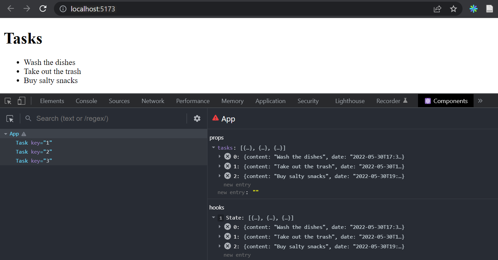
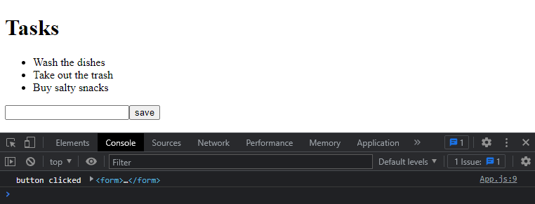
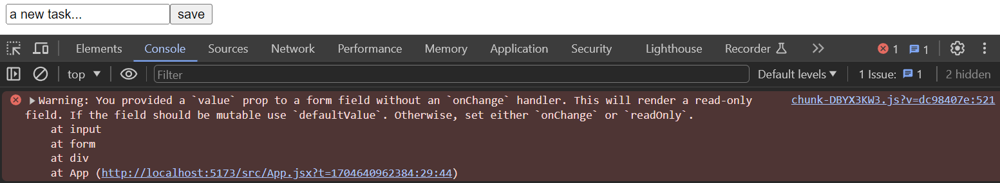
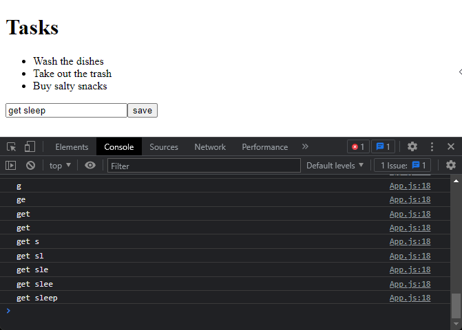
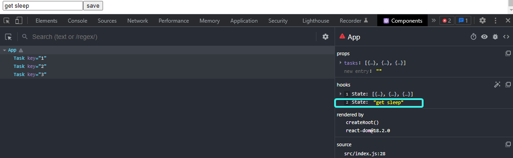
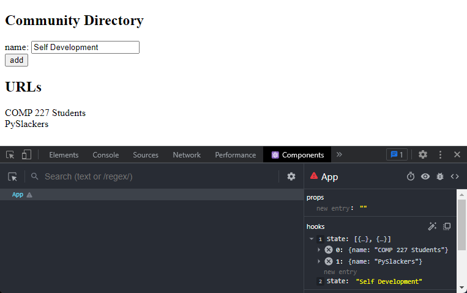
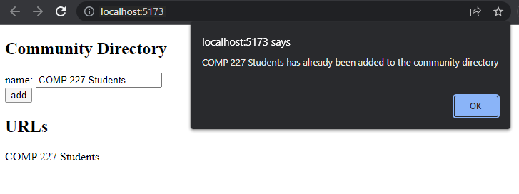
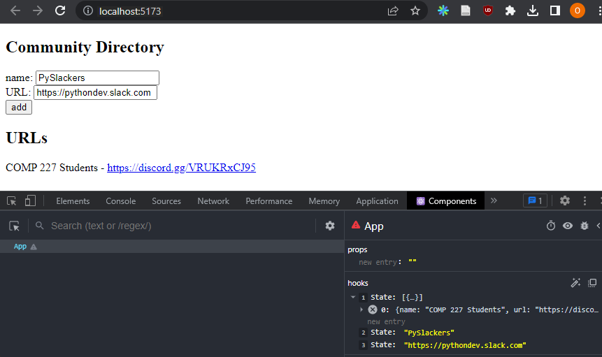
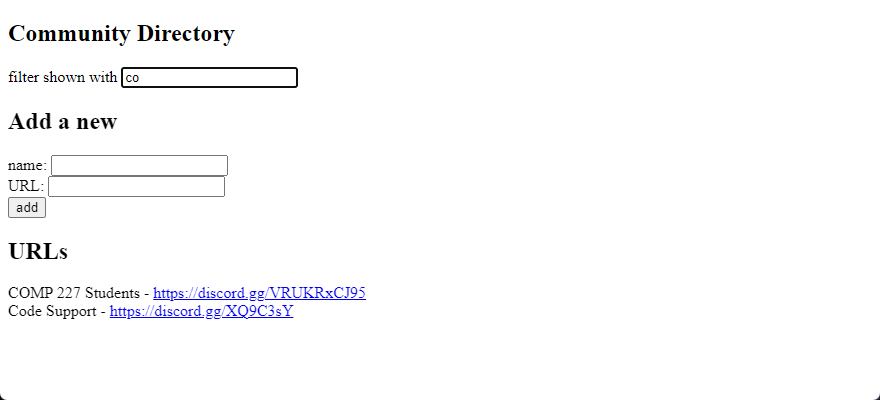

<div class="content">

Let's continue expanding our application by allowing users to add new tasks.
I would encourage you to follow along with using the code and typing things in as we go.
Is it more frustrating? Absolutely.
But merely reading (or just watching) is not enough, you have to practice and type things in and work with the examples given.
However, if you missed a step, you can find the code for our current application [here](https://github.com/comp227/part2-tasks/tree/part2-1).

To get our page to update when new tasks are added it's best to store the tasks in the `App` component's state.
Let's import the [useState](https://reactjs.org/docs/hooks-state.html) function
and use it to define a piece of state that gets initialized with the initial tasks array passed in the props.

```js
import { useState } from 'react' // highlight-line
import Task from './components/Task'

const App = (props) => { // highlight-line
  const [tasks, setTasks] = useState(props.tasks) // highlight-line

  return (
    <div>
      <h1>Tasks</h1>
      <ul>
        {tasks.map(task => 
          <Task key={task.id} task={task} />
        )}
      </ul>
    </div>
  )
}

export default App;
```

The component uses the `useState` function to initialize the piece of state stored in `tasks` with the array of tasks passed in the props:

```js
const App = (props) => { 
  const [tasks, setTasks] = useState(props.tasks) 

  // ...
}
```

We can also use React Developer Tools to see that this really happens:



If we wanted to start with an empty list of tasks, we would set the initial value as an empty array,
and since the props would not be used, we could omit the `props` parameter from the function definition:

```js
const App = () => { 
  const [tasks, setTasks] = useState([]) 

  // ...
}  
```

Let's stick with the initial value passed in the props for the time being.

Next, let's add an HTML [form](https://developer.mozilla.org/en-US/docs/Learn/HTML/Forms) to the component that will be used for adding new tasks.

```js
const App = (props) => {
  const [tasks, setTasks] = useState(props.tasks)

// highlight-start 
  const addTask = (event) => {
    event.preventDefault()
    console.log('button clicked', event.target)
  }
  // highlight-end   

  return (
    <div>
      <h1>Tasks</h1>
      <ul>
        {tasks.map(task => 
          <Task key={task.id} task={task} />
        )}
      </ul>
      // highlight-start 
      <form onSubmit={addTask}>
        <input />
        <button type="submit">save</button>
      </form>   
      // highlight-end   
    </div>
  )
}
```

We have added the `addTask` function as an event handler to the form element that will be called when the form is submitted, by clicking the submit button.

We use the method discussed in [part 1](/part1/component_state_event_handlers#event-handling) for defining our event handler:

```js
const addTask = (event) => {
  event.preventDefault()
  console.log('button clicked', event.target)
}
```

The `event` parameter is the [event](https://reactjs.org/docs/handling-events.html) that triggers the call to the event handler function:

The event handler immediately calls the `event.preventDefault()` method, which prevents the default action of submitting a form.
The default action would, [among other things](https://developer.mozilla.org/en-US/docs/Web/API/HTMLFormElement/submit_event),
cause the page to reload.

The target of the event stored in `event.target` is logged to the console:



The target in this case is the form that we have defined in our component.

How do we access the data contained in the form's `input` element?

### Controlled component

There are many ways to accomplish this; the first method we will take a look at is through the use of so-called
[controlled components](https://reactjs.org/docs/forms.html#controlled-components).

Let's add a new piece of state called `newTask` for storing the user-submitted input **and** let's set it as the `input` element's `value` attribute:

```js
const App = (props) => {
  const [tasks, setTasks] = useState(props.tasks)
  // highlight-start
  const [newTask, setNewTask] = useState(
    'a new task...'
  ) 
  // highlight-end

  const addTask = (event) => {
    event.preventDefault()
    console.log('button clicked', event.target)
  }

  return (
    <div>
      <h1>Tasks</h1>
      <ul>
        {tasks.map(task => 
          <Task key={task.id} task={task} />
        )}
      </ul>
      <form onSubmit={addTask}>
        <input value={newTask} /> //highlight-line
        <button type="submit">save</button>
      </form>   
    </div>
  )
}
```

The placeholder text stored as the initial value of the `newTask` state appears in the `input` element, but the input text can't be edited.
The console displays a warning that gives us a clue as to what might be wrong:



Since we assigned a piece of the `App` component's state as the `value` attribute of the input element,
the `App` component now [controls](https://reactjs.org/docs/forms.html#controlled-components) the behavior of the input element.

To enable editing of the input element, we have to register an **event handler** that synchronizes the changes made to the input with the component's state:

```js
const App = (props) => {
  const [tasks, setTasks] = useState(props.tasks)
  const [newTask, setNewTask] = useState(
    'a new task...'
  ) 

  // ...

// highlight-start
  const handleTaskChange = (event) => {
    console.log(event.target.value)
    setNewTask(event.target.value)
  }
// highlight-end

  return (
    <div>
      <h1>Tasks</h1>
      <ul>
        {tasks.map(task => 
          <Task key={task.id} task={task} />
        )}
      </ul>
      <form onSubmit={addTask}>
        <input
          value={newTask}
          onChange={handleTaskChange} // highlight-line
        />
        <button type="submit">save</button>
      </form>   
    </div>
  )
}
```

We have now registered an event handler to the `onChange` attribute of the form's `input` element:

```js
<input
  value={newTask}
  onChange={handleTaskChange}
/>
```

The event handler is called every time *a change occurs in the input element*.
The event handler function receives the event object as its `event` parameter:

```js
const handleTaskChange = (event) => {
  console.log(event.target.value)
  setNewTask(event.target.value)
}
```

The `target` property of the event object now corresponds to the controlled `input` element, and `event.target.value` refers to the input value of that element.

Notice that we did not need to call the `event.preventDefault()` method like we did in the `onSubmit` event handler.
This is because no default action occurs on an input change, unlike a form submission.

You can follow along in the console to see how the event handler is called:



You did remember to install [React devtools](https://chrome.google.com/webstore/detail/react-developer-tools/fmkadmapgofadopljbjfkapdkoienihi), right? Good.
You can directly view how the state changes from the React Devtools tab:



Now the `App` component's `newTask` state reflects the current value of the input,
which means that we can complete the `addTask` function for creating new tasks:

```js
const addTask = (event) => {
  event.preventDefault()
  const taskObject = {
    content: newTask,
    date: new Date().toISOString(),
    important: Math.random() < 0.5,
    id: tasks.length + 1,
  }

  setTasks(tasks.concat(taskObject))
  setNewTask('')
}
```

First, we create a new object for the task called `taskObject` that will receive its content from the component's `newTask` state.
The unique identifier `id` is generated based on the total number of tasks.
This method works for our application since tasks are never deleted.
With the help of the `Math.random()` function, our task has a 50% chance of being marked as important.

The new task is added to the list of tasks using the
[concat](https://developer.mozilla.org/en-US/docs/Web/JavaScript/Reference/Global_Objects/Array/concat) array method,
introduced in [part 1](/part1/java_script#arrays):

```js
setTasks(tasks.concat(taskObject))
```

The method does not mutate the original `tasks` array, but rather creates *a new copy of the array with the new item added to the end*.
This is important since we must [never mutate state directly](https://reactjs.org/docs/state-and-lifecycle.html#using-state-correctly) in React!

The event handler also resets the value of the controlled input element by calling the `setNewTask` function of the `newTask` state:

```js
setNewTask('')
```

You can find the code for our current application in its entirety in the *part2-2* branch of
[this GitHub repository](https://github.com/comp227/part2-tasks/tree/part2-2).

### Filtering Displayed Elements

Let's add some new functionality to our application that allows us to only view the important tasks.

Let's add a piece of state to the `App` component that keeps track of which tasks should be displayed:

```js
const App = (props) => {
  const [tasks, setTasks] = useState(props.tasks) 
  const [newTask, setNewTask] = useState('')
  const [showAll, setShowAll] = useState(true) // highlight-line
  
  // ...
}
```

Let's change the component so that it stores a list of all the tasks to be displayed in the `tasksToShow` variable.
The items on the list depend on the state of the component:

```js
import { useState } from 'react'
import Task from './components/Task'

const App = (props) => {
  const [tasks, setTasks] = useState(props.tasks)
  const [newTask, setNewTask] = useState('') 
  const [showAll, setShowAll] = useState(true)

  // ...

// highlight-start
  const tasksToShow = showAll
    ? tasks
    : tasks.filter(task => task.important === true)
// highlight-end

  return (
    <div>
      <h1>Tasks</h1>
      <ul>
        {tasksToShow.map(task => // highlight-line
          <Task key={task.id} task={task} />
        )}
      </ul>
      // ...
    </div>
  )
}
```

The definition of the `tasksToShow` variable is rather compact:

```js
const tasksToShow = showAll
  ? tasks
  : tasks.filter(task => task.important === true)
```

The definition uses the [conditional AKA ternary AKA ?:](https://developer.mozilla.org/en-US/docs/Web/JavaScript/Reference/Operators/Conditional_Operator) operator
also found in many other programming languages.

The operator functions as follows.
If we have:

```js
const result = condition ? val1 : val2
```

the `result` variable will be set to the value of `val1` if `condition` is `true`.
If `condition` is `false`, the `result` variable will be set to the value of`val2`.

If the value of `showAll` is false, the `tasksToShow` variable will be assigned to a list that only contains tasks that have the `important` property set to true.
Filtering is done with the help of the array [filter](https://developer.mozilla.org/en-US/docs/Web/JavaScript/Reference/Global_Objects/Array/filter) method:

```js
tasks.filter(task => task.important === true)
```

The comparison operator is redundant, since the value of `task.important` is either `true` or `false`, which means that we can should instead write:

```js
tasks.filter(task => task.important)
```

The reason we showed the comparison operator first was to emphasize an important detail: in JavaScript `val1 == val2` does not work as expected in all situations
and it's safer to use `val1 === val2` exclusively in comparisons.
You can read more about the topic [here](https://developer.mozilla.org/en-US/docs/Web/JavaScript/Equality_comparisons_and_sameness).

You can test out the filtering functionality by changing the initial value of the `showAll` state.

Next, let's add functionality that enables users to toggle the `showAll` state of the application from the user interface.

The relevant changes are shown below:

```js
import { useState } from 'react' 
import Task from './components/Task'

const App = (props) => {
  const [tasks, setTasks] = useState(props.tasks) 
  const [newTask, setNewTask] = useState('')
  const [showAll, setShowAll] = useState(true)

  // ...

  return (
    <div>
      <h1>Tasks</h1>
// highlight-start      
      <div>
        <button onClick={() => setShowAll(!showAll)}>
          show {showAll ? 'important' : 'all' }
        </button>
      </div>
// highlight-end            
      <ul>
        {tasksToShow.map(task =>
          <Task key={task.id} task={task} />
        )}
      </ul>
      // ...
    </div>
  )
}
```

The displayed tasks (all versus important) are controlled with a button.
The event handler for the button is so simple that it has been defined directly in the attribute of the button element.
The event handler switches the value of `showAll` from true to false and vice versa:

```js
() => setShowAll(!showAll)
```

The text of the button depends on the value of the `showAll` state:

```js
show {showAll ? 'important' : 'all'}
```

You can find the code for our current application in its entirety in the *part2-3* branch of
[this GitHub repository](https://github.com/comp227/part2-tasks/tree/part2-3).
</div>

<div class="tasks">

### Exercises 2.6-2.10

In the first exercise, we will start working on an application that will be further developed in the later exercises, so you'll need to create another application.
In related sets of exercises, it is sufficient to return the final version of your application.

The exercises are submitted through GitHub and marking them as done on Canvas.

Please make sure **that you commit often**, as that will be the way you show your work and progress through the course.

**WARNING** make sure you are in the correct location before calling `create-react-app`

#### 2.6: The Communities Step1

Let's create a simple community directory, which will be a list of communities that we may want to join.

Let us start by implementing the addition of a single community to this directory.

You can use the code below as a starting point for the `App` component of your application:

```js
import { useState } from 'react'

const App = () => {
  const [groups, setGroups] = useState([
    { name: 'COMP 227 Students' }
  ]) 
  const [newName, setNewName] = useState('')

  return (
    <div>
      <h2>Community Directory</h2>
      <form>
        <div>
          name: <input />
        </div>
        <div>
          <button type="submit">add</button>
        </div>
      </form>
      <h2>URLs</h2>
      ...     
    </div>
  )
}

export default App
```

The `newName` state is meant for controlling the form input element.

Sometimes it can be useful to render state and other variables as text for debugging purposes.
You can temporarily add the following element to the rendered component:

```html
<div>debug: {newName}</div>
```

It's also important to put what we learned in the [debugging React applications](/part1/a_more_complex_state_debugging_react_apps) chapter of part one into good use.
The [React developer tools](https://chrome.google.com/webstore/detail/react-developer-tools/fmkadmapgofadopljbjfkapdkoienihi)
extension is ***incredibly*** useful for tracking changes that occur in the application's state.

After finishing this exercise your application should look something like this:



Notice the use of the React developer tools extension in the picture above!

**NB:**

- you can use the group's name as a value of the `key` property
- remember to prevent the default action of submitting HTML forms!

#### 2.7: The Communities Step2

Prevent the user from being able to add names that already exist in the list.
JavaScript arrays have numerous suitable
[methods](https://developer.mozilla.org/en-US/docs/Web/JavaScript/Reference/Global_Objects/Array)
for accomplishing this job.
Keep in mind [how object equality works](https://www.joshbritz.co/posts/why-its-so-hard-to-check-object-equality/) in Javascript.

Issue a warning with the [alert](https://developer.mozilla.org/en-US/docs/Web/API/Window/alert) command when such an action is attempted:



**Hint:** when you are forming strings that contain values from variables, it is recommended to use a
[template string](https://developer.mozilla.org/en-US/docs/Web/JavaScript/Reference/Template_literals):

```js
`${newName} has already been added to the community directory`
```

If the `newName` variable holds the value `Arto Hellas`, the template string expression returns the string

```js
`Arto Hellas has already been added to the community directory`
```

The same could be done in a more Java-like fashion by using the plus operator:

```js
newName + ' has already been added to the community directory'
```

Using template strings is the more idiomatic option and the sign of a true JavaScript professional.

#### 2.8: The Communities Step3

Expand your application by allowing users to add URLs to the community directory.
The URL will be an invitation link to that communities' discord or slack group.
You will need to add a second ***input*** element to the form (along with its own event handler):

```js
<form>
  <div>name: <input /></div>
  <div>URL: <input /></div>
  <div><button type="submit">add</button></div>
</form>
```

At this point, the application could look something like this.
The image also displays the application's state with the help of [React developer tools](https://chrome.google.com/webstore/detail/react-developer-tools/fmkadmapgofadopljbjfkapdkoienihi):



#### 2.9*: The Communities Step4

Implement a search field that can be used to filter the list of communities by name:



You can implement the search field as an ***input*** element that is placed outside the HTML form.
The filtering logic shown in the image is **case insensitive**, meaning that the search term `comp` also returns results that contain Comp with an uppercase C.

**NB:** When you are working on new functionality, it's often useful to "hardcode" some dummy data into your application, e.g.

```js
const App = () => {
  const [groups, setGroups] = useState([
    { name: 'COMP 227 Students', url: 'https://discord.gg/VRUKRxCJ95', id: 1 },
    { name: 'PySlackers', url: 'https://pythondev.slack.com', id: 2 },
    { name: 'Code Support', url: 'https://discord.gg/XQ9C3sY', id: 3 },
    { name: 'Front End Developers', url: 'https://discord.gg/XHsumw2C39', id: 4 }
  ])

  // ...
}
```

This saves you from having to manually input data into your application for testing out your new functionality.

#### 2.10: The Communities Step5

If you have implemented your application in a single component, refactor it by extracting suitable parts into new components.
Maintain the application's state and all event handlers in the `App` root component.

It is sufficient to extract ***three*** components from the application.
Good candidates for separate components are, for example, the search filter, the form for adding a group,
a component that renders all communities, and a component that renders a single group's details.

The application's root component could look similar to this after the refactoring.
The refactored root component below only renders titles and lets the extracted components take care of the rest.

```js
const App = () => {
  // ...

  return (
    <div>
      <h2>Community Directory</h2>

      <Filter ... />

      <h3>Add a new</h3>

      <GroupForm 
        ...
      />

      <h3>URLs</h3>

      <Groups ... />
    </div>
  )
}
```

**NB**: You might run into problems in this exercise if you define your components "in the wrong place".
Now would be a good time to rehearse
the chapter [do not define a component in another component](/part1/a_more_complex_state_debugging_react_apps#do-not-define-components-within-components)
from the last part.

</div>
