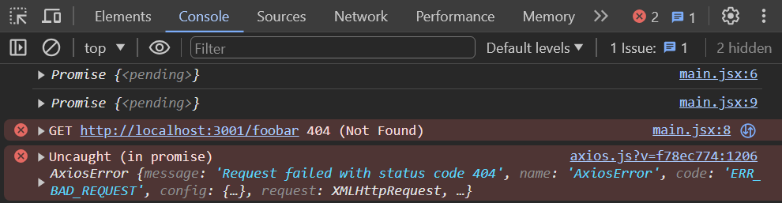

<div class="content">

For a while now we have only been working on "frontend", i.e. client-side (browser) functionality.
We will begin working on "backend", i.e. server-side functionality in the [third part](/part3) of this course.
Nonetheless, we will now take a step in that direction by familiarizing ourselves with how the code executing in the browser communicates with the backend.

Let's use a tool meant to be used during software development called [JSON Server](https://github.com/typicode/json-server) to act as our server.

Create a file named *db.json* in the root directory of the previous notes project with the following content:

```json
{
  "notes": [
    {
      "id": 1,
      "content": "HTML is easy",
      "date": "2022-1-17T17:30:31.098Z",
      "important": true
    },
    {
      "id": 2,
      "content": "Browser can execute only JavaScript",
      "date": "2022-1-17T18:39:34.091Z",
      "important": false
    },
    {
      "id": 3,
      "content": "GET and POST are the most important methods of HTTP protocol",
      "date": "2022-1-17T19:20:14.298Z",
      "important": true
    }
  ]
}
```

You can [install](https://github.com/typicode/json-server#getting-started) a JSON server globally on your machine using the command `npm install -g json-server`.
A global installation requires administrative privileges, which means that it is not possible on faculty computers or freshman laptops.

After installing run the following command to run the json-server.
The *json-server* starts running on port 3000 by default;
but since projects created using create-react-app reserve port 3000,
we must define an alternate port, such as port 3001, for the json-server.
The --watch option automatically looks for any saved changes to db.json
  
```js
json-server --port 3001 --watch db.json
```

However, a global installation is not necessary.
From the root directory of your app, we can run the *json-server* using the command `npx`:

```js
npx json-server --port 3001 --watch db.json
```

Let's navigate to the address <http://localhost:3001/notes> in the browser.
We can see that *json-server* serves the notes we previously wrote to the file in JSON format:


If your browser doesn't have a way to format the display of JSON-data, then install an appropriate plugin,
e.g. [JSONVue](https://chrome.google.com/webstore/detail/jsonview/chklaanhfefbnpoihckbnefhakgolnmc) to make your life easier.

Going forward, the idea will be to save the notes to the server, which in this case means saving them to the json-server.
The React code fetches the notes from the server and renders them to the screen.
Whenever a new note is added to the application, the React code also sends it to the server to make the new note persist in "memory".

json-server stores all the data in the *db.json* file, which resides on the server.
In the real world, data would be stored in some kind of database.
However, json-server is a handy tool that enables the use of server-side functionality in the development phase without the need to program any of it.

We will get familiar with the principles of implementing server-side functionality in more detail in [part 3](/part3) of this course.

### The browser as a runtime environment

Our first task is fetching the already existing notes to our React application from the address <http://localhost:3001/notes>.

In the part0 [example project](/part0/fundamentals_of_web_apps#running-application-logic-on-the-browser),
we already learned a way to fetch data from a server using JavaScript.
The code in the example was fetching the data using [XMLHttpRequest](https://developer.mozilla.org/en-US/docs/Web/API/XMLHttpRequest),
otherwise known as an HTTP request made using an XHR object.
This is a technique introduced in 1999, which every browser has supported for a good while now.

The use of XHR is no longer recommended, and browsers already widely support the
[fetch](https://developer.mozilla.org/en-US/docs/Web/API/WindowOrWorkerGlobalScope/fetch) method,
which is based on so-called [promises](https://developer.mozilla.org/en-US/docs/Web/JavaScript/Reference/Global_Objects/Promise),
instead of the event-driven model used by XHR.

As a reminder from part0 (which one should **remember to not use `xhr`** without a pressing reason),
data was fetched using XHR in the following way:

```js
const xhttp = new XMLHttpRequest()

xhttp.onreadystatechange = function() {
  if (this.readyState == 4 && this.status == 200) {
    const data = JSON.parse(this.responseText)
    // handle the response that is saved in variable data
  }
}

xhttp.open('GET', '/data.json', true)
xhttp.send()
```

Right at the beginning, we register an *event handler* to the `xhttp` object representing the HTTP request,
which will be called by the JavaScript runtime whenever the state of the `xhttp` object changes.
If the change in state means that the response to the request has arrived, then the data is handled accordingly.

It is worth noting that the code in the event handler is defined before the request is sent to the server.
Despite this, the code within the event handler will be executed at a later point in time.
Therefore, the code does not execute synchronously "from top to bottom", but does so **asynchronously**.
JavaScript calls the event handler that was registered for the request at some point.

A synchronous way of making requests that's common in Java programming, for instance,
would play out as follows (NB, this is not actually working Java code):

```java
HTTPRequest request = new HTTPRequest();

String url = "https://comp227-exampleapp.herokuapp.com/data.json";
List<Note> notes = request.get(url);

notes.forEach(m => {
  System.out.println(m.content);
});
```

In Java, the code executes line by line and stops to wait for the HTTP request, which means waiting for the command `request.get(...)` to finish.
The data returned by the command, in this case the notes, are then stored in a variable, and we begin manipulating the data in the desired manner.

On the other hand, JavaScript engines, or runtime environments, follow the [asynchronous model](https://developer.mozilla.org/en-US/docs/Web/JavaScript/EventLoop).
In principle, this requires all
[IO operations](https://en.wikipedia.org/wiki/Input/output)
(with some exceptions) to be executed as non-blocking.
This means that code execution continues immediately after calling an IO function, without waiting for it to return.

When an asynchronous operation is completed, or, more specifically, at some point after its completion,
the JavaScript engine calls the event handlers registered to the operation.

Currently, JavaScript engines are **single-threaded**, which means that they cannot execute code in parallel.
As a result, it is a requirement in practice to use a non-blocking model for executing IO operations.
Otherwise, the browser would "freeze" during, for instance, the fetching of data from a server.

Another consequence of this single-threaded nature of JavaScript engines is that if some code execution takes up a lot of time, the browser will get stuck for the duration of the execution.
If we added the following code at the top of our application:

```js
setTimeout(() => {
  console.log('loop..')
  let i = 0
  while (i < 50000000000) {
    i++
  }
  console.log('end')
}, 5000)
```

everything would work normally for 5 seconds.
However, when the function defined as the parameter for `setTimeout` is run,
the browser will be stuck for the duration of the execution of the long loop.
Even the browser tab cannot be closed during the execution of the loop, at least not in Chrome.

For the browser to remain **responsive**, i.e., to be able to continuously react to user operations with sufficient speed,
the code logic needs to be such that no single computation can take too long.

There is a host of additional material on the subject to be found on the internet.
One particularly clear presentation of the topic is the keynote by Philip Roberts called
[What the heck is the event loop anyway?](https://www.youtube.com/watch?v=8aGhZQkoFbQ)

In today's browsers, it is possible to run parallelized code with the help of so-called
[web workers](https://developer.mozilla.org/en-US/docs/Web/API/Web_Workers_API/Using_web_workers).
The event loop of an individual browser window is, however, still only handled by a
[single thread](https://medium.com/techtrument/multithreading-javascript-46156179cf9a).

### npm

Let's get back to the topic of fetching data from the server.

We could use the previously mentioned promise-based function
[fetch](https://developer.mozilla.org/en-US/docs/Web/API/WindowOrWorkerGlobalScope/fetch)
to pull the data from the server.
Fetch is a great tool.
It is standardized and supported by all modern browsers (excluding IE).

That being said, we will be using the [axios](https://github.com/axios/axios) library instead for communication between the browser and server.
It functions like fetch but is somewhat more pleasant to use.
Another good reason to use axios is our getting familiar with adding external libraries, so-called *npm packages*, to React projects.

Nowadays, practically all JavaScript projects are defined using the node package manager, aka [npm](https://docs.npmjs.com/getting-started/what-is-npm).
The projects created using create-react-app also follow the npm format.
A clear indicator that a project uses npm is the *package.json* file located at the root of the project:

```json
{
  "name": "notes",
  "version": "0.1.0",
  "private": true,
  "dependencies": {
    "@testing-library/jest-dom": "^5.16.1",
    "@testing-library/react": "^12.1.2",
    "@testing-library/user-event": "^13.5.0",
    "react": "^17.0.2",
    "react-dom": "^17.0.2",
    "react-scripts": "5.0.0",
    "web-vitals": "^2.1.3"
  },
  "scripts": {
    "start": "react-scripts start",
    "build": "react-scripts build",
    "test": "react-scripts test",
    "eject": "react-scripts eject"
  },
  "eslintConfig": {
    "extends": [
      "react-app",
      "react-app/jest"
    ]
  },
  "browserslist": {
    "production": [
      ">0.2%",
      "not dead",
      "not op_mini all"
    ],
    "development": [
      "last 1 chrome version",
      "last 1 firefox version",
      "last 1 safari version"
    ]
  }
}
```

At this point, the `dependencies` part is of most interest to us as it defines what **dependencies**, or external libraries, the project has.

We now want to use axios.
Theoretically, we could define the library directly in the *package.json* file, but it is better to install it from the command line.

```js
npm install axios
```

**NB *npm* commands should always be run in the project root directory**, which is where the *package.json* file can be found.

Axios is now included among the other dependencies:

```json
{
  "name": "notes",
  "version": "0.1.0",
  "private": true,
  "dependencies": {
    "@testing-library/jest-dom": "^5.16.1",
    "@testing-library/react": "^12.1.2",
    "@testing-library/user-event": "^13.5.0",
    "axios": "^0.24.0", // highlight-line
    "react": "^17.0.2",
    "react-dom": "^17.0.2",
    "react-scripts": "5.0.0",
    "web-vitals": "^2.1.3"
  },
  // ...
}
```

In addition to adding axios to the dependencies, the `npm install` command also ***downloaded*** the library code.
As with other dependencies, the code can be found in the *node_modules* directory located in the root.
As one might have noticed, *node_modules* contains a fair amount of interesting stuff.

Let's make another addition.
Install *json-server* as a development dependency (only used during development) by executing the command:

```js
npm install json-server --save-dev
```

and making a small addition to the *scripts* part of the *package.json* file:

```json
{
  // ...

  "scripts": {
    "start": "react-scripts start",
    "build": "react-scripts build",
    "test": "react-scripts test",
    "eject": "react-scripts eject",
    "server": "json-server -p3001 --watch db.json" // highlight-line
  },
}
```

We can now conveniently, without parameter definitions, start the json-server from the project root directory with the command:

```js
npm run server
```

We will get more familiar with the *npm* tool in the [third part of the course](/part3).

**NB** The previously started json-server must be terminated before starting a new one; otherwise, there will be trouble:


The red print in the error message informs us about the issue:

*Cannot bind to port 3001.
Please specify another port number either through --port argument or through the json-server.json configuration file*

As we can see, the application is not able to bind itself to the [port](https://en.wikipedia.org/wiki/Port_(computer_networking)).
The reason being that port 3001 is already occupied by the previously started json-server.

We used the command `npm install` twice, but with slight differences:

```js
npm install axios
npm install json-server --save-dev
```

There is a fine difference in the parameters.
*axios* is installed as a runtime dependency of the application because the execution of the program requires the existence of the library.
On the other hand, *json-server* was installed as a development dependency (`--save-dev`),
since the program itself doesn't require it.
It is used for assistance during software development.
There will be more on different dependencies in the next part of the course.

### Axios and promises

Now we are ready to use axios.
Going forward, json-server is assumed to be running on port 3001.

NB: To run json-server and your react app simultaneously, you may need to use two terminal windows.
One to keep json-server running and the other to run react-app.

The library can be brought into use the same way other libraries, e.g. React, are, i.e., by using an appropriate `import` statement.

Add the following to the file *index.js*:

```js
import axios from 'axios'

const promise = axios.get('http://localhost:3001/notes')
console.log(promise)

const promise2 = axios.get('http://localhost:3001/foobar')
console.log(promise2)
```

If you open <http://localhost:3000> in the browser, this should be printed to the console



**Note:** when the content of the file *index.js* changes, React does not always notice that automatically, so you might need to refresh the browser to see your changes!
A simple workaround to make React notice the change automatically is to create a file named *.env* in the root directory of the project and add this line `FAST_REFRESH=false`.
Restart the app for the applied changes to take effect.

Axios' method `get` returns a [promise](https://developer.mozilla.org/en-US/docs/Web/JavaScript/Guide/Using_promises).

The documentation on Mozilla's site states the following about promises:

> *A Promise is an object representing the eventual completion or failure of an asynchronous operation.*

In other words, a promise is an object that represents an asynchronous operation.
A promise can have three distinct states:

1. The promise is **pending**: It means that the final value (one of the following two) is not available yet.
2. The promise is **fulfilled**: It means that the operation has been completed and the final value is available, which generally is a successful operation.
This state is sometimes also called **resolved**.
3. The promise is **rejected**: It means that an error prevented the final value from being determined, which generally represents a failed operation.

The first promise in our example is ***fulfilled***, representing a successful *axios.get('http://localhost:3001/notes')* request.
The second one, however, is ***rejected***, and the console tells us the reason.
It looks like we were trying to make an HTTP GET request to a non-existent address.

If, and when, we want to access the result of the operation represented by the promise, we must register an event handler to the promise.
This is achieved using the method `then`:

```js
const promise = axios.get('http://localhost:3001/notes')

promise.then(response => {
  console.log(response)
})
```

The following is printed to the console:


The JavaScript runtime environment calls the callback function registered by the `then` method providing it with a `response` object as a parameter.
The `response` object contains all the essential data related to the response of an HTTP GET request,
which would include the returned ***data***, ***status code***, and ***headers***.

Storing the promise object in a variable is generally unnecessary, and it's instead common to chain the `then` method call to the axios method call, so that it follows it directly:

```js
axios.get('http://localhost:3001/notes').then(response => {
  const notes = response.data
  console.log(notes)
})
```

The callback function now takes the data contained within the response, stores it in a variable, and prints the notes to the console.

A more readable way to format ***chained*** method calls is to place each call on its own line:

```js
axios
  .get('http://localhost:3001/notes')
  .then(response => {
    const notes = response.data
    console.log(notes)
  })
```

The data returned by the server is plain text, basically just one long string.
The axios library is still able to parse the data into a JavaScript array,
since the server has specified that the data format is `application/json; charset=utf-8` (see the previous image) using the `content-type` header.

We can finally begin using the data fetched from the server.

Let's try and request the notes from our local server and render them, initially as the App component.
Please note that this approach has many issues, as we're rendering the entire `App` component only when we successfully retrieve a response:

```js
import React from 'react'
import ReactDOM from 'react-dom/client'
import axios from 'axios' // highlight-line

import App from './App'

axios.get('http://localhost:3001/notes').then(response => {
  const notes = response.data
  ReactDOM.createRoot(document.getElementById('root')).render(<App notes={notes} />)
})
```

This method could be acceptable in some circumstances, but it's somewhat problematic.
Let's instead move the fetching of the data into the `App` component.

What's not immediately obvious, however, is where the command `axios.get` should be placed within the component.

### Effect-hooks

We have already used [state hooks](https://reactjs.org/docs/hooks-state.html)
that were introduced along with React version [16.8.0](https://www.npmjs.com/package/react/v/16.8.0),
which provide state to React components defined as functions - the so-called **functional components**.
Version 16.8.0 also introduces [effect hooks](https://reactjs.org/docs/hooks-effect.html) as a new feature.
As per the official docs:

> *The Effect Hook lets you perform side effects on function components.*
> *Data fetching, setting up a subscription, and manually changing the DOM in React components are all examples of side effects.*

As such, effect hooks are precisely the right tool to use when fetching data from a server.

Let's remove the fetching of data from *index.js*.
Since we're gonna be retrieving the notes from the server, there is no longer a need to pass data as props to the `App` component.
So *index.js* can be simplified to:

```js
ReactDOM.createRoot(document.getElementById('root')).render(<App />)
```

The `App` component changes as follows:

```js
import { useState, useEffect } from 'react' // highlight-line
import axios from 'axios' // highlight-line
import Note from './components/Note'

const App = () => { // highlight-line
  const [notes, setNotes] = useState([]) // highlight-line
  const [newNote, setNewNote] = useState('')
  const [showAll, setShowAll] = useState(true)

// highlight-start
  useEffect(() => {
    console.log('effect')
    axios
      .get('http://localhost:3001/notes')
      .then(response => {
        console.log('promise fulfilled')
        setNotes(response.data)
      })
  }, [])

  console.log('render', notes.length, 'notes')
// highlight-end

  // ...
}
```

We have also added a few helpful prints, which clarify the progression of the execution.

This is printed to the console:

```shell
render 0 notes
effect
promise fulfilled
render 3 notes
```

First, the body of the function defining the component is executed and the component is rendered for the first time.
At this point `render 0 notes` is printed, meaning data hasn't been fetched from the server yet.

The following function, or effect in React parlance:

```js
() => {
  console.log('effect')
  axios
    .get('http://localhost:3001/notes')
    .then(response => {
      console.log('promise fulfilled')
      setNotes(response.data)
    })
}
```

is executed immediately after rendering.
The execution of the function results in `effect` being printed to the console,
and the command `axios.get` initiates the fetching of data from the server as well as registers the following function as an *event handler* for the operation:

```js
response => {
  console.log('promise fulfilled')
  setNotes(response.data)
})
```

When data arrives from the server, the JavaScript runtime calls the function registered as the event handler,
which prints `promise fulfilled` to the console and stores the notes received from the server into the state using the function `setNotes(response.data)`.

As always, a call to a state-updating function triggers the re-rendering of the component.
As a result, `render 3 notes` is printed to the console, and the notes fetched from the server are rendered to the screen.

Finally, let's take a look at the definition of the effect hook as a whole:

```js
useEffect(() => {
  console.log('effect')
  axios
    .get('http://localhost:3001/notes').then(response => {
      console.log('promise fulfilled')
      setNotes(response.data)
    })
}, [])
```

Let's rewrite the code a bit differently.

```js
const hook = () => {
  console.log('effect')
  axios
    .get('http://localhost:3001/notes')
    .then(response => {
      console.log('promise fulfilled')
      setNotes(response.data)
    })
}

useEffect(hook, [])
```

Now we can see more clearly that the function [useEffect](https://reactjs.org/docs/hooks-reference.html#useeffect) takes **two parameters**.
The first is a function, the ***effect*** itself.
According to the documentation:

> *By default, effects run after every completed render, but you can choose to fire it only when certain values have changed.*

So by default, the effect is ***always*** run after the component has been rendered.
In our case, however, we only want to execute the effect along with the first render.

The second parameter of `useEffect` is used to [specify how often the effect is run](https://reactjs.org/docs/hooks-reference.html#conditionally-firing-an-effect).
If the second parameter is an empty array `[]`, then the effect is only run along with the first render of the component.

There are many possible use cases for an effect hook other than fetching data from the server.
However, this use is sufficient for us, for now.

Think back to the sequence of events we just discussed.
Which parts of the code are run? In what order? How often?
Understanding the order of events is critical!

Note that we could have also written the code for the effect function this way:

```js
useEffect(() => {
  console.log('effect')

  const eventHandler = response => {
    console.log('promise fulfilled')
    setNotes(response.data)
  }

  const promise = axios.get('http://localhost:3001/notes')
  promise.then(eventHandler)
}, [])
```

A reference to an event handler function is assigned to the variable `eventHandler`.
The promise returned by the `get` method of Axios is stored in the variable `promise`.
The registration of the callback happens by giving the `eventHandler` variable,
referring to the event-handler function, as a parameter to the `then` method of the promise.
It isn't usually necessary to assign functions and promises to variables,
and a more compact way of representing things, as seen further above, is sufficient.

```js
useEffect(() => {
  console.log('effect')
  axios
    .get('http://localhost:3001/notes')
    .then(response => {
      console.log('promise fulfilled')
      setNotes(response.data)
    })
}, [])
```

We still have a problem with our application.
When adding new notes, they are not stored on the server.

The code for the application, as described so far, can be found in full on
[github](https://github.com/comp227/part2-notes/tree/part2-4), on branch *part2-4*.

### The development runtime environment

The configuration for the whole application has steadily grown more complex.
Let's review what happens and where.
The following image describes the makeup of the application


The JavaScript code making up our React application is run in the browser.
The browser gets the JavaScript from the *React dev server*, which is the application that runs after running the command `npm start`.
The dev-server transforms the JavaScript into a format understood by the browser.
Among other things, it stitches together JavaScript from different files into one file.
We'll discuss the dev-server in more detail in part 7 of the course.

The React application running in the browser fetches the JSON formatted data from *json-server* running on port 3001 on the machine.
The server we query the data from - *json-server* - gets its data from the file *db.json*.

At this point in development, all the parts of the application happen to reside on the software developer's machine, otherwise known as localhost.
The situation changes when the application is deployed to the internet.
We will do this in part 3.

</div>

<div class="tasks">

### Exercises 2.11-2.14

#### 2.11: The Phonebook Step6

We continue with developing the phonebook.
Store the initial state of the application in the file *db.json*, which should be placed in the root of the project.

```json
{
  "persons":[
    { 
      "name": "Arto Hellas", 
      "number": "040-123456",
      "id": 1
    },
    { 
      "name": "Ada Lovelace", 
      "number": "39-44-5323523",
      "id": 2
    },
    { 
      "name": "Dan Abramov", 
      "number": "12-43-234345",
      "id": 3
    },
    { 
      "name": "Mary Poppendieck", 
      "number": "39-23-6423122",
      "id": 4
    }
  ]
}
```

Start json-server on port 3001 and make sure that the server returns the list of people by going to the address <http://localhost:3001/persons> in the browser.

If you receive the following error message:

```js
events.js:182
      throw er; // Unhandled 'error' event
      ^

Error: listen EADDRINUSE 0.0.0.0:3001
    at Object._errnoException (util.js:1019:11)
    at _exceptionWithHostPort (util.js:1041:20)
```

it means that port 3001 is already in use by another application, e.g. in use by an already running json-server.
Close the other application, or change the port in case that doesn't work.

Modify the application such that the initial state of the data is fetched from the server using the `axios` library.
Complete the fetching with an [Effect hook](https://reactjs.org/docs/hooks-effect.html).

#### 2.12* Data for countries, step1

The API [https://restcountries.com](https://restcountries.com) provides data for different countries in a machine-readable format, a so-called REST API.

Create an application, in which one can look at data from various countries.
The application should probably get the data from the endpoint [all](https://restcountries.com/v3.1/all).

The user interface is very simple.
The country to be shown is found by typing a search query into the search field.

If there are too many (over 10) countries that match the query, then the user is prompted to make their query more specific:


If there are ten or fewer countries, but more than one, then all countries matching the query are shown:


When there is only one country matching the query, then the basic data of the country (e.g. capital and area),
its flag and the languages spoken are shown:


**NB**: It is enough that your application works for most countries.
Some countries, like ***Sudan***, can be hard to support since the name of the country is part of the name of another country, ***South Sudan***.
You don't need to worry about these edge cases.

**WARNING** create-react-app will automatically turn your project into a git-repository unless you create your application inside of an existing git repository.
**Most likely you do not want each of your projects to be a separate repository**,
so simply run the `rm -rf .git` command at the root of your application.

#### 2.13*: Data for countries, step2

**There is still a lot to do in this part, so don't get stuck on this exercise!**

Improve on the application in the previous exercise,
such that when the names of multiple countries are shown on the page there is a button next to the name of the country,
which when pressed shows the view for that country:


In this exercise, it is also enough that your application works for most countries.
Countries whose name appears in the name of another country, like ***Sudan***, can be ignored.

#### 2.14*: Data for countries, step3

**There is still a lot to do in this part, so don't get stuck on this exercise!**

Add to the view showing the data of a single country, the weather report for the capital of that country.
There are dozens of providers for weather data.
One suggested API is [https://openweathermap.org](https://openweathermap.org).
Note that it might take some minutes until a generated API key is valid.


If you use Open weather map, [here](https://openweathermap.org/weather-conditions#Icon-list) is the description for how to get weather icons.

**NB:** In some browsers (such as Firefox) the chosen API might send an error response,
which indicates that HTTPS encryption is not supported, although the request URL starts with `http://`.
This issue can be fixed by completing the exercise using Chrome.

**NB:** You need an api-key to use almost every weather service.
Do not save the api-key to source control! Nor hardcode the api-key to your source code.
Instead use an [environment variable](https://create-react-app.dev/docs/adding-custom-environment-variables/) to save the key.

Assuming the api-key is `t0p53cr3t4p1k3yv4lu3`, when the application is started like so:

```bash
REACT_APP_API_KEY=t0p53cr3t4p1k3yv4lu3 npm start // For Linux/macOS Bash
($env:REACT_APP_API_KEY="t0p53cr3t4p1k3yv4lu3") -and (npm start) // For Windows PowerShell
set "REACT_APP_API_KEY=t0p53cr3t4p1k3yv4lu3" && npm start // For Windows cmd.exe
```

you can access the value of the key from the `process.env` object:

```js
const api_key = process.env.REACT_APP_API_KEY
// variable api_key has now the value set in startup
```

Note that if you created the application using `npx create-react-app ...` and you want to use a different name for your environment variable then the environment variable name must still begin with `REACT_APP_`.
You can also use a `.env` file rather than defining it on the command line each time by creating a file entitled '.env' in the root of the project and adding the following.

```text
# .env

REACT_APP_API_KEY=t0p53cr3t4p1k3yv4lu3
```

Note that you will need to restart the server to apply the changes.
</div>
