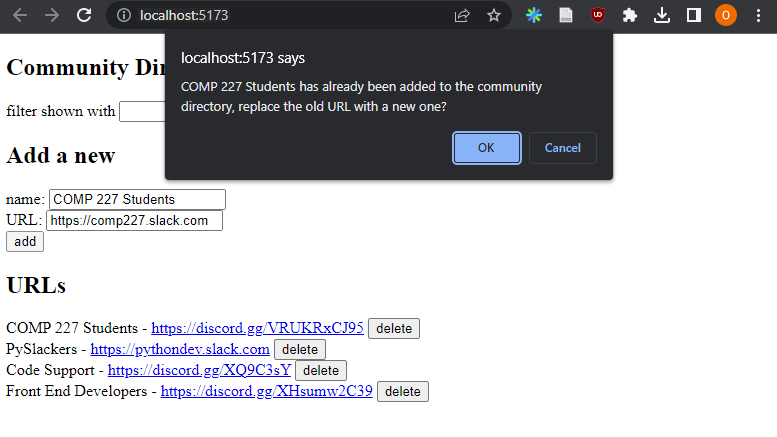

<div class="content">

When creating tasks in our application, we would naturally want to store them in some backend server.
The [json-server](https://github.com/typicode/json-server) package claims to be a so-called REST or RESTful API in its documentation:

> *Get a full fake REST API with zero coding in less than 30 seconds (seriously)*

The json-server does not exactly match the description provided by the textbook
[definition](https://en.wikipedia.org/wiki/Representational_state_transfer)
of a REST API, but neither do most other APIs claiming to be RESTful.

We will take a closer look at REST in the [next part](/part3) of the course.
But it's important to familiarize ourselves at this point with some of the
[conventions](https://en.wikipedia.org/wiki/Representational_state_transfer#Applied_to_web_services)
used by json-server and REST APIs in general.
In particular, we will be taking a look at the conventional use of [routes](https://github.com/typicode/json-server#routes),
aka URLs and HTTP request types, in REST.

### REST

In REST terminology, we refer to individual data objects, such as the tasks in our application, as **resources**.
Every resource has a unique address associated with it - its URL.
According to a general convention used by json-server,
we would be able to locate an individual task at the resource URL ***tasks/3***, where 3 is the id of the resource.
The ***tasks*** URL, on the other hand, would point to a resource collection containing all the tasks.

Resources are fetched from the server with HTTP GET requests.
For instance, an HTTP GET request to the URL ***tasks/3*** will return the task that has the id number 3.
An HTTP GET request to the ***tasks*** URL would return a list of all tasks.

Creating a new resource for storing a task is done by making an HTTP POST request to the ***tasks*** URL according to the REST convention that the json-server adheres to.
The data for the new task resource is sent in the `body` of the request.

json-server requires all data to be sent in JSON format.
What this means in practice is that the data must be a correctly formatted string
and that the request must contain the `Content-Type` request header with the value `application/json`.

### Sending Data to the Server

Let's make the following changes to the event handler responsible for creating a new task:

```js
addTask = event => {
  event.preventDefault()
  const taskObject = {
    content: newTask,
    date: new Date(),
    important: Math.random() < 0.5,
  }

// highlight-start
  axios
    .post('http://localhost:3001/tasks', taskObject)
    .then(response => {
      console.log(response)
    })
// highlight-end
}
```

We create a new object for the task but omit the `id` property since it's better to let the server generate ids for our resources!

The object is sent to the server using the axios `post` method.
The registered event handler logs the response that is sent back from the server to the console.

When we try to create a new task, the following output pops up in the console:


The newly created task resource is stored in the value of the `data` property of the `response` object.

Sometimes it can be useful to inspect HTTP requests in the ***Network*** tab of Chrome developer tools,
which was used heavily at the beginning of [part 0](/part0/fundamentals_of_web_apps#http-get):


We can use the inspector to check that the headers sent in the POST request are what we expected them to be and that their values are correct.

Since the data we sent in the POST request was a JavaScript object,
axios automatically knew to set the appropriate `application/json` value for the `Content-Type` header.

The new task is not rendered to the screen yet.
This is because we did not update the state of the `App` component when we created the new task.
Let's fix this:

```js
addTask = event => {
  event.preventDefault()
  const taskObject = {
    content: newTask,
    date: new Date(),
    important: Math.random() > 0.5,
  }

  axios
    .post('http://localhost:3001/tasks', taskObject)
    .then(response => {
      // highlight-start
      setTasks(tasks.concat(response.data))
      setNewTask('')
      // highlight-end
    })
}
```

The new task returned by the backend server is added to the list of tasks in our application's state
in the customary way of using the `setTasks` function and then resetting the task creation form.
An [important detail](/part1/a_more_complex_state_debugging_react_apps#handling-arrays)
to remember is that the `concat` method does not change the component's original state,
but instead creates a new copy of the list.

Once the data returned by the server starts to have an effect on the behavior of our web applications,
we are immediately faced with a whole new set of challenges arising from, for instance, the asynchronicity of communication.
This necessitates new debugging strategies, console logging and other means of debugging become increasingly more important.
We must also develop a sufficient understanding of the principles of both the JavaScript runtime and React components.
Guessing won't be enough.

It's beneficial to inspect the state of the backend server, e.g. through the browser:


This makes it possible to verify that all the data we intended to send was actually received by the server.

In the next part of the course, we will learn to implement our own logic in the backend.
We will then take a closer look at tools like [Postman](https://www.postman.com/downloads/) that helps us to debug our server applications.
However, inspecting the state of the json-server through the browser is sufficient for our current needs.

> **NB:** In the current version of our application, the browser adds the creation date property to the task.
Since the clock of the machine running the browser can be wrongly configured,
it's much wiser to let the backend server generate this timestamp for us.
This is in fact what we will do in the next part of the course.

The code for the current state of our application can be found in the  *part2-5* branch on [GitHub](https://github.com/comp227/part2-tasks/tree/part2-5).

### Changing the Importance of Tasks

Let's add a button to every task that can be used for toggling its importance.

We make the following changes to the `Task` component:

```js
const Task = ({ task, toggleImportance }) => {
  const label = task.important
    ? 'make not important' : 'make important'

  return (
    <li>
      {task.content} 
      <button onClick={toggleImportance}>{label}</button>
    </li>
  )
}
```

We add a button to the component and assign its event handler as the `toggleImportance` function passed in the component's props.

The `App` component defines an initial version of the `toggleImportanceOf` event handler function and passes it to every `Task` component:

```js
const App = () => {
  const [tasks, setTasks] = useState([]) 
  const [newTask, setNewTask] = useState('')
  const [showAll, setShowAll] = useState(true)

  // ...

  // highlight-start
  const toggleImportanceOf = (id) => {
    console.log('importance of ' + id + ' needs to be toggled')
  }
  // highlight-end

  // ...

  return (
    <div>
      <h1>Tasks</h1>
      <div>
        <button onClick={() => setShowAll(!showAll)}>
          show {showAll ? 'important' : 'all' }
        </button>
      </div>      
      <ul>
        {tasksToShow.map(task => 
          <Task
            key={task.id}
            task={task} 
            toggleImportance={() => toggleImportanceOf(task.id)} // highlight-line
          />
        )}
      </ul>
      // ...
    </div>
  )
}
```

Notice how every task receives its own ***unique*** event handler function since the `id` of every task is unique.

E.g., if `task.id` is 3, the event handler function returned by `toggleImportance(task.id)` will be:

```js
() => { console.log('importance of 3 needs to be toggled') }
```

A short reminder here.
The string printed by the event handler is defined in a Java-like manner by adding the strings:

```js
console.log('importance of ' + id + ' needs to be toggled')
```

The [template string](https://developer.mozilla.org/en-US/docs/Web/JavaScript/Reference/Template_literals) syntax added in ES6
can be used to write similar strings in a much nicer way:

```js
console.log(`importance of ${id} needs to be toggled`)
```

We can now use the "dollar-bracket"-syntax to add parts to the string that will evaluate JavaScript expressions, e.g. the value of a variable.
Notice that we use backticks in template strings instead of quotation marks used in regular JavaScript strings.

Individual tasks stored in the json-server backend can be modified in two different ways by making HTTP requests to the task's unique URL.
We can either ***replace*** the entire task with an HTTP PUT request or only change some of the task's properties with an HTTP PATCH request.

The final form of the event handler function is the following:

```js
const toggleImportanceOf = id => {
  const url = `http://localhost:3001/tasks/${id}`
  const task = tasks.find(n => n.id === id)
  const changedTask = { ...task, important: !task.important }

  axios.put(url, changedTask).then(response => {
    setTasks(tasks.map(n => n.id !== id ? n : response.data))
  })
}
```

Almost every line of code in the function body contains important details.
The first line defines the unique URL for each task resource based on its id.

The array [find method](https://developer.mozilla.org/en-US/docs/Web/JavaScript/Reference/Global_Objects/Array/find)
is used to find the task we want to modify, and we then assign it to the `task` variable.

After this, we create a **new object** that is an exact copy of the old task, apart from the important property.

The code for creating the new object that uses the
[object spread syntax](https://developer.mozilla.org/en-US/docs/Web/JavaScript/Reference/Operators/Spread_syntax)
may seem a bit strange at first:

```js
const changedTask = { ...task, important: !task.important }
```

In practice, `{ ...task }` creates a new object with copies of all the properties from the `task` object.
When we add properties inside the curly braces after the spread object,
e.g. `{ ...task, important: true }`, then the value of the `important` property of the new object will be `true`.
In our example, the `important` property gets the negation of its previous value in the original object.

There are a few things to point out.
Why did we make a copy of the task object we wanted to modify when the following code also appears to work?

```js
const task = tasks.find(n => n.id === id)
task.important = !task.important

axios.put(url, task).then(response => {
  // ...
```

This is not recommended because the variable `task` is a reference to an item in the `tasks` array in the component's state,
and as we recall we must never mutate state directly in React.

It's also worth noting that the new object `changedTask` is only a so-called
[shallow copy](https://en.wikipedia.org/wiki/Object_copying#Shallow_copy),
meaning that the values of the new object are the same as the values of the old object.
If the values of the old object were objects themselves,
then the copied values in the new object would reference the same objects that were in the old object.

The new task is then sent with a PUT request to the backend where it will replace the old object.

The callback function sets the component's `tasks` state to a new array that contains all the items from the previous `tasks` array,
except for the old task which is replaced by the updated version of it returned by the server:

```js
axios.put(url, changedTask).then(response => {
  setTasks(tasks.map(task => task.id !== id ? task : response.data))
})
```

This is accomplished with the `map` method:

```js
tasks.map(task => task.id !== id ? task : response.data)
```

The map method creates a new array by mapping every item from the old array into an item in the new array.
In our example, the new array is created conditionally so that if `task.id !== id` is true; we simply copy the item from the old array into the new array.
If the condition is false, then the task object returned by the server is added to the array instead.

This `map` trick may seem a bit strange at first, but it's worth spending some time wrapping your head around it.
We will be using this method many times throughout the course.

### Extracting Communication with the Backend into a Separate Module

The `App` component has become somewhat bloated after adding the code for communicating with the backend server.
In the spirit of the [single responsibility principle](https://en.wikipedia.org/wiki/Single_responsibility_principle),
we deem it wise to extract this communication into its own [module](/part2/rendering_a_collection_modules#refactoring-modules).

Let's create a *src/services* directory and add a file there called *tasks.js*:

```js
import axios from 'axios'
const baseUrl = 'http://localhost:3001/tasks'

const getAll = () => {
  return axios.get(baseUrl)
}

const create = newObject => {
  return axios.post(baseUrl, newObject)
}

const update = (id, newObject) => {
  return axios.put(`${baseUrl}/${id}`, newObject)
}

export default { 
  getAll: getAll, 
  create: create, 
  update: update 
}
```

The module returns an object that has three functions (`getAll`, `create`, and `update`) as its properties that deal with tasks.
The functions directly return the promises returned by the axios methods.

The `App` component uses `import` to get access to the module:

```js
import taskService from './services/tasks' // highlight-line

const App = () => {
```

The functions of the module can be used directly with the imported variable `taskService` as follows:

```js
const App = () => {
  // ...

  useEffect(() => {
    // highlight-start
    taskService
      .getAll()
      .then(response => {
        setTasks(response.data)
      })
    // highlight-end
  }, [])

  const toggleImportanceOf = id => {
    const task = tasks.find(n => n.id === id)
    const changedTask = { ...task, important: !task.important }

    // highlight-start
    taskService
      .update(id, changedTask)
      .then(response => {
        setTasks(tasks.map(task => task.id !== id ? task : response.data))
      })
    // highlight-end
  }

  const addTask = (event) => {
    event.preventDefault()
    const taskObject = {
      content: newTask,
      date: new Date().toISOString(),
      important: Math.random() > 0.5
    }

// highlight-start
    taskService
      .create(taskObject)
      .then(response => {
        setTasks(tasks.concat(response.data))
        setNewTask('')
      })
// highlight-end
  }

  // ...
}

export default App
```

We could take our implementation a step further.
When the `App` component uses the functions, it receives an object that contains the entire response for the HTTP request:

```js
taskService
  .getAll()
  .then(response => {
    setTasks(response.data)
  })
```

The `App` component only uses the `response.data` property of the response object.

The module would be much nicer to use if, instead of the entire HTTP response, we would only get the response data.
Using the module would then look like this:

```js
taskService
  .getAll()
  .then(initialTasks => {
    setTasks(initialTasks)
  })
```

We can achieve this by changing the code in the module as follows (the current code contains some copy-paste, but we will tolerate that for now):

```js
import axios from 'axios'
const baseUrl = 'http://localhost:3001/tasks'

const getAll = () => {
  const request = axios.get(baseUrl)
  return request.then(response => response.data)
}

const create = newObject => {
  const request = axios.post(baseUrl, newObject)
  return request.then(response => response.data)
}

const update = (id, newObject) => {
  const request = axios.put(`${baseUrl}/${id}`, newObject)
  return request.then(response => response.data)
}

export default { 
  getAll: getAll, 
  create: create, 
  update: update 
}
```

We no longer return the promise returned by axios directly.
Instead, we assign the promise to the `request` variable and call its `then` method:

```js
const getAll = () => {
  const request = axios.get(baseUrl)
  return request.then(response => response.data)
}
```

The last row in our function is simply a more compact expression of the same code as shown below:

```js
const getAll = () => {
  const request = axios.get(baseUrl)
  // highlight-start
  return request.then(response => {
    return response.data
  })
  // highlight-end
}
```

The modified `getAll` function still returns a promise, as the `then` method of a promise also
[returns a promise](https://developer.mozilla.org/en-US/docs/Web/JavaScript/Reference/Global_Objects/Promise/then).

After defining the parameter of the `then` method to directly return `response.data`, we have gotten the `getAll` function to work like we wanted it to.
When the HTTP request is successful, the promise returns the data sent back in the response from the backend.

We have to update the `App` component to work with the changes made to our module.
We have to fix the callback functions given as parameters to the `taskService` object's methods so that they use the directly returned response data:

```js
const App = () => {
  // ...

  useEffect(() => {
    taskService
      .getAll()
      // highlight-start      
      .then(initialTasks => {
        setTasks(initialTasks)
      // highlight-end
      })
  }, [])

  const toggleImportanceOf = id => {
    const task = tasks.find(n => n.id === id)
    const changedTask = { ...task, important: !task.important }

    taskService
      .update(id, changedTask)
      // highlight-start      
      .then(returnedTask => {
        setTasks(tasks.map(task => task.id !== id ? task : returnedTask))
      // highlight-end
      })
  }

  const addTask = (event) => {
    event.preventDefault()
    const taskObject = {
      content: newTask,
      date: new Date().toISOString(),
      important: Math.random() > 0.5
    }

    taskService
      .create(taskObject)
      // highlight-start      
      .then(returnedTask => {
        setTasks(tasks.concat(returnedTask))
      // highlight-end
        setNewTask('')
      })
  }

  // ...
}
```

This is all quite complicated and attempting to explain it may just make it harder to understand.
The internet is full of material discussing the topic, such as [this](https://javascript.info/promise-chaining) one.

The "Async and performance" book from the
[You do not know JS](https://github.com/getify/You-Dont-Know-JS/tree/1st-ed)
book series [explains the topic](https://github.com/getify/You-Dont-Know-JS/blob/1st-ed/async%20%26%20performance/ch3.md) well,
but the explanation is many pages long.

Promises are central to modern JavaScript development and it is highly recommended to invest a reasonable amount of time into understanding them.

### Cleaner Syntax for Defining Object Literals

The module defining task-related services currently exports an object
with the properties `getAll`, `create`, and `update` that are assigned to functions for handling tasks.

The module definition was:

```js
import axios from 'axios'
const baseUrl = 'http://localhost:3001/tasks'

const getAll = () => {
  const request = axios.get(baseUrl)
  return request.then(response => response.data)
}

const create = newObject => {
  const request = axios.post(baseUrl, newObject)
  return request.then(response => response.data)
}

const update = (id, newObject) => {
  const request = axios.put(`${baseUrl}/${id}`, newObject)
  return request.then(response => response.data)
}

export default { 
  getAll: getAll, 
  create: create, 
  update: update 
}
```

The module exports the following, rather peculiar looking, object:

```js
{ 
  getAll: getAll, 
  create: create, 
  update: update 
}
```

The labels to the left of the colon in the object definition are the **keys** of the object,
whereas the ones to the right of it are **variables** that are defined inside the module.

Since the names of the keys and the assigned variables are the same, we can write the object definition with a more compact syntax:

```js
{ 
  getAll, 
  create, 
  update 
}
```

As a result, the module definition gets simplified into the following form:

```js
import axios from 'axios'
const baseUrl = 'http://localhost:3001/tasks'

const getAll = () => {
  const request = axios.get(baseUrl)
  return request.then(response => response.data)
}

const create = newObject => {
  const request = axios.post(baseUrl, newObject)
  return request.then(response => response.data)
}

const update = (id, newObject) => {
  const request = axios.put(`${baseUrl}/${id}`, newObject)
  return request.then(response => response.data)
}

export default { getAll, create, update } // highlight-line
```

In defining the object using this shorter notation, we make use of a
[new feature](https://developer.mozilla.org/en-US/docs/Web/JavaScript/Reference/Operators/Object_initializer#Property_definitions)
that was introduced to JavaScript through ES6, enabling a slightly more compact way of defining objects using variables.

To demonstrate this feature, let's consider a situation where we have the following values assigned to variables:

```js
const name = 'Leevi'
const age = 0
```

In older versions of JavaScript we had to define an object like this:

```js
const person = {
  name: name,
  age: age
}
```

However, since both the property fields and the variable names in the object are the same, it's enough to simply write the following in ES6 JavaScript:

```js
const person = { name, age }
```

The result is identical for both expressions.
They both create an object with a `name` property with the value `Leevi` and an `age` property with the value `0`.

### Promises and Errors

If our application allowed users to delete tasks, we could end up in a situation where a user tries to change the importance of a task that has already been deleted from the system.

Let's simulate this situation by making the `getAll` function of the task service return a "hardcoded" task that does not actually exist on the backend server:

```js
const getAll = () => {
  const request = axios.get(baseUrl)
  const nonExisting = {
    id: 10000,
    content: 'This task is not saved to server',
    date: '2023-01-10T17:30:31.098Z',
    important: true,
  }
  return request.then(response => response.data.concat(nonExisting))
}
```

When we try to change the importance of the hardcoded task, we see the following error message in the console.
The error says that the backend server responded to our HTTP PUT request with a status code 404 *not found*.


The application should be able to handle these types of error situations gracefully.
Users won't be able to tell that an error has occurred unless they happen to have their console open.
The only way the error can be seen in the application is that clicking the button does not affect the task's importance.

We had [previously](/part2/getting_data_from_server#axios-and-promises) mentioned that a promise can be in one of three different states.
When an HTTP request fails, the associated promise is ***rejected***.
Our current code does not handle this rejection in any way.

The rejection of a promise is [handled](https://developer.mozilla.org/en-US/docs/Web/JavaScript/Guide/Using_promises)
by providing the `then` method with a second callback function, which is called in the situation where the promise is rejected.

The more common way of adding a handler for rejected promises is to use the [catch](https://developer.mozilla.org/en-US/docs/Web/JavaScript/Reference/Global_Objects/Promise/catch) method.

In practice, the error handler for rejected promises is defined like this:

```js
axios
  .get('http://example.com/probably_will_fail')
  .then(response => {
    console.log('success!')
  })
  .catch(error => {
    console.log('fail')
  })
```

If the request fails, the event handler registered with the `catch` method gets called.

The `catch` method is often utilized by placing it deeper within the promise chain.

When our application makes an HTTP request, we are in fact creating a [promise chain](https://javascript.info/promise-chaining):

```js
axios
  .put(`${baseUrl}/${id}`, newObject)
  .then(response => response.data)
  .then(changedTask => {
    // ...
  })
```

The `catch` method can be used to define a handler function at the end of a promise chain,
which is called once any promise in the chain throws an error and the promise becomes ***rejected***.

```js
axios
  .put(`${baseUrl}/${id}`, newObject)
  .then(response => response.data)
  .then(changedTask => {
    // ...
  })
  .catch(error => {
    console.log('fail')
  })
```

Let's use this feature and register an error handler in the `App` component:

```js
const toggleImportanceOf = id => {
  const task = tasks.find(n => n.id === id)
  const changedTask = { ...task, important: !task.important }

  taskService
    .update(id, changedTask).then(returnedTask => {
      setTasks(tasks.map(task => task.id !== id ? task : returnedTask))
    })
    // highlight-start
    .catch(error => {
      alert(
        `the task '${task.content}' was already deleted from server`
      )
      setTasks(tasks.filter(n => n.id !== id))
    })
    // highlight-end
}
```

The error message is displayed to the user with the trusty old
[alert](https://developer.mozilla.org/en-US/docs/Web/API/Window/alert) dialog popup,
and the deleted task gets filtered out from the state.

Removing an already deleted task from the application's state is done with the array
[filter](https://developer.mozilla.org/en-US/docs/Web/JavaScript/Reference/Global_Objects/Array/filter) method,
which returns a new array comprising only the items from the list for which the function that was passed as a parameter returns true for:

```js
tasks.filter(n => n.id !== id)
```

It's probably not a good idea to use alert in more serious React applications.
We will soon learn a more advanced way of displaying messages and notifications to users.
There are situations, however, where a simple, battle-tested method like `alert` can function as a starting point.
A more advanced method could always be added in later, given that there's time and energy for it.

The code for the current state of our application can be found in the *part2-6* branch on [GitHub](https://github.com/comp227/part2-tasks/tree/part2-6).

</div>

<div class="tasks">

### Exercises 2.15-2.18

#### 2.15: Phonebook step7

Let's return to our phonebook application.

Currently, the numbers that are added to the phonebook are not saved to a backend server.
Fix this situation.

#### 2.16: Phonebook step8

Extract the code that handles the communication with the backend into its own module by following the example shown earlier in this part of the course material.

#### 2.17: Phonebook step9

Make it possible for users to delete entries from the phonebook.
The deletion can be done through a dedicated button for each person in the phonebook list.
You can confirm the action from the user by using the [window.confirm](https://developer.mozilla.org/en-US/docs/Web/API/Window/confirm) method:


The associated resource for a person in the backend can be deleted by making an HTTP DELETE request to the resource's URL.
If we are deleting e.g. a person who has the `id` 2, we would have to make an HTTP DELETE request to the URL ***localhost:3001/persons/2***.
No data is sent with the request.

You can make an HTTP DELETE request with the [axios](https://github.com/axios/axios) library in the same way that we make all of the other requests.

**NB:** You can't use the name `delete` for a variable because it's a reserved word in JavaScript.
E.g. the following is not possible:

```js
// use some other name for variable!
const delete = (id) => {
  // ...
}
```

#### 2.18*: Phonebook step10

Change the functionality so that if a number is added to an already existing user, the new number will replace the old number.
It's recommended to use the HTTP PUT method for updating the phone number.

If the person's information is already in the phonebook, the application can confirm the action from the user:



</div>
