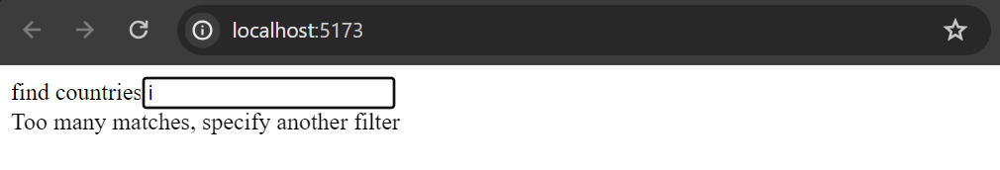
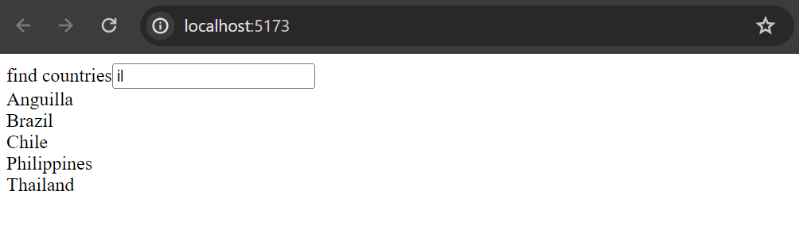
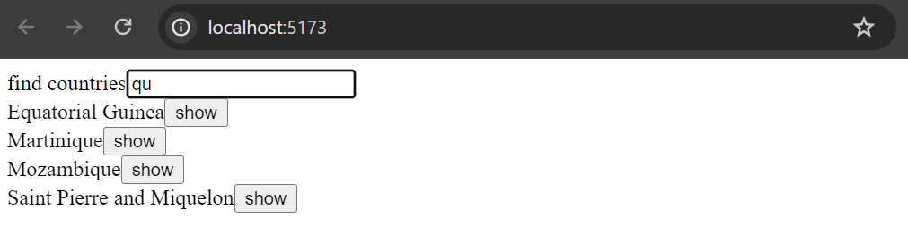

<div class="content">

The appearance of our current application is quite modest.
In [exercise 0.2](/part0/fundamentals_of_web_apps#exercises-0-1-0-6),
the assignment was to go through Mozilla's [CSS tutorial](https://developer.mozilla.org/en-US/docs/Learn/Getting_started_with_the_web/CSS_basics).

Let's take a look at how we can add styles to a React application.
There are several different ways of doing this and we will take a look at the other methods later on.
First, we will add CSS to our application the old-school way; in a single file without using a
[CSS preprocessor](https://developer.mozilla.org/en-US/docs/Glossary/CSS_preprocessor)
(although this is not entirely true as we will learn later on).

Let's add a new *index.css* file under the *src* directory and then add it to the application by importing it in the *index.js* file:

```js
import './index.css'
```

Let's add the following CSS rule to the *index.css* file:

```css
h1 {
  color: chocolate;
}
```

**Notice:** when the content of the file *index.css* changes, React might not notice that automatically, so you may need to refresh the browser to see your changes!

CSS rules comprise of **selectors** and **declarations**.
The selector defines which elements the rule should be applied to.
The selector above is `h1`, which will match all of the `h1` header tags in our application.

The declaration sets the `color` property to the value `chocolate` (*all this work is making me hungry!*).

One CSS rule can contain an arbitrary number of declarations.
Let's modify the previous rule to make the text cursive, by defining the font style as `italic`:

```css
h1 {
  color: chocolate;
  font-style: italic;  // highlight-line
}
```

There are many ways of matching elements by using [different types of CSS selectors](https://developer.mozilla.org/en-US/docs/Web/CSS/CSS_Selectors).

If we wanted to target, let's say, each one of the tasks with our styles,
we could use the selector `li`, as all of the tasks are wrapped inside `li` tags:

```js
const Task = ({ task, toggleImportance }) => {
  const label = task.important 
    ? 'make not important' 
    : 'make important';

  return (
    <li>
      {task.content} 
      <button onClick={toggleImportance}>{label}</button>
    </li>
  )
}
```

Let's add the following rule to our style sheet (relying on my non-existent knowledge of color theory and design):

```css
li {
  color: #f4b223;
  padding-top: 8px;
  font-size: 18px;
}
```

Using element types for defining CSS rules is slightly problematic.
If our application contained other `li` tags, the same style rule would also be applied to them.

If we want to apply our style specifically to tasks,
then it is better to use [class selectors](https://developer.mozilla.org/en-US/docs/Web/CSS/Class_selectors).

In regular HTML, classes are defined as the value of the `class` attribute:

```html
<li class="task">some text...</li>
```

In React we have to use the [className](https://reactjs.org/docs/dom-elements.html#classname) attribute instead of the class attribute.
With this in mind, let's make the following changes to our `Task` component:

```js
const Task = ({ task, toggleImportance }) => {
  const label = task.important 
    ? 'make not important' 
    : 'make important';

  return (
    <li className='task'> // highlight-line
      {task.content} 
      <button onClick={toggleImportance}>{label}</button>
    </li>
  )
}
```

Class selectors are defined with the `.classname` syntax:

```css
.task {
  color: #f4b223;
  padding-top: 8px;
  font-size: 18px;
}
```

Notice this time that instead of a named color, I used a [**hex color value**](https://www.w3schools.com/colors/colors_hexadecimal.asp) to specify a color in the RGB space.
If you now add other `li` elements to the application, they will not be affected by the style rule above.

One final task that we are going to make is to use what is called a **pseudo-class selector**, which is not an actual class, but something that is defined by most browsers.
In our case, since we've been doing a lot websites with dark mode, we'll jump on the bandwagon and add this as well here.

:root {
    color-scheme:dark;
}

Once you save, you'll immediately notice that the entire page has inverted, including the colors for button controls and textboxes.
You can apply this to any of the future assignments if you prefer all things dark.

### Improved error message

We previously implemented the error message that was displayed when the user tried to toggle the importance of a deleted task with the `alert` method.
Let's implement the error message as its own React component.

The component is quite simple:

```js
const Notification = ({ message }) => {
  if (message === null) {
    return null
  }

  return (
    <div className='error'>
      {message}
    </div>
  )
}
```

If the value of the `message` prop is `null`, then nothing is rendered to the screen,
and in other cases, the message gets rendered inside of a div element.

Let's add a new piece of state called `errorMessage` to the `App` component.
Let's initialize it with some error message so that we can immediately test our component:

```js
const App = () => {
  const [tasks, setTasks] = useState([]) 
  const [newTask, setNewTask] = useState('')
  const [showAll, setShowAll] = useState(true)
  const [errorMessage, setErrorMessage] = useState('some error happened...') // highlight-line

  // ...

  return (
    <div>
      <h1>Tasks</h1>
      <Notification message={errorMessage} /> // highlight-line
      <div>
        <button onClick={() => setShowAll(!showAll)}>
          show {showAll ? 'important' : 'all' }
        </button>
      </div>      
      // ...
    </div>
  )
}
```

Then let's add a style rule that suits an error message:

```css
.error {
  background: #9c2b2e;
  font-size: 22px;
  border-style: solid;
  border-width: 1px;
  border-radius: 5px;
  padding: 10px;
  margin-bottom: 10px;
}
```

Now we are ready to add the logic for displaying the error message.
Let's change the `toggleImportanceOf` function in the following way:

```js
  const toggleImportanceOf = id => {
    const task = tasks.find(t => t.id === id)
    const changedTask = { ...task, important: !task.important }

    taskService
      .update(id, changedTask).then(returnedTask => {
        setTasks(tasks.map(task => task.id !== id ? task : returnedTask))
      })
      .catch(error => {
        // highlight-start
        setErrorMessage(
          `Task '${task.content}' was already deleted from server`
        )
        setTimeout(() => {
          setErrorMessage(null)
        }, 5000)
        // highlight-end
        setTasks(tasks.filter(t => t.id !== id))
      })
  }
```

When the error occurs we add a descriptive error message to the `errorMessage` state.
At the same time, we start a timer, that will set the `errorMessage` state to `null` after five seconds.

The result looks like this:


The code for the current state of our application can be found in the  *part2-7* branch on [GitHub](https://github.com/comp227/part2-tasks/tree/part2-7).

### Inline styles

React also makes it possible to write styles directly in the code as so-called [inline styles](https://react-cn.github.io/react/tips/inline-styles.html).

The idea behind defining inline styles is extremely simple.
Any React component or element can be provided with a set of CSS properties as a JavaScript object through the [style](https://reactjs.org/docs/dom-elements.html#style) attribute.

CSS rules are defined slightly differently in JavaScript than in normal CSS files.
Let's say that we wanted to give some element the color green and italic font that's 16 pixels in size.
In CSS, it would look like this:

```css
{
  color: green;
  font-style: italic;
  font-size: 16px;
}
```

But as a React inline-style object it would look like this:

```js
{
  color: 'green',
  fontStyle: 'italic',
  fontSize: 16
}
```

Every CSS property is defined as a separate property of the JavaScript object.
Numeric values for pixels can be simply defined as integers.
One of the major differences compared to regular CSS, is that hyphenated (kebab case) CSS properties are written in camelCase.

Next, we could add a "bottom block" to our application by creating a `Footer` component and defining the following inline styles for it:

```js
// highlight-start
const Footer = () => {
  const footerStyle = {
    marginTop: 30,
    paddingBottom: 15,
    color: 'orange',
    fontStyle: 'italic',
    fontSize: 16
  }

  return (
    <div style={footerStyle}>
      <br />
      Task app, Department of Computer Science, University of the Pacific 2023
    </div>
  )
}
// highlight-end

const App = () => {
  // ...

  return (
    <div>
      <h1>Tasks</h1>

      <Notification message={errorMessage} />

      // ...

      <Footer /> // highlight-line
    </div>
  )
}
```

Inline styles come with certain limitations.
For instance, so-called [pseudo-classes](https://developer.mozilla.org/en-US/docs/Web/CSS/Pseudo-classes) can't be used straightforwardly.

Inline styles and some of the other ways of adding styles to React components go completely against the grain of old conventions.
Traditionally, it has been considered best practice to entirely separate CSS from the content (HTML) and functionality (JavaScript).
According to this older school of thought, the goal was to write CSS, HTML, and JavaScript into their separate files.

The philosophy of React is, in fact, the polar opposite of this.
Since the separation of CSS, HTML, and JavaScript into separate files did not seem to scale well in larger applications,
React bases the division of the application along the lines of its logical functional entities.

The structural units that make up the application's functional entities are React components.
A React component defines the HTML for structuring the content,
the JavaScript functions for determining functionality, and also the component's styling; all in one place.
This is to create individual components that are as independent and reusable as possible.

The code of the final version of our application can be found in the *part2-8* branch on [GitHub](https://github.com/comp227/part2-tasks/tree/part2-8).

</div>

<div class="tasks">

### Exercises 2.16-2.17

#### 2.16: Phonebook step11

Use the [improved error message](/part2/adding_styles_to_react_app#improved-error-message)
example from part 2 as a guide to show a notification that lasts for a few seconds after a successful operation is executed (a group is added or a number is changed).
In these examples, use the gray and green colors.


<h4>2.17*: Phonebook step12</h4>

Open your application in two browsers.
**If you delete a group in browser 1** a short while before attempting to ***change the group's URL*** in browser 2, you will get the following error message:


Fix the issue according to the example shown in [promise and errors](/part2/altering_data_in_server#promises-and-errors) in part 2.
Modify the example so that the user is shown a message when the operation does not succeed.
The messages shown for successful and unsuccessful events should look different:


**Notice** that even if you handle the exception, the error message is printed to the console.

</div>

<div class="content">

### Couple of important remarks

At the end of this part, there are a few more challenging exercises.
At this stage, you can skip the exercises if they are too much of a headache,
we will come back to the same themes again later.
You should still read through this material below.

Know that we have done one thing in our app that is masking away a very typical source of errors:
***We set the state `tasks` to have an initial value of an empty array.***

```js
const App = () => {
  const [tasks, setTasks] = useState([])

  // ...
}
```

This is a reasonable initial value for `tasks` since we will be storing multiple tasks in that state.

If the state were to hold a "single thing",
a better initial value would be `null` since it indicates that there is *nothing* in the state initially.
Let us try what happens if we use this initial value:

```js
const App = () => {
  const [tasks, setTasks] = useState(null) // highlight-line

  // ...
}
```

The app breaks down.


The error message gives the reason and location for the error.
The code that caused the problems is the following:

```js
  // tasksToShow gets the value of tasks
  const tasksToShow = showAll
    ? tasks
    : tasks.filter(task => task.important)

  // ...

  {tasksToShow.map(task =>  // highlight-line
    <Task key={task.id} task={task} />
  )}
```

The error message is

```bash
Cannot read properties of null (reading 'map')
```

The variable `tasksToShow` is first assigned the value of the state `tasks`.
Then, the code tries to call the method `map` to a non-existing object, that is, to `null`.

What is the reason for that?

The effect hook uses the function `setTasks` to set the `tasks` that the backend is returning:

```js
  useEffect(() => {
    taskService
      .getAll()
      .then(initialTasks => {
        setTasks(initialTasks)  // highlight-line
      })
  }, [])
```

However, the problem is that **the effect is executed only *after the first render***.
And because `tasks` has the initial value of `null`:

```js
const App = () => {
  const [tasks, setTasks] = useState(null) // highlight-line

  // ...
```

on the first render, the following code gets executed

```js
tasksToShow = tasks // has the value null

// ...

tasksToShow.map(task => ...) // uh-oh...
```

and this blows up the app since we can not call the method `map` on the value `null`.

When we set `tasks` to be initially an empty array,
there is no error since it is allowed to call `map` to an empty array.

So, the initialization of the state "masked" the problem
that is caused by the data not yet being fetched from the backend.

Another way to circumvent the problem is to use *conditional rendering*
and return `null` if the component state is not properly initialized:

```js
const App = () => {
  const [tasks, setTasks] = useState(null) // highlight-line
  // ... 

  useEffect(() => {
    taskService
      .getAll()
      .then(initialTasks => {
        setTasks(initialTasks)
      })
  }, [])

  // do not render anything if tasks is still null
  // highlight-start
  if (!tasks) { 
    return null 
  }
  // highlight-end

  // ...
} 
```

So on the first render, nothing is rendered.
When the tasks arrive from the backend,
the effect used the function `setTasks` to set the value of the state `tasks`.
This causes the component to be rendered again,
and at the second render, the tasks get rendered to the screen.

This conditional rendering is suitable in cases where it is impossible to define the state so that the initial rendering is possible.

The other thing that we still need to have a closer look at is the second parameter of `useEffect`:

```js
  useEffect(() => {
    taskService
      .getAll()
      .then(initialTasks => {
        setTasks(initialTasks)  
      })
  }, []) // highlight-line
```

The second parameter of `useEffect` is used to [specify how often the effect is run](https://reactjs.org/docs/hooks-reference.html#conditionally-firing-an-effect).
The principle is that the effect is always executed after the first render of the component
*and* when the value of the second parameter changes.

If the second parameter is an empty array `[]`, *its content never changes*
and **the effect is only run after the first render of the component**.
This is what we want when we initialize the app state from the server.

However, there are situations where we want to perform the effect at other times,
e.g. when the state of the component changes in a particular way.

Consider the following simple application for querying currency exchange rates from the [Exchange rate API](https://www.exchangerate-api.com/):

```js
import { useState, useEffect } from 'react'
import axios from 'axios'

const App = () => {
  const [value, setValue] = useState('')
  const [rates, setRates] = useState({})
  const [currency, setCurrency] = useState(null)

  useEffect(() => {
    console.log('effect run, currency is now', currency)

    // skip if currency is not defined
    if (currency) {
      console.log('fetching exchange rates...')
      axios
        .get(`https://open.er-api.com/v6/latest/${currency}`)
        .then(response => {
          setRates(response.data.rates)
        })
    }
  }, [currency])

  const handleChange = (event) => {
    setValue(event.target.value)
  }

  const onSearch = (event) => {
    event.preventDefault()
    setCurrency(value)
  }

  return (
    <div>
      <form onSubmit={onSearch}>
        currency: <input value={value} onChange={handleChange} />
        <button type="submit">exchange rate</button>
      </form>
      <pre>
        {JSON.stringify(rates, null, 2)}
      </pre>
    </div>
  )
}
```

The user interface of the application has a form,
in the input field of which the name of the desired currency is written.
If the currency exists, the application renders the exchange rates of the currency to other currencies:


The application sets the name of the currency entered into the form to the state `currency` at the moment the button is pressed.

When the `currency` gets a new value, the application fetches its exchange rates from the API in the effect function:

```js
const App = () => {
  // ...
  const [currency, setCurrency] = useState(null)

  useEffect(() => {
    console.log('effect run, currency is now', currency)

    // skip if currency is not defined
    if (currency) {
      console.log('fetching exchange rates...')
      axios
        .get(`https://open.er-api.com/v6/latest/${currency}`)
        .then(response => {
          setRates(response.data.rates)
        })
    }
  }, [currency]) // highlight-line
  // ...
}
```

The useEffect hook has now `currency` as the second parameter.
The effect function is therefore executed after the first render,
and *always* after the table as its second parameter `currency` changes.
That is, when the state `currency` gets a new value, the content of the table changes and the effect function is executed.

The effect has the following condition:

```js
if (currency) { 
  // get exchange rates
}
```

which prevents requesting the exchange rates just after the first render when the variable `currency` still has the initial value of `""`.

So if the user types *eur* in the search field,
the application uses Axios to perform an HTTP GET request to the address <https://open.er-api.com/v6/latest/eur>
and stores the response in the `rates` state.

When the user then enters another value in the search field, e.g. *usd*,
the effect function is executed again and the exchange rates of the new currency are requested form the API.

The way presented here for making API requests might seem a bit awkward.
This particular application could have been made without `useEffect`,
by making the API requests directly in the form submit handler function:

```js
  const onSearch = (event) => {
    event.preventDefault()
    axios
      .get(`https://open.er-api.com/v6/latest/${value}`)
      .then(response => {
        setRates(response.data.rates)
      })
  }
```

However, there are situations where that technique would not work.
For example, you *might* encounter one such a situation in the exercise 2.20 where the use of `useEffect` could provide a solution.
Notice that this depends quite much on the approach you selected.

</div>

<div class="tasks">

### Exercises 2.18-2.20

#### 2.18* Data for countries, step1

The API [https://restcountries.com](https://restcountries.com) provides data for different countries in a machine-readable format, a so-called REST API.

Create an application, in which one can look at data from various countries.
The application should probably get the data from the endpoint [all](https://restcountries.com/v3.1/all).

**NOTICE** make sure again that you are careful to call `create-react-app` in your base directory when you make your new application, which you can call *countries*.

The user interface is very simple.
The country to be shown is found by typing a search query into the search field.

If there are too many (over 10) countries that match the query, then the user is prompted to make their query more specific:



If there are ten or fewer countries, but more than one, then all countries matching the query are shown:



When there is only one country matching the query, then the basic data of the country (e.g. capital and area),
its flag and the languages spoken are shown:


**NB**: It is enough that your application works for most countries.
Some countries, like ***Sudan***, can be hard to support since the name of the country is part of the name of another country, ***South Sudan***.
You don't need to worry about these edge cases.

#### 2.19*: Data for countries, step2

**There is still a lot to do in this part, so don't get stuck on this exercise!**

Improve on the application in the previous exercise,
such that when the names of multiple countries are shown on the page there is a button next to the name of the country,
which when pressed shows the view for that country:



In this exercise, it is also enough that your application works for most countries.
Countries whose name appears in the name of another country, like ***Sudan***, can be ignored.

#### 2.20*: Data for countries, step3

**There is still a lot to do in this part, so don't get stuck on this exercise!**

Add to the view showing the data of a single country, the weather report for the capital of that country.
There are dozens of providers for weather data.
One suggested API is [https://openweathermap.org](https://openweathermap.org).
Notice that it might take some minutes until a generated API key is valid.


If you use Open weather map, [here](https://openweathermap.org/weather-conditions#Icon-list) is the description for how to get weather icons.

**NB:** In some browsers (such as Firefox) the chosen API might send an error response,
which indicates that HTTPS encryption is not supported, although the request URL starts with `http://`.
This issue can be fixed by completing the exercise using Chrome.

**NB:** You need an api-key to use almost every weather service.
Do not save the api-key to source control! Nor hardcode the api-key to your source code.
Instead use an [environment variable](https://create-react-app.dev/docs/adding-custom-environment-variables/) to save the key.

Assuming the api-key is `t0p53cr3t4p1k3yv4lu3`, when the application is started like so:

```bash
REACT_APP_API_KEY=t0p53cr3t4p1k3yv4lu3 npm start // For Linux/macOS Bash
($env:REACT_APP_API_KEY="t0p53cr3t4p1k3yv4lu3") -and (npm start) // For Windows PowerShell
set "REACT_APP_API_KEY=t0p53cr3t4p1k3yv4lu3" && npm start // For Windows cmd.exe
```

you can access the value of the key from the `process.env` object:

```js
const api_key = process.env.REACT_APP_API_KEY
// variable api_key has now the value set in startup
```

Notice that if you created the application using `npx create-react-app ...`
and you want to use a different name for your environment variable then the environment variable name must still begin with `REACT_APP_`.
You can also use a `.env` file rather than defining it on the command line each time by creating a file entitled '.env' in the root of the project and adding the following.

```text
# .env

REACT_APP_API_KEY=t0p53cr3t4p1k3yv4lu3
```

Notice that you will need to restart the server to apply the changes.

</div>
