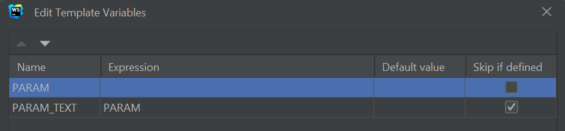
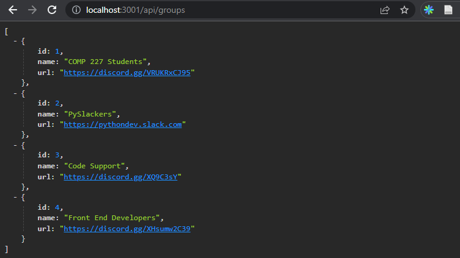

<div class="content">

In this part, our focus shifts towards the backend: that is, towards implementing functionality on the server side of the stack.

We will be building our backend on top of [NodeJS](https://nodejs.org/en/),
which is a JavaScript runtime based on Google's [Chrome V8](https://developers.google.com/v8/) JavaScript engine.

This course material was originally written with version *16.13.2* of Node.js,
but you can try to use v18.13.0 as, it parts have been adapted to use that version.
If you are using NVM, you can switch.
For the rest of you, please stay on 16.13.2.
Just know that some of the library versions may change, as most the material is still in 16.13.2.
Please make sure that your version of Node is at least as new as the version used in the material
(you can check the version by running `node -v` in the command line).

As mentioned in [part 1](/part1/java_script),
browsers don't yet support the newest features of JavaScript,
and that is why the code running in the browser must be *transpiled* with e.g. [babel](https://babeljs.io/).
The situation with JavaScript running in the backend is different.
The newest version of Node supports a large majority of the latest features of JavaScript,
so we can use the latest features without having to transpile our code.

Our goal is to implement a backend that will work with the tasks application from [part 2](/part2/).
However, let's start with the basics by implementing a classic "hello world" application.

> **Notice** that the applications and exercises in this part are not all React applications,
and we will not use the *create-react-app* utility for initializing the project for this application.

We had already mentioned [npm](/part2/getting_data_from_server#npm) back in part 2, which is a tool used for managing JavaScript packages.
In fact, npm originates from the Node ecosystem.

Let's navigate to an appropriate directory, and create a new template for our application with the `npm init` command.
We will answer the questions presented by the utility,
and the result will be an automatically generated *package.json* file at the root of the project that contains information about the project.

```json
{
  "name": "backend",
  "version": "0.0.1",
  "description": "",
  "main": "index.js",
  "scripts": {
    "test": "echo \"Error: no test specified\" && exit 1"
  },
  "author": "Osvaldo Jiménez",
  "license": "ISC"
}
```

The file defines, for instance, that the entry point of the application is the *index.js* file.

Let's make a small change to the `scripts` object:

```bash
{
  // ...
  "scripts": {
    "start": "node index.js", // highlight-line
    "test": "echo \"Error: no test specified\" && exit 1"
  },
  // ...
}
```

Next, let's create the first version of our application by adding an *index.js* file to the root of the project with the following code:

```js
console.log('hello comp227')
```

We can run the program directly with Node from the command line:

```bash
node index.js
```

Or we can run it as an [npm script](https://docs.npmjs.com/misc/scripts):

```bash
npm start
```

The `start` npm script works because we defined it in the *package.json* file:

```bash
{
  // ...
  "scripts": {
    "start": "node index.js",
    "test": "echo \"Error: no test specified\" && exit 1"
  },
  // ...
}
```

Even though the execution of the project works when it is started by calling `node index.js` from the command line, it's customary for npm projects to execute such tasks as npm scripts.

By default, the *package.json* file also defines another commonly used npm script called `npm test`.
Since our project does not yet have a testing library, the `npm test` command simply executes the following command:

```bash
echo "Error: no test specified" && exit 1
```

### Simple web server

Let's change the application into a web server by editing the *index.js* files as follow:

```js
const http = require('http')

const app = http.createServer((request, response) => {
  response.writeHead(200, { 'Content-Type': 'text/plain' })
  response.end('Hello COMP227!')
})

const PORT = 3001
app.listen(PORT)
console.log(`Server running on port ${PORT}`)
```

Once the application is running, the following message is printed in the console:

```bash
Server running on port 3001
```

We can open our humble application in the browser by visiting the address <http://localhost:3001>:


The text is rendered in black and white because my system is in dark mode.
The server works the same way regardless of the latter part of the URL.
Also the address <http://localhost:3001/foo/bar> will display the same content.

> **NB** if port 3001 is already in use by some other application, then starting the server will result in the following error message:
>
> ```bash
> ➜  hello npm start
>
> > hello@1.0.0 start /Users/powercat/comp227/part3/hello<br/>
> > node index.js
>
> Server running on port 3001
> events.js:167
>       throw er; // Unhandled 'error' event
>       ^
>
> Error: listen EADDRINUSE :::3001
>     at Server.setupListenHandle [as _listen2] (net.js:1330:14)
>     at listenInCluster (net.js:1378:12)
> ```
>
> You have two options.
Either shut down the application using port 3001 (the json-server in the last part of the material was using port 3001),
or use a different port for this application.

Let's take a closer look at the first line of the code:

```js
const http = require('http')
```

In the first row, the application imports Node's built-in [web server](https://nodejs.org/docs/latest-v8.x/api/http.html) module.
This is practically what we have already been doing in our browser-side code, but with a slightly different syntax:

```js
import http from 'http'
```

These days, code that runs in the browser uses ES6 modules.
Modules are defined with an [export](https://developer.mozilla.org/en-US/docs/Web/JavaScript/Reference/Statements/export)
and taken into use with an [import](https://developer.mozilla.org/en-US/docs/Web/JavaScript/Reference/Statements/import).

However, Node.js uses so-called [CommonJS](https://en.wikipedia.org/wiki/CommonJS) modules.
The reason for this is that the Node ecosystem had a need for modules long before JavaScript supported them in the language specification.
Node supports now also the use of ES6 modules, but since the support is yet [not quite perfect](https://nodejs.org/api/esm.html#modules-ecmascript-modules) we'll stick to CommonJS modules.

CommonJS modules function almost exactly like ES6 modules, at least as far as our needs in this course are concerned.

The next chunk in our code looks like this:

```js
const app = http.createServer((request, response) => {
  response.writeHead(200, { 'Content-Type': 'text/plain' })
  response.end('Hello World')
})
```

The code uses the `createServer` method of the [http](https://nodejs.org/docs/latest-v8.x/api/http.html) module to create a new web server.
An **event handler** is registered to the server that is called *every time* an HTTP request is made to the server's address <http://localhost:3001>.

The request is responded to with the status code 200,
with the `Content-Type` header set to `text/plain`, and the content of the site to be returned set to `Hello World`.

The last rows bind the http server assigned to the `app` variable, to listen to HTTP requests sent to port 3001:

```js
const PORT = 3001
app.listen(PORT)
console.log(`Server running on port ${PORT}`)
```

The primary purpose of the backend server in this course is to offer raw data in JSON format to the frontend.
For this reason, let's immediately change our server to return a hardcoded list of tasks in the JSON format:

```js
const http = require('http')

// highlight-start
let tasks = [
  {
    id: 1,
    content: "Wash the dishes",
    date: "2023-01-10T17:30:31.098Z",
    important: true
  },
  {
    id: 2,
    content: "Take out the trash",
    date: "2023-01-10T18:39:34.091Z",
    important: false
  },
  {
    id: 3,
    content: "Buy salty snacks",
    date: "2023-01-10T19:20:14.298Z",
    important: true
  }
]

const app = http.createServer((request, response) => {
  response.writeHead(200, { 'Content-Type': 'application/json' })
  response.end(JSON.stringify(tasks))
})
// highlight-end

const PORT = 3001
app.listen(PORT)
console.log(`Server running on port ${PORT}`)
```

Let's restart the server (you can shut the server down by pressing ***Ctrl+C*** in the console) and let's refresh the browser.

The `application/json` value in the `Content-Type` header informs the receiver that the data is in the JSON format.
The `tasks` array gets transformed into JSON with the `JSON.stringify(tasks)` method.

When we open the browser, the displayed format is exactly the same as in [part 2](/part2/getting_data_from_server/)
where we used [json-server](https://github.com/typicode/json-server) to serve the list of tasks:


### Express

Implementing our server code directly with Node's built-in [http](https://nodejs.org/docs/latest-v8.x/api/http.html) web server is possible.
However, it is cumbersome, especially once the application grows in size.

Many libraries have been developed to ease server-side development with Node,
by offering a more pleasing interface to work with the built-in http module.
These libraries aim to provide a better abstraction for general use cases we usually require to build a backend server.
By far the most popular library intended for this purpose is [express](http://expressjs.com).

Let's take express into use by defining it as a project dependency with the command:

```bash
npm install express
```

The dependency is also added to our *package.json* file:

```json
{
  // ...
  "dependencies": {
    "express": "^4.17.2"
  }
}
```

The source code for the dependency is installed in the *node_modules* directory located at the root of the project.
In addition to express, you can find a great number of other dependencies in the directory:


These are the dependencies of the express library and the dependencies of all of its dependencies, and so forth.
These are called the [transitive dependencies](https://lexi-lambda.github.io/blog/2016/08/24/understanding-the-npm-dependency-model/) of our project.

The version 4.17.2 of express was installed in our project.
(*Version 4.18.2 if using node 18*)
What does the caret in front of the version number in *package.json* mean?

```json
"express": "^4.17.2"
```

The versioning model used in npm is called [semantic versioning](https://docs.npmjs.com/getting-started/semantic-versioning).

The caret in the front of `^4.X.Y` means that if and when the dependencies of a project are updated,
the version of express that is installed will be at least ***4.X.Y***.
However, the installed version of express can also have a larger **patch** number (the last number),
or a larger **minor** number (the middle number).
The major version of the library indicated by the first **major** number must be the same.

We can update the dependencies of the project with the command:

```bash
npm update
```

Likewise, if we start working on the project on another computer,
we can install all up-to-date dependencies of the project defined in *package.json* by running this next command in the project's root directory:

```bash
npm install
```

If the *major* number of a dependency does not change,
then the newer versions should be [backwards compatible](https://en.wikipedia.org/wiki/Backward_compatibility).
This means that if our application happened to use version 4.99.175 of express in the future,
then all the code implemented in this part would still have to work without making changes to the code.
In contrast, the future 5.0.0 version of express [may contain](https://expressjs.com/en/guide/migrating-5.html) changes that would cause our application to no longer work.

### Web and express

Let's get back to our application and make the following changes:

```js
const express = require('express')
const app = express()

let tasks = [
  ...
]

app.get('/', (request, response) => {
  response.send('<h1>Hello COMP227!</h1>')
})

app.get('/api/tasks', (request, response) => {
  response.json(tasks)
})

const PORT = 3001
app.listen(PORT, () => {
  console.log(`Server running on port ${PORT}`)
})
```

To get the new version of our application into use, we have to restart the application.

The application did not change a whole lot.
Right at the beginning of our code, we're importing `express`,
which this time is a *function* that is used to create an express application stored in the `app` variable:

```js
const express = require('express')
const app = express()
```

Next, we define two ***routes*** to the application.
The first one defines an event handler that is used to handle HTTP GET requests made to the application's `/` root:

```js
app.get('/', (request, response) => {
  response.send('<h1>Hello World!</h1>')
})
```

The event handler function accepts two parameters.
The first [request](http://expressjs.com/en/4x/api.html#req) parameter contains all of the information of the HTTP request,
and the second [response](http://expressjs.com/en/4x/api.html#res) parameter is used to define how the request is responded to.

In our code, the request is answered by using the [send](http://expressjs.com/en/4x/api.html#res.send) method of the `response` object.
Calling the method makes the server respond to the HTTP request by sending a response containing the string `<h1>Hello World!</h1>` that was passed to the `send` method.
Since the parameter is a string, express automatically sets the value of the `Content-Type` header to be `text/html`.
The status code of the response defaults to 200.

We can verify this from the ***Network*** tab in developer tools:


The second route defines an event handler that handles HTTP GET requests made to the *tasks* path of the application:

```js
app.get('/api/tasks', (request, response) => {
  response.json(tasks)
})
```

The request is responded to with the [json](http://expressjs.com/en/4x/api.html#res.json) method of the `response` object.
Calling the method will send the **tasks** array that was passed to it as a JSON formatted string.
Express automatically sets the `Content-Type` header with the appropriate value of `application/json`.


Next, let's take a quick look at the data sent in JSON format.

In the earlier version where we were only using Node, we had to transform the data into the JSON format with the `JSON.stringify` method:

```js
response.end(JSON.stringify(tasks))
```

With express, this is no longer required, because this transformation happens automatically.

It's worth noting that [JSON](https://en.wikipedia.org/wiki/JSON) is a string and not a JavaScript object like the value assigned to `tasks`.

The experiment shown below illustrates this point:


The experiment above was done in the interactive [node-repl](https://nodejs.org/docs/latest-v8.x/api/repl.html).
You can start the interactive node-repl by typing in `node` in the command line.
The repl is particularly useful for testing how commands work while you're writing application code.  To get out of node-repl, type `.exit`.
I highly recommend this!

### nodemon

If we make changes to the application's code we have to restart the application to see the changes.
We restart the application by first shutting it down by typing *Ctrl+C* and then restarting the application.
Compared to the convenient workflow in React where the browser automatically reloaded after changes were made, this feels slightly cumbersome.

The solution to this problem is [nodemon](https://github.com/remy/nodemon):

> *nodemon will watch the files in the directory in which nodemon was started,
and if any files change, nodemon will automatically restart your node application.*

Let's install nodemon by defining it as a **development dependency** with the command:

```bash
npm install nodemon --save-dev
```

The contents of *package.json* have also changed:

```json
{
  //...
  "dependencies": {
    "express": "^4.17.2"
  },
  "devDependencies": {
    "nodemon": "^2.0.15"
  }
}
```

If you accidentally used the wrong command and the nodemon dependency was added under "dependencies" instead of "devDependencies",
then manually change the contents of *package.json* to match what is shown above.

By development dependencies, we are referring to tools that are needed only during the development of the application,
e.g. for testing or automatically restarting the application, like *nodemon*.

These development dependencies are not needed when the application is run in production mode on the production server (e.g. Render).

We can start our application with *nodemon* like this:

```bash
node_modules/.bin/nodemon index.js
```

Changes to the application code now cause the server to restart automatically.
It's worth noting that even though the backend server restarts automatically, the browser still has to be manually refreshed.
This is because unlike when working in React,
we don't have the [hot reload](https://gaearon.github.io/react-hot-loader/getstarted/) functionality needed to automatically reload the browser.

The command is long and quite unpleasant, so let's define a dedicated *npm script* for it in the *package.json* file:

```bash
{
  // ..
  "scripts": {
    "start": "node index.js",
    "dev": "nodemon index.js",  // highlight-line
    "test": "echo \"Error: no test specified\" && exit 1"
  },
  // ..
}
```

In the script there is no need to specify the *node_modules/.bin/nodemon* path to nodemon,
because ***npm*** automatically knows to search for the file from that directory.

We can now start the server in development mode with the command:

```bash
npm run dev
```

Unlike with the ***start*** and ***test*** scripts, we also have to add `run` to the command.

### REST

Let's expand our application so that it mimics [json-server's](https://github.com/typicode/json-server#routes) RESTful HTTP API.

Representational State Transfer, aka **REST**, was introduced in 2000 in Roy Fielding's
[dissertation](https://www.ics.uci.edu/~fielding/pubs/dissertation/rest_arch_style.htm).
REST is an architectural style meant for building scalable web applications.

We are not going to dig into Fielding's definition of REST or spend time pondering about what is and isn't RESTful.
Instead, we take a more [narrow view](https://en.wikipedia.org/wiki/Representational_state_transfer#Applied_to_web_services)
by only concerning ourselves with how RESTful APIs are typically understood in web applications.
The original definition of REST is not even limited to web applications.

We mentioned in the [previous part](/part2/altering_data_in_server#rest) that singular things,
like tasks in the case of our application, are called **resources** in RESTful thinking.
Every resource has an associated URL which is the resource's unique address.

One convention for creating unique addresses is to combine the name of the resource type with the resource's unique identifier.

Let's assume that the root URL of our service is ***www.example.com/api***.

If we define the resource type of task to be ***tasks***,
then the address of a task resource with the identifier 10, has the unique address ***www.example.com/api/tasks/10***.

The URL for the entire collection of all task resources is ***www.example.com/api/tasks***.

We can execute different operations on resources.
The operation to be executed is defined by the HTTP *verb*:

| URL                   | verb                | functionality                                                    |
| --------------------- | ------------------- | -----------------------------------------------------------------|
| tasks/10              | GET                 | fetches a single resource                                        |
| tasks                 | GET                 | fetches all resources in the collection                          |
| tasks                 | POST                | creates a new resource based on the request data                 |
| tasks/10              | DELETE              | removes the identified resource                                  |
| tasks/10              | PUT                 | replaces the entire identified resource with the request data    |
| tasks/10              | PATCH               | replaces a part of the identified resource with the request data |
|                       |                     |                                                                  |

This is how we manage to roughly define what REST refers to as a [uniform interface](https://en.wikipedia.org/wiki/Representational_state_transfer#Architectural_constraints),
which means a consistent way of defining interfaces that makes it possible for systems to cooperate.

This way of interpreting REST falls under the
[second level of RESTful maturity](https://martinfowler.com/articles/richardsonMaturityModel.html)
in the Richardson Maturity Model.
According to the definition provided by Roy Fielding,
we have not defined a [REST API](http://roy.gbiv.com/untangled/2008/rest-apis-must-be-hypertext-driven).
In fact, a large majority of the world's purported "REST" APIs do not meet Fielding's original criteria outlined in his dissertation.

In some places (e.g. [Richardson, Ruby: RESTful Web Services](http://shop.oreilly.com/product/9780596529260.do))
you will see our model for a straightforward [CRUD](https://en.wikipedia.org/wiki/Create,_read,_update_and_delete) API,
being referred to as an example of [resource-oriented architecture](https://en.wikipedia.org/wiki/Resource-oriented_architecture) instead of REST.
We will avoid getting stuck arguing semantics and instead return to working on our application.

### Fetching a single resource

Let's expand our application so that it offers a REST interface for operating on individual tasks.
First, let's create a [route](http://expressjs.com/en/guide/routing.html) for fetching a single resource.

The unique address we will use for an individual task is of the form ***tasks/10***, where the number at the end refers to the task's unique id number.

We can define [parameters](http://expressjs.com/en/guide/routing.html#route-parameters) for routes in express by using the colon syntax:

```js
app.get('/api/tasks/:id', (request, response) => {
  const id = request.params.id
  const task = tasks.find(task => task.id === id)
  response.json(task)
})
```

Now `app.get('/api/tasks/:id', ...)` will handle all HTTP GET requests that are of the form ***/api/tasks/SOMETHING***, where ***SOMETHING*** is an arbitrary string.

The `id` parameter in the route of a request can be accessed through the [request](http://expressjs.com/en/api.html#req) object:

```js
const id = request.params.id
```

The now familiar `find` method of arrays is used to find the task with an id that matches the parameter.
The task is then returned to the sender of the request.

When we test our application by going to <http://localhost:3001/api/tasks/1> in our browser,
we notice that it does not appear to work, as the browser displays an empty page.
This comes as no surprise to us as software developers, and it's time to debug.

As I've been doing more with live templates, I decided to modify JetBrains `log` live template.
Here's the text that I used.
`console.log('$PARAM_TEXT$ =', $PARAM$)$END$`
Afterwards, I decided to edit the variables in the live template so they look like this:



Now we can add `log` commands to our code for id and task. So type `log`, ***Enter***, `id`, ***Enter***(2x), and you get the console.log statement that shows below.
You could also add the line numbers and file names, but since I have clog already, I'll use that as well.

```js
app.get('/api/tasks/:id', (request, response) => {
  const id = request.params.id
  console.log('id =', id)
  const task = tasks.find(task => task.id === id)
  console.log('task =', task)
  response.json(task)
})
```

When we visit <http://localhost:3001/api/tasks/1> again in the browser,
the console - which is the terminal (in this case) - will display the following:


The id parameter from the route is passed to our application but the `find` method does not find a matching task.

To further our investigation, we also add a `console.log` inside the comparison function passed to the `find` method.
To do this, we have to get rid of the compact arrow function syntax `task => task.id === id`, and use the syntax with an explicit return statement:

```js
app.get('/api/tasks/:id', (request, response) => {
  const id = request.params.id
  const task = tasks.find(task => {
    console.log(task.id, typeof task.id, id, typeof id, task.id === id)
    return task.id === id
  })
  console.log(task)
  response.json(task)
})
```

When we visit the URL again in the browser, each call to the comparison function prints a few different things to the console.
Here is the first part of that console output:

```shell
task.id = 1
typeof task.id = number
id = 1
typeof id = string
task.id === id = false
```

The cause of the bug becomes clear.
The `id` variable contains a string '1', whereas the ids of tasks are integers.
In JavaScript, the "triple equals" comparison === considers all values of different types to not be equal by default, meaning that 1 is not '1'.

Let's fix the issue by changing the id parameter from a string into a [number](https://developer.mozilla.org/en-US/docs/Web/JavaScript/Reference/Global_Objects/Number):

```js
app.get('/api/tasks/:id', (request, response) => {
  const id = Number(request.params.id) // highlight-line
  const task = tasks.find(task => task.id === id)
  response.json(task)
})
```

Now fetching an individual resource works.


However, there's another problem with our application.

If we search for a task with an id that does not exist, the server responds with:


The HTTP status code that is returned is 200, which means that the response succeeded.
There is no data sent back with the response, since the value of the `content-length` header is 0, and the same can be verified from the browser.

The reason for this behavior is that the `task` variable is set to `undefined` if no matching task is found.
The situation needs to be handled on the server in a better way.
If no task is found, the server should respond with the status code [404 not found](https://www.rfc-editor.org/rfc/rfc9110.html#name-404-not-found) instead of 200.

Let's make the following change to our code:

```js
app.get('/api/tasks/:id', (request, response) => {
  const id = Number(request.params.id)
  const task = tasks.find(task => task.id === id)
  
  // highlight-start
  if (task) {
    response.json(task)
  } else {
    response.status(404).end()
  }
  // highlight-end
})
```

Since no data is attached to the response, we use the [status](http://expressjs.com/en/4x/api.html#res.status)
method for setting the status and the [end](http://expressjs.com/en/4x/api.html#res.end)
method for responding to the request without sending any data.

The if-condition leverages the fact that all JavaScript objects are [truthy](https://developer.mozilla.org/en-US/docs/Glossary/Truthy),
meaning that they evaluate to true in a comparison operation.
However, `undefined` is [falsy](https://developer.mozilla.org/en-US/docs/Glossary/Falsy) meaning that it will evaluate to false.

Our application works and sends the error status code if no task is found.
However, the application doesn't return anything to show to the user, like web applications normally do when we visit a page that does not exist.
We do not need to display anything in the browser because REST APIs are interfaces that are intended for programmatic use, and the error status code is all that is needed.
  
Anyway, it's possible to give a clue about the reason for sending a 404 error by
[overriding the default NOT FOUND message](https://stackoverflow.com/questions/14154337/how-to-send-a-custom-http-status-message-in-node-express/36507614#36507614).

### Deleting resources

Next, let's implement a route for deleting resources.
Deletion happens by making an HTTP DELETE request to the URL of the resource:

```js
app.delete('/api/tasks/:id', (request, response) => {
  const id = Number(request.params.id)
  tasks = tasks.filter(task => task.id !== id)

  response.status(204).end()
})
```

If deleting the resource is successful, meaning that the task exists and is removed,
we respond to the request with the status code [204 no content](https://www.rfc-editor.org/rfc/rfc9110.html#name-204-no-content) and return no data with the response.

There's no consensus on what status code should be returned to a DELETE request if the resource does not exist.
The only two options are 204 and 404.
For the sake of simplicity, our application will respond with 204 in both cases.

### Postman

So how do we test the delete operation?
HTTP GET requests are easy to make from the browser.
We could write some JavaScript for testing deletion, but writing test code is not always the best solution in every situation.

Many tools exist for making the testing of backends easier.
One of these is a command line program [curl](https://curl.haxx.se).
However, instead of curl, we will take a look at using [Postman](https://www.postman.com) for testing the application.

Let's install the Postman desktop client and try it out:

| Windows | Mac |
| :--- | :--- |
|`winget install -e postman` | `brew install --cask postman` |

Create an account, then a personal workspace and then create a collection.
I named my collection ***COMP 227***.
You'll then ***add a request***, which is a link provided on the side of postman.


While there is a lot of lingo and terminology to sift through, once you get to the request page, it becomes much more manageable.

It's enough to define the URL and then select the correct request type (DELETE).


The backend server appears to respond correctly.
By making an HTTP GET request to, or just visiting <http://localhost:3001/api/tasks>,
we see that the task with the id 2 is no longer in the list, which indicates that the deletion was successful.

Because the tasks in the application are only saved to memory, the list of tasks will return to its original state when we restart the application.

### WebStorm REST client

While Postman has become fairly popular due to all of it's options, in our case we can also use Webstorm's REST client instead of Postman.

To use the rest client, right-click on the project and select ***New->HTTP Request***.
Give it the name `all_tasks` and then you'll see a file named ***all_tasks.http***.
We'll use that file to define a request that fetches all tasks.


By clicking the highlighted play button, the REST client will execute the HTTP request and the response from the server is opened in the editor.


### Receiving data

Next, let's make it possible to add new tasks to the server.
Adding a task happens by making an HTTP POST request to the address <http://localhost:3001/api/tasks>,
and by sending all the information for the new task in the request [body](https://www.w3.org/Protocols/rfc2616/rfc2616-sec7.html#sec7) in JSON format.

To access the data easily, we need the help of the express [json-parser](https://expressjs.com/en/api.html).
We can use the parser by adding in that the command **`app.use(express.json())`**.

Let's activate the json-parser and implement an initial handler for dealing with the HTTP POST requests:

```js
const express = require('express')
const app = express()

app.use(express.json())  // highlight-line

//...

// highlight-start
app.post('/api/tasks', (request, response) => {
  const task = request.body
  console.log('task =', task)

  response.json(task)
})
// highlight-end
```

The event handler function can access the data from the `body` property of the `request` object.

Without the json-parser, the `body` property would be `undefined`.
The json-parser:

1. takes the JSON data of a request,
2. transforms it into a JavaScript object and
3. attaches it to the `body` property of the `request` object

before the route handler is called.

For the time being, the application does not do anything with the received data besides printing it to the console and sending it back in the response.

Before we implement the rest of the application logic, let's verify with Postman that the data is in fact received by the server.
In addition to defining the URL and request type in Postman, we also have to define the data sent in the `body`:


The application prints the data that we sent in the request to the console:


> **NB** *Keep the terminal running the application visible at all times* when you are working on the backend.
Thanks to Nodemon any changes we make to the code will restart the application.
If you pay attention to the console, you will immediately be able to pick up on errors that could occur:
>
> 
>
> Similarly, it is useful to check the console for making sure that the backend behaves as we expect it to in different situations, like when we send data with an HTTP POST request.
Naturally, it's OK to add lots of `console.log` commands to the code while the application is still being developed.
>
> A potential cause for issues is an incorrectly set `Content-Type` header in requests.
This can happen with Postman if the type of body is not defined correctly:
>
> 
>
> The `Content-Type` header is set to `text/plain`:
>
> 
>
> The server appears to only receive an empty object:
>
> 
>
> The server will not be able to parse the data correctly without the correct value in the header.
It won't even try to guess the format of the data since
there's a [massive amount](https://developer.mozilla.org/en-US/docs/Web/HTTP/Basics_of_HTTP/MIME_types) of potential *Content-Types*.

With WebStorm, the POST request can be sent with the REST client like this:


One benefit that the REST client has over Postman is that the requests are handily available at the root of the project repository,
and they can be distributed to everyone in the development team.
Notice in the picture that we are also able to add the POST request in same file using `###` separators:

```text
GET http://localhost:3001/api/tasks/

###
POST http://localhost:3001/api/tasks/ HTTP/1.1
content-type: application/json

{
    "name": "sample",
    "time": "Wed, 21 Oct 2015 18:27:50 GMT"
}
```

You can use the play button next to the line numbers to run the request you'd like.
Postman also allows users to save requests, but the situation can get quite chaotic especially when you're working on multiple unrelated projects.

> **About debugging and using requests**
>
> Sometimes when you're debugging, you may want to find out what headers have been set in the HTTP request.
> One way of accomplishing this is through the [get](http://expressjs.com/en/4x/api.html#req.get) method of the `request` object,
> that can be used for getting the value of a single header.
> The `request` object also has the *headers* property, that contains all of the headers of a specific request.
>
> Problems can occur with the Webstorm REST client if you accidentally add an empty line between the top row and the row specifying the HTTP headers.
> In this situation, the REST client interprets this to mean that all headers are left empty,
> which leads to the backend server not knowing that the data it has received is in the JSON format.
>
> You will be able to spot this missing *Content-Type* header if at some point in your code
> you print all of the request headers with the `console.log('request.headers=', request.headers)` command.

Let's return to the application.
Once we know that the application receives data correctly, it's time to finalize the handling of the request:

```js
app.post('/api/tasks', (request, response) => {
  const maxId = tasks.length > 0
    ? Math.max(...tasks.map(t => t.id)) 
    : 0

  const task = request.body
  task.id = maxId + 1

  tasks = tasks.concat(task)

  response.json(task)
})
```

We need a unique id for the task.
First, we find out the largest id number in the current list and assign it to the `maxId` variable.
The id of the new task is then defined as `maxId + 1`.
This method is not recommended, but we will live with it for now as we will replace it soon enough.

The current version still has the problem that the HTTP POST request can be used to add objects with arbitrary properties.
Let's improve the application by defining that the `content` property may not be empty.
The `important` and `date` properties will be given default values.
All other properties are discarded:

```js
const generateId = () => {
  const maxId = tasks.length > 0
    ? Math.max(...tasks.map(t => t.id))
    : 0
  return maxId + 1
}

app.post('/api/tasks', (request, response) => {
  const body = request.body

  if (!body.content) {
    return response.status(400).json({ 
      error: 'content missing' 
    })
  }

  const task = {
    content: body.content,
    important: body.important || false,
    date: new Date().toISOString(),
    id: generateId(),
  }

  tasks = tasks.concat(task)

  response.json(task)
})
```

The logic for generating the new id number for tasks has been extracted into a separate `generateId` function.

If the received data is missing a value for the `content` property, the server will respond to the request with the status code
[400 bad request](https://www.rfc-editor.org/rfc/rfc9110.html#name-400-bad-request):

```js
if (!body.content) {
  return response.status(400).json({ 
    error: 'content missing' 
  })
}
```

Notice that calling return is crucial because otherwise the code will execute to the very end and the malformed task gets saved to the application.

If the content property has a value, the task will be based on the received data.
As mentioned previously, it is better to generate timestamps on the server than in the browser,
since we can't trust that the host machine running the browser has its clock set correctly.
The generation of the `date` property is now done by the server.

If the `important` property is missing, we will default the value to `false`.
The default value is currently generated in a rather odd-looking way:

```js
important: body.important || false,
```

If the data saved in the `body` variable has the `important` property, the expression will evaluate to its value.
If the property does not exist, then the expression will evaluate to false which is defined on the right-hand side of the vertical lines.

> To be exact, when the `important` property is `false`,
then the `body.important || false` expression will in fact return `false` from the right-hand side...

You can find the code for our current application in its entirety in the *part3-1* branch of
[this GitHub repository](https://github.com/comp227/part3-tasks-backend/tree/part3-1).

The code for the current state of the application is specified in branch [part3-1](https://github.com/comp227/part3-tasks-backend/tree/part3-1).


If you clone the project, run the `npm install` command before starting the application with `npm start` or `npm run dev`.

One more thing before we move on to the exercises.
The function for generating IDs looks currently like this:

```js
const generateId = () => {
  const maxId = tasks.length > 0
    ? Math.max(...tasks.map(t => t.id))
    : 0
  return maxId + 1
}
```

The function body contains a row that looks a bit intriguing:

```js
Math.max(...tasks.map(t => t.id))
```

What exactly is happening in that line of code? `tasks.map(t => t.id)` creates a new array that contains all the ids of the tasks.
[Math.max](https://developer.mozilla.org/en-US/docs/Web/JavaScript/Reference/Global_Objects/Math/max) returns the maximum value of the numbers that are passed to it.
However, `tasks.map(t => t.id)` is an *array* so it can't directly be given as a parameter to `Math.max`.
The array can be transformed into individual numbers by using the
"three dot" [spread](https://developer.mozilla.org/en-US/docs/Web/JavaScript/Reference/Operators/Spread_syntax) syntax `...`.

</div>

<div class="tasks">

### Exercises 3.1-3.6

Please use this new repo link to build your new repository.

**<http://go.djosv.com/227lab3>**

> **NB:** Because this is not a frontend project and we are not working with React, the application **is not created** with create-react-app.
You initialize this project with the `npm init` command that was demonstrated earlier in this part of the material.
>
> **Strong recommendation:** When you are working on backend code, always keep an eye on what's going on in the terminal that is running your application.

#### 3.1: Communities backend step1

Implement a Node application that returns a hardcoded list of communities entries from the address <http://localhost:3001/api/groups>.
  
Data:
  
```js
[
    { 
      "id": 1,
      "name": "COMP 227 Students", 
      "url": "https://discord.gg/VRUKRxCJ95"
    },
    { 
      "id": 2,
      "name": "PySlackers", 
      "url": "https://pythondev.slack.com"
    },
    { 
      "id": 3,
      "name": "Code Support", 
      "url": "https://discord.gg/XQ9C3sY"
    },
    { 
      "id": 4,
      "name": "Front End Developers", 
      "url": "https://discord.gg/XHsumw2C39"
    }
]
```

Output in the browser after GET request:
  


Notice that the forward slash in the route ***api/groups*** is not a special character, and is just like any other character in the string.

The application must be started with the command `npm start`.

The application must also offer an `npm run dev` command that will run the application
and restart the server whenever changes are made and saved to a file in the source code.

#### 3.2: Communities backend step2

Implement a page at the address <http://localhost:3001/info> that looks roughly like this:


The page has to show the time that the request was received and how many communtiies are listed at the time of processing the request.

#### 3.3: Communities backend step3

Implement the functionality for displaying the information for a community.
The url for getting the data for a group with the id 5 should be <http://localhost:3001/api/groups/5>

If an entry for the given id is not found, the server has to respond with the appropriate status code.

#### 3.4: Communities backend step4

Implement functionality that makes it possible to delete a community by making an HTTP DELETE request to the unique URL of that community.

Test that your functionality works with either Postman or the Visual Studio Code REST client.

#### 3.5: Communities backend step5

Expand the backend so that new communities can be added by making HTTP POST requests to the address <http://localhost:3001/api/groups>.

Generate a new id for the community with the [Math.random](https://developer.mozilla.org/en-US/docs/Web/JavaScript/Reference/Global_Objects/Math/random) function.
Use a big enough range for your random values so that the likelihood of creating duplicate ids is small.

#### 3.6: Communities backend step6

Implement error handling for creating new entries.
The request is not allowed to succeed, if:

- The name or URL is missing
- The community name already exists

Respond to requests like these with the appropriate status code, and also send back information that explains the reason for the error, e.g.:

```js
{ error: 'name must be unique' }
```

</div>

<div class="content">

### About HTTP request types

[The HTTP standard](https://www.rfc-editor.org/rfc/rfc9110.html#name-common-method-properties)
talks about two properties related to request types, **safety** and **idempotency**.

The HTTP GET request should be **safe**:

> *In particular, the convention has been established that the GET and HEAD methods SHOULD NOT have the significance of taking an action other than retrieval.
  These methods ought to be considered "safe".*

Safety means that the executing request must not cause any *side effects* on the server.
By side effects, we mean that the state of the database must not change as a result of the request,
and the response must only return data that already exists on the server.

Nothing can ever guarantee that a GET request is *safe*, this is just a recommendation that is defined in the HTTP standard.
By adhering to RESTful principles in our API, GET requests are always used in a way that they are *safe*.

The HTTP standard also defines the request type [HEAD](https://www.rfc-editor.org/rfc/rfc9110.html#name-head),
which ought to be safe.
In practice, HEAD should work exactly like GET but it does not return anything but the status code and response headers.
The response body will not be returned when you make a HEAD request.

All HTTP requests except POST should be **idempotent**:

> *Methods can also have the property of "idempotence" in that (aside from error or expiration issues)
the side-effects of N > 0 identical requests is the same as for a single request.
  The methods `GET`, `HEAD`, `PUT` and `DELETE` share this property*

This means that if a request does not generate side effects, then the result should be the same regardless of how many times the request is sent.

If we make an HTTP PUT request to the URL ***/api/tasks/10*** and with the request we send the data `{ content: "no side effects!", important: true }`,
the result is the same regardless of how many times the request is sent.

Like *safety* for the GET request, **idempotence** is also just a recommendation in the HTTP standard
and not something that can be guaranteed simply based on the request type.
However, when our API adheres to RESTful principles, then GET, HEAD, PUT, and DELETE requests are used in such a way that they are idempotent.

POST is the only HTTP request type that is neither *safe* nor *idempotent*.
If we send 5 different HTTP POST requests to ***/api/tasks*** with a body of
`{content: "many same", important: true}`, the resulting 5 tasks on the server will all have the same content.

### Middleware

The express [json-parser](https://expressjs.com/en/api.html) we took into use earlier is a so-called [middleware](http://expressjs.com/en/guide/using-middleware.html).

Middleware are functions that can be used for handling `request` and `response` objects.

As a reminder, the json-parser we used earlier:

- takes the raw data from the requests that are stored in the `request` object
- parses it into a JavaScript object
- assigns it to the `request` object as a new property `body`.

In practice, you can use several middlewares at the same time.
When you have more than one, they're executed one by one in the order that they were taken into use in express.

Let's *implement our own middleware* that prints information about every request that is sent to the server.

For a function to be **middleware** it needs to receives three parameters:

```js
const requestLogger = (request, response, next) => {
  console.log('Method:', request.method)
  console.log('Path:  ', request.path)
  console.log('Body:  ', request.body)
  console.log('---')
  next()
}
```

At the end of the function body, the `next` function that was passed as a parameter is called.
The `next` function yields control to the next middleware.

Middleware is taken into use like this:

```js
app.use(requestLogger)
```

Middleware functions are called in the order that they're taken into use with the express server object's `use` method.
Notice that json-parser is taken into use before the `requestLogger` middleware,
because otherwise `request.body` will not be initialized when the logger is executed!

Middleware functions have to be taken into use before routes *if we want them to be executed before the route event handlers* are called.
There are also situations where we want to define middleware functions *after routes*.
In practice, this means that we are defining middleware functions that are only called if no route handles the HTTP request.

Let's add the following middleware after our routes.
This middleware will be used for catching requests made to non-existent routes.
For these requests, the middleware will return an error message in the JSON format.

```js
const unknownEndpoint = (request, response, next) => {
  response.status(404).send({ error: 'unknown endpoint' })
  next()
}

app.use(unknownEndpoint)
```

You can find the code for our current application in its entirety in the *part3-2* branch of
[this GitHub repository](https://github.com/comp227/part3-tasks-backend/tree/part3-2).

</div>

<div class="tasks">

### Exercises 3.7-3.8

#### 3.7: Communities backend step7

Add the [**morgan**](https://github.com/expressjs/morgan) middleware to your application for logging.
Configure it to log messages to your console based on the `tiny` configuration.

The documentation for Morgan is not the best, and you may have to spend some time figuring out how to configure it correctly.
However, most documentation in the world falls under the same category,
so it's good to learn to decipher and interpret cryptic documentation in any case.

Morgan is installed just like all other libraries with the `npm install` command.
Taking morgan into use happens the same way as configuring any other middleware by using the `app.use` command.

#### 3.8*: Communities backend step8

Configure morgan so that it also shows the data sent in HTTP POST requests:


Notice that logging data even in the console can be dangerous since it can contain sensitive data
and may violate local privacy law (e.g. GDPR in EU) or business standards.
In this exercise, you don't have to worry about privacy issues, but in practice, do not to log any sensitive data.

This exercise can be quite challenging, even though the solution does not require a lot of code.

This exercise can be completed in a few different ways.
One of the possible solutions utilizes these two techniques:

- [creating new tokens](https://github.com/expressjs/morgan#creating-new-tokens)
- [JSON.stringify](https://developer.mozilla.org/en-US/docs/Web/JavaScript/Reference/Global_Objects/JSON/stringify)

</div>
