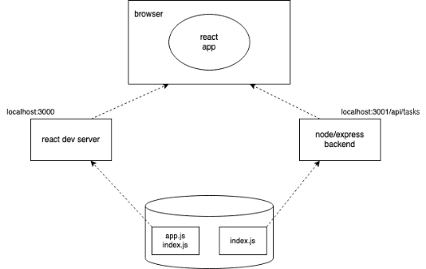
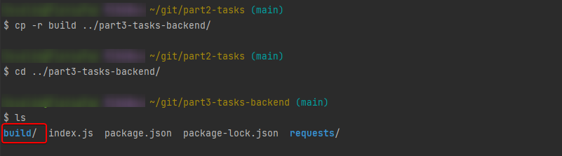
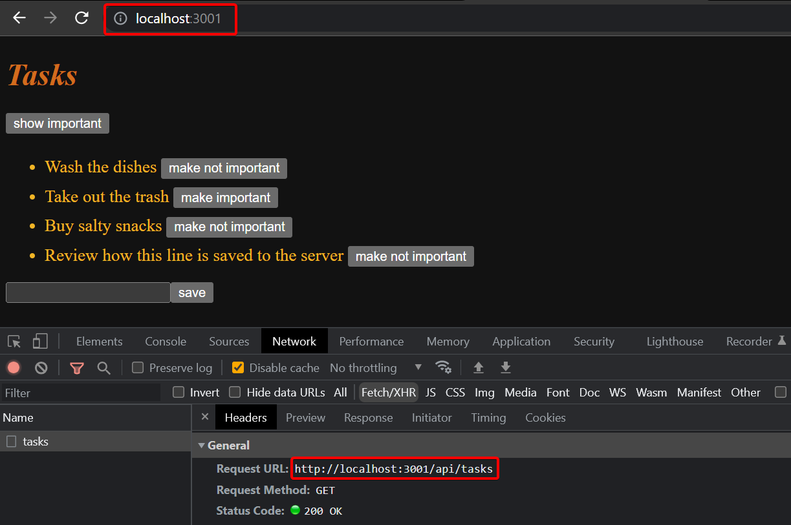
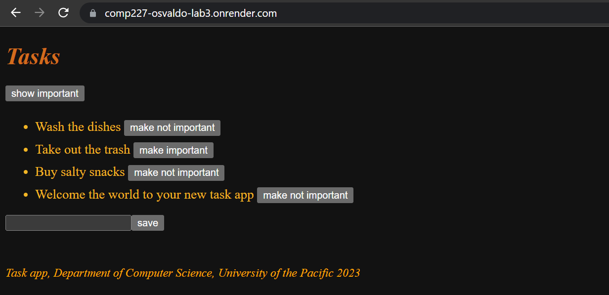

<div class="content">

Next, let's connect the frontend we made in [part 2](/part2) to our own backend.

In the previous part, the frontend could ask for the list of tasks from the json-server we had as a backend, from the address <http://localhost:3001/tasks>.
Our backend has a slightly different URL structure now, as the tasks can be found at <http://localhost:3001/api/tasks>.
Let's change the attribute `baseUrl` in the *src/services/tasks.js* like so:

```js
import axios from 'axios'
const baseUrl = 'http://localhost:3001/api/tasks' //highlight-line

const getAll = () => {
  const request = axios.get(baseUrl)
  return request.then(response => response.data)
}

// ...

export default { getAll, create, update }
```

Now frontend's GET request to <http://localhost:3001/api/tasks> does not work for some reason:


What's going on here?
We can access the backend from a browser and from postman without any problems.

### Same origin policy and CORS

The issue lies with a thing called `same origin policy`. A URL's origin is defined by the combination of protocol (AKA scheme), hostname, and port.

```text
http://example.com:80/index.html
  
protocol: http
host: example.com
port: 80
```

When you visit a website (i.e <http://catwebsites.com>), the browser issues a request to the server on which the webiste (catwebsites.com) is hosted.
The response sent by the server is an HTML file that may contain one or more references to external assets/resources hosted
either on the same server that *catwebsites.com* is hosted on or a different website.
When the browser sees reference(s) to a URL in the source HTML, it issues a request.
If the request is issued using the URL that the source HTML was fetched from, then the browser processes the response without any issues.
However, if the resource is fetched using a URL that doesn't share the same origin(scheme, host, port) as the source HTML,
the browser will have to check the `Access-Control-Allow-origin` response header.
If it contains `*` or the URL of the source HTML, the browser will process the response, otherwise the browser will refuse to process it and throw an error.
  
The **same-origin policy** is a security mechanism implemented by browsers in order to prevent session hijacking among other security vulnerabilities.

In order to enable legitimate cross-origin requests (requests to URLs that don't share the same origin),
W3C came up with a mechanism called <strong>CORS</strong>(Cross-Origin Resource Sharing).
According to [Wikipedia](https://en.wikipedia.org/wiki/Cross-origin_resource_sharing):

> *Cross-origin resource sharing (CORS) is a mechanism that allows restricted resources (e.g. fonts)
  on a web page to be requested from another domain outside the domain from which the first resource was served.
  A web page may freely embed cross-origin images, stylesheets, scripts, iframes, and videos.
  Certain "cross-domain" requests, notably Ajax requests, are forbidden by default by the same-origin security policy.*

The problem is that, by default, the JavaScript code of an application that runs in a browser can only communicate with a server in the same
[origin](https://developer.mozilla.org/en-US/docs/Web/Security/Same-origin_policy).
Because our server is in localhost port 3001, while our frontend is in localhost port 3000, they do not have the same origin.

Keep in mind, that [same-origin policy](https://developer.mozilla.org/en-US/docs/Web/Security/Same-origin_policy) and CORS are not specific to React or Node.
They are universal principles regarding the safe operation of web applications.

We can allow requests from other **origins** by using Node's [cors](https://github.com/expressjs/cors) middleware.

In your ***backend*** repository, install **cors** with the command

```bash
npm install cors
```

take the middleware to use and allow for requests from all origins:

```js
const cors = require('cors')

app.use(cors())
```

And the frontend works! However, the functionality for changing the importance of tasks has not yet been implemented on the backend.

You can read more about CORS from [Mozilla's page](https://developer.mozilla.org/en-US/docs/Web/HTTP/CORS).

The setup of our app looks now as follows:



The react app running in the browser now fetches the data from node/express-server that runs in [localhost:3001](http://localhost:3001).

### Application to the Internet

Now that the whole stack is ready, let's move our application to the internet.
Before we can do that though, we'll need to do a few things to set ourselves up.

#### Some backstory

So one thing that most businesses look for is to separate working on the code
and sharing what you are working on with **deploying** or sending the changes to a live web server.
For us to have a separate place that is *"live"*,
we will need to create a separate **deploy staging area** between uploading changes to a shared repository that everyone can see.
To better illustrate this, let me present to you this awful drawing of what we have so far.


In this diagram, the term "`You`" represents the work that is on your computer in vs code,
while `comp227/git` is your lab repo on GitHub that has your handle name.
When you click `Sync changes`, in VSCode, that causes your changes to be synced with this repository that is on comp 127.
That repo can be shared across different folks and devices.
Think of a shared repository as something that ends up storing your work, like a google drive,
but with a way of better keeping track of different versions of your code.

What we need then, is a way of uploading that code to an actual server that will serve web pages.
Something that is accessible by the rest of the internet, so that other folks can see the actual webpage,
rather than just the assortment of files that are in your repo.
So what we need to figure out is something like this.


While we could create something that auto-magically will upload our changes from git to the web server (which would be awesome),
we run into another small issue.
How do we differentiate between sharing code with folks (or even with ourselves as we are working on it
versus having something that we want to deploy to the outside world?)  


We can't just have an automatic link between the GitHub server and the web server,
since we may want to share something on the GitHub server with our team members but do not want to share it with the world just yet.
Instead, we'll need to have a separate **deploy** step that involves us deploying the code to the web.
While there are many ways of having this be separated,
we are going to follow a workflow that fits with our permissions and circumstances.  
What we are going to do is to have a **fork** of our comp227 repo that we will place into our personal account.
This fork will merely exist to connect to a web server.
**We should not push any code to our personal repo.**
We will only use our personal fork for deployment.
That way, we can still share code and yet have a "one-click" way of deploying our code to the web.
So what our final diagram will look like is something like this.


So that is what we are going to set up next.

## Setting up the fork of our project

Here we are going to go to GitHub to set up a fork.
Remember that the fork's job is merely to interact with the web server.
We will never commit code directly to this fork.
The fork though can sync with the your commit repo in 227 and when it does sync, the web server will be updated magically.
Up until this point we have not talked about forks or your repos, as we want to make sure that you setup and commit code to the 227 repo from Webstorm.

To set up a fork, merely go to the comp227 webpage from your repo.  This can be accessed if you go to `github.com/comp227/lab3-yourusername`

Once there, you will see a fork button at the upper right, with a picture similar to this:


Once you click **Fork**, you'll be presented with another intermediate page.
I would change the name of the repo to so that it has the word deploy and confirm the fork will be in your personal account.
Once you're ready, click the **Create fork** button at the bottom.


Notice that your fork will be out of your own GitHub handle and not be from 227.
Remember that when you make changes to your repo, if you'd like to deploy thme,
you'll only ever to your fork and sync the changes once everything is connected.


### Our rationale for using Render

There are an ever-growing number of services that can be used to host an app on the internet.
The developer-friendly services like PaaS (i.e. Platform as a Service) take care of installing the execution environment (e.g. Node.js)
and could also provide various services such as databases.

For a decade, [Heroku](http://heroku.com) was dominating the PaaS scene.
Unfortunately, Heroku's free tier ended at 27th November 2022.
This is very unfortunate for many developers, especially students.
They do have [a student program](https://www.heroku.com/students) that provides some free credits, but I would advise against it.

While there are replacements for Heroku that could work with this course like:

- [Fly.io](https://fly.io)
- [Railway](https://railway.app/)
- [Cyclic](https://www.cyclic.sh/)
- [Replit](https://replit.com)
- [CodeSandBox](https://codesandbox.io)

We will be using [Render](https://render.com/) in this class, because:

- They have a free option
- They do not require a credit card

One downside that we have with Render is that we'll need to create an extra step to make it work.

So let's get ourselves started in using Render

### Using Render

To start, go to the [Render website](https://render.com/) and create an account.
When creating an account you can either connect it automatically to your GitHub or you can provide them with an email.
Connecting an account that is linked to your GitHub profile removes one step later on about authenticating.
For now, I'll assume you are using an email - in that case you'll need to confirm your email address.

Once you confirm and successfully create your account, go to <http://dashboard.render.com>.

From the dashboard, you'll create a ***New Web Service***.


If you created your account with an email, at this point, you'll select the option to **connect a GitHub account**.
You'll then go through a series of pages that prompt you to authorize Render to access your GitHub account, including entering your GitHub password.
Once you get back to Render, if you linked your account correctly, you should see your repos with purple connect button to the side of each one.


Click the connect button for your forked repo.
You'll then be taken to a page to place all of your options to deploy the page.
Here's the changes I made, since the Branch should be main, and environment should be node.

```js
name: comp227-osvaldo-part3

Build Command: npm install
Start Command: npm start
```

Then scroll all the way down to the bottom and click ***Create Web Service***.
At that point, go take a walk outside and then come back.
Once it's deployed, you'll see your link for your live site.

Render recently changed their pricing model, but has a limit on the number of build minutes,
so it will be important not to keep deploying every time you make a change and to treat it like many web servers do (thoroughly checking and testing things)

Also, you are given build minutes ***to have one web service up at a time***.
There is an option to suspend a web service by clicking on it from the dashboard.

For many PaaS services, we need to change the definition of the port our application uses at the bottom of the *index.js* file like so:

```js
const PORT = process.env.PORT || 3001  // highlight-line
app.listen(PORT, () => {
  console.log(`Server running on port ${PORT}`)
})
```

Now we are using the port defined in the [environment variable](https://en.wikipedia.org/wiki/Environment_variable) `PORT` or port 3001 if the environment variable `PORT` is undefined.
Many cloud services configure the application port based on that environment variable.

If you run into problems with the first run through, you may have to select ***Manual Deploy*** and try it again.
Realize that this part of the course is the most unstable at this point.
Please ask for help on Discord!

If your build keeps failing due to unhealthy checks,
make sure that you have changed the bottom of the *index.js* file like so:

```js
const PORT = process.env.PORT || 3001  // highlight-line
app.listen(PORT, () => {
  console.log(`Server running on port ${PORT}`)
})
```

Don't forget to add your *cors* package to `dependencies` in *package.json*
and you might need to remove the `morgan` code from the server application.

If everything went well, the application works:


The frontend can also work with the backend on Render!

You can check this by changing the backend's address on the frontend to be the backend's address in Render instead of [localhost:3001](http://localhost:3001).

The next question is, how do we deploy the frontend to the Internet?
We have multiple options.
Let's go through one of them next.

### Frontend production build

So far we have been running React code in **development mode**.
In development mode the application is configured to give clear error messages, immediately render code changes to the browser, and so on.

When the application is deployed, we must create a [production build](https://reactjs.org/docs/optimizing-performance.html#use-the-production-build)
or a version of the application which is optimized for production.

A production build of applications created with *create-react-app* can be created with the command
[npm run build](https://github.com/facebookincubator/create-react-app#npm-run-build-or-yarn-build).

Let's run this command from the ***root of the frontend project***.

This creates a directory called *build* (which contains the only HTML file of our application, *index.html* ) which contains the directory *static*.
[Minified](<https://en.wikipedia.org/wiki/Minification_(programming)>) version of our application's JavaScript code will be generated in the *static* directory.
Even though the application code is in multiple files, all of the JavaScript will be minified into one file.
All of the code from all of the application's dependencies will also be minified into this single file.

The minified code is not very readable.
The beginning of the code looks like this:

```js
!function(e){function r(r){for(var n,f,i=r[0],l=r[1],a=r[2],c=0,s=[];c<i.length;c++)f=i[c],o[f]&&s.push(o[f][0]),o[f]=0;for(n in l)Object.prototype.hasOwnProperty.call(l,n)&&(e[n]=l[n]);for(p&&p(r);s.length;)s.shift()();return u.push.apply(u,a||[]),t()}function t(){for(var e,r=0;r<u.length;r++){for(var t=u[r],n=!0,i=1;i<t.length;i++){var l=t[i];0!==o[l]&&(n=!1)}n&&(u.splice(r--,1),e=f(f.s=t[0]))}return e}var n={},o={2:0},u=[];function f(r){if(n[r])return n[r].exports;var t=n[r]={i:r,l:!1,exports:{}};return e[r].call(t.exports,t,t.exports,f),t.l=!0,t.exports}f.m=e,f.c=n,f.d=function(e,r,t){f.o(e,r)||Object.defineProperty(e,r,{enumerable:!0,get:t})},f.r=function(e){"undefined"!==typeof Symbol&&Symbol.toStringTag&&Object.defineProperty(e,Symbol.toStringTag,{value:"Module"})
```

### Serving static files from the backend

There are many options for deploying the frontend.
We will:

1. copy the production build (that *build* directory) from frontend
2. paste it in the root of the backend repository and
3. configure the backend to show the frontend's ***main page*** (the file *build/index.html*) as the **backend's main page**.

We begin by copying the production build of the frontend to the root of the backend.
The copying can be done from the frontend directory by opening up the terminal in Webstorm from the frontend's project and then typing:

```bash
cp -r build ../tasks-backend_OR_NAME_OF_YOUR_BACKEND_DIR
```

Otherwise, simply copy and paste.

The backend directory should now look as follows:



To make express show **static content**, the page *index.html* and the JavaScript, etc., it fetches,
we need a built-in middleware from express called [static](http://expressjs.com/en/starter/static-files.html).

Then we add the following amidst the declarations of middlewares

```js
app.use(express.static('build'))
```

whenever express gets an HTTP GET request it will first check if the *build* directory contains a file corresponding to the request's address.
If a correct file is found, express will return it.

Now HTTP GET requests to the address ***www.serversaddress.com/index.html*** or ***www.serversaddress.com*** will show the React frontend.
GET requests to the address ***www.serversaddress.com/api/tasks*** will be handled by the backend's code.

Because of our situation, both the frontend and the backend are at the same address,
we can declare `baseUrl` in frontend's *services/tasks* as a [relative](https://www.w3.org/TR/WD-html40-970917/htmlweb.html#h-5.1.2) URL.
This means we can leave out the part declaring the server.

```js
import axios from 'axios'
const baseUrl = '/api/tasks' // highlight-line

const getAll = () => {
  const request = axios.get(baseUrl)
  return request.then(response => response.data)
}

// ...
```

After the change, we have to ***create a new production build and copy it to the root of the backend repository***.

The application can now be used from the *backend* address <http://localhost:3001>:


Our application now works exactly like the [single-page app](/part0/fundamentals_of_web_apps#single-page-app) example application we studied in part 0.

When we use a browser to go to the address <http://localhost:3001>, the server returns the *index.html* file from the *build* repository.
The summarized contents of the file are as follows:

```html
<head>
  <meta charset="utf-8"/>
  <title>React App</title>
  <link href="/static/css/main.f9a47af2.chunk.css" rel="stylesheet">
</head>
<body>
  <div id="root"></div>
  <script src="/static/js/1.578f4ea1.chunk.js"></script>
  <script src="/static/js/main.104ca08d.chunk.js"></script>
</body>
</html>
```

The file contains instructions to fetch a CSS stylesheet defining the styles of the application,
and two `script` tags that instruct the browser to fetch the JavaScript code of the application - the actual React application.

The React code fetches tasks from the server address <http://localhost:3001/api/tasks> and renders them to the screen.
The communications between the server and the browser can be seen in the ***Network*** tab of the developer console:



The setup that is ready for a product deployment looks as follows:


Unlike when running the app in a development environment,
everything is now in the same node/express-backend that runs in [localhost:3001](http://localhost:3001).
When the browser goes to the page, the file *index.html* is rendered.
That causes the browser to fetch the product version of the React app.
Once it starts to run, it fetches the json-data from the address [localhost:3001/api/tasks](http://localhost:3001/api/tasks).

### The whole app to the internet

After ensuring that the production version of the application works locally,
add and commit the production build of the frontend to the backend repository, and push the code to GitHub.
To then deploy, go back to your personal fork of the repo, and click the Sync Fork button.

Remember, if the automatic deployment does not work, you may need to select the ***Manual Deploy*** from the Render dashboard.

[The application](https://comp227-osvaldo-lab3.onrender.com/) works perfectly,
except we haven't added the functionality for changing the importance of a task to the backend yet.



Our application saves the tasks to a variable.
If the application crashes or is restarted, all of the data will disappear.

The application needs a database.
Before we introduce one, let's go through a few things.

The setup looks like now as follows:


The node/express-backend now resides in the Render server.
When the root address that is of the form <https://comp227-osvaldo-lab3.onrender.com/> is accessed,
the browser loads and executes the React app that fetches the json-data from the Render server.

### Streamlining deploying of the frontend

To create a new production build of the frontend without some of the extra manual work,
let's add some npm-scripts to the ***backend's package.json***.

```json
{
    "scripts": {
        //...
    "build:ui": "rm -rf build && cd ../part2-tasks/ && npm run build && cp -r build ../tasks-backend",
    "deploy": "npm run build:ui && git add . && git commit -m npm_generated_rebuild_of_the_UI && git push",
  }
}
```

Re-examine the text above. Make sure to modify the names of your directories to match your repos.

The script `npm run build:ui` builds the frontend and copies the production version under the backend repository.
`npm run deploy` releases the current backend and pushes it to GitHub.
You'll just need the final step of syncing your personal fork with what is in COMP 227 to get it to upload to Render.

Notice that the directory paths in the script `build:ui` depend on the location of repositories in the file system.

### Proxy

Changes on the frontend have caused it to no longer work in development mode (when started with command `npm start`),
as the connection to the backend does not work,
which you'll also have to start as well.


This is due to changing the backend address to a relative URL:

```js
const baseUrl = '/api/tasks'
```

Because in development mode the frontend is at the address [localhost:3000](http://localhost:3000),
the requests to the backend go to the wrong address [localhost:3000/api/tasks](http://localhost:3000/api/tasks).
The backend is at [localhost:3001](http://localhost:3001).

If the project was created with create-react-app, this problem is easy to solve.
It is enough to add the following declaration to the ***frontend's*** *package.json* file.

```bash
{
  "dependencies": {
    // ...
  },
  "scripts": {
    // ...
  },
  "proxy": "http://localhost:3001"  // highlight-line
}
```

After a restart, the React development environment will work as a [proxy](https://create-react-app.dev/docs/proxying-api-requests-in-development/).
If the React code does an HTTP request to a server address at *<http://localhost:3000>* not managed by the React application itself
(i.e. when requests are not about fetching the CSS or JavaScript of the application),
the request will be redirected to the server at *<http://localhost:3001>*.

Now the frontend is also fine, working with the server both in development- and production mode.

A negative aspect of our approach is how complicated it is to deploy the frontend.
Deploying a new version requires generating a new production build of the frontend and copying it to the backend repository.
This makes creating an automated [**deployment pipeline**](https://martinfowler.com/bliki/DeploymentPipeline.html) more difficult.
A deployment pipeline is an automated and controlled way to move the code from the computer of the developer through different tests and quality checks to the production environment.

There are multiple ways to achieve this - for example placing both backend and frontend code
[in the same repository](https://github.com/mars/heroku-cra-node) - but we will not go into those now.

In some situations, it may be sensible to deploy the frontend code as its own application.
With apps created with create-react-app it is [straightforward](https://github.com/mars/create-react-app-buildpack).

The current backend code can be found on [Github](https://github.com/comp227/part3-tasks-backend/tree/part3-3),
in the branch *part3-3*.
The changes in frontend code are in *part3-3* branch of the [frontend repository](https://github.com/comp227/part2-tasks/tree/part3-3).

</div>

<div class="tasks">

### Exercises 3.9-3.11

The following exercises don't require many lines of code.
They can however be challenging, because you must understand exactly what is happening and where, and the configurations must be just right.

#### 3.9 communities backend step9

Make the backend work with the communities frontend from the exercises of the previous part.
Do not implement the functionality for making changes to the URLs yet, that will be implemented in exercise 3.17.

You will probably have to do some small changes to the frontend, at least to the URLs for the backend.
Remember to keep the developer console open in your browser.
If some HTTP requests fail, you should check from the ***Network*** tab what is going on.
Keep an eye on the backend's console as well.
If you did not do the previous exercise, it is worth it to print the request data or `request.body` to the console in the event handler responsible for POST requests.

#### 3.10 communities backend step10

Deploy the backend to the internet.

Test the deployed backend with a browser and Postman or VS Code REST client to ensure it works.

**PRO TIP:** When you deploy your application to the cloud,
it is worth it to at least in the beginning keep an eye on the logs in render.

One such problem that you'll see arises is that npm will complain that it cannot find application dependency *express*:

The reason would be that the *express* package has not been installed with the `npm install express` command,
so information about the dependency was not saved to the file *package.json*.

Another typical problem is that the application is not configured to use the port set to the environment variable `PORT`.

Create a README.md at the root of your repository, and add a link to your online application to it.

#### 3.11 Communities full stack

Generate a production build of your frontend, and add it to the internet application using the method introduced in this part.

**NB** Make sure the directory *build* is not gitignored

Also, make sure that the frontend still works locally (in development mode when started with command `npm start`).

If you have problems getting the app working make sure that your directory structure matches
[the example app](https://github.com/comp227/part3-tasks-backend/tree/part3-3).

</div>
