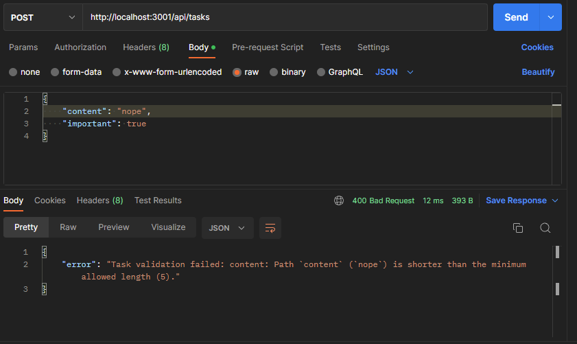
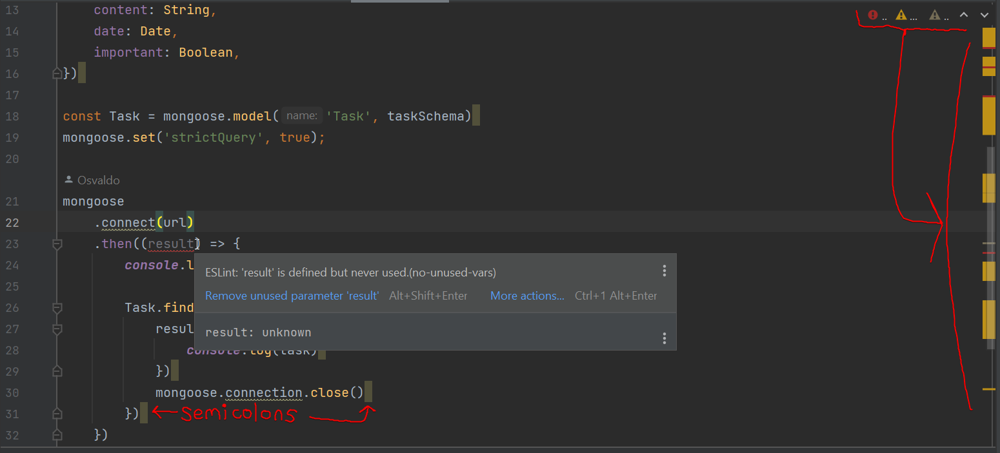

<div class="content">

There are usually constraints that we want to apply to the data that is stored in our application's database.
As an example, our application shouldn't accept tasks that have a missing or empty `content` property.
The validity of the task is checked in the route handler:

```js
app.post('/api/tasks', (request, response) => {
  const body = request.body
  // highlight-start
  if (body.content === undefined) {
    return response.status(400).json({ error: 'content missing' })
  }
  // highlight-end

  // ...
})
```

If the task does not have the `content` property, we respond to the request with the status code **400 bad request**.

One smarter way of validating the format of the data before it is stored in the database is to use the
[validation](https://mongoosejs.com/docs/validation.html) functionality available in Mongoose.

We can define specific validation rules for each field in the schema:

```js
const taskSchema = new mongoose.Schema({
  // highlight-start
  content: {
    type: String,
    minLength: 5,
    required: true
  },
  date: { 
    type: Date,
    required: true
  },
  // highlight-end
  important: Boolean
})
```

The `content` field is now required to be at least five characters long.
The `date` field is set as required, meaning that it can not be missing.
The same constraint is also applied to the `content` field since the minimum length constraint allows the field to be missing.
We have not added any constraints to the `important` field, so its definition in the schema has not changed.

The `minLength` and `required` validators are [built-in](https://mongoosejs.com/docs/validation.html#built-in-validators) and provided by Mongoose.
The Mongoose [custom validator](https://mongoosejs.com/docs/validation.html#custom-validators) functionality
allows us to create new validators if none of the built-in ones cover our needs.

If we try to store an object in the database that breaks one of the constraints, the operation will throw an exception.
Let's change our handler for creating a new task so that it passes any potential exceptions to the error handler middleware:

```js
app.post('/api/tasks', (request, response, next) => { // highlight-line
  const body = request.body

  const task = new Task({
    content: body.content,
    important: body.important || false,
    date: new Date(),
  })

  task.save()
    .then(savedTask => {
      response.json(savedTask)
    })
    .catch(error => next(error)) // highlight-line
})
```

Let's expand the error handler to deal with these validation errors:

```js
const errorHandler = (error, request, response, next) => {
  console.error(error.message)

  if (error.name === 'CastError') {
    return response.status(400).send({ error: 'malformatted id' })
  } else if (error.name === 'ValidationError') { // highlight-line
    return response.status(400).json({ error: error.message }) // highlight-line
  }

  next(error)
}
```

When validating an object fails, we return the following default error message from Mongoose:



We may notice that the backend has now a problem: ***validations are not done when editing a task***.
The [documentation](https://github.com/blakehaswell/mongoose-unique-validator#find--updates) explains what is the problem:
validations are not run by default when `findOneAndUpdate` is executed.

The fix is easy.
Let us also reformulate the route code a bit:

```js
app.put('/api/tasks/:id', (request, response, next) => {
  const { content, important } = request.body // highlight-line

  Task.findByIdAndUpdate(
    request.params.id, 
    { content, important }, // highlight-line
    { new: true, runValidators: true, context: 'query' } // highlight-line
  ) 
    .then(updatedTask => {
      response.json(updatedTask)
    })
    .catch(error => next(error))
})
```

### Deploying the database backend to production

The application should work almost as-is in Render.
We do have to generate a new production build of the frontend since changes thus far were only on our backend.

Render does a nice job of allowing us to keep the environment variables that we want to pull in from production so that it keeps the same structure as our dev environment.
With the secret file, the environment variables we define will be used, so we can try our best to mirror both what is on Render and what we have on our machine.

**The application should now work.**

Sometimes things don't go according to plan.
If there are problems, looking at Render's logs, which are in the left-hand navigation of your web service will help.
As I was going through and working on this, my own application didn't work after making some changes.
Here's what render's logs showed:


In my case, after scrolling through the logs, I noticed that my URL was not defined.
Then I realized that I forgot to save the secret file that I took screenshots of from earlier in this part. 😔

With many of our problems, when we are learning material we sometimes get to problems that feel catastrophic.
Do not despair and stay cool.
Most of the time,
there are simple reasons for our programs behaving in ways that we were hoping wouldn't occur.
Your logs are vital to helping you analyze what could potentially be awry.

You can find the code for our current application in its entirety in the *part3-6* branch of
[this GitHub repository](https://github.com/comp227-hy2019/part3-tasks-backend/tree/part3-6).

</div>

<div class="tasks">

### Exercises 3.19-3.21

#### 3.19*: Communities database, step7

Expand the validation so that the name stored in the database has to be at least three characters long.

Expand the frontend so that it displays some form of error message when a validation error occurs.
Error handling can be implemented by adding a `catch` block as shown below:

```js
groupService
    .create({ ...
})
    .then(createdGroup => {
      // ...
    })
    .catch(error => {
      // this is the way to access the error message
      console.log(error.response.data.error)
    })
```

You can display the default error message returned by Mongoose, even though they are not as readable as they could be:


**NB:** On update operations, mongoose validators are off by default.
[Read the documentation](https://mongoosejs.com/docs/validation.html) to determine how to enable them.

#### 3.20*: Communities database, step8

Add validation to your communities application, which will make sure that community links are of the correct form.

A community link must

- start with `https://` and then either have **discord.com/invite** or **discord.gg** as part of its URL. (I was going to have you add slack, but decided against it)
- end with 6-10 more letters (both upper case and lowercase) or numbers, but not more than 10 of them.
    - e.g. <https://discord.com/invite/yNhmmsPBT8> and and <https://discord.gg/9BXyDG> are valid community links
    - e.g. discord.gg/9BXyDG, <https://reddit.com> and <https://something.discord.gg/9BXyDG> are invalid

Use a [Custom validator](https://mongoosejs.com/docs/validation.html#custom-validators) to implement the second part of the validation.

If an HTTP POST request tries to add a name that is already in the communities app,
the server must respond with an appropriate status code and error message.

#### 3.21 Deploying the database backend to production

Generate a new "comp227" version of the application by creating a new production build of the frontend, and copying it to the backend repository.
Verify that everything works locally by using the entire application from the address <http://localhost:3001/>.

Push the latest version to Render and verify that everything works there as well.

</div>

<div class="content">

### Lint

Before we move on to the next part, we will take a look at an important tool called [**lint**](<https://en.wikipedia.org/wiki/Lint_(software)>).
Wikipedia says the following about lint:

> *Generically, lint or a linter is any tool that detects and flags errors in programming languages, including stylistic errors.
  The term lint-like behavior is sometimes applied to the process of flagging suspicious language usage.
  Lint-like tools generally perform static analysis of source code.*

In compiled statically typed languages like Java, IDEs like NetBeans can point out errors in the code, even ones that are more than just compile errors.
Additional tools for performing [static analysis](https://en.wikipedia.org/wiki/Static_program_analysis) like [checkstyle](https://checkstyle.sourceforge.io),
can be used for expanding the capabilities of the IDE to also point out problems related to style, like indentation.

In the JavaScript universe, the current leading tool for static analysis aka.
"linting" is [ESlint](https://eslint.org/).

Let's install ESlint as a development dependency to the backend project with the command:

```bash
npm install eslint --save-dev
```

After this we can initialize a default ESlint configuration with the command:

```bash
npx eslint --init
```

We will answer all of the questions:


The configuration will be saved in the *.eslintrc.js* file:

```js
module.exports = {
    "env": {
        "browser": true,
        "commonjs": true,
        "es2021": true
    },
    "extends": "eslint:recommended",
    "parserOptions": {
        "ecmaVersion": "latest"
    },
    "rules": {
        "indent": [
            "error",
            4
        ],
        "linebreak-style": [
            "error",
            "unix"
        ],
        "quotes": [
            "error",
            "double"
        ],
        "semi": [
            "error",
            "always"
        ]
    }
};
```

Let's change the rule concerning semicolons so that it only raises a warning and not an error.
You can also change the rule regarding indentation or others like the linebreak style if you are using windows.
I had to change my configuration a little bit this first time around, and that's fine.
The point is to be consistent.

```js
"semi": [
    "warn",
    "always"
],
```

Inspecting and validating a file like *index.js* can be done with the following command:

```bash
npx eslint index.js
```

It is recommended to create some separate `npm script` for linting:

```json
{
  // ...
  "scripts": {
    "start": "node index.js",
    "dev": "nodemon index.js",
    // ...
    "lint": "eslint .", // highlight-line
    "lint:fix": "nprum run lint -- --fix" // highlight-line
  },
  // ...
}
```

Now the `npm run lint` command will check every file in the project, while `npm run lint:fix` can automatically go through and fix all of the errors.

Also, the files in the *build* directory get checked when the command is run.
We do not want this to happen, and we can accomplish this by creating a [.eslintignore](https://eslint.org/docs/user-guide/configuring#ignoring-files-and-directories)
file in the project's root with the following contents:

```bash
build
```

This causes the entire *build* directory to not be checked by ESlint.

Lint has quite a lot to say about our code, much of which can be easily fixed.


Let's not fix these issues just yet.

I like having the `lint:fix` option to go through and problems ESlint can fix by itself (like semicolons, line endings and spacing),
but a convenient alternative to the command line is to configure WebStorm to use ESLint so that you run the linter continuously.
By using WebStorm you will see errors in your code immediately.
Let's turn that on now by going to Settings (***Ctrl-Alt-S***) and typing `lint`,
which should take you to the Page ***Languages & Frameworks->JavaScript->Code Quality Tools->ESLint***
Once you are in the ESLint setting select the ***Automatic ESLint configuration*** option and mark the checkbox below that says ***Run eslint --fix on save***.

Once you click OK, Webstorm will underline style violations with a red line and will highlight other problems as well.



Some of those can be solved merely by saving the file (if we checked the ***Run eslint --fix on save*** option).
Here's how it looks after I added I pressed ***Spacebar*** and then saved via ***Ctrl-S***.

Any errors like the missing semicolon will be applied by ESlint.
This makes the other errors easy to spot and fix right away.


ESlint has a vast array of [rules](https://eslint.org/docs/rules/) that are easy to take into use by editing the *.eslintrc.js* file.

Let's add the [eqeqeq](https://eslint.org/docs/rules/eqeqeq) rule that warns us if equality is checked with anything other than `===` (like `==`).
The rule is added under the `rules` field in the configuration file.

```js
{
  // ...
  'rules': {
    // ...
   'eqeqeq': 'error',
  },
}
```

While we're at it, let's make a few other changes to the rules.

Let's prevent unnecessary [trailing spaces](https://eslint.org/docs/rules/no-trailing-spaces) at the ends of lines,
let's require that [there is always a space before and after curly braces](https://eslint.org/docs/rules/object-curly-spacing),
and let's also demand a consistent use of whitespaces in the function parameters of arrow functions.

```js
{
  // ...
  'rules': {
    // ...
    'eqeqeq': 'error',
    'no-trailing-spaces': 'error',
    'object-curly-spacing': [
        'error', 'always'
    ],
    'arrow-spacing': [
        'error', { 'before': true, 'after': true }
    ]
  },
}
```

Our default configuration takes a bunch of predetermined rules into use from `eslint:recommended`:

```bash
'extends': 'eslint:recommended',
```

This includes a rule that warns about *console.log* commands.
[Disabling](https://eslint.org/docs/user-guide/configuring#configuring-rules) a rule can be accomplished by
defining its "value" as 0 in the configuration file.
Let's do this for the `no-console` and `no-debugger` rules in the meantime,
since we are learning and not intending to ship anything just yet.

```json
{
  // ...
  'rules': {
    // ...
    'eqeqeq': 'error',
    'no-trailing-spaces': 'error',
    'object-curly-spacing': [
        'error', 'always'
    ],
    'arrow-spacing': [
        'error', { 'before': true, 'after': true }
    ],
    'no-console': 0 // highlight-line
    'no-debugger': 0 // highlight-line
  },
}
```

To fix the remaining issues in the code, you can leverage WebStorm's support by clicking at the ***more actions*** link in the error.
You can also use the keyboard shortcut shown to see a list of options for fixing the error.


Just pay careful attention as you go through and fix some of the errors to ensure that your program still works.

#### Supressing warnings and other tweaks

While ESlint and Webstorm are great, sometimes Webstorm or ESlint may not have a good solution for you either, as it has with us complaining about using the variable **`process`**.


In those cases, you may be tempted to use ***Suppress  'no-undef' for current line***.
Doing so leads to having a line for ESlint that looks like this just above the line.

```js
// eslint-disable-next-line no-undef // highlight-line

const password = process.argv[2];
```

If you use that suppression a lot, you'll end up for the file if it ends up generating too many comments for your file that deal with disabling ESlint rules.
At this point, you may end up thinking that you should use ESLint's rule to suppress the errors for the entire file to remove all those comments,
but now that could also leave you more exposed.
It's important with ESlint (and other tests) to be mindful of the errors so that you continue to have faith in seeing them as informative, instead of a hindrance.
You also want to make sure you have faith that ESlint will catch errors for you.
You need to keep a close balance between seeing it as being a hindrance and improving your code by maintaining a consistent style.
In this case, a better option than suppressing error messages (which you really should avoid at this point in your learning journey) is to search for any potential ways to resolve this.
It turns out that the best solution is not to do any suppression but to add this line to the top of your *eslintrc.js* file.

```json
'env': {
        'node': true, // highlight-line
        'browser': true,
```

Enabling node means that ESlint knows that we can use the `process` variable,
and allows you to rely on a system that has helped countless developers with similar situations who have come before you.

**NB** when you make changes to the *.eslintrc.js* file, play close attention to errors in there as well! Webstorm will highlight issues.
If there are, Webstorm will report the issues to you, and you can look at the terminal output to see more details about it.


Many companies define coding standards that are enforced throughout the organization through the ESlint configuration file.
It is not recommended to keep reinventing the wheel over and over again,
and it can be a good idea to adopt a ready-made configuration from someone else's project into yours.
Recently many projects have adopted the Airbnb [Javascript style guide](https://github.com/airbnb/javascript)
by taking Airbnb's [ESlint](https://github.com/airbnb/javascript/tree/master/packages/eslint-config-airbnb) configuration into use.

You can find the code for our current application in its entirety in the *part3-7* branch of
[this GitHub repository](https://github.com/comp227/part3-tasks-backend/tree/part3-7).
</div>

<div class="tasks">

### Exercise 3.22

#### 3.22: Lint configuration

Add ESlint to your application and fix all the warnings.

This was the last exercise of this part of the course. It's time to push your code to GitHub if you haven't already and mark the exercises that were completed on Canvas.

</div>
