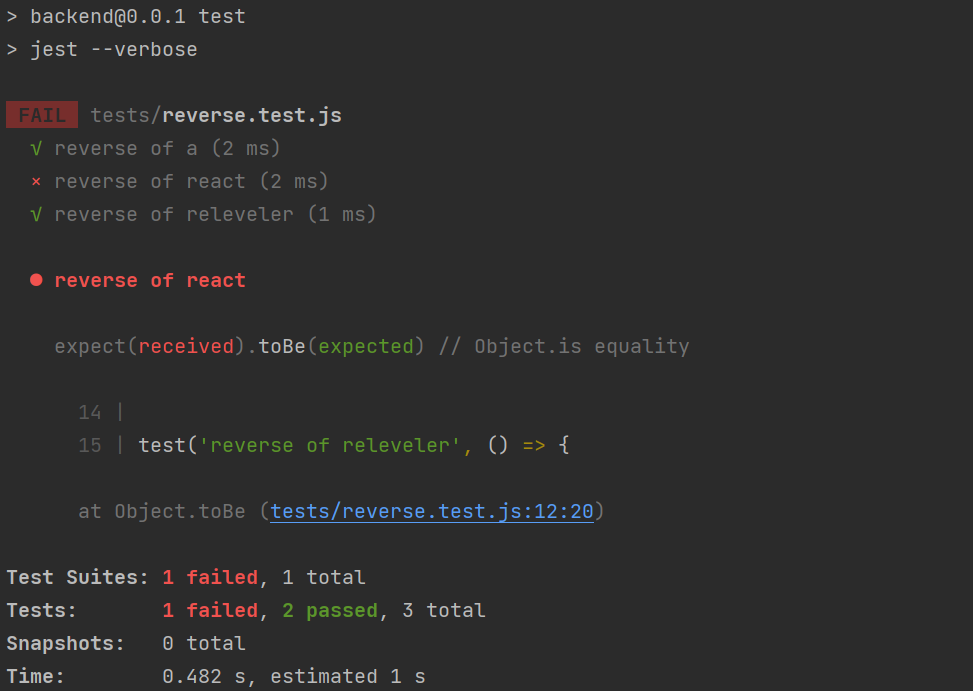

<div class="content">

Let's continue our work on the backend of the tasks application we started in [part 3](/part3).

### Project structure

Before we move into the topic of testing, we will modify the structure of our project to adhere to Node.js best practices.

The following section will be devoted to walking us through restructuring our project.
By the time we reach the [recap section](#directory-structure-recap), the directory structure of our project will look like this:

```bash
├── index.js
├── app.js
├── build
│   └── ...
├── controllers
│   └── tasks.js
├── models
│   └── task.js
├── package-lock.json
├── package.json
├── utils
│   ├── config.js
│   ├── logger.js
│   └── middleware.js  
```

Before we get started, know that when you ask Webstorm to make a file, and if type *`dir/file`*, Webstorm will automatically create the directory if it doesn't exist.
You just need to make sure the correct directory is selected before you begin.
Let's get started

#### utils/logger.js

So far we have been using `console.log` and we gently introduced `console.error` to print different information from the code.
However, there are better tricks we can use to [go beyond `console.log`](https://dev.to/stefirosca/7-tips-tricks-to-make-your-console-log-output-stand-out-389g).
Let's go one step closer to best practices and **separate all console printing to the module *utils/logger.js***

```js
const info = (...params) => {
  console.log(...params)
}

const error = (...params) => {
  console.error(...params)
}

module.exports = {
  info, error
}
```

The logger has two functions, **info** for printing normal log messages, and **error** for all error messages.

Extracting logging into its own module is a good idea in more ways than one.
If we wanted to start writing logs to a file or send them to an external logging service like [graylog](https://www.graylog.org/)
or [papertrail](https://papertrailapp.com) we would only have to make changes in one place.

#### index.js

The contents of the *index.js* file used for starting the application gets simplified as follows:

```js
const app = require('./app') // the actual Express application
const http = require('http')
const config = require('./utils/config')
const logger = require('./utils/logger')

const server = http.createServer(app)

server.listen(config.PORT, () => {
  logger.info(`Server running on port ${config.PORT}`)
})
```

The *index.js* file only imports the actual application from the *app.js* file and then starts the application.
The function `info` of the logger module is used for the console printout telling that the application is running.

#### utils/config.js

The handling of environment variables is extracted into a separate *utils/config.js* file:

```js
require('dotenv').config()

const PORT = process.env.PORT
const MONGODB_URI = process.env.MONGODB_URI

module.exports = {
  MONGODB_URI,
  PORT
}
```

The other parts of the application can access the environment variables by importing the configuration module:

```js
const config = require('./utils/config')

logger.info(`Server running on port ${config.PORT}`)
```

#### controllers/tasks.js

The route handlers have also been moved into a dedicated module.
The event handlers of routes are commonly referred to as **controllers**, and for this reason, we have created a new *controllers* directory.
All of the routes related to tasks are now in the *tasks.js* module under the *controllers* directory.

The contents of the *tasks.js* module are the following:

```js
const tasksRouter = require('express').Router()
const Task = require('../models/task')

tasksRouter.get('/', (request, response) => {
  Task.find({}).then(tasks => {
    response.json(tasks)
  })
})

tasksRouter.get('/:id', (request, response, next) => {
  Task.findById(request.params.id)
    .then(task => {
      if (task) {
        response.json(task)
      } else {
        response.status(404).end()
      }
    })
    .catch(error => next(error))
})

tasksRouter.post('/', (request, response, next) => {
  const body = request.body

  const task = new Task({
    content: body.content,
    important: body.important || false,
    date: new Date()
  })

  task.save()
    .then(savedTask => {
      response.json(savedTask)
    })
    .catch(error => next(error))
})

tasksRouter.delete('/:id', (request, response, next) => {
  Task.findByIdAndRemove(request.params.id)
    .then(() => {
      response.status(204).end()
    })
    .catch(error => next(error))
})

tasksRouter.put('/:id', (request, response, next) => {
  const body = request.body

  const task = {
    content: body.content,
    important: body.important,
  }

  Task.findByIdAndUpdate(request.params.id, task, { new: true })
    .then(updatedTask => {
      response.json(updatedTask)
    })
    .catch(error => next(error))
})

module.exports = tasksRouter
```

This is almost an exact copy-paste of our previous *index.js* file.

However, there are a few significant changes.
At the very beginning of the file, we create a new [router](http://expressjs.com/en/api.html#router) object:

```js
const tasksRouter = require('express').Router()

//...

module.exports = tasksRouter
```

The module exports the router to be available for all consumers of the module.

All routes are now defined for the router object, similar to what did before with the object representing the entire application.

It's worth noting that the paths in the route handlers have shortened.
In the previous version, we had:

```js
app.delete('/api/tasks/:id', (request, response) => {
```

And in the current version, we have:

```js
tasksRouter.delete('/:id', (request, response) => {
```

So what are these router objects exactly?
The Express manual provides the following explanation:

> *A router object is an isolated instance of middleware and routes.
  You can think of it as a “mini-application,” capable only of performing middleware and routing functions.
  Every Express application has a built-in app router.*

The router *is a* **middleware**, that can be used for defining "related routes" in a single place, which is typically placed in its own module.

#### app.js

The *app.js* file that creates the actual application takes the router into use as shown in this code snippet:

```js
const tasksRouter = require('./controllers/tasks')
app.use('/api/tasks', tasksRouter)
```

The router we defined earlier is used *if* the URL of the request starts with ***/api/tasks***.
For this reason, the tasksRouter object must only define the relative parts of the routes, i.e. the empty path `/` or just the parameter `/:id`.

After making these changes, our *app.js* file looks like this:

```js
const config = require('./utils/config')
const express = require('express')
const app = express()
const cors = require('cors')
const tasksRouter = require('./controllers/tasks')
const middleware = require('./utils/middleware')
const logger = require('./utils/logger')
const mongoose = require('mongoose').set('strictQuery', true)

logger.info('connecting to', config.MONGODB_URI)

mongoose.connect(config.MONGODB_URI)
  .then(() => {
    logger.info('connected to MongoDB')
  })
  .catch((error) => {
    logger.error('error connecting to MongoDB:', error.message)
  })

app.use(cors())
app.use(express.static('build'))
app.use(express.json())
app.use(middleware.requestLogger)

app.use('/api/tasks', tasksRouter)

app.use(middleware.unknownEndpoint)
app.use(middleware.errorHandler)

module.exports = app
```

The file takes different middleware into use, and one of these is the `tasksRouter` that is attached to the `/api/tasks` route.

#### utils/middleware.js

Our custom middleware has been moved to a new *utils/middleware.js* module:

```js
const logger = require('./logger')

const requestLogger = (request, response, next) => {
  logger.info('Method:', request.method)
  logger.info('Path:  ', request.path)
  logger.info('Body:  ', request.body)
  logger.info('---')
  next()
}

const unknownEndpoint = (request, response) => {
  response.status(404).send({ error: 'unknown endpoint' })
}

const errorHandler = (error, request, response, next) => {
  logger.error(error.message)

  if (error.name === 'CastError') {
    return response.status(400).send({ error: 'malformatted id' })
  } else if (error.name === 'ValidationError') {
    return response.status(400).json({ error: error.message })
  }

  next(error)
}

module.exports = {
  requestLogger,
  unknownEndpoint,
  errorHandler
}
```

The responsibility of establishing the connection to the database has been given to the *app.js* module.

#### models/task.js

The *task.js* file under the *models* directory only defines the Mongoose schema for tasks.

```js
const mongoose = require('mongoose')

const taskSchema = new mongoose.Schema({
  content: {
    type: String,
    required: true,
    minlength: 5
  },
  date: {
    type: Date,
    required: true,
  },
  important: Boolean,
})

taskSchema.set('toJSON', {
  transform: (document, returnedObject) => {
    returnedObject.id = returnedObject._id.toString()
    delete returnedObject._id
    delete returnedObject.__v
  }
})

module.exports = mongoose.model('Task', taskSchema)
```

### Directory Structure Recap

To recap, the directory structure looks like this after the changes have been made:

```bash
├── index.js
├── app.js
├── build
│   └── ...
├── controllers
│   └── tasks.js
├── models
│   └── task.js
├── package-lock.json
├── package.json
├── utils
│   ├── config.js
│   ├── logger.js
│   └── middleware.js  
```

For smaller applications, the structure does not matter that much.
Once the application starts to grow in size, you must establish a structure
and separate the different responsibilities of the application into separate modules.
This will make developing the application much easier.

There is no strict directory structure or file naming convention that is required for Express applications.
In contrast, other frameworks like Ruby on Rails do require a specific structure.
Our current structure merely tries to adhere to best practices (according to the internet).

You can find the code for our current application in its entirety in the *part4-1* branch of
[this GitHub repository](https://github.com/comp227/part3-tasks-backend/tree/part4-1).

If you clone the project for yourself, run the `npm install` command before starting the application with `npm start`.

### Notice about exports

We have used two different kinds of exports in this part.
Firstly, e.g. the file *utils/logger.js* does the export as follows:

```js
const info = (...params) => {
  console.log(...params)
}

const error = (...params) => {
  console.error(...params)
}

// highlight-start
module.exports = {
  info, error
}
// highlight-end
```

#### Exporting a bundled object

The file exports ***an object*** that has two fields, both of which are functions.
The functions can be used in two different ways.
The first option is to require the whole object and refer to functions through the object using the dot notation:

```js
const logger = require('./utils/logger')

logger.info('message')

logger.error('error message')
```

The other option is to destructure the functions to their own variables in the `require` statement:

```js
const { info, error } = require('./utils/logger')

info('message')
error('error message')
```

I would recommend using the latter option when only a small portion of those exported functions would be needed.

#### Exporting a single value

In file *controller/tasks.js*, exporting happens differently:

```js
const tasksRouter = require('express').Router()
const Task = require('../models/task')

// ...

module.exports = tasksRouter // highlight-line
```

In this case, there is just one *thing* exported, so the only way to use it is the following:

```js
const tasksRouter = require('./controllers/tasks')

// ...

app.use('/api/tasks', tasksRouter)
```

Now the exported *thing* (in this case a router object) is assigned to a variable and used as such.

</div>

<div class="tasks">

### Exercises 4.1-4.2

In the exercises for this part, we will be building a **Streaming Show list application**,
which allows users to save information about interesting shows they have stumbled across on the internet.
For each listed show we will save the title, genre, Streaming Service URL, and amount of upvotes from users of the application.
From here on, I will refer to a streaming show as a **show**.

#### 4.1 Show list, step1

Let's imagine a situation, where you receive an email that contains the following application body:

```js
const http = require('http')
const express = require('express')
const app = express()
const cors = require('cors')
const mongoose = require('mongoose')

const showSchema = new mongoose.Schema({
  title: String,
  genre: String,
  url: String,
  likes: Number
})

const Show = mongoose.model('Show', showSchema)

const mongoUrl = 'mongodb://localhost/showlist'
mongoose.connect(mongoUrl)

app.use(cors())
app.use(express.json())

app.get('/api/shows', (request, response) => {
  Show
    .find({})
    .then(shows => {
      response.json(shows)
    })
})

app.post('/api/shows', (request, response) => {
  const show = new Show(request.body)

  show
    .save()
    .then(result => {
      response.status(201).json(result)
    })
})

const PORT = 3003
app.listen(PORT, () => {
  console.log(`Server running on port ${PORT}`)
})
```

Turn the application into a functioning ***npm*** project.
To keep your development productive, configure the application to be executed with ***nodemon***.
You can create a new database for your application with MongoDB Atlas, or use the same database from the previous part's exercises.

Verify that it is possible to add shows to the list with Postman or the WebStorm REST client
and that the application returns the added shows at the correct endpoint.

#### 4.2 Show list, step2

Refactor the application into separate modules as shown earlier in this part of the course material.

**NB** refactor your application in baby steps and verify that the application works after every change you make.
If you try to take a "shortcut" by refactoring many things at once, then [Murphy's law](https://en.wikipedia.org/wiki/Murphy%27s_law)
will kick in and it is almost certain that something will break in your application.
The "shortcut" will end up taking more time than moving forward slowly and systematically.

This is part of why I keep enforcing you all to commit your code every time it is in a stable state.
It makes it easier to find what error caused your mistake.
This makes it easy to rollback to a situation where the application still works.

</div>

<div class="content">

### Testing Node applications

We have completely neglected one essential area of software development, and that is automated testing.

Let's start our testing journey by looking at unit tests.
The logic of our application is so simple, that there is not much that makes sense to test with unit tests.
Let's create a new file *utils/for_testing.js* and write a couple of simple functions that we can use for test writing practice:

```js
const reverse = (string) => {
  return string
    .split('')
    .reverse()
    .join('')
}

const average = (array) => {
  const reducer = (sum, item) => {
    return sum + item
  }

  return array.reduce(reducer, 0) / array.length
}

module.exports = {
  reverse,
  average,
}
```

> The `average` function uses the array [reduce](https://developer.mozilla.org/en-US/docs/Web/JavaScript/Reference/Global_Objects/Array/Reduce) method.
  If the method is not familiar to you yet, then now is a good time to watch the first three videos from the
  [Functional Javascript](https://www.youtube.com/watch?v=BMUiFMZr7vk&list=PL0zVEGEvSaeEd9hlmCXrk5yUyqUag-n84) series on Youtube.

There are many different testing libraries or **test runners** available for JavaScript.
In this course we will be using a testing library developed and used internally by Facebook called [jest](https://jestjs.io/),
which resembles the previous king of JavaScript testing libraries [Mocha](https://mochajs.org/).

Jest is a natural choice for this course, as it works well for testing backends, and it shines when it comes to testing React applications.

> ***Windows users:*** Jest may not work if the path of the project directory contains a directory that has spaces in its name.

Since tests are only executed during the development of our application, we will install `jest` as a development dependency with the command:

```bash
npm install jest --save-dev
```

Let's define the *npm script `test`* to execute tests with Jest and to report about the test execution with the `verbose` style:

```json
{
  //...
  "scripts": {
    "start": "node index.js",
    "dev": "nodemon index.js",
    "test": "echo \"Error: no test specified\" && exit 1",
    "build:ui": "rm -rf build && cd ../part2-tasks/ && npm run build && cp -r build ../part3-tasks-backend",
    "deploy": "npm run build:ui && git add . && git commit -m npm_generated_rebuild_of_the_UI && git push",
    "lint": "eslint .",
    "fixlint": "eslint . --fix",
    "test": "jest --verbose" // highlight-line
  },
  //...
}
```

Jest requires one to specify that the execution environment is Node.
This can be done by adding the following to the end of *package.json*:

```js
{
 //...
 "jest": {
   "testEnvironment": "node"
 }
}
```

Alternatively, Jest can look for a configuration file with the default name *jest.config.js*, where we can define the execution environment like this:

```js
module.exports = {
  testEnvironment: 'node',
}
```

Let's create a new file called *tests/reverse.test.js* with the following contents:

```js
const reverse = require('../utils/for_testing').reverse

test('reverse of a', () => {
  const result = reverse('a')

  expect(result).toBe('a')
})

test('reverse of react', () => {
  const result = reverse('react')

  expect(result).toBe('tcaer')
})

test('reverse of releveler', () => {
  const result = reverse('releveler')

  expect(result).toBe('releveler')
})
```

The ESLint configuration we added to the project in the previous part complains about the `test` and `expect` commands in our test file
since the configuration does not allow *globals*.
Let's get rid of the complaints by adding `"jest": true` to the `env` property in the *.eslintrc.js* file.

```js
module.exports = {
  'env': {
    'commonjs': true,
    'es2021': true,
    'browser': true,
    'node': true,
    'jest': true, // highlight-line
  },
  'extends': 'eslint:recommended',
  'parserOptions': {
    'ecmaVersion': 12
  },
  "rules": {
    // ...
  },
}
```

In the first row, the test file imports the function to be tested and assigns it to a variable called `reverse`:

```js
const reverse = require('../utils/for_testing').reverse
```

Individual test cases are defined with the `test` function.
The first parameter of the function is the *test description* as a string.
The second parameter is a *function that defines the functionality* for the test case.
The functionality for the second test case looks like this:

```js
() => {
  const result = reverse('react')

  expect(result).toBe('tcaer')
}
```

First, we execute the code to be tested, meaning that we generate a reverse for the string `react`.
Next, we verify the results with the [expect](https://jestjs.io/docs/expect#expectvalue) function.
Expect wraps the resulting value into an object that offers a collection of **matcher** functions, that can be used for verifying the correctness of the result.
Since in this test case we are comparing two strings, we can use the [toBe](https://jestjs.io/docs/expect#tobevalue) matcher.

As expected, all of the tests pass:


Jest expects by default that the names of test files contain *.test*.
In this course, we will follow the convention of naming our test files with the extension *.test.js*.

Jest has excellent error messages, let's break our `reverse of react` test to demonstrate this by changing the expected result from `tcaer` to the incorrect `8caer` (line 12).

```js
  expect(result).toBe('8caer')
```

Running the tests above results in the following error message:



Change the test back.

Let's add a few tests for the `average` function, into a new file *tests/average.test.js*.

```js
const average = require('../utils/for_testing').average

describe('average', () => {
  test('of one value is the value itself', () => {
    expect(average([1])).toBe(1)
  })

  test('of many is calculated right', () => {
    expect(average([1, 2, 3, 4, 5, 6])).toBe(3.5)
  })

  test('of empty array is zero', () => {
    expect(average([])).toBe(0)
  })
})
```

The test reveals that the function does not work correctly with an empty array (this is because in JavaScript dividing by zero results in `NaN`):


Fixing the function is quite easy:

```js
const average = array => {
  const reducer = (sum, item) => {
    return sum + item
  }

  return array.length === 0
    ? 0
    : array.reduce(reducer, 0) / array.length
}
```

If the length of the array is `0` then we *`return 0`*, and in all other cases, we use the `reduce` method to calculate the average.

There are a few things to notice about the tests that we just wrote.
We defined a `describe` block around the tests that were given the name `average`:

```js
describe('average', () => {
  // tests
})
```

Describe blocks can be used for grouping tests into logical collections.
The test output of Jest also uses the name of the `describe` block:


As we will see later on `describe` blocks are necessary when we want to run some shared setup or teardown operations for a group of tests.

Another thing to notice is that we wrote the tests in quite a compact way,
without assigning the output of the function being tested to a variable:

```js
test('of empty array is zero', () => {
  expect(average([])).toBe(0)
})
```

</div>

<div class="tasks">

### Exercises 4.3-4.7

Let's create a collection of helper functions that are meant to assist in dealing with the show list.
Create the functions into a file called *utils/list_helper.js*.
Write your tests into an appropriately named test file under the *tests* directory.

#### 4.3: helper functions and unit tests, step1

First, define a `dummy` function that receives an array of shows as a parameter and always returns the value 1.
The contents of the *list_helper.js* file at this point should be the following:

```js
const dummy = (shows) => {
  // ...
}

module.exports = {
  dummy
}
```

Verify that your test configuration works with the following test:

```js
const listHelper = require('../utils/list_helper')

test('dummy returns one', () => {
  const shows = []

  const result = listHelper.dummy(shows)
  expect(result).toBe(1)
})
```

#### 4.4: helper functions and unit tests, step2

Define a new `totalLikes` function that receives a list of shows as a parameter.
The function returns the total sum of ***likes*** in all of the shows.

Write appropriate tests for the function.
It's recommended to put the tests inside of a `describe` block so that the test report output gets grouped nicely:


Defining test inputs for the function can be done like this:

```js
describe('total likes', () => {
  const listWithOneShow = [
    {
      _id: '5a422aa71b54a676234d17f8',
      title: 'Arrested Development',
      genre: 'Comedy',
      url: 'https://www.netflix.com/title/70140358',
      likes: 5,
      __v: 0
    }
  ]

  test('when list has only one show, equals the likes of that', () => {
    const result = listHelper.totalLikes(listWithOneShow)
    expect(result).toBe(5)
  })
})
```

If defining your own test input list of shows is too much work,
you can use the ready-made list [here](https://raw.githubusercontent.com/comp227/misc/main/shows_for_test.md).

You are bound to run into problems while writing tests.
Remember the things that we learned about [debugging](/part3/saving_data_to_mongo_db#debugging-node-applications) in part 3.
You can print things to the console with `console.log ` even during test execution.
It is even possible to use the debugger while running tests, you can find instructions for that [here](https://jestjs.io/docs/en/troubleshooting).

**NB:** if some test is failing, then it is recommended to only run that test while you are fixing the issue.
You can run a single test with the [only](https://jestjs.io/docs/api#testonlyname-fn-timeout) method.

Another way of running a single test (or describe block) is to specify the name of the test to be run with the [-t](https://jestjs.io/docs/en/cli.html) flag:

```js
npm test -- -t 'when list has only one show, equals the likes of that'
```

#### 4.5*: helper functions and unit tests, step3

Define a new `favoriteShow` function that receives a list of shows as a parameter.
The function finds out which show has the most likes.
If there are many top favorites, it is enough to return one of them.

The value returned by the function could be in the following format:

```js
{
  title: "Community",
  genre: "Comedy",
  likes: 12
}
```

**NB** when you are comparing objects, the [toEqual](https://jestjs.io/docs/en/expect#toequalvalue) method is probably what you want to use,
since the [toBe](https://jestjs.io/docs/en/expect#tobevalue) tries to verify that the two values are the same value, and not just that they contain the same properties.

Write the tests for this exercise inside of a new `describe` block.
Do the same for the remaining exercises as well.

#### 4.6*: helper functions and unit tests, step4

This and the next exercise are a little bit more challenging.
Finishing these two exercises is not required to advance in the course material,
so it may be a good idea to return to these once you're done going through the material for this part in its entirety.

Finishing this exercise can be done without the use of additional libraries.
However, this exercise is a great opportunity to learn how to use the [Lodash](https://lodash.com/) library.

Define a function called `mostShows` that receives an array of shows as a parameter.
The function returns the ***genre*** that has the largest amount of shows.
The return value also contains the number of shows the top genre has:

```js
{
  genre: "Drama",
  shows: 3
}
```

If there are many top genres, then it is enough to return any one of them.

#### 4.7*: helper functions and unit tests, step5

Define a function called `mostLikes` that receives an array of shows as its parameter.
The function returns the genre, whose shows collectively have the largest amount of likes.
The return value also contains the total number of likes that the genre has received:

```js
{
  genre: "Comedy",
  likes: 17
}
```

If there are many top genres, then it is enough to show any one of them.

</div>
