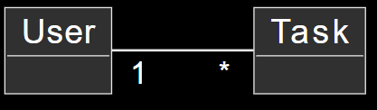
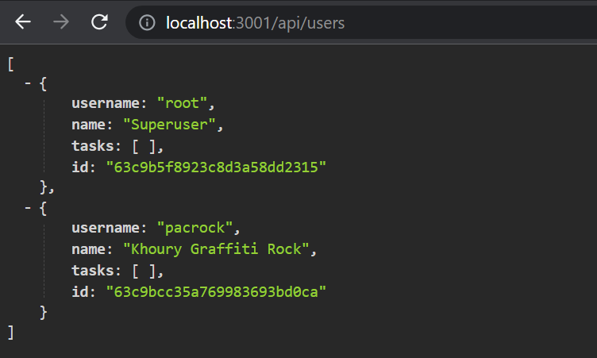
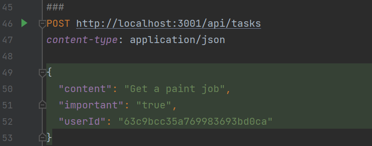
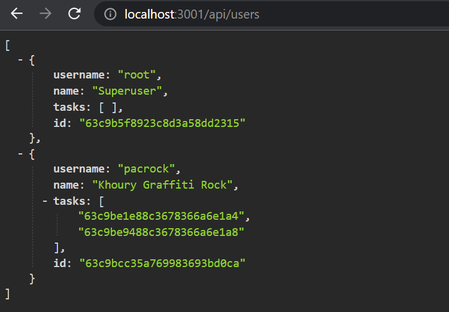
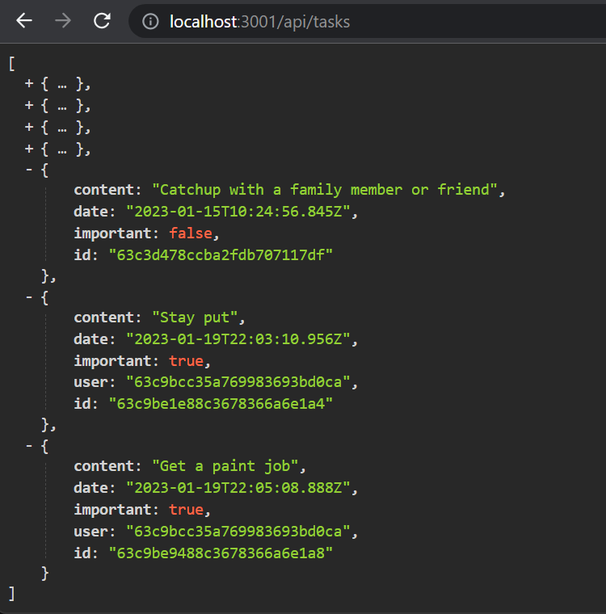
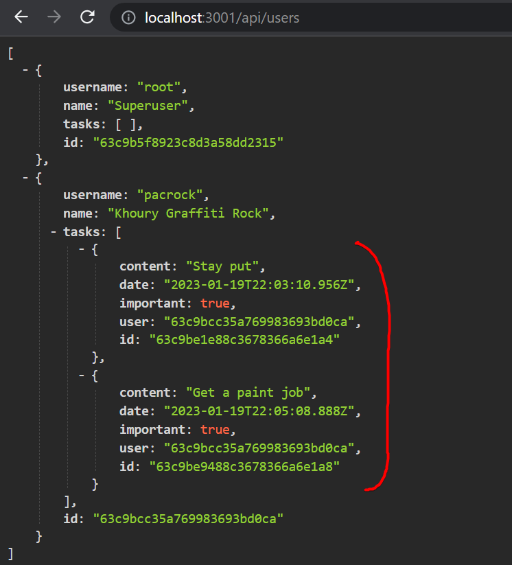
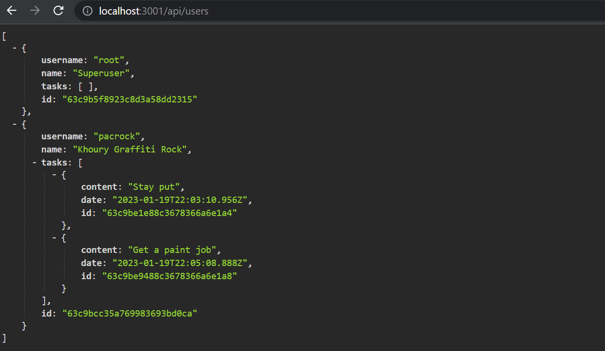
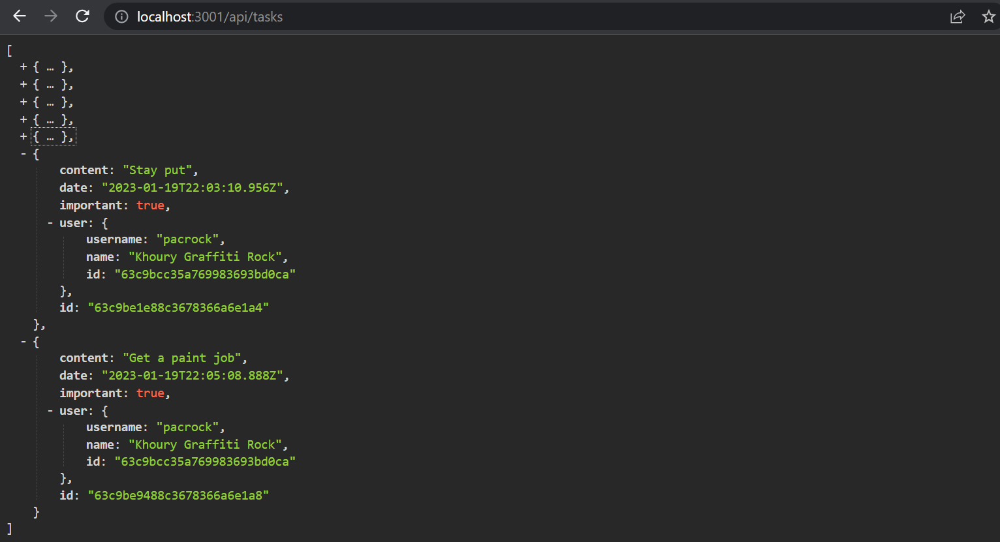

<div class="content">

We want to add user authentication and authorization to our application.
Users should be stored in the database and every task should be linked to the user who created it.
Deleting and editing a task should only be allowed for the user who created it.

Let's start by adding information about users to the database.
There is a one-to-many relationship between the user (***User***) and tasks (***Task***):



If we were working with a relational database the implementation would be straightforward.
Both resources would have their separate database tables, and the id of the user who created a task would be stored in the tasks table as a foreign key.

When working with document databases the situation is a bit different, as there are many different ways of modeling the situation.

The existing solution saves every task in the *tasks collection* in the database.
If we do not want to change this existing collection, then the natural choice is to save users in their own collection, ***users*** for example.

Like with all document databases, we can use object IDs in Mongo to reference documents in other collections.
This is similar to using foreign keys in relational databases.

Traditionally document databases like Mongo do not support **join queries** that are available in relational databases, used for aggregating data from multiple tables.
However, starting from version 3.2.
Mongo has supported [lookup aggregation queries](https://docs.mongodb.com/manual/reference/operator/aggregation/lookup/).
We will not be taking a look at this functionality in this course.

If we need functionality similar to join queries, we will implement it in our application code by making multiple queries.
In certain situations, Mongoose can take care of joining and aggregating data, which gives the appearance of a join query.
However, even in these situations, Mongoose makes multiple queries to the database in the background.

### References across collections

If we were using a relational database, the *task* would contain a **reference key** to the *user* who created it.
In document databases, we can do the same thing.

Let's assume that the `users` collection contains two users:

```js
[
  {
    username: 'powercat',
    _id: 123456,
  },
  {
    username: 'randy',
    _id: 141414,
  },
];
```

The `tasks` collection contains three tasks that all have a `user` field that references a user in the `users` collection:

```js
[
  {
    content: 'Wash the dishes',
    important: false,
    _id: 221212,
    user: 123456,
  },
  {
    content: 'Attend university events',
    important: true,
    _id: 221255,
    user: 123456,
  },
  {
    content: 'Work on personal React project',
    important: false,
    _id: 221244,
    user: 141414,
  },
]
```

Document databases do not demand the foreign key to be stored in the `task` resources, it could *also* be stored in the `users` collection, or even both:

```js
[
  {
    username: 'powercat',
    _id: 123456,
    tasks: [221212, 221255],
  },
  {
    username: 'randy',
    _id: 141414,
    tasks: [221244],
  },
]
```

Since users can have many tasks, the related ids are stored in an array in the `tasks` field.

Document databases also offer a radically different way of organizing the data: In some situations,
it might be beneficial to nest the entire `tasks` array as a part of the documents in the `users` collection:

```js
[
  {
    username: 'powercat',
    _id: 123456,
    tasks: [
      {
        content: 'Wash the dishes',
        important: false,
      },
      {
        content: 'Attend university events',
        important: true,
      },
    ],
  },
  {
    username: 'randy',
    _id: 141414,
    tasks: [
      {
        content:
          'Work on personal React project',
        important: false,
      },
    ],
  },
]
```

In this schema, `tasks` would be tightly nested under `users` and the database would not generate ids for them.

The structure and schema of the database are not as self-evident as it was with relational databases.
The chosen schema must support the use cases of the application the best.
This is not a simple design decision to make, as all use cases of the applications are not known when the design decision is made.

Paradoxically, schema-less databases like ***Mongo require developers to make far more radical design decisions about data organization*** at the beginning of the project
than relational databases with schemas.
On average, relational databases offer a more or less suitable way of organizing data for many applications.

### Mongoose schema for users

In this case, we decide to store the ids of the `tasks` created by the user in the `user` document.
Let's define the model for representing a `User` in the *models/user.js* file:

```js
const mongoose = require('mongoose')

const userSchema = new mongoose.Schema({
  username: String,
  name: String,
  passwordHash: String,
  // highlight-start
  tasks: [
    {
      type: mongoose.Schema.Types.ObjectId,
      ref: 'Task'
    }
  ],
  // highlight-end
})

userSchema.set('toJSON', {
  transform: (document, returnedObject) => {
    returnedObject.id = returnedObject._id.toString()
    delete returnedObject._id
    delete returnedObject.__v
    // the passwordHash should not be revealed
    delete returnedObject.passwordHash
  }
})

const User = mongoose.model('User', userSchema)

module.exports = User
```

The highlighted text above helps us conceptualize that the ids of the `tasks` are stored within the user document as an *array of Mongo ids*.

The type of the field is `ObjectId` that references *task*-style documents.
Mongo does not inherently know that this is a field that references `tasks`, the syntax is purely related to and defined by Mongoose.

Let's **expand the schema of the task defined in the *models/task.js*** file so that the task contains information about the user who created it:

```js
const taskSchema = new mongoose.Schema({
  content: {
    type: String,
    required: true,
    minlength: 5
  },
  date: Date,
  important: Boolean,
  // highlight-start
  user: {
    type: mongoose.Schema.Types.ObjectId,
    ref: 'User'
  }
  // highlight-end
})
```

In stark contrast to the conventions of relational databases, ***references are now stored in both documents***:

- the `task` references the `user` who created it, and
- the `user` has an array of references to all of the `tasks` created by them.

### Creating users

Let's implement a route for creating new users.
Users have a unique `username`, a `name` and something called a `passwordHash`.
The password hash is the output of a
[one-way hash function](https://en.wikipedia.org/wiki/Cryptographic_hash_function)
applied to the user's password.
**It is never wise to store unencrypted plain text passwords in the database!**

Let's install the [bcrypt](https://github.com/kelektiv/node.bcrypt.js) package for generating the password hashes:

```bash
npm install bcrypt
```

Creating new users happens in compliance with the RESTful conventions discussed in [part 3](/part3/node_js_and_express#rest),
by making an HTTP POST request to the ***users*** path.

Let's define a separate **router** for dealing with users in a new *controllers/users.js* file.
Let's use this new router in our application via the *app.js* file, so that it handles requests made to the ***/api/users*** URL:

```js
const usersRouter = require('./controllers/users')

// ...

app.use('/api/users', usersRouter)
```

The contents of our new router (*controllers/users.js*) is as follows:

```js
const bcrypt = require('bcrypt')
const usersRouter = require('express').Router()
const User = require('../models/user')

usersRouter.post('/', async (request, response) => {
  const { username, name, password } = request.body

  const saltRounds = 10
  const passwordHash = await bcrypt.hash(password, saltRounds)

  const user = new User({
    username,
    name,
    passwordHash,
  })

  const savedUser = await user.save()

  response.status(201).json(savedUser)
})

module.exports = usersRouter
```

The password sent in the request is ***not*** stored in the database.
We store the **hash** of the password that is generated with the `bcrypt.hash` function.

The fundamentals of [storing passwords](https://codahale.com/how-to-safely-store-a-password/) are outside the scope of this course material.
We will not discuss what the magic number 10 assigned to the [saltRounds](https://github.com/kelektiv/node.bcrypt.js/#a-task-on-rounds) variable means,
but you can read more about it in the linked material.

Our current code does not contain any error handling or input validation for verifying that the username and password are in the desired format.

The new feature can and should initially be tested manually with a tool like Postman.
However testing things manually will quickly become too cumbersome, especially once we implement functionality that enforces usernames to be unique.

It takes much less effort to write automated tests, and it will make the development of our application much easier.

Our initial tests could look like this:

```js
const bcrypt = require('bcrypt')
const User = require('../models/user')

//...

describe('when there is initially one user in db', () => {
  beforeEach(async () => {
    await User.deleteMany({})

    const passwordHash = await bcrypt.hash('sekret', 10)
    const user = new User({ username: 'root', passwordHash })

    await user.save()
  })

  test('creation succeeds with a fresh username', async () => {
    const usersAtStart = await helper.usersInDb()

    const newUser = {
      username: 'powercat',
      name: 'Matti Luukkainen',
      password: 'tigers',
    }

    await api
      .post('/api/users')
      .send(newUser)
      .expect(201)
      .expect('Content-Type', /application\/json/)

    const usersAtEnd = await helper.usersInDb()
    expect(usersAtEnd).toHaveLength(usersAtStart.length + 1)

    const usernames = usersAtEnd.map(u => u.username)
    expect(usernames).toContain(newUser.username)
  })
})
```

The tests use the `usersInDb()` helper function that we implemented in the *tests/test_helper.js* file.
The function is used to help us verify the state of the database after a user is created:

```js
const User = require('../models/user')

// ...

const usersInDb = async () => {
  const users = await User.find({})
  return users.map(u => u.toJSON())
}

module.exports = {
  initialTasks,
  nonExistingId,
  tasksInDb,
  usersInDb,
}
```

The `beforeEach` block adds a user with the username `root` to the database.
We can write a new test that verifies that a new user with the same username can not be created:

```js
describe('when there is initially one user in db', () => {
  // ...

  test('creation fails with proper statuscode and message if username already taken', async () => {
    const usersAtStart = await helper.usersInDb()

    const newUser = {
      username: 'root',
      name: 'Superuser',
      password: 'tigers',
    }

    const result = await api
      .post('/api/users')
      .send(newUser)
      .expect(400)
      .expect('Content-Type', /application\/json/)

    expect(result.body.error).toContain('username must be unique')

    const usersAtEnd = await helper.usersInDb()
    expect(usersAtEnd).toEqual(usersAtStart)
  })
})
```

The test case obviously will not pass at this point.
We are essentially practicing [test-driven development (TDD)](https://en.wikipedia.org/wiki/Test-driven_development),
where tests for new functionality are written before the functionality is implemented.

Mongoose does not have a built-in validator for checking the uniqueness of a field.
In principle we could find a ready-made solution for this from the
[mongoose-unique-validator](https://www.npmjs.com/package/mongoose-unique-validator)
npm package but unfortunately at the time of writing (24th Jan 2022)
mongoose-unique-validator does not work with Mongoose version 6.x, so we have to implement the uniqueness check by ourselves in the controller:

```js
usersRouter.post('/', async (request, response) => {
  const { username, name, password } = request.body

// highlight-start
  const existingUser = await User.findOne({ username })
  if (existingUser) {
    return response.status(400).json({
      error: 'username must be unique'
    })
  }
  // highlight-end

  const saltRounds = 10
  const passwordHash = await bcrypt.hash(password, saltRounds)

  const user = new User({
    username,
    name,
    passwordHash,
  })

  const savedUser = await user.save()

  response.status(201).json(savedUser)
})
```

We could also implement other validations into the user creation.
We could check that the username is long enough, that the username only consists of permitted characters, or that the password is strong enough.
Implementing these functionalities is left as an optional exercise.

Before we move onward, let's add an initial implementation of a route handler that returns all of the users in the database:

```js
usersRouter.get('/', async (request, response) => {
  const users = await User.find({})
  response.json(users)
})
```

For making new users in a production or development environment,
you may send a POST request to ```/api/users/``` via Postman or REST Client in the following format:

```js
{
    "username": "root",
    "name": "Superuser",
    "password": "tigers"
}

```

The list looks like this:



You can find the code for our current application in its entirety in the *part4-7* branch of
[this GitHub repository](https://github.com/comp227/part3-tasks-backend/tree/part4-7).

### Creating a new task

The code for creating a new task has to be updated so that the task is assigned to the user who created it.

Let's expand our current implementation so that the information about the user who created a task is sent in the `userId` field of the request body:

```js
const User = require('../models/user') //highlight-line

//...

tasksRouter.post('/', async (request, response, next) => {
  const body = request.body

  const user = await User.findById(body.userId) //highlight-line

  const task = new Task({
    content: body.content,
    important: body.important === undefined ? false : body.important,
    date: new Date(),
    user: user._id //highlight-line
  })

  const savedTask = await task.save()
  user.tasks = user.tasks.concat(savedTask._id) //highlight-line
  await user.save()  //highlight-line
  
  response.json(savedTask)
})
```

It's worth noting that the `user` object also changes.
The `id` of the task is stored in the `tasks` field:

```js
const user = await User.findById(body.userId)

// ...

user.tasks = user.tasks.concat(savedTask._id)
await user.save()
```

Let's try to create a new task



The operation appears to work.
Let's add one more task and then visit the route for fetching all users:



We can see that the user has two tasks.

Likewise, the ids of the users who created the tasks can be seen when we visit the route for fetching all tasks:



### Populate

We would like our API to work in such a way, that when an HTTP GET request is made to the ***/api/users*** route,
the user objects would also contain the contents of the user's tasks and not just their id.
In a relational database, this functionality would be implemented with a **join query**.

As previously mentioned, document databases do not properly support join queries between collections, but the Mongoose library can do some of these joins for us.
Mongoose accomplishes the join by doing multiple queries, which is different from join queries in relational databases which are **transactional**,
meaning that the state of the database does not change during the time that the query is made.
With join queries in Mongoose, nothing can guarantee that the state between the collections being joined is consistent,
meaning that if we make a query that joins the user and tasks collections, the state of the collections may change during the query.

The Mongoose join is done with the [populate](http://mongoosejs.com/docs/populate.html) method.
Let's update the route that returns all users first:

```js
usersRouter.get('/', async (request, response) => {
  const users = await User  // highlight-line
    .find({}).populate('tasks') // highlight-line

  response.json(users)
})
```

The [populate](http://mongoosejs.com/docs/populate.html) method is chained after the `find` method making the initial query.
The parameter given to the populate method defines that the ***ids*** referencing `task` objects in the `tasks` field of the `user` document
will be replaced by the referenced `task` documents.

The result is almost exactly what we wanted:



We can use the populate parameter for choosing the fields we want to include from the documents.
The selection of fields is done with the Mongo [syntax](https://docs.mongodb.com/manual/tutorial/project-fields-from-query-results/#return-the-specified-fields-and-the-id-field-only):

```js
usersRouter.get('/', async (request, response) => {
  const users = await User
    .find({}).populate('tasks', { content: 1, date: 1 })

  response.json(users)
});
```

The result is now exactly like we want it to be:



Let's also add a suitable population of user information to tasks:

```js
tasksRouter.get('/', async (request, response) => {
  const tasks = await Task
    .find({}).populate('user', { username: 1, name: 1 })

  response.json(tasks)
});
```

Now the user's information is added to the `user` field of task objects.



It's important to understand that the database does not know that the ids stored in the `user` field of tasks reference documents in the user collection.

The functionality of the `populate` method of Mongoose is based on the fact that we have defined "types" to the references in the Mongoose schema with the `ref` option:

```js
const taskSchema = new mongoose.Schema({
  content: {
    type: String,
    required: true,
    minlength: 5
  },
  date: Date,
  important: Boolean,
  user: {
    type: mongoose.Schema.Types.ObjectId,
    ref: 'User'
  }
})
```

You can find the code for our current application in its entirety in the *part4-8* branch of
[this GitHub repository](https://github.com/comp227/part3-tasks-backend/tree/part4-8).

</div>
