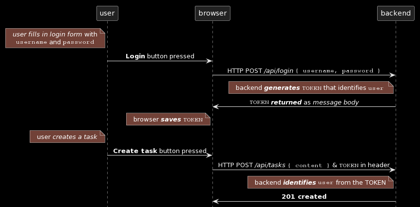
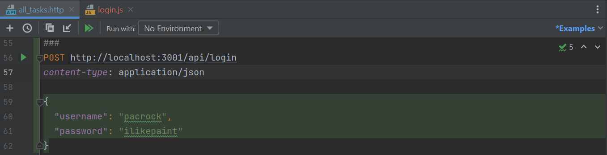
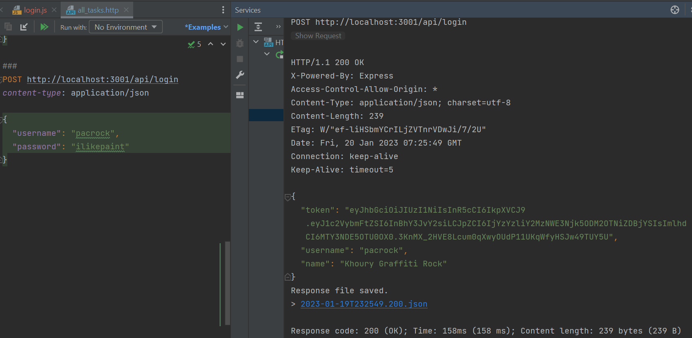
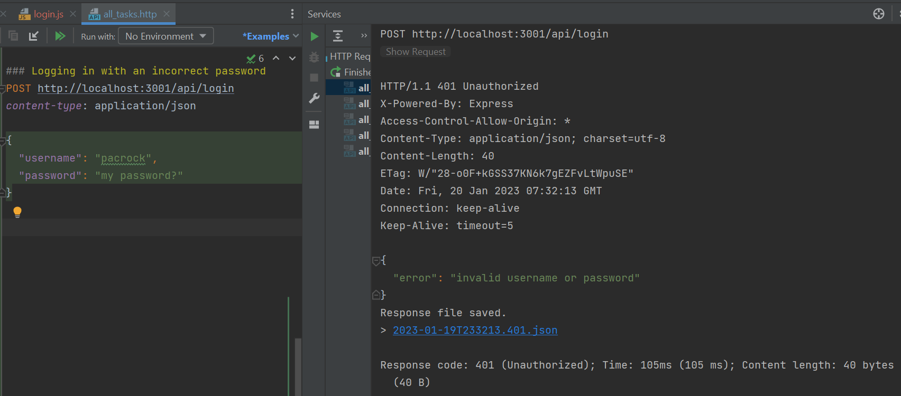
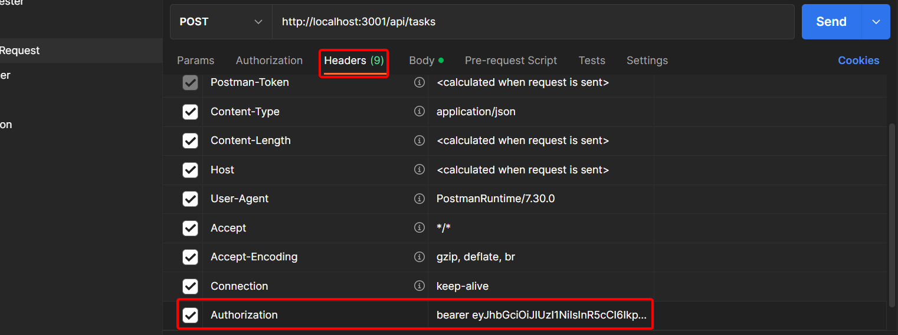
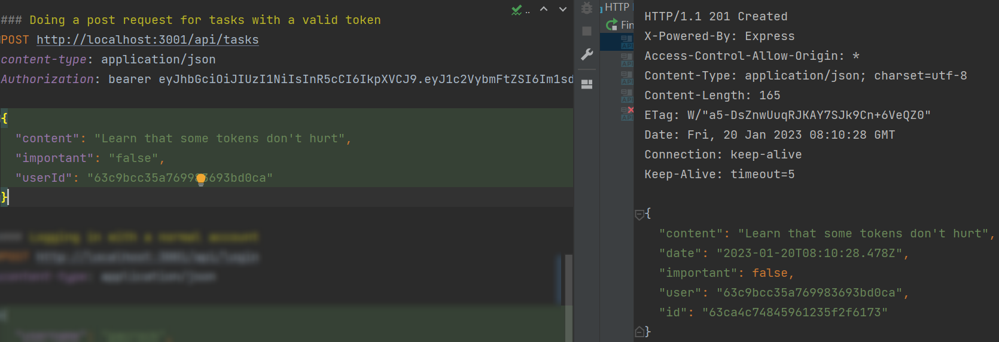
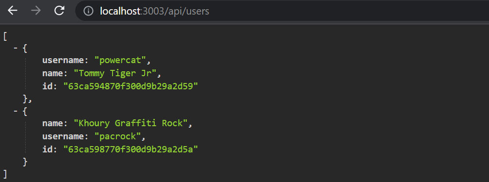
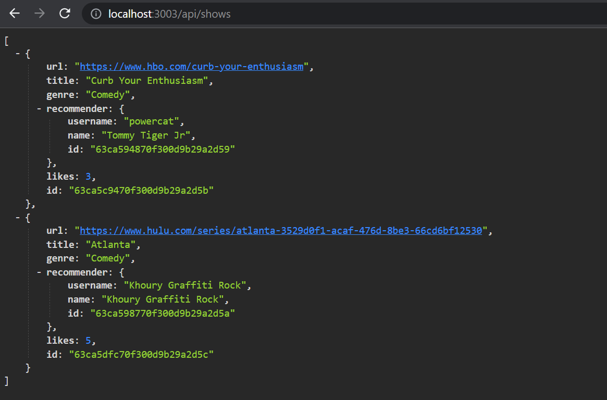
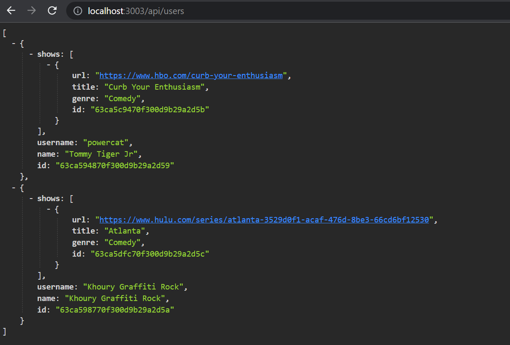

<div class="content">

Now that we have created users on the backend, let's move on and add more functionality related to users and their tasks.
In particular, users must be able to log into our application, and when a user is logged in,
their user information must automatically be attached to any new tasks they create.

Let's start by implementing support for
[**token-based authentication**](https://www.digitalocean.com/community/tutorials/the-ins-and-outs-of-token-based-authentication#how-token-based-works) to the backend.

The principles of token-based authentication are depicted in the following sequence diagram:



1. User starts by logging in using a login form implemented with React
    - We will add the login form to the frontend in [part 5](/part5)
2. This causes the React code to send the username and the password to the server address ***/api/login*** as a HTTP POST request.
3. If the username and the password are correct, the server generates a **token** that somehow identifies the logged-in user.
    - The token is signed digitally, making it highly impracticable to falsify cryptographically
4. The backend responds with a status code indicating the operation was successful and returns the token with the response.
5. The browser saves the token, for example to the state of a React application.
6. When the user creates a new task (or does some other operation requiring identification), the React code sends the token to the server with the request.
7. The server uses the token to identify the user

Let's first implement the functionality for logging in.
Install the [*jsonwebtoken* library](https://github.com/auth0/node-jsonwebtoken), which allows us to generate [JSON web tokens](https://jwt.io/).

```bash
npm i jsonwebtoken
```

The code for logging in goes to the file *controllers/login.js*.

```js
const jwt = require("jsonwebtoken");
const bcrypt = require("bcrypt");
const loginRouter = require("express").Router();
const User = require("../models/user");

loginRouter.post("/", async (request, response) => {
  const { username, password } = request.body;

  const user = await User.findOne({ username });
  const passwordCorrect = user === null
    ? false
    : await bcrypt.compare(password, user.passwordHash);

  if (!(user && passwordCorrect)) {
    return response.status(401).json({
      error: "invalid username or password"
    });
  }

  const userForToken = {
    username: user.username,
    id: user._id,
  };

  const token = jwt.sign(userForToken, process.env.SECRET);

  response
    .status(200)
    .send({ token, username: user.username, name: user.name });
});

module.exports = loginRouter;
```

The code starts by searching for the user from the database via the `username` attached to the request.

```js
const user = await User.findOne({ username });
```

Next, it checks the `password`, which is also attached to the request.

```js
const passwordCorrect = user === null
  ? false
  : await bcrypt.compare(password, user.passwordHash);
```

Remember that passwords themselves are not saved to the database.
Instead, we store the **hashes** calculated from the passwords.
This means we need to use `bcrypt.compare` to check if the password is correct:

```js
await bcrypt.compare(password, user.passwordHash);
```

If the user is not found, or the password is incorrect,
we respond to the request with the status code [401 unauthorized](https://www.rfc-editor.org/rfc/rfc9110.html#name-401-unauthorized).
The reason for the failure is explained in the response body.

```js
if (!(user && passwordCorrect)) {
  return response.status(401).json({
    error: "invalid username or password"
  });
}
```

If the password is correct, a token is created with the method `jwt.sign`.
The token contains the `username` and the user `id` in a digitally signed form.

```js
const userForToken = {
  username: user.username,
  id: user._id,
};

const token = jwt.sign(userForToken, process.env.SECRET);
```

The token has been digitally signed using a string from the environment variable `SECRET` as the *secret*.
The digital signature ensures that only parties who know the secret can generate a valid token.
The value for the environment variable must be set in the *.env* file.

A successful request is responded to with the status code **200 OK**.
The generated token and the username of the user are sent back in the response body.

```js
response
  .status(200)
  .send({ token, username: user.username, name: user.name });
```

Now the code for login just has to be added to the application by adding the new router to *app.js*.

```js
const loginRouter = require("./controllers/login");

//...

app.use("/api/login", loginRouter);
```

Let's try logging in using the WebStorm REST client:



It does not work.
The following is printed to the console:

```html
<body>
<pre>Error: secretOrPrivateKey must have a value<br> &nbsp; &nbsp;at module.exports [as sign] (C:\Users\powercat\comp227\part3\tasks-backend\node_modules\jsonwebtoken\sign.js:105:20)<br> &nbsp; &nbsp;at C:\Users\powercat\comp227\part3\tasks-backend\controllers\login.js:25:23</pre>
</body>

...

Response code: 500 (Internal Server Error); Time: 235ms (235 ms); Content length: 387 bytes (387 B)
```

The command `jwt.sign(userForToken, process.env.SECRET)` fails.
We forgot to set a value to the environment variable `SECRET`.
It can be any string.
When we set the value in file *.env*, (and restart the server), the login works.

A successful login returns the user details and the token:



A wrong username or password returns an error message and the proper status code:



Notice here that I placed a comment after the `###` syntax.
This is helpful when you start having a larger test file where you have different scenarios so you can more easily find what you are looking for.

### Limiting creating new tasks to logged-in users

Let's change creating new tasks so that it is *only possible if the POST request has a valid token attached*.
The task is then saved to the `tasks` list of the user identified by the token.

There are several ways of sending the token from the browser to the server.
We will use the [Authorization header](https://developer.mozilla.org/en-US/docs/Web/HTTP/Headers/Authorization).
The header also tells which [authentication scheme](https://developer.mozilla.org/en-US/docs/Web/HTTP/Authentication#Authentication_schemes) is used.
This can be necessary if the server offers multiple ways to authenticate.
Identifying the scheme tells the server how the attached credentials should be interpreted.

The **Bearer** scheme is suitable for our needs.

In practice, this means that if the token is, for example,
the string `eyJhbGciOiJIUzI1NiIsInR5cCI6IkpXVCJ9`, the Authorization header will have the value:

```text
Bearer eyJhbGciOiJIUzI1NiIsInR5cCI6IkpXVCJ9
```

Our *controllers/tasks.js* will change like so:

```js
const jwt = require("jsonwebtoken"); //highlight-line

// ...
//highlight-start
const getTokenFrom = request => {
  const authorization = request.get("authorization");
  if (authorization && authorization.startsWith("Bearer ")) {
    return authorization.replace("Bearer ", "");
  }
  return null;
};
//highlight-end

tasksRouter.post("/", async (request, response) => {
  const body = request.body;
//highlight-start
  const decodedToken = jwt.verify(getTokenFrom(request), process.env.SECRET);
  if (!decodedToken.id) {
    return response.status(401).json({ error: "token invalid" });
  }

  const user = await User.findById(decodedToken.id);
//highlight-end

  const task = new Task({
    content: body.content,
    important: body.important === undefined ? false : Boolean(body.important), // highlight-line
    date: new Date(),
    user: user._id
  });

  const savedTask = await task.save();
  user.tasks = user.tasks.concat(savedTask._id);
  await user.save();

  response.status(201).json(savedTask);
})
```

The helper function `getTokenFrom` isolates the token from the ***authorization*** header.
The validity of the token is checked with `jwt.verify`.
The method also decodes the token or returns the Object that the token was based on.

```js
const decodedToken = jwt.verify(token, process.env.SECRET);
```

The object decoded from the token contains the `username` and `id` fields, which tell the server who made the request.

If the object decoded from the token does not contain the user's identity (`decodedToken.id` is *`undefined`*),
error status code [401 unauthorized](https://www.w3.org/Protocols/rfc2616/rfc2616-sec10.html#sec10.4.2)
is returned and the reason for the failure is explained in the response body.

```js
if (!decodedToken.id) {
  return response.status(401).json({
    error: "token invalid"
  });
}
```

When the identity of the maker of the request is resolved, the execution continues as before.

A new task can now be created using a REST client if the ***authorization*** header is given the correct value,
something like the string `Bearer eyJhbGciOiJIUzI1NiIsInR5cCI6IkpXVCJ9`, where the second value is the token returned by the ***login*** operation.

Using Postman this looks as follows:



and with the WebStorm REST client



### Error handling

Token verification can also cause a `JsonWebTokenError`.
For example, if we remove a few characters from the token and try creating a new task, this happens:

```bash
JsonWebTokenError: invalid signature
    at /Users/powercat/comp227/part3/tasks-backend/node_modules/jsonwebtoken/verify.js:126:19
    at getSecret (/Users/powercat/comp227/part3/tasks-backend/node_modules/jsonwebtoken/verify.js:80:14)
    at Object.module.exports [as verify] (/Users/powercat/comp227/part3/tasks-backend/node_modules/jsonwebtoken/verify.js:84:10)
    at tasksRouter.post (/Users/powercat/comp227/part3/tasks-backend/controllers/tasks.js:40:30)
```

Once we get an exception, if we are not running *nodemon* we may have to restart our program,
as any subsequent bad requests could be met with an *Internal Server Error (500)*.

There are many possible reasons for a decoding error.
The token can be faulty (like in our example),
falsified, or expired.
Let's extend our `errorHandler` in *utils/middleware.js* to take into account the different decoding errors.

```js
const unknownEndpoint = (request, response) => {
  response.status(404).send({ error: "unknown endpoint" });
}

const errorHandler = (error, request, response, next) => {
  logger.error(error.message);
  
  if (error.name === "CastError") {
    return response.status(400).send({
      error: "malformatted id"
    });
  } else if (error.name === "ValidationError") {
    return response.status(400).json({
      error: error.message 
    });
    // highlight-start
  } else if (error.name === "JsonWebTokenError") { 
    return response.status(401).json({ 
      error: "invalid token"
    });
    //highlight-end
  }

  next(error);
};
```

The current application code can be found on
[GitHub](https://github.com/comp227/part3-tasks-backend/tree/part4-9), branch *part4-9*.

If the application has multiple interfaces requiring identification, JWT's validation should be separated into its own middleware.
An existing library like [*express-jwt*](https://www.npmjs.com/package/express-jwt) could also be used.

### Problems of Token-based authentication

Token authentication is pretty easy to implement, but it contains one problem.
Once the API user, (e.g. a React app) gets a token, the API has a blind trust with the token holder.
What if the access rights of the token holder should be revoked?

There are two solutions to the problem.
The easier one is to limit the validity period of a token:

```js
loginRouter.post("/", async (request, response) => {
  const { username, password } = request.body;

  const user = await User.findOne({ username })
  const passwordCorrect = user === null
    ? false
    : await bcrypt.compare(password, user.passwordHash);

  if (!(user && passwordCorrect)) {
    return response.status(401).json({
      error: "invalid username or password"
    });
  }

  const userForToken = {
    username: user.username,
    id: user._id,
  };

  // token expires in 60*60 seconds, that is, in one hour
  // highlight-start
  const token = jwt.sign(
    userForToken, 
    process.env.SECRET,
    { expiresIn: 60*60 }
  );
  // highlight-end

  response
    .status(200)
    .send({ token, username: user.username, name: user.name });
});
```

Once the token expires, the client app needs to get a new token.
Usually, this happens by forcing the user to re-login to the app.

The error handling middleware should be extended to give a proper error in the case of an expired token:

```js
const errorHandler = (error, request, response, next) => {
  logger.error(error.message);

  if (error.name === "CastError") {
    return response.status(400).send({ error: "malformatted id" });
  } else if (error.name === "ValidationError") {
    return response.status(400).json({ error: error.message });
  } else if (error.name === "JsonWebTokenError") {
    return response.status(401).json({
      error: "invalid token"
    });
  // highlight-start  
  } else if (error.name === "TokenExpiredError") {
    return response.status(401).json({
      error: "token expired"
    });
  }
  // highlight-end

  next(error);
}
```

The *shorter the expiration time, the more safe the solution is*.
So if the token gets into the wrong hands or user access to the system needs to be revoked, the token is only usable for a limited amount of time.
On the other hand, a short expiration time forces a potential pain to a user, one must login to the system more frequently.

The other solution is to save info about each token to backend database
and to check for each API request if the access right corresponding to the token is still valid.
With this scheme, access rights can be revoked at any time.
This kind of solution is often called a **server-side session**.

The negative aspect of server-side sessions is the increased complexity in the backend and also the effect on performance
since the token validity needs to be checked for each API request to the database.
Database access is considerably slower compared to checking the validity of the token itself.
That is why it is quite common to save the session corresponding to a token to a **key-value database** such as [***Redis***](https://redis.io/)
that is limited in functionality compared to a MongoDB or relational databases but extremely fast in some usage scenarios.

When server-side sessions are used, the ***token is a random string*** (quite often).
The token does not include any information about the user as it is quite often the case when jwt-tokens are used.
For each API request, the server fetches the relevant information about the identity of the user from the database.
It is also quite usual that instead of using Authorization-header, **cookies** are used as the mechanism for transferring the token between the client and the server.

### End tasks

There have been many changes to the code which have caused a typical problem for a fast-paced software project: most of the tests have broken.
Because this part of the course is already jammed with new information, we will leave fixing the tests to a non-compulsory exercise.

Usernames, passwords and applications using token authentication must always be used over [HTTPS](https://en.wikipedia.org/wiki/HTTPS).
We could use a Node [HTTPS](https://nodejs.org/api/https.html) server in our application instead of the
[HTTP](https://nodejs.org/docs/latest-v8.x/api/http.html) server (it requires more configuration).
On the other hand, the production version of our application is on Render, so our application stays secure.
Render routes all traffic between a browser and the Render server over HTTPS.

We will implement login to the frontend in the [next part](/part5).

> **Pertinent:** At this stage, in the deployed tasks app, it is expected that the creating a task feature will stop working as the backend login feature is not yet linked to the frontend.

</div>

<div class="tasks">

### Exercises 4.15-4.23

In the next exercises, the basics of user management will be implemented for the Watchlist application.
The safest way is to follow the story from part 4 chapter [User administration](/part4/user_administration)
to the chapter [Token-based authentication](/part4/token_authentication).
You can of course also use your creativity.

> **Warning:** If you notice you are mixing `async`/`await` and `then` calls, it is 99% certain you are doing something wrong.
> Use either or, never both.

#### 4.15: watchlist expansion, Step 3

Implement a way to create new users by doing an HTTP POST request to address ***api/users***.
Users have a *username, password and name*.

**Do not save passwords to the database as clear text**,
but use the ***bcrypt*** library like we did in part 4 chapter [Creating new users](/part4/user_administration#creating-users).

> **FYI:** Some Windows users have had problems with ***bcrypt***.
> If you run into problems, remove the library with command
>
> ```bash
> npm uninstall bcrypt 
> ```
>
> and install [bcryptjs](https://www.npmjs.com/package/bcryptjs) instead.

Implement a way to see the details of all users by doing a suitable HTTP request.

The list of users can, for example, look as follows:



#### 4.16*: watchlist expansion, Step 4

Add a feature which adds the following restrictions to creating new users:

- Both username and password must be given.
- Both username and password must be at least 3 characters long.
- The username must be unique.

The operation must respond with a suitable status code and some kind of an error message if an invalid user is created.

> **Pertinent:** Do not test password restrictions with Mongoose validations.
> It is not a good idea because the password received by the backend and the password hash saved to the database are not the same thing.
> The password length should be validated in the controller as we did in [part 3](/part3/node_js_and_express) before using Mongoose validation.

Also, implement tests that ensure invalid users are not created and that an invalid add user operation returns a suitable status code and error message.

#### 4.17: watchlist expansion, Step 5

Expand `show` so that *each show contains information on the recommender of that show*.

Modify adding new shows so that when a new show is created, ***any*** user from the database is designated as its recommender (for example the one found first).
Implement this according to part 4's [populate section](/part4/user_administration#populate).
Which user is designated as the recommender does not matter just yet.
The functionality is finished in exercise 4.19.

Modify listing all shows so that the recommender's user information is displayed with the show:



and listing all users also displays the shows they recommended:



#### 4.18: watchlist expansion, Step 6

Implement token-based authentication according to part 4's [Token authentication section](/part4/token_authentication).

#### 4.19: watchlist expansion, Step 7

Modify adding new shows so that it is only possible if a valid token is sent with the HTTP POST request.
The user identified by the token is designated as the recommender of that show.

#### 4.20*: watchlist expansion, Step 8

[This example](/part4/token_authentication) from part 4 shows taking the token from the header with the `getTokenFrom` helper function in *controllers/shows.js*.

If you used the same solution, refactor taking the token to a [middleware](/part3/node_js_and_express#middleware).
The middleware should take the token from the ***Authorization*** header and place it into the `token` field of the `request` object.

In other words, if you register this middleware in the *app.js* file before all routes

```js
app.use(middleware.tokenExtractor);
```

Routes can access the token with `request.token`:

```js
showsRouter.post("/", async (request, response) => {
  // ..
  const decodedToken = jwt.verify(request.token, process.env.SECRET);
  // ..
});
```

Remember that a normal [middleware function](/part3/node_js_and_express#middleware) is a function with three parameters,
that at the end calls the last parameter `next` to move the control to the next middleware:

```js
const tokenExtractor = (request, response, next) => {
  // code that extracts the token

  next();
};
```

#### 4.21*: watchlist expansion, Step 9

***Change the delete show operation*** so that a show can be deleted only by the user who added the show.
Therefore, deleting a show is possible only if the token sent with the request is the same as that of the show's recommender.

If deleting a show is attempted without a token or by an invalid user, the operation should return a suitable status code.

Notice that if you fetch a show from the database,

```js
const show = await Show.findById(...);
```

the field `show.user` does not contain a `string`, but an `Object`.
So if you want to compare the id of the object fetched from the database and a string id, a normal comparison operation does not work.
The id fetched from the database must be parsed into a string first.

```js
if ( show.user.toString() === userid.toString() ) // ...
```

#### 4.22*:  watchlist expansion, Step 10

Both the new show recommendation and show deletion need to find out the identity of the user who is doing the operation.
The middleware `tokenExtractor` that we did in exercise 4.20 helps
but still both the handlers of *post* and *delete* operations need to find out who the user holding a specific token is.

Now create a new middleware `userExtractor`, that finds out the user and sets it to the request object.
When you register the middleware in *app.js*

```js
app.use(middleware.userExtractor);
```

the user will be set in the field `request.user`:

```js
showsRouter.post("/", async (request, response) => {
  // get user from request object
  const user = request.user;
  // ..
});

showsRouter.delete("/:id", async (request, response) => {
  // get user from request object
  const user = request.user;
  // ..
});
```

Notice that it is possible to register a middleware only for a specific set of routes.
So instead of using `userExtractor` with all the routes,

```js
const middleware = require("../utils/middleware");
// ...

// use the middleware in all routes
app.use(middleware.userExtractor); // highlight-line

app.use("/api/shows", showsRouter);  
app.use("/api/users", usersRouter);
app.use("/api/login", loginRouter);
```

we could register it to be only executed with path ***/api/shows*** routes:

```js
const middleware = require("../utils/middleware");
// ...

// use the middleware only in /api/shows routes
app.use("/api/shows", middleware.userExtractor, showsRouter); // highlight-line
app.use("/api/users", usersRouter);
app.use("/api/login", loginRouter);
```

As can be seen, this happens by chaining multiple middlewares as the parameter of function `use`.
It would also be possible to register a middleware only for a specific operation:

```js
const middleware = require("../utils/middleware");
// ...

router.post("/", middleware.userExtractor, async (request, response) => {
  // ...
};
```

#### 4.23*:  watchlist expansion, Step 11

After adding token-based authentication the tests for adding a new show broke down.
**Fix the tests.**
Also, write a new test to ensure adding a show fails with the proper status code **401 Unauthorized** if a token is not provided.

[This](https://github.com/visionmedia/supertest/issues/398) is most likely useful when doing the fix.

This is the last exercise for this part of the course and it's time to push your code to GitHub if you haven't already and mark the exercises that were completed on Canvas.

<!---
@startuml
skinparam defaultTextAlignment center
note left of user
  //user fills in login form// with
  ""username"" and ""password""
end note
user -> browser: **Login** button pressed

browser -> backend: HTTP POST ///api/login// ""{ username, password }""
note left of backend
  backend //**generates**// ""TOKEN"" that identifies ""user"" 
end note
backend -> browser: ""TOKEN"" //**returned**// as //message body//
note left of browser
  browser //**saves**// ""TOKEN""
end note
note left of user
  user //creates a task//
end note
user -> browser: **Create task** button pressed
browser -> backend: HTTP POST ///api/tasks// ""{ content }"" & ""TOKEN"" in header
note left of backend
  backend //**identifies**// ""user"" from the TOKEN
end note

backend -> browser: **201 created**

user -> user:
@enduml
-->

</div>
