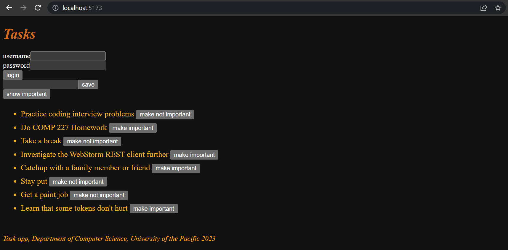

<div class="content">

In the last two parts, we have mainly concentrated on the backend.
The frontend that we developed in [part 2](/part2) does not yet support the user management we implemented to the backend in part 4.

At the moment the frontend shows existing tasks and lets users change the state of a task from important to not important and vice versa.
Unfortunately, new tasks can't be added anymore
because our backend expects that [a token verifying a user's identity be sent with new tasks](/part4/token_authentication#limiting-creating-new-tasks-to-logged-in-users).

We'll now implement a part of the required user management functionality in the frontend.
Let's begin with the user login.
Throughout this part, we will assume that new users will not be added from the frontend.

### Handling login

Let's add a login form to the top of the page.
That code will be shown below.
**Let's also move the form for adding tasks above the form.**
We'll task you with doing this.



Below are the changes needed to add the login form in *App.js*:

```js
const App = () => {
  const [tasks, setTasks] = useState([]) 
  const [newTask, setNewTask] = useState('')
  const [showAll, setShowAll] = useState(true)
  const [errorMessage, setErrorMessage] = useState(null)
  // highlight-start
  const [username, setUsername] = useState('') 
  const [password, setPassword] = useState('') 
// highlight-end

  useEffect(() => {
    taskService
      .getAll().then(initialTasks => {
        setTasks(initialTasks)
      })
  }, [])

  // ...

// highlight-start
  const handleLogin = (event) => {
    event.preventDefault()
    console.log('logging in with', username, password)
  }
  // highlight-end

  return (
    <div>
      <h1>Tasks</h1>

      <Notification message={errorMessage} />

      // highlight-start
      <form onSubmit={handleLogin}>
        <div>
          username
            <input
            type="text"
            value={username}
            name="Username"
            onChange={({ target }) => setUsername(target.value)}
          />
        </div>
        <div>
          password
            <input
            type="password"
            value={password}
            name="Password"
            onChange={({ target }) => setPassword(target.value)}
          />
        </div>
        <button type="submit">login</button>
      </form>
      <hr/>
    // highlight-end

      // ...
    </div>
  )
}

export default App
```

The current application code can be found on
[Github](https://github.com/comp227/part2-tasks/tree/part5-1), branch *part5-1*.

> **Notice** If you clone the repo, don't forget to run `npm install` before attempting to run the frontend.
>
> The frontend will not display any tasks if it's not connected to the backend.
> You'll need to open up both repositories and start them both.
>
> | repository | command | port |
> | :-- | :-- | :-- |
> | backend | `npm run dev` | 3001 |
> | frontend | `npm start` | 3000 |
>
> After starting both, you will see the tasks that are saved in your MongoDB database from Part 4.
>
> ***You'll need to start both from now on if you want full functionality***

The login form is handled the same way we handled forms in
[part 2](/part2/forms).
The app state has fields for `username` and `password` to store the data from the form.
The form fields have *event handlers*, which synchronize changes in the field to the state of the `App` component.
The event handlers are simple:
An object is given to them as a parameter,
and they destructure the field `target` from the object and save its value to the state.

```js
({ target }) => setUsername(target.value)
```

The method `handleLogin`, which is responsible for handling the data in the form, is yet to be implemented.

Logging in is done by sending an HTTP POST request to the server address ***api/login***.
Let's separate the code responsible for this request into its own module, to file *services/login.js*.

We'll use `async`/`await` syntax instead of promises for the HTTP request:

```js
import axios from 'axios'
const baseUrl = '/api/login'

const login = async credentials => {
  const response = await axios.post(baseUrl, credentials)
  return response.data
}

export default { login }
```

The `handleLogin` function and the other parts of *App.js* can be changed as follows:

```js
import loginService from './services/login' // highlight-line

const App = () => {
  // ...
  const [username, setUsername] = useState('') 
  const [password, setPassword] = useState('') 
// highlight-start
  const [user, setUser] = useState(null)
// highlight-end
  
  const handleLogin = async (event) => { // higlight-line
    event.preventDefault()
    
    // highlight-start
    try {
      const user = await loginService.login({
        username, password,
      })

      setUser(user)
      setUsername('')
      setPassword('')
    } catch (exception) {
      setErrorMessage('Wrong credentials')
      setTimeout(() => {
        setErrorMessage(null)
      }, 5000)
    }
    // highlight-end
  }

  // ...
}
```

If the login is successful, the form fields are emptied ***and*** the server response
(including a *token* and the user details) is saved to the `user` field of the application's state.

If the login fails or function `loginService.login` throws an error, the user is notified.

The user is not notified about a successful login in any way.
Let's modify the application to show the login form only *if the user is not logged in* so when `user === null`.
The form for adding new tasks is shown only if the *user is logged in*, so `user` contains the user details.

Let's add two helper functions to the `App` component for generating the forms:

```js
const App = () => {
  // ...

  const loginForm = () => (
    <form onSubmit={handleLogin}>
      <div>
        username
          <input
          type="text"
          value={username}
          name="Username"
          onChange={({ target }) => setUsername(target.value)}
        />
      </div>
      <div>
        password
          <input
          type="password"
          value={password}
          name="Password"
          onChange={({ target }) => setPassword(target.value)}
        />
      </div>
      <button type="submit">login</button>
    </form>      
  )

  const taskForm = () => (
    <form onSubmit={addTask}>
      <input
        value={newTask}
        onChange={handleTaskChange}
      />
      <button type="submit">save</button>
    </form>  
  )

  return (
    // ...
  )
}
```

and conditionally render them:

```js
const App = () => {
  // ...

  const loginForm = () => (
    // ...
  )

  const taskForm = () => (
    // ...
  )

  return (
    <div>
      <h1>Tasks</h1>

      <Notification message={errorMessage} />

      {user === null && loginForm()} // highlight-line
      {user !== null && taskForm()} // highlight-line

      <div>
        <button onClick={() => setShowAll(!showAll)}>
          show {showAll ? 'important' : 'all'}
        </button>
      </div>
      <ul>
        {tasksToShow.map((task, i) => 
          <Task
            key={i}
            task={task} 
            toggleImportance={() => toggleImportanceOf(task.id)}
          />
        )}
      </ul>

      <Footer />
    </div>
  )
}
```

A slightly odd looking, but commonly used
[React trick](https://reactjs.org/docs/conditional-rendering.html#inline-if-with-logical--operator)
is used to render the forms conditionally:

```js
{
  user === null && loginForm()
}
```

If the first statement evaluates to `false` or is [**falsy**](https://developer.mozilla.org/en-US/docs/Glossary/Falsy),
the second statement (generating the form) is not executed at all.

We can make this even more straightforward by using the [**conditional operator**](https://developer.mozilla.org/en-US/docs/Web/JavaScript/Reference/Operators/Conditional_Operator):

```js
return (
  <div>
    <h1>Tasks</h1>

    <Notification message={errorMessage}/>
    // higlight-start
    {user === null ?
      loginForm() :
      taskForm()
    }
    // highlight-end
    // ...

  </div>
)
```

If `user === null` is
[**truthy**](https://developer.mozilla.org/en-US/docs/Glossary/Truthy),
`loginForm()` is executed.
If not, `taskForm()` is.

Let's do one more modification.
If the user is logged in, their name is shown on the screen:

```js
return (
  <div>
    <h1>Tasks</h1>

    <Notification message={errorMessage} />

    // highlight-start
    {!user && loginForm()}
    {user && 
      <div>
        <p>{user.name} logged in</p>
        {taskForm()}
      </div>
    }
    // highlight-end

    // ...

  </div>
)
```

The solution isn't perfect, but we'll leave it for now.

Our main component `App` is at the moment way too large.
The changes we did now are a clear sign that the forms should be refactored into their own components.
However, we will leave that for an optional exercise.

The current application code can be found on
[GitHub](https://github.com/comp227/part2-tasks/tree/part5-2), branch *part5-2*.

### Creating new tasks

The token returned with a successful login is saved to the application's state - the `user`'s field `token`:

```js
const handleLogin = async (event) => {
  event.preventDefault()
  try {
    const user = await loginService.login({
      username, password,
    })

    setUser(user) // highlight-line
    setUsername('')
    setPassword('')
  } catch (exception) {
    // ...
  }
}
```

Let's fix creating new tasks so it works with the backend.
This means adding the token of the logged-in user to the Authorization header of the HTTP request.

The *taskService* module changes like so:

```js
import axios from 'axios'
const baseUrl = '/api/tasks'

let token = null // highlight-line

// highlight-start
const setToken = newToken => {
  token = `bearer ${newToken}`
}
// highlight-end

const getAll = () => {
  const request = axios.get(baseUrl)
  return request.then(response => response.data)
}

const create = async newObject => {
  // highlight-start
  const config = {
    headers: { Authorization: token },
  }
// highlight-end

  const response = await axios.post(baseUrl, newObject, config) // highlight-line
  return response.data
}

const update = (id, newObject) => {
  const request = axios.put(`${ baseUrl }/${id}`, newObject)
  return request.then(response => response.data)
}

export default { getAll, create, update, setToken } // highlight-line
```

The taskService module contains a private variable `token`.
Its value can be changed with a function `setToken`, which is exported by the module.
`create`, now with `async`/`await` syntax, sets the token to the `Authorization` header.
The header is given to axios as the third parameter of the `post` method.

The event handler responsible for login must be changed to call the method `taskService.setToken(user.token)` with a successful login:

```js
const handleLogin = async (event) => {
  event.preventDefault()
  try {
    const user = await loginService.login({
      username, password,
    })

    taskService.setToken(user.token) // highlight-line
    setUser(user)
    setUsername('')
    setPassword('')
  } catch (exception) {
    // ...
  }
}
```

And now adding new tasks works again!

### Saving the token to the browser's local storage

Our application has a flaw: when the page is rerendered, the user's login information disappears.
This also slows down development.
For example, when we test creating new tasks, we have to login again every single time.

This problem is easily solved by saving the login details to [**local storage**](https://developer.mozilla.org/en-US/docs/Web/API/Storage).
Local Storage is a [key-value](https://en.wikipedia.org/wiki/Key-value_database) database in the browser.

It is very easy to use.
A *value* corresponding to a certain *key* is saved to the database with the method [setItem](https://developer.mozilla.org/en-US/docs/Web/API/Storage/setItem).
For example:

```js
window.localStorage.setItem('name', 'slim shady')
```

saves the string given as the second parameter as the value of the key `name`.

The value of a key can be found with the method [getItem](https://developer.mozilla.org/en-US/docs/Web/API/Storage/getItem):

```js
window.localStorage.getItem('name')
```

and [removeItem](https://developer.mozilla.org/en-US/docs/Web/API/Storage/removeItem) removes a key.

Values in the local storage are persisted even when the page is re-rendered.
The storage is [origin](https://developer.mozilla.org/en-US/docs/Glossary/Origin)-specific so each web application has its own storage.

Let's extend our application so that it saves the details of a logged-in user to local storage.

Values saved to storage are [**DOMstrings**](https://docs.w3cub.com/dom/domstring),
so we cannot save a JavaScript object as it is.
The object has to be parsed to JSON first, with the method `JSON.stringify`.
Correspondingly, when a JSON object is read from the local storage, *it has to be parsed back to JavaScript with `JSON.parse`*.

Changes to the login method are as follows:

```js
  const handleLogin = async (event) => {
    event.preventDefault()
    try {
      const user = await loginService.login({
        username, password,
      })

      // highlight-start
      window.localStorage.setItem(
        'loggedTaskappUser', JSON.stringify(user)
      ) 
      // highlight-end
      taskService.setToken(user.token)
      setUser(user)
      setUsername('')
      setPassword('')
    } catch (exception) {
      // ...
    }
  }
```

The details of a logged-in user are now saved to the local storage, and they can be viewed on the console (*by typing `window.localStorage` to the console*):


You can also inspect the local storage using the developer tools.
On Chrome, go to the ***Application*** tab and select ***Local Storage***
(more details [here](https://developers.google.com/web/tools/chrome-devtools/storage/localstorage)).
On Firefox go to the ***Storage*** tab and select ***Local Storage*** (details [here](https://developer.mozilla.org/en-US/docs/Tools/Storage_Inspector)).

We still have to modify our application so that when we enter the page,
the application checks if local storage has details for a logged-in user.
If there is, the details are saved to the state of the application and to ***taskService***.

The right way to do this is with an [*effect hook*](https://reactjs.org/docs/hooks-effect.html):
a mechanism we first encountered in [part 2](/part2/getting_data_from_server#effect-hooks),
and used to fetch tasks from the server.

We can have multiple effect hooks, so let's create a second one to handle the first loading of the page:

```js
const App = () => {
  const [tasks, setTasks] = useState([]) 
  const [newTask, setNewTask] = useState('')
  const [showAll, setShowAll] = useState(true)
  const [errorMessage, setErrorMessage] = useState(null)
  const [username, setUsername] = useState('') 
  const [password, setPassword] = useState('') 
  const [user, setUser] = useState(null) 

  useEffect(() => {
    taskService
      .getAll().then(initialTasks => {
        setTasks(initialTasks)
      })
  }, [])

  // highlight-start
  useEffect(() => {
    const loggedUserJSON = window.localStorage.getItem('loggedTaskappUser')
    if (loggedUserJSON) {
      const user = JSON.parse(loggedUserJSON)
      setUser(user)
      taskService.setToken(user.token)
    }
  }, [])
  // highlight-end

  // ...
}
```

The empty array `[]` as the parameter of the effect ensures that the effect is executed only when the component is rendered
[for the first time](https://reactjs.org/docs/hooks-reference.html#conditionally-firing-an-effect).

Now a user stays logged in to the application forever.
We should probably add a ***logout*** functionality, which removes the login details from the local storage.
*We will leave it as an exercise, as it builds character* 🧐.

***It's possible to log out a user using the console***, and that is enough for now.
You can log out with the command:

```js
window.localStorage.removeItem('loggedTaskappUser')
```

or with the command which empties `localStorage`:

```js
window.localStorage.clear()
```

The current application code can be found on
[GitHub](https://github.com/comp227/part2-tasks/tree/part5-3), branch *part5-3*.

</div>

<div class="tasks">

### Exercises 5.1-5.4

We will now create a frontend for the watchlist backend we created in the previous section.
You will be using a new repo for this part that you will be able to obtain by vising the URL below.
This new repo/application has a small amount of code to get you started.
The application expects your backend to be running on port 3003.

Visit <http://go.djosv.com/227lab5> to start the process of cloning the frontend repo into Webstorm.

The application is started the usual way, but you have to install its dependencies first:

```bash
npm install
npm start
```

Following what we have mentioned before about committing regularly, your commits should be providing context on the small changes that you are doing as you write your code.
This way you think about your code as you move through, which has an [increasing following](https://conventionalcommits.org).

The first few exercises revise everything we have learned about React so far.
They can be challenging, especially if your backend is incomplete.
Please **ensure part4 is working first** before moving onto this.

While doing the exercises, remember all of the debugging methods we have talked about, especially keeping an eye on the console.

**Warning:** If you notice you are mixing in the functions `async`/`await` and `then` commands, it's 99.9%  certain you are doing something wrong.
Use either or, never both.

#### 5.1: watchlist frontend, step1

Implement login functionality to the frontend.
The token returned with a successful login is saved to the application's state `user`.

If a user is not logged in, ***only*** the login form is visible.


If the user is logged in, the name of the user and a list of blogs is shown.


User details of the logged-in user do not have to be saved to the local storage yet.

> **NB** You can implement the conditional rendering of the login form like this for example:
>
> ```js
>   if (user === null) {
>     return (
>       <div>
>         <h2>Log in to application</h2>
>         <form>
>           //...
>         </form>
>       </div>
>     )
>   }
> 
>   return (
>     <div>
>       <h2>What to watch</h2>
>       {shows.map(show =>
>         <Show key={show.id} show={show} />
>       )}
>     </div>
>   )
> }
> ```

#### 5.2: watchlist frontend, step2

Make the login 'permanent' by using the local storage.
Also, implement a way to log out.


Ensure the browser does not remember the details of the user after logging out.

#### 5.3: watchlist frontend, step3

Expand your application to allow a logged-in user to add new shows:


#### 5.4: watchlist frontend, step4

Implement notifications that inform the user about successful and unsuccessful operations at the top of the page.
For example, when a new show is added, the following notification can be shown:


Failed login can show the following notification:


The notifications must be visible for a few seconds.
It is not compulsory to add colors.

</div>

<div class="content">

### A notice about using local storage

At the [end](/part4/token_authentication#problems-of-token-based-authentication) of the last part,
we mentioned that the challenge of token-based authentication is how to cope with the situation when the API access of the token holder to the API needs to be revoked.

There are two solutions to the problem.
The first one is to limit the validity period of a token.
This forces the user to re-login to the app once the token has expired.
The other approach is to save the validity information of each token to the backend database.
This solution is often called a **server-side session**.

No matter how the validity of tokens is checked and ensured,
saving a token in the local storage might contain a security risk if the application has a security vulnerability that allows
[Cross-Site Scripting (XSS)](https://owasp.org/www-community/attacks/xss/) attacks.
An XSS attack is possible if the application would allow a user to inject arbitrary JavaScript code (e.g. using a form) that the app would then execute.
When using React sensibly it should not be possible since [React sanitizes](https://reactjs.org/docs/introducing-jsx.html#jsx-prevents-injection-attacks)
all text that it renders, meaning that it is not executing the rendered content as JavaScript.

If one wants to play safe, the best option is to not store a token in local storage.
This might be an option in situations where leaking a token might have tragic consequences.

It has been suggested that the identity of a signed-in user should be saved as [**httpOnly cookies**](https://developer.mozilla.org/en-US/docs/Web/HTTP/Cookies#restrict_access_to_cookies),
so that JavaScript code could not have any access to the token.
The drawback of this solution is that it would make implementing SPA applications a bit more complex.
One would need at least to implement a separate page for logging in.

However, it is good to notice that even the use of httpOnly cookies does not guarantee anything.
It has even been suggested that httpOnly cookies are
[not any safer than](https://academind.com/tutorials/localstorage-vs-cookies-xss/)
the use of local storage.

So no matter the used solution the most important thing is to
[minimize the risk](https://cheatsheetseries.owasp.org/cheatsheets/DOM_based_XSS_Prevention_Cheat_Sheet.html)
of XSS attacks altogether.

</div>
