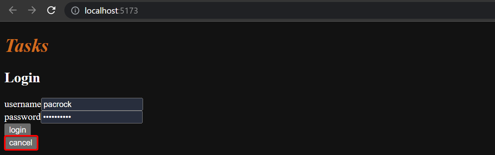
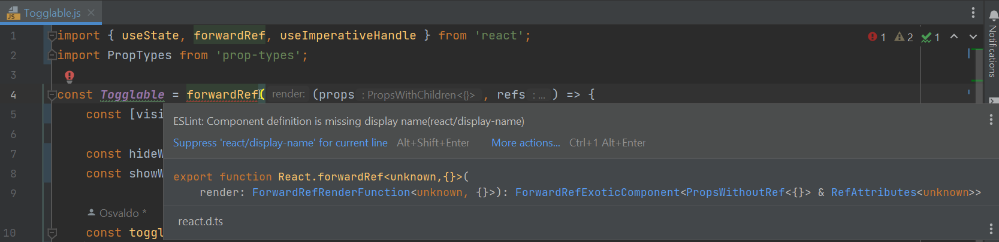
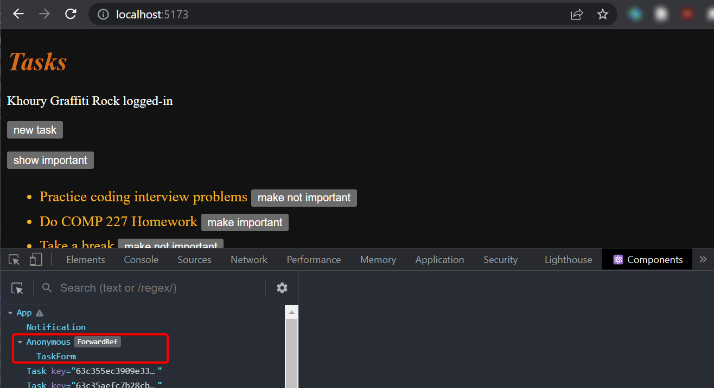
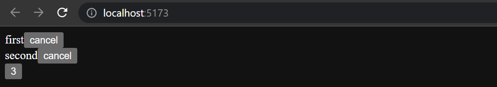
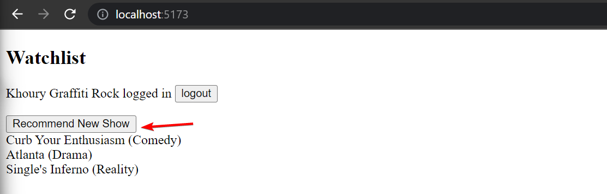
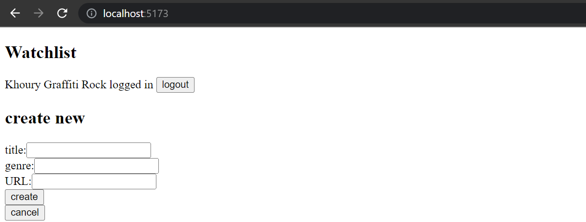
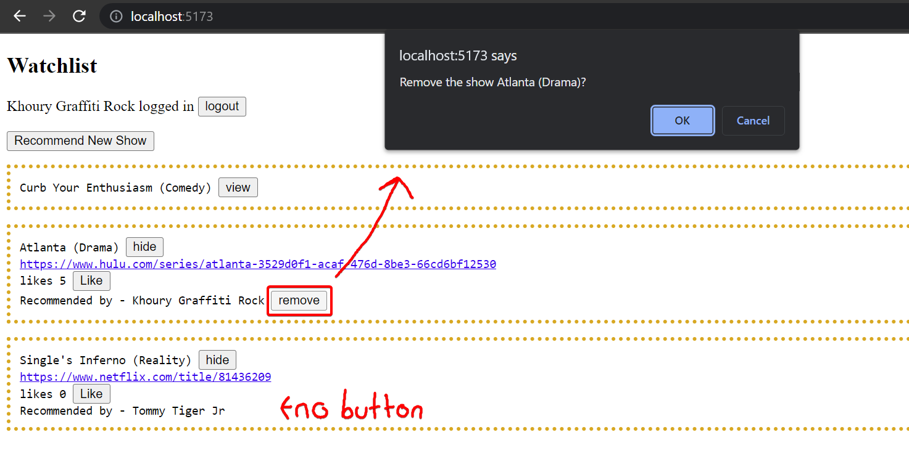
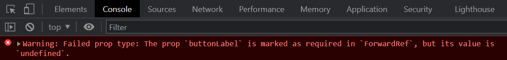
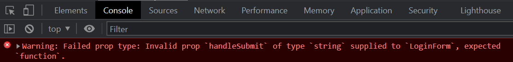

<div class="content">

### Displaying the login form only when appropriate

Let's modify the application so that the login form is not displayed by default:

![browser showing log in button by default]

Rather, the login form appears when the user presses the ***login*** button.



The user can then close the login form by clicking the ***cancel*** button.

Let's start by extracting the login form into a separate component and file:

```js
const LoginForm = ({
   handleSubmit,
   handleUsernameChange,
   handlePasswordChange,
   username,
   password
  }) => {
  return (
    <div>
      <h2>Login</h2>
      <form onSubmit={handleSubmit}>
        <div>
          username
          <input
            value={username}
            onChange={handleUsernameChange}
          />
        </div>
        <div>
          password
          <input
            type="password"
            value={password}
            onChange={handlePasswordChange}
          />
      </div>
        <button type="submit">login</button>
      </form>
    </div>
  )
}

export default LoginForm
```

The state and all the functions related to it are defined outside of the component and are passed to the component as *props*.

Notice that the *`props`* are assigned to variables through **destructuring**, which means that instead of writing:

```js
const LoginForm = (props) => {
  return (
    <div>
      <h2>Login</h2>
      <form onSubmit={props.handleSubmit}> // highlight-line
        <div>
          username
          <input
            value={props.username} // highlight-line
            onChange={props.handleChange} // highlight-line
            name="username"
          />
        </div>
        // ...
        <button type="submit">login</button>
      </form>
    </div>
  )
}
```

where the properties are accessed through the `props` object like `props.handleSubmit`.
Instead, the properties are assigned directly to variables.

One fast way of implementing the functionality is to replace the `loginForm` function of the `App` component and introduce a new state variable:

```js
const App = () => {
  const [loginVisible, setLoginVisible] = useState(false) // highlight-line

  // ...

  const loginForm = () => {
    const hideWhenVisible = { display: loginVisible ? 'none' : '' }
    const showWhenVisible = { display: loginVisible ? '' : 'none' }

    return (
      <div>
        <div style={hideWhenVisible}>
          <button onClick={() => setLoginVisible(true)}>login</button>
        </div>
        <div style={showWhenVisible}>
          <LoginForm
            username={username}
            password={password}
            handleUsernameChange={({ target }) => setUsername(target.value)}
            handlePasswordChange={({ target }) => setPassword(target.value)}
            handleSubmit={handleLogin}
          />
          <button onClick={() => setLoginVisible(false)}>cancel</button>
        </div>
      </div>
    )
  }

  // ...
}
```

***You'll see that there will be a warning with `LoginForm` because we did not import it.***
Use WebStorm's context actions (hopefully using the keyboard shortcut) to select the option to *add the import statement*.
The `App` components state now contains the boolean `loginVisible`, which defines if the login form should be shown to the user or not.

The value of `loginVisible` is toggled with two buttons.
Both buttons have their event handlers defined directly in the component:

```js
<button onClick={() => setLoginVisible(true)}>login</button>

<button onClick={() => setLoginVisible(false)}>cancel</button>
```

The visibility of the component is defined by giving the component an [inline style rule](/part2/adding_styles_to_react_app#inline-styles),
where the value of the [`display` property](https://developer.mozilla.org/en-US/docs/Web/CSS/display) is `none` if we do not want the component to be displayed:

```js
const hideWhenVisible = { display: loginVisible ? 'none' : '' }
const showWhenVisible = { display: loginVisible ? '' : 'none' }

<div style={hideWhenVisible}>
  // button
</div>

<div style={showWhenVisible}>
  // button
</div>
```

We are once again using the ***`?:` ternary operator***.
If `loginVisible` is `true`, then the CSS rule of the component will be:

```css
display: 'none';
```

If `loginVisible` is `false`, then `display` will not receive any value related to the visibility of the component.

> **FYI:**, Since we are moving components, I'm going to show you how to move the `Footer` component outside of *App.jsx*.
> Select the entire function for `Footer`, and then in Webstorm, select *Refactor->Move*.
> Then in the ***To*** field, make sure to add the *Components* Folder in between *src* and *Footer.jsx*
> Make sure that only Footer is selected as the member to move, and click ***Refactor***.
> Notice how Webstorm added the import and export portions and moved the `Footer` to its own file, *components/Footer.jsx*!
> Remember ***utilize the IDE to help you refactor when possible***.

### The components children, AKA props.children

The code related to managing the visibility of the login form could be considered to be its own logical entity,
and for this reason, it would be good to extract it from the `App` component into a separate component.

Our goal is to implement a new `Togglable` component that can be used in the following way:

```js
<Togglable buttonLabel='login'> // highlight-line
  <LoginForm
    username={username}
    password={password}
    handleUsernameChange={({ target }) => setUsername(target.value)}
    handlePasswordChange={({ target }) => setPassword(target.value)}
    handleSubmit={handleLogin}
  />
</Togglable> // highlight-line
```

The way that the component is used is slightly different from our previous components.
The component has both opening and closing tags that surround a `LoginForm` component.
In React terminology, *`LoginForm` is a **child component** of `Togglable`*.

We can add any React elements within `Togglable`'s tags, like this for example:

```js
<Togglable buttonLabel="reveal">
  <p>this line is hidden at the start</p> // highlight-line
  <p>also this is hidden</p> // highlight-line
</Togglable>
```

The code for the `Togglable` component is shown below:

```js
import { useState } from 'react'

const Togglable = (props) => {
  const [visible, setVisible] = useState(false)

  const hideWhenVisible = { display: visible ? 'none' : '' }
  const showWhenVisible = { display: visible ? '' : 'none' }

  const toggleVisibility = () => {
    setVisible(!visible)
  }

  return (
    <div>
      <div style={hideWhenVisible}>
        <button onClick={toggleVisibility}>{props.buttonLabel}</button>
      </div>
      <div style={showWhenVisible}>
        {props.children} // highlight-line
        <button onClick={toggleVisibility}>cancel</button>
      </div>
    </div>
  )
}

export default Togglable
```

The new and interesting part of the code is [**`props.children`**](https://react.dev/learn/passing-props-to-a-component#passing-jsx-as-children),
which is used for referencing the child components of the component.
The **child components** are the React elements that we define between the opening and closing tags of a component.

This time the *children are rendered from within the parent component*:

```js
<div style={showWhenVisible}>
  {props.children}
  <button onClick={toggleVisibility}>cancel</button>
</div>
```

Unlike the normal props we've seen before, ***`children`*** are:

- automatically added by React
- *always exist*.

If a component is defined with an automatically closing `/>` tag, like this:

```js
<Task
  key={task.id}
  task={task}
  toggleImportance={() => toggleImportanceOf(task.id)}
/>
```

Then `props.children` still exists, it's just an empty array.

The `Togglable` component is **reusable** and we can use it to add similar functionality to the form that creates tasks.

Before we do that, let's extract the form for creating tasks into a component:

```js
const TaskForm = ({ onSubmit, handleChange, value}) => {
  return (
    <div>
      <h2>Create a new task</h2>

      <form onSubmit={onSubmit}>
        <input
          value={value}
          onChange={handleChange}
        />
        <button type="submit">save</button>
      </form>
    </div>
  )
}
```

Next, let's define the form component inside of a `Togglable` component in our `taskForm` function in `App.jsx`:

```js
<Togglable buttonLabel="new task">
  <TaskForm
    onSubmit={addTask}
    value={newTask}
    handleChange={handleTaskChange}
  />
</Togglable>
```

You can find the code for our current application in its entirety in the *part5-4* branch of
[this GitHub repository](https://github.com/comp227/part2-tasks/tree/part5-4).

### State of the forms

The state of the application is currently in the `App` component.

Is this where we should keep that state?
Here's what the [React documentation says](https://react.dev/learn/sharing-state-between-components):

> *Sometimes, you want the state of two components to always change together.*
> *We recommend lifting that shared state up to their closest common ancestor, and then pass it down via **props**.*

If we think about the *state* in the forms, like a new task's contents, ***the `App` component does not need it for anything***.
We could move the state in `App` into the appropriate subcomponents.

We'll start by modifying *TaskForm.jsx* to have the task creation state.

```js
import { useState } from 'react'

const TaskForm = ({ createTask }) => {
  const [newTask, setNewTask] = useState('') 

  const addTask = (event) => {
    event.preventDefault()
    createTask({
      content: newTask,
      important: false, // highlight-line
    })

    setNewTask('')
  }

  return (
    <div>
      <h2>Create a new task</h2>

      <form onSubmit={addTask}>
        <input
          value={newTask}
          onChange={event => setNewTask(event.target.value)}
        />
        <button type="submit">save</button>
      </form>
    </div>
  )
}

export default TaskForm
```

> **NOTE** To make task creation work the same, we changed the application so that tasks are ***unimportant by default***.
> The highlighted line above shows `important` now having the value `false`.

The `newTask` state attribute and its change event handler have been moved from the `App` component to the component responsible for the task form.

`TaskForm` has one prop left, the `createTask` function, which the form calls when a new task is created.

The `App` component becomes simpler now that we have moved the `newTask` state and its event handler.
The `addTask` function for creating new tasks receives a new task as a parameter, and the function is the only prop we send to the form:

```js
const App = () => {
  // ...
  const addTask = (taskObject) => { //highlight-line
    taskService
      .create(taskObject)
      .then(returnedTask => {
        setTasks(tasks.concat(returnedTask))
      })
  }
  // ...
  const taskForm = () => (
    <Togglable buttonLabel="new task">
      <TaskForm createTask={addTask} />
    </Togglable>
  )

  // ...
}
```

We could do the same for the login form, but we'll leave that for an optional exercise.

The application code can be found on [GitHub](https://github.com/comp227/part2-tasks/tree/part5-5),
branch *part5-5*.

### References to components with ref

Our current implementation works; it does have one aspect that could be improved.

After a *new task is created, it would make sense to hide the new task form*.
Currently, the form stays visible.
There is a slight problem with hiding the form.
*The visibility is controlled with the `visible` variable inside of the `Togglable` component*.
***How can we access it outside of the component?***

There are many ways to implement closing the form from the parent component,
but let's use the [**ref**](https://react.dev/learn/referencing-values-with-refs) mechanism of React, which *offers a reference to the component*.

Let's make these changes to the `App` component:

```js
import { useState, useEffect, useRef } from 'react' // highlight-line

const App = () => {
  // ...
  const taskFormRef = useRef() // highlight-line

  const taskForm = () => (
    <Togglable buttonLabel="new task" ref={taskFormRef}>  // highlight-line
      <TaskForm createTask={addTask} />
    </Togglable>
  )

  // ...
}
```

The [`useRef` hook](https://react.dev/reference/react/useRef) is used to create a `taskFormRef` ref,
that is assigned to the `Togglable` component containing the creation task form.
The **`taskFormRef` variable acts as a reference to the component**.
This hook ensures the same reference (*ref*) that is kept throughout re-renders of the component.

We also need to make the following changes to the `Togglable` component:

```js
import { useState, forwardRef, useImperativeHandle } from 'react' // highlight-line

const Togglable = forwardRef((props, refs) => { // highlight-line
  const [visible, setVisible] = useState(false)

  const hideWhenVisible = { display: visible ? 'none' : '' }
  const showWhenVisible = { display: visible ? '' : 'none' }

  const toggleVisibility = () => {
    setVisible(!visible)
  }

// highlight-start
  useImperativeHandle(refs, () => {
    return {
      toggleVisibility
    }
  })
// highlight-end

  return (
    <div>
      <div style={hideWhenVisible}>
        <button onClick={toggleVisibility}>{props.buttonLabel}</button>
      </div>
      <div style={showWhenVisible}>
        {props.children}
        <button onClick={toggleVisibility}>cancel</button>
      </div>
    </div>
  )
})  // highlight-line

export default Togglable
```

The function that creates the component is wrapped inside of a [`forwardRef`](https://react.dev/reference/react/forwardRef) function call.
This way the component can access the ref that is assigned to it.

The component uses the [`useImperativeHandle`](https://react.dev/reference/react/useImperativeHandle) hook
to make its `toggleVisibility` function available outside of the component.

> **FYI:** If you add this code as is and you already have eslint configured,
> you might see that Component `Togglable` causes a nasty-looking warning:
> *Component definition is missing display name*:
>
> 
>
> You can read more about this ESlint rule in the
> [ESlint react plugin's docs](https://github.com/yannickcr/eslint-plugin-react/blob/master/docs/rules/display-name.md).
> In short, this rule is about helping you better debug your code.
> If you run the program, you might notice that *react-devtools* shows this component without a name:
>
> 
>
> A quick fix is to assign our component a *`displayName`* property:
>
> ```js
> const Togglable = React.forwardRef((props, ref) => {
>   // ...
> })
>
> Togglable.displayName = 'Togglable'; // highlight-line
>
> export default Togglable
> ```

We can now hide the form by calling `taskFormRef.current.toggleVisibility()` after a new task has been created:

```js
const App = () => {
  // ...
  const addTask = (taskObject) => {
    taskFormRef.current.toggleVisibility() // highlight-line
    taskService
      .create(taskObject)
      .then(returnedTask => {     
        setTasks(tasks.concat(returnedTask))
      })
  }
  // ...
}
```

To recap, the [**`useImperativeHandle`**](https://react.dev/reference/react/useImperativeHandle) function is a React hook,
that is used for defining functions in a component, which can be invoked from outside of the component.

This trick works for changing the state of a component, but it looks a bit unpleasant.
We could have accomplished the same functionality with slightly cleaner code using "old React" class-based components.
We will take a look at these class components during part 7 of the course material.
So far this is the only situation where using React hooks leads to code that is not cleaner than with class components.

There are also [other use cases](https://react.dev/learn/manipulating-the-dom-with-refs) for refs than accessing React components.

You can find the code for our current application in its entirety in the *part5-6* branch of
[this GitHub repository](https://github.com/comp227/part2-tasks/tree/part5-6).

### One point about components

When we define a component in React:

```js
const Togglable = () => ...
  // ...
}
```

And use it like this:

```js
<div>
  <Togglable buttonLabel="1" ref={togglable1}>
    first
  </Togglable>

  <Togglable buttonLabel="2" ref={togglable2}>
    second
  </Togglable>

  <Togglable buttonLabel="3" ref={togglable3}>
    third
  </Togglable>
</div>
```

We create *three separate instances of the component* that all ***have their separate state***:



The `ref` attribute is used for assigning a reference to each of the components in the variables above: `togglable1`, `togglable2` and `togglable3`.

### Web developers pledge v5

We will once again update
[our web developer pledge](/part4/testing_the_backend#web-developers-pledge-v4)
but will also add a few more items:

> I also pledge to:
>
> - *Ensure the frontend works if I suspect a bug in the backend*
> - *Ensure the backend works if I suspect a bug in the frontend*

</div>

<div class="tasks">

### Exercises 5.5-5.11

> ***Hint:***: If you're stuck on one of these exercises, why not revisit `populate`?

#### 5.5 Watchlist frontend, Step 5

Change the form for creating shows so that it is only displayed when appropriate.
Use functionality similar to what was shown [earlier in this part of the course material](/part5/props_children_and_proptypes#displaying-the-login-form-only-when-appropriate).
If you wish to do so, you can use the `Togglable` component defined in part 5.

By default, the form is not visible



It expands when the button ***Recommend New Show*** is clicked



The form closes when a new show has been added.

#### 5.6 Watchlist frontend, Step 6

Separate the form for recommending a new show into its own component (if you have not already done so),
and move all the states required for recommending a new show to this component.

The component must work like the `TaskForm` component from this [previously covered part](/part5/props_children_and_proptypes).

#### 5.7* Watchlist frontend, Step 7

Let's add a button to each show, which controls whether all of the details about the show are shown or not.

Full details of the show open when the button is clicked.


And the details are hidden when the button is clicked again.

At this point, the ***like*** button does not need to do anything.

The application shown in the picture has a bit of additional CSS to improve its appearance.

It is easy to add styles to the application as shown in part 2 using [inline](/part2/adding_styles_to_react_app#inline-styles) styles:

```js
const Show = ({ show }) => {
  const showStyle = {
    padding: 10,
    border: 'dotted',
    borderWidth: 4,
    borderColor: 'goldenrod',
    marginTop: 15,
    fontFamily: 'monospace'
  }

  return (
    <div style={showStyle}> // highlight-line
      <div>
        {show.title} ({show.genre})
      </div>
      // ...
  </div>
)}
```

> **Pertinent:** even though the functionality implemented in this part is almost identical to the functionality provided by the `Togglable` component,
the component can not be used directly to achieve the desired behavior.
The easiest solution will be ***to add a state to the show that controls the displayed form of the show***.

#### 5.8: Watchlist frontend, Step 8

Implement the functionality for the like button.
Likes are increased by making an HTTP ***PUT*** request to the unique address of the show in the backend.

Since the backend operation replaces the entire show, you will have to send all of its fields in the request body.
If you wanted to add a like to the following show:

```js
{
    _id: "5a43fde2cbd20b12a2c34e91",
  user: {
      _id: "5a43e6b6c37f3d065eaaa581",
    username: "powercat",
    name: "Tommy Tiger Jr"
  },
  likes: 0,
  genre: "Comedy",
  title: "Silicon Valley",
  url: "https://www.hbo.com/silicon-valley"
},
```

You would have to make an HTTP PUT request to the address ***/api/shows/5a43fde2cbd20b12a2c34e91*** with the following request data:

```js
{
    user: "5a43e6b6c37f3d065eaaa581",
  likes: 1,
  genre: "Comedy",
  title: "Silicon Valley",
  url: "https://www.hbo.com/silicon-valley"
}
```

The backend also has to be updated to handle the user reference.

**One last warning:** if you notice that you are using `async`/`await` and the `then` method in the same code,
it is almost certain that you are doing something wrong.
Stick to using one or the other, and never use both at the same time "just in case".

#### 5.9: Watchlist frontend, Step 9

You may have noticed that something might be wrong with your app.
When a new show is recommended in the app, the name of the user that recommended that show may not be shown in the details of the show:

<!--  -->

It's only when we reload the browser, that the information of the person is displayed.
This is not acceptable, find out where the problem is and make the necessary correction.

#### 5.10: Watchlist frontend, Step 10

Modify the application to list the shows by the number of ***likes***.
Sorting the shows can be done with the array's [`sort` method](https://developer.mozilla.org/en-US/docs/Web/JavaScript/Reference/Global_Objects/Array/sort).

#### 5.11: Watchlist frontend, Step 11

Add a new button for deleting shows.
Also, implement the logic for deleting shows in the frontend.

Your application could look something like this:



The confirmation dialog for deleting a recommended show is easy to implement with the [`window.confirm` function](https://developer.mozilla.org/en-US/docs/Web/API/Window/confirm).

Show the button for deleting a recommended show ***only if the show was added by the user***.

</div>

<div class="content">

### PropTypes

The `Togglable` component assumes that it is given the text for the button via the `buttonLabel` prop.
If we forget to define it to the component:

```js
<Togglable> buttonLabel forgotten... </Togglable>
```

The application works, but the browser renders a button that has no label text.

We would like to enforce that *when the `Togglable` component is used, the **`buttonLabel` text prop must be defined***.

The expected and required props of a component can be defined with the [*prop-types* package](https://github.com/facebook/prop-types).
Let's install the package:

```shell
npm i prop-types
```

We can define the `buttonLabel` prop as **required** for `Togglable` as shown below:

```js
import PropTypes from 'prop-types'
// ..

const Togglable = React.forwardRef((props, ref) => {
  // ..
})

Togglable.displayName = "Togglable"
// highlight-start
Togglable.propTypes = {
  buttonLabel: PropTypes.string.isRequired
}
// highlight-end
```

The console will display the following error message if the prop is left undefined:



The application still works and nothing forces us to define props despite the `PropTypes` definitions.
Mind you, *it is unprofessional to leave **any** red output in the browser console*.

Let's also define `PropTypes` to the `LoginForm` component:

```js
import PropTypes from 'prop-types'

const LoginForm = ({
   handleSubmit,
   handleUsernameChange,
   handlePasswordChange,
   username,
   password
  }) => {
    // ...
}

LoginForm.propTypes = {
  handleSubmit: PropTypes.func.isRequired,
  handleUsernameChange: PropTypes.func.isRequired,
  handlePasswordChange: PropTypes.func.isRequired,
  username: PropTypes.string.isRequired,
  password: PropTypes.string.isRequired
}
```

If the type of a passed prop is wrong, e.g. if we try to define the `handleSubmit` prop as a string, then this will result in the following warning:



### ESlint

In part 3 we configured the [ESlint](/part3/validation_and_es_lint#lint) code style tool to the backend.
Let's take ESlint to use in the frontend as well.

Vite has installed ESlint to the project by default, so all that's left for us to do is define our desired configuration in the *.eslintrc.cjs* file.

Next, we will start testing the frontend and to avoid undesired and irrelevant linter errors
we will install the [eslint-plugin-jest](https://www.npmjs.com/package/eslint-plugin-jest) package:

```bash
npm i -D eslint-plugin-jest
```

Let's create a *.eslintrc.cjs* file with the following contents:

```js
module.exports = {
  root: true,
  env: {
    browser: true,
    es2020: true,
    "jest/globals": true
  },
  extends: [
    'eslint:recommended',
    'plugin:react/recommended',
    'plugin:react/jsx-runtime',
    'plugin:react-hooks/recommended',
  ],
  ignorePatterns: ['dist', '.eslintrc.cjs'],
  parserOptions: { ecmaVersion: 'latest', sourceType: 'module' },
  settings: { react: { version: '18.2' } },
  plugins: ['react-refresh', 'jest'],
  rules: {
    "indent": [
        "error",
        4
    ],
    "linebreak-style": [
        "error",
        "unix"
    ],
    "quotes": [
        "error",
        "double"
    ],
    "semi": [
        "error",
        "always"
    ],
    "eqeqeq": "error",
    "no-trailing-spaces": "error",
    "object-curly-spacing": [
        "error", "always"
    ],
    "arrow-spacing": [
        "error", { "before": true, "after": true }
    ],
    'react-refresh/only-export-components': [
      'warn',
      { allowConstantExport: true },
    ],
    "no-console": 0,
    "no-debugger": 0,
    "react/react-in-jsx-scope": "off",
    "react/prop-types": 0,
  }
}
```

> Reminder: We may need to turn on our ESLint settings like we did in [part 3](/part3/validation_and_es_lint#configure-webstorm-with-eslint)
> Make sure that you turn on *`--eslint-fix-on-save`* and configure the node interpreter for this new project again.
> If you are running into issues I would restart WebStorm.
> You can also introduce a space anywhere in a file and then save and it should then fix all the errors.
> We may update this with additional configurations, but for now, you can ask in discord if there are any issues.

Let's also create [.eslintignore](https://eslint.org/docs/user-guide/configuring#ignoring-files-and-directories) file with the following contents to the repository root

```bash
node_modules
dist
.eslintrc.cjs
```

Now the directories *dist* and *node_modules* will be skipped when linting.

As usual, you can perform the linting either from the command line with the command

```bash
npm run Lint
```

or using the editor's Eslint plugin.

> **Pertinent:** Before you continue, ***make sure to fix all of the eslint errors,***
> since our configuration is introducing new rules
> that we have not exactly followed up until this point in time.

You can find the code for our current application in its entirety in the *part5-7* branch of
[this GitHub repository](https://github.com/comp227/part2-tasks/tree/part5-7).

</div>

<div class="tasks">

### Exercises 5.12

#### 5.12: Watchlist frontend, Step 12

Define `PropTypes` for one of the components of your application, and ***Add ESlint to the project.***
Define the configuration according to your liking.
Fix all of the linter errors.

Vite has installed ESlint to the project by default, so all that's left for you to do is define your desired configuration in the *.eslintrc.cjs* file.

</div>
