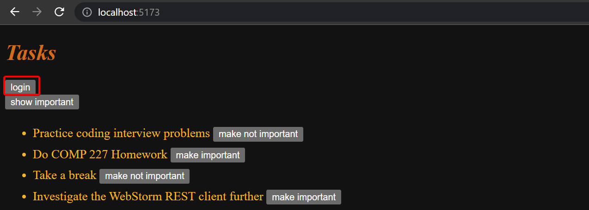

<div class="content">

### Displaying the login form only when appropriate

Let's modify the application so that the login form is not displayed by default:



The login form appears when the user presses the ***login*** button:


The user can close the login form by clicking the ***cancel*** button.

Let's start by extracting the login form into its own component:

```js
const LoginForm = ({
   handleSubmit,
   handleUsernameChange,
   handlePasswordChange,
   username,
   password
  }) => {
  return (
    <div>
      <h2>Login</h2>

      <form onSubmit={handleSubmit}>
        <div>
          username
          <input
            value={username}
            onChange={handleUsernameChange}
          />
        </div>
        <div>
          password
          <input
            type="password"
            value={password}
            onChange={handlePasswordChange}
          />
      </div>
        <button type="submit">login</button>
      </form>
    </div>
  )
}

export default LoginForm
```

The state and all the functions related to it are defined outside of the component and are passed to the component as props.

Notice that the props are assigned to variables through **destructuring**, which means that instead of writing:

```js
const LoginForm = (props) => {
  return (
    <div>
      <h2>Login</h2>
      <form onSubmit={props.handleSubmit}> // highlight-line
        <div>
          username
          <input
            value={props.username} // highlight-line
            onChange={props.handleChange} // highlight-line
            name="username"
          />
        </div>
        // ...
        <button type="submit">login</button>
      </form>
    </div>
  )
}
```

where the properties are accessed through the `prop` object like `props.handleSubmit`.
Instead, the properties are assigned directly to their own variables.

One fast way of implementing the functionality is to change the `loginForm` function of the `App` component like so:

```js
const App = () => {
  const [loginVisible, setLoginVisible] = useState(false) // highlight-line

  // ...

  const loginForm = () => {
    const hideWhenVisible = { display: loginVisible ? 'none' : '' }
    const showWhenVisible = { display: loginVisible ? '' : 'none' }

    return (
      <div>
        <div style={hideWhenVisible}>
          <button onClick={() => setLoginVisible(true)}>log in</button>
        </div>
        <div style={showWhenVisible}>
          <LoginForm
            username={username}
            password={password}
            handleUsernameChange={({ target }) => setUsername(target.value)}
            handlePasswordChange={({ target }) => setPassword(target.value)}
            handleSubmit={handleLogin}
          />
          <button onClick={() => setLoginVisible(false)}>cancel</button>
        </div>
      </div>
    )
  }

  // ...
}
```

You'll see that there will be a warning with LoginForm because we did not import it.
Use WebStorm's context actions (hopefully using the keyboard shortcut) to select the option to *add the import statement*.
The `App` components state now contains the boolean `loginVisible`, which defines if the login form should be shown to the user or not.

The value of `loginVisible` is toggled with two buttons.
Both buttons have their event handlers defined directly in the component:

```js
<button onClick={() => setLoginVisible(true)}>log in</button>

<button onClick={() => setLoginVisible(false)}>cancel</button>
```

The visibility of the component is defined by giving the component an [inline](/part2/adding_styles_to_react_app#inline-styles) style rule,
where the value of the [display](https://developer.mozilla.org/en-US/docs/Web/CSS/display) property is `none` if we do not want the component to be displayed:

```js
const hideWhenVisible = { display: loginVisible ? 'none' : '' }
const showWhenVisible = { display: loginVisible ? '' : 'none' }

<div style={hideWhenVisible}>
  // button
</div>

<div style={showWhenVisible}>
  // button
</div>
```

We are once again using the ***`?:` ternary operator***.
If `loginVisible` is `true`, then the CSS rule of the component will be:

```css
display: 'none';
```

If `loginVisible` is `false`, then `display` will not receive any value related to the visibility of the component.

### The components children, AKA props.children

The code related to managing the visibility of the login form could be considered to be its own logical entity,
and for this reason, it would be good to extract it from the `App` component into a separate component.

Our goal is to implement a new `Togglable` component that can be used in the following way:

```js
<Togglable buttonLabel='login'> // highlight-line
  <LoginForm
    username={username}
    password={password}
    handleUsernameChange={({ target }) => setUsername(target.value)}
    handlePasswordChange={({ target }) => setPassword(target.value)}
    handleSubmit={handleLogin}
  />
</Togglable> // highlight-line
```

The way that the component is used is slightly different from our previous components.
The component has both opening and closing tags that surround a `LoginForm` component.
In React terminology, *`LoginForm` is a **child component** of `Togglable`*.

We can add any React elements within `Togglable`'s tags, like this for example:

```js
<Togglable buttonLabel="reveal">
  <p>this line is hidden at the start</p> // highlight-line
  <p>also this is hidden</p> // highlight-line
</Togglable>
```

The code for the `Togglable` component is shown below:

```js
import { useState } from 'react'

const Togglable = (props) => {
  const [visible, setVisible] = useState(false)

  const hideWhenVisible = { display: visible ? 'none' : '' }
  const showWhenVisible = { display: visible ? '' : 'none' }

  const toggleVisibility = () => {
    setVisible(!visible)
  }

  return (
    <div>
      <div style={hideWhenVisible}>
        <button onClick={toggleVisibility}>{props.buttonLabel}</button>
      </div>
      <div style={showWhenVisible}>
        {props.children} // highlight-line
        <button onClick={toggleVisibility}>cancel</button>
      </div>
    </div>
  )
}

export default Togglable
```

The new and interesting part of the code is [**`props.children`**](https://reactjs.org/docs/glossary.html#propschildren),
which is used for referencing the child components of the component.
The **child components** are the React elements that we define between the opening and closing tags of a component.

This time the *children are rendered from within the parent component*:

```js
<div style={showWhenVisible}>
  {props.children}
  <button onClick={toggleVisibility}>cancel</button>
</div>
```

Unlike the normal props we've seen before, ***`children`*** is automatically added by React and *always exists*.
If a component is defined with an automatically closing `/>` tag, like this:

```js
<Task
  key={task.id}
  task={task}
  toggleImportance={() => toggleImportanceOf(task.id)}
/>
```

Then `props.children` still exists, it's just an empty array.

The `Togglable` component is **reusable** and we can use it to add similar functionality to the form that creates tasks.

Before we do that, let's extract the form for creating tasks into a component:

```js
const TaskForm = ({ onSubmit, handleChange, value}) => {
  return (
    <div>
      <h2>Create a new task</h2>

      <form onSubmit={onSubmit}>
        <input
          value={value}
          onChange={handleChange}
        />
        <button type="submit">save</button>
      </form>
    </div>
  )
}
```

Next, let's define the form component inside of a `Togglable` component:

```js
<Togglable buttonLabel="new task">
  <TaskForm
    onSubmit={addTask}
    value={newTask}
    handleChange={handleTaskChange}
  />
</Togglable>
```

You can find the code for our current application in its entirety in the *part5-4* branch of
[this GitHub repository](https://github.com/comp227/part2-tasks/tree/part5-4).

### State of the forms

The state of the application currently is in the `App` component.

React documentation says the [following](https://reactjs.org/docs/lifting-state-up.html) about where to place the state:

> *Often, several components need to reflect the same changing data.
> We recommend lifting the shared state up to their closest common ancestor.*

If we think about the *state* in the forms, like a new task's contents, the `App` component does not need it for anything.
We could move the state contained in the forms into their more closely related components.

The component for a task changes like so:

```js
import { useState } from 'react' 

const TaskForm = ({ createTask }) => {
  const [newTask, setNewTask] = useState('') 

  const handleChange = (event) => {
    setNewTask(event.target.value)
  }

  const addTask = (event) => {
    event.preventDefault()
    createTask({
      content: newTask,
      important: Math.random() > 0.5,
    })

    setNewTask('')
  }

  return (
    <div>
      <h2>Create a new task</h2>

      <form onSubmit={addTask}>
        <input
          value={newTask}
          onChange={handleChange}
        />
        <button type="submit">save</button>
      </form>
    </div>
  )
}

export default TaskForm
```

The `newTask` state attribute and the event handler responsible for changing it have been moved from the `App` component to the component responsible for the task form.

There is only one prop left, the `createTask` function, which the form calls when a new task is created.

The `App` component becomes simpler now that we have got rid of the `newTask` state and its event handler.
The `addTask` function for creating new tasks receives a new task as a parameter, and the function is the only prop we send to the form:

```js
const App = () => {
  // ...
  const addTask = (taskObject) => {
    taskService
      .create(taskObject)
      .then(returnedTask => {
        setTasks(tasks.concat(returnedTask))
      })
  }
  // ...
  const taskForm = () => (
    <Togglable buttonLabel='new task'>
      <TaskForm createTask={addTask} />
    </Togglable>
  )

  // ...
}
```

We could do the same for the login form, but we'll leave that for an optional exercise.

The application code can be found on [GitHub](https://github.com/comp227/part2-tasks/tree/part5-5),
branch *part5-5*.

### References to components with ref

Our current implementation is quite good; it has one aspect that could be improved.

After a new task is created, it would make sense to hide the new task form.
Currently, the form stays visible.
There is a slight problem with hiding the form.
*The visibility is controlled with the `visible` variable inside of the `Togglable` component*.
***How can we access it outside of the component?***

There are many ways to implement closing the form from the parent component,
but let's use the [**ref**](https://reactjs.org/docs/refs-and-the-dom.html) mechanism of React, which offers a reference to the component.

Let's make the following changes to the `App` component:

```js
import { useState, useEffect, useRef } from 'react' // highlight-line

const App = () => {
  // ...
  const taskFormRef = useRef() // highlight-line

  const taskForm = () => (
    <Togglable buttonLabel='new task' ref={taskFormRef}>  // highlight-line
      <TaskForm createTask={addTask} />
    </Togglable>
  )

  // ...
}
```

The [useRef](https://reactjs.org/docs/hooks-reference.html#useref) hook is used to create a `taskFormRef` ref,
that is assigned to the `Togglable` component containing the creation task form.
The `taskFormRef` variable acts as a reference to the component.
This hook ensures the same reference (ref) that is kept throughout re-renders of the component.

We also need to make the following changes to the `Togglable` component:

```js
import { useState, forwardRef, useImperativeHandle } from 'react' // highlight-line

const Togglable = forwardRef((props, refs) => { // highlight-line
  const [visible, setVisible] = useState(false)

  const hideWhenVisible = { display: visible ? 'none' : '' }
  const showWhenVisible = { display: visible ? '' : 'none' }

  const toggleVisibility = () => {
    setVisible(!visible)
  }

// highlight-start
  useImperativeHandle(refs, () => {
    return {
      toggleVisibility
    }
  })
// highlight-end

  return (
    <div>
      <div style={hideWhenVisible}>
        <button onClick={toggleVisibility}>{props.buttonLabel}</button>
      </div>
      <div style={showWhenVisible}>
        {props.children}
        <button onClick={toggleVisibility}>cancel</button>
      </div>
    </div>
  )
})  // highlight-line

export default Togglable
```

The function that creates the component is wrapped inside of a [`forwardRef`](https://reactjs.org/docs/react-api.html#reactforwardref) function call.
This way the component can access the ref that is assigned to it.

The component uses the [`useImperativeHandle`](https://reactjs.org/docs/hooks-reference.html#useimperativehandle) hook
to make its `toggleVisibility` function available outside of the component.

We can now hide the form by calling `taskFormRef.current.toggleVisibility()` after a new task has been created:

```js
const App = () => {
  // ...
  const addTask = (taskObject) => {
    taskFormRef.current.toggleVisibility() // highlight-line
    taskService
      .create(taskObject)
      .then(returnedTask => {     
        setTasks(tasks.concat(returnedTask))
      })
  }
  // ...
}
```

To recap, the [**`useImperativeHandle`**](https://reactjs.org/docs/hooks-reference.html#useimperativehandle) function is a React hook,
that is used for defining functions in a component, which can be invoked from outside of the component.

This trick works for changing the state of a component, but it looks a bit unpleasant.
We could have accomplished the same functionality with slightly cleaner code using "old React" class-based components.
We will take a look at these class components during part 7 of the course material.
So far this is the only situation where using React hooks leads to code that is not cleaner than with class components.

There are also [other use cases](https://reactjs.org/docs/refs-and-the-dom.html) for refs than accessing React components.

You can find the code for our current application in its entirety in the *part5-6* branch of
[this GitHub repository](https://github.com/comp227/part2-tasks/tree/part5-6).

### One point about components

When we define a component in React:

```js
const Togglable = () => ...
  // ...
}
```

And use it like this:

```js
<div>
  <Togglable buttonLabel="1" ref={togglable1}>
    first
  </Togglable>

  <Togglable buttonLabel="2" ref={togglable2}>
    second
  </Togglable>

  <Togglable buttonLabel="3" ref={togglable3}>
    third
  </Togglable>
</div>
```

We create *three separate instances of the component* that all have their separate state:


The `ref` attribute is used for assigning a reference to each of the components in the variables `togglable1`, `togglable2` and `togglable3`.

</div>

<div class="tasks">

### Exercises 5.5-5.10

#### 5.5 Watchlist frontend, step5

Change the form for creating shows so that it is only displayed when appropriate.
Use functionality similar to what was shown [earlier in this part of the course material](/part5/props_children_and_proptypes#displaying-the-login-form-only-when-appropriate).
If you wish to do so, you can use the `Togglable` component defined in part 5.

By default, the form is not visible


It expands when the button ***Recommend New Show*** is clicked


The form closes when a new show has been added.

#### 5.6 Watchlist frontend, step6

Separate the form for recommending a new show into its own component (if you have not already done so),
and move all the states required for recommending a new show to this component.

The component must work like the `TaskForm` component from this [previously covered part](/part5/props_children_and_proptypes).

#### 5.7* Watchlist frontend, step7

Let's add a button to each show, which controls whether all of the details about the show are shown or not.

Full details of the show open when the button is clicked.


And the details are hidden when the button is clicked again.

At this point, the ***like*** button does not need to do anything.

The application shown in the picture has a bit of additional CSS to improve its appearance.

It is easy to add styles to the application as shown in part 2 using [inline](/part2/adding_styles_to_react_app#inline-styles) styles:

```js
const Show = ({ show }) => {
  const showStyle = {
    padding: 10,
    border: "dotted",
    borderWidth: 4,
    borderColor: "goldenrod",
    marginTop: 15,
    fontFamily: "monospace"
  }

  return (
    <div style={showStyle}> // highlight-line
      <div>
        {show.title} ({show.genre})
      </div>
      // ...
  </div>
)}
```

**NB:** even though the functionality implemented in this part is almost identical to the functionality provided by the `Togglable` component,
the component can not be used directly to achieve the desired behavior.
The easiest solution will be ***to add a state to the blog post that controls the displayed form of the blog post***.

#### 5.8: Watchlist frontend, step8

Implement the functionality for the like button.
Likes are increased by making an HTTP ***PUT*** request to the unique address of the show in the backend.

Since the backend operation replaces the entire show, you will have to send all of its fields in the request body.
If you wanted to add a like to the following show:

```js
{
  _id: "5a43fde2cbd20b12a2c34e91",
  user: {
    _id: "5a43e6b6c37f3d065eaaa581",
    username: "powercat",
    name: "Tommy Tiger Jr"
  },
  likes: 0,
  genre: "Comedy",
  title: "Silicon Valley",
  url: "https://www.hbo.com/silicon-valley"
},
```

You would have to make an HTTP PUT request to the address ***/api/shows/5a43fde2cbd20b12a2c34e91*** with the following request data:

```js
{
  user: "5a43e6b6c37f3d065eaaa581",
  likes: 1,
  genre: "Comedy",
  title: "Silicon Valley",
  url: "https://www.hbo.com/silicon-valley"
}
```

The backend also has to be updated to handle the user reference.

**One last warning:** if you notice that you are using `async`/`await` and the `then` method in the same code,
it is almost certain that you are doing something wrong.
Stick to using one or the other, and never use both at the same time "just in case".

#### 5.9: Watchlist frontend, step9

Modify the application to list the shows by the number of ***likes***.
Sorting the shows can be done with the array [sort](https://developer.mozilla.org/en-US/docs/Web/JavaScript/Reference/Global_Objects/Array/sort) method.

#### 5.10: Watchlist frontend, step10

Add a new button for deleting shows.
Also, implement the logic for deleting shows in the frontend.

Your application could look something like this:


The confirmation dialog for deleting a recommended show is easy to implement with the [window.confirm](https://developer.mozilla.org/en-US/docs/Web/API/Window/confirm) function.

Show the button for deleting a recommended show ***only if the show was added by the user***.

</div>

<div class="content">

### PropTypes

The `Togglable` component assumes that it is given the text for the button via the `buttonLabel` prop.
If we forget to define it to the component:

```js
<Togglable> buttonLabel forgotten... </Togglable>
```

The application works, but the browser renders a button that has no label text.

We would like to enforce that when the `Togglable` component is used, the button label text prop must be given a value.

The expected and required props of a component can be defined with the [prop-types](https://github.com/facebook/prop-types) package.
Let's install the package:

```shell
npm install prop-types
```

We can define the `buttonLabel` prop as a mandatory or **required** string-type prop as shown below:

```js
import PropTypes from 'prop-types'

const Togglable = React.forwardRef((props, ref) => {
  // ..
})

Togglable.propTypes = {
  buttonLabel: PropTypes.string.isRequired
}
```

The console will display the following error message if the prop is left undefined:


The application still works and nothing forces us to define props despite the PropTypes definitions.
Mind you, it is extremely unprofessional to leave **any** red output in the browser console.

Let's also define PropTypes to the `LoginForm` component:

```js
import PropTypes from 'prop-types'

const LoginForm = ({
   handleSubmit,
   handleUsernameChange,
   handlePasswordChange,
   username,
   password
  }) => {
    // ...
  }

LoginForm.propTypes = {
  handleSubmit: PropTypes.func.isRequired,
  handleUsernameChange: PropTypes.func.isRequired,
  handlePasswordChange: PropTypes.func.isRequired,
  username: PropTypes.string.isRequired,
  password: PropTypes.string.isRequired
}
```

If the type of a passed prop is wrong, e.g. if we try to define the `handleSubmit` prop as a string, then this will result in the following warning:


### ESlint

In part 3 we configured the [ESlint](/part3/validation_and_es_lint#lint) code style tool to the backend.
Let's take ESlint to use in the frontend as well.

Create-react-app has installed ESlint to the project by default, so all that's left for us to do is define our desired configuration in the *.eslintrc.js* file.

*NB:* do not run the `eslint --init` command.
It will install the latest version of ESlint that is not compatible with the configuration file created by create-react-app!

Next, we will start testing the frontend and in order to avoid undesired and irrelevant linter errors
we will install the [eslint-plugin-jest](https://www.npmjs.com/package/eslint-plugin-jest) package:

```bash
npm install eslint-plugin-jest --save-dev
```

Let's create a *.eslintrc.js* file with the following contents:

```js
/* eslint-env node */
module.exports = {
  "env": {
      "browser": true,
      "es6": true,
      "jest/globals": true 
  },
  "extends": [ 
      "eslint:recommended",
      "plugin:react/recommended"
  ],
  "parserOptions": {
      "ecmaFeatures": {
          "jsx": true
      },
      "ecmaVersion": 2018,
      "sourceType": "module"
  },
  "plugins": [
      "react", "jest"
  ],
  "rules": {
      "indent": [
          "error",
          2  
      ],
      "linebreak-style": [
          "error",
          "unix"
      ],
      "quotes": [
          "error",
          "single"
      ],
      "semi": [
          "error",
          "never"
      ],
      "eqeqeq": "error",
      "no-trailing-spaces": "error",
      "object-curly-spacing": [
          "error", "always"
      ],
      "arrow-spacing": [
          "error", { "before": true, "after": true }
      ],
      "no-console": 0,
      "react/prop-types": 0,
      "react/react-in-jsx-scope": "off"
  },
  "settings": {
    "react": {
      "version": "detect"
    }
  }
}
```

NOTE: If you are using Visual Studio Code together with ESLint plugin, you might need to add a workspace setting for it to work.
If you are seeing ```Failed to load plugin react: Cannot find module 'eslint-plugin-react'``` additional configuration is needed.
Adding the line ```"eslint.workingDirectories": [{ "mode": "auto" }]``` to settings.json in the workspace seems to work.
See [here](https://github.com/microsoft/vscode-eslint/issues/880#issuecomment-578052807) for more information.

Let's create [.eslintignore](https://eslint.org/docs/user-guide/configuring#ignoring-files-and-directories) file with the following contents to the repository root

```bash
node_modules
build
.eslintrc.js
```

Now the directories *build* and *node_modules* will be skipped when linting.

Let us also create an npm script to run the lint:

```js
{
  // ...
  {
    "scripts": {
    "start": "react-scripts start",
    "build": "react-scripts build",
    "test": "react-scripts test",
    "eject": "react-scripts eject",
    "server": "json-server -p3001 db.json",
    "eslint": "eslint ." // highlight-line
  },
  // ...
}
```

Component `Togglable` causes a nasty-looking warning *Component definition is missing display name*:


The react-devtools also reveals that the component does not have a name:


Fortunately, this is easy to fix

```js
import { useState, useImperativeHandle } from 'react'
import PropTypes from 'prop-types'

const Togglable = React.forwardRef((props, ref) => {
  // ...
})

Togglable.displayName = 'Togglable' // highlight-line

export default Togglable
```

You can find the code for our current application in its entirety in the *part5-7* branch of
[this GitHub repository](https://github.com/comp227/part2-tasks/tree/part5-7).

Notice that create-react-app has also a [default ESLint-configuration](https://www.npmjs.com/package/eslint-config-react-app),
that we have now overridden.
[The documentation](https://create-react-app.dev/docs/setting-up-your-editor/#extending-or-replacing-the-default-eslint-config)
mentions that it is ok to replace the default but does not encourage us to do so:
> **We highly recommend extending the base config, as removing it could introduce hard-to-find issues**.

</div>

<div class="tasks">

### Exercises 5.11-5.12

#### 5.11: Watchlist frontend, step11

Define PropTypes for one of the components of your application.

#### 5.12: Watchlist frontend, step12

Add ESlint to the project.
Define the configuration according to your liking.
Fix all of the linter errors.

Create-react-app has installed ESlint to the project by default, so all that's left for you to do is define your desired configuration in the *.eslintrc.js* file.

*NB:* do not run the `eslint --init` command.
It will install the latest version of ESlint that is not compatible with the configuration file created by create-react-app!

</div>
