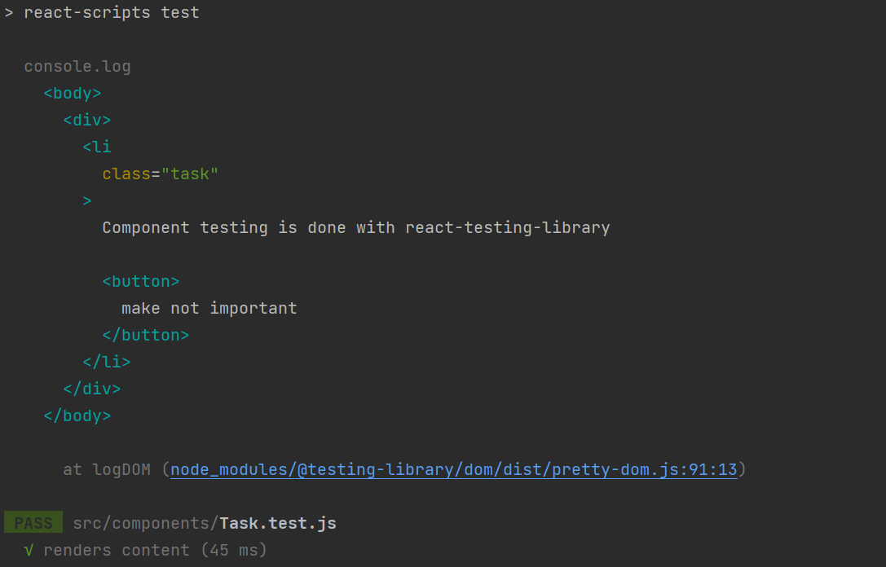
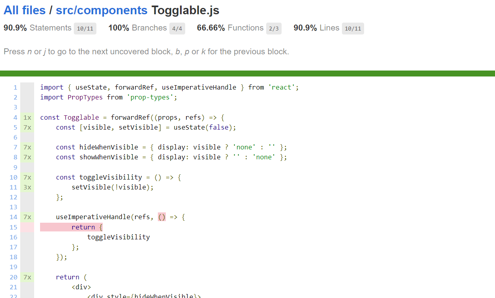

<div class="content">

There are many different ways of testing React applications.
Let's take a look at few of those next.

Tests will be implemented with the same [Jest](http://jestjs.io/) testing library developed by Facebook that was used in the previous part.

In addition to Jest, we also need another testing library that will help us render components for testing purposes.
The option we'll use for this class is [**react-testing-library**](https://github.com/testing-library/react-testing-library), which had seen rapid growth in popularity in recent times.

Let's install libraries with the command:

```bash
npm i -D @testing-library/react @testing-library/jest-dom jest jest-environment-jsdom @babel/preset-env @babel/preset-react
```

The file *package.json* should be extended as follows:

```js
{
  "scripts": {
    // ...
    "test": "jest"
  }
  // ...
  "jest": {
    "testEnvironment": "jsdom"
  }
}
```

We also need the file *.babelrc* with the following content:

```js
{
  "presets": [
    "@babel/preset-env",
    ["@babel/preset-react", { "runtime": "automatic" }]
  ]
}
```

Before we start writing tests, let's review the `Task` component and what it renders:

```js
const Task = ({ task, toggleImportance }) => {
  const label = task.important
    ? "make not important"
    : "make important";

  return (
    <li className='task'> // highlight-line
      {task.content}
      <button onClick={toggleImportance}>{label}</button>
    </li>
  );
};
```

Notice that the `li` element has the [CSS](https://react.dev/learn#adding-styles) classname **`task`**,
which could be used to access the component in our tests.

### Rendering the component for tests

We will write our first test in the *src/components/Task.test.js* file, which is in the same directory as the component itself.

The first test verifies that the component renders the contents of the task:

```js
import "@testing-library/jest-dom";
import { render, screen } from "@testing-library/react";
import Task from "./Task";

test("renders content", () => {
  const task = {
    content: "Component testing is done with react-testing-library",
    important: true
  };

  // highlight-start
  render(<Task task={task} />);

  const element = screen.getByText("Component testing is done with react-testing-library");
  expect(element).toBeDefined();
  // highlight-end
});
```

Before we run the test, let's examine the contents of the test itself.
After some initial configuration, our newest test renders the component with the
[`render` method](https://testing-library.com/docs/react-testing-library/api#render)
provided by the *react-testing-library*:

```js
render(<Task task={task} />);
```

Normally React components are rendered to the ***DOM***.
The `render` method we used renders the components in a format that is **suitable for tests *without* rendering them to the DOM**.

We can use the [`screen` object](https://testing-library.com/docs/queries/about#screen) to access the rendered component.
We use `screen`'s method [`getByText`](https://testing-library.com/docs/queries/bytext)
to search for an element that has the task content and ensure that it exists:

```js
  const element = screen.getByText("Component testing is done with react-testing-library");
  expect(element).toBeDefined();
```

### Running tests

Run the test with command `npm test`:

```js
$ npm test

> tasks@0.0.0 test
> jest

 PASS  src/components/Task.test.js
  ✓ renders content (15 ms)

Test Suites: 1 passed, 1 total
Tests:       1 passed, 1 total
Snapshots:   0 total
Time:        3.169 s
Ran all test suites
```

As expected, the test passes.

> **FYI:** *If you did not observe any errors in the terminal, you can skip this small section*.
> The console may issue a warning if you have not installed [**Watchman**](https://facebook.github.io/watchman/).
> Watchman is an application developed by Facebook that watches for changes that are made to files.
> The program speeds up the execution of tests and at least starting from macOS Sierra,
> running tests in watch mode issues some warnings to the console, which can be removed by installing *Watchman*.
>
> You can install *Watchman* using your package manager of choice

### Test file location

In React there are (at least)
[two different conventions](https://medium.com/@JeffLombardJr/organizing-tests-in-jest-17fc431ff850)
for the test file's location.
We created our test files according to the current standard by placing them in the same directory as the component being tested.

The other convention is to store the test files in a separate *test* directory.
This debate on which convention is better is almost as contentious (*and hilarious IMO*) as [the debate on whether you use Tabs or Spaces for indentation](https://www.youtube.com/watch?v=SsoOG6ZeyUI).

I prefer to store tests and application code separately.
Nonetheless, we'll keep them in the same folder because some of the previous libraries we've used follow this convention by default.

### Searching for content in a component

The *react-testing-library* package offers many different ways of investigating the content of the component being tested.
In reality, *the `expect` in our test is not needed at all*!

```js
import "@testing-library/jest-dom";
import { render, screen } from "@testing-library/react";
import Task from "./Task";

test("renders content", () => {
  const task = {
    content: "Component testing is done with react-testing-library",
    important: true
  };

  render(<Task task={task} />);

  const element = screen.getByText("Component testing is done with react-testing-library");

  expect(element).toBeDefined(); // highlight-line
});
```

The test fails if, on the previous line, *`getByText` does not find the element it is looking for*.

We could also use [**CSS selectors**](https://developer.mozilla.org/en-US/docs/Web/CSS/CSS_Selectors)
to find rendered elements by using the [`querySelector` method](https://developer.mozilla.org/en-US/docs/Web/API/Document/querySelector)
on the [`container` object](https://testing-library.com/docs/react-testing-library/api/#container-1) that is one of the fields returned by the render:

```js
import "@testing-library/jest-dom";
import { render } from "@testing-library/react";
import Task from "./Task";

test("renders content", () => {
  const task = {
    content: "Component testing is done with react-testing-library",
    important: true
  };

  const { container } = render(<Task task={task} />); // highlight-line

// highlight-start
  const div = container.querySelector(".task");
  expect(div).toHaveTextContent(
    "Component testing is done with react-testing-library"
  );
  // highlight-end
});
```

> **Pertinent:** A more consistent way of selecting elements is using a [data attribute](https://developer.mozilla.org/en-US/docs/Web/HTML/Global_attributes/data-*)
> that is specifically defined for testing purposes.
> Using *react-testing-library*, we can leverage the [`getByTestId` method](https://testing-library.com/docs/queries/bytestid/)
> to select elements with a specified `data-testid` attribute.

### Debugging tests

We typically run into many different kinds of problems when writing our tests.

Object `screen` has the method [`debug`](https://testing-library.com/docs/queries/about/#screendebug) that can be used to print the HTML of a component to the terminal.
If we change the test as follows:

```js
import "@testing-library/jest-dom";
import { render, screen } from "@testing-library/react";
import Task from "./Task";

test("renders content", () => {
  const task = {
    content: "Component testing is done with react-testing-library",
    important: true
  };

  const { container } = render(<Task task={task} />);

  screen.debug(); // highlight-line

  // ...

});
```

the HTML gets printed to the console:



It is also possible to use the same method to print a wanted element to the console:

```js
import "@testing-library/jest-dom";
import { render, screen } from "@testing-library/react";
import Task from "./Task";

test("renders content", () => {
  const task = {
    content: "Component testing is done with react-testing-library",
    important: true
  };

  const { container } = render(<Task task={task} />);

  const element = screen.getByText("Component testing is done with react-testing-library");

  screen.debug(element);  // highlight-line

  // ...
});
```

Now the HTML of the wanted element gets printed:

```js
  <li
    class="task"
  >
    Component testing is done with react-testing-library
    <button>
      make not important
    </button>
  </li>
```

### Clicking buttons in tests

In addition to displaying content, the `Task` component also makes sure that when the button associated with the task is pressed,
the `toggleImportance` event handler function gets called.

Let us install a library called [**user-event**](https://testing-library.com/docs/user-event/intro) that makes simulating user input a bit easier:

```bash
npm i -D @testing-library/user-event
```

Testing this functionality can be accomplished by adding another test like this:

```js
import "@testing-library/jest-dom";
import { render, screen } from "@testing-library/react";
import userEvent from "@testing-library/user-event"; // highlight-line
import Task from "./Task";

// ...

test("clicking the button calls event handler once", async () => {
  const task = {
    content: "Component testing is done with react-testing-library",
    important: true
  };

  const mockHandler = jest.fn(); // highlight-line

  render(
    <Task task={task} toggleImportance={mockHandler} /> // highlight-line
  );

  const user = userEvent.setup(); // highlight-line
  const button = screen.getByText("make not important"); // highlight-line
  await user.click(button); // highlight-line

  expect(mockHandler.mock.calls).toHaveLength(1); // highlight-line
});
```

There are a few interesting things related to this test.
The event handler is a [**mock**](https://facebook.github.io/jest/docs/en/mock-functions.html) function defined with Jest:

```js
const mockHandler = jest.fn();
```

A [**session**](https://testing-library.com/docs/user-event/setup/) is started to interact with the rendered component:

```js
const user = userEvent.setup();
```

The test finds the button *based on the text* from the rendered component and clicks the element:

```js
const button = screen.getByText("make not important");
await user.click(button);
```

Clicking happens via the [`click` method](https://testing-library.com/docs/user-event/convenience/#click) from the *userEvent* library.

The expectation of the test verifies that the **mock function** has been called *exactly once*.

```js
expect(mockHandler.mock.calls).toHaveLength(1);
```

[**Mock objects and functions**](https://en.wikipedia.org/wiki/Mock_object)
are commonly used stub components in testing that are used for replacing dependencies of the components being tested.
***Mocks*** make it possible to return hardcoded responses, and to verify the number of times the mock functions are called and with what parameters.

In our example, the mock function is a perfect choice since it can be easily used for verifying that the method gets called exactly once.

### Tests for the `Togglable` component

Let's write a few tests for the `Togglable` component.
Let's add the `togglableContent` CSS classname to the `div` that returns the child components in *components/Togglable.jsx*.

```js
const Togglable = forwardRef((props, ref) => {
  // ...

  return (
    <div>
      <div style={hideWhenVisible}>
        <button onClick={toggleVisibility}>
          {props.buttonLabel}
        </button>
      </div>
      <div style={showWhenVisible} className="togglableContent"> // highlight-line
        {props.children}
        <button onClick={toggleVisibility}>cancel</button>
      </div>
    </div>
  );
});
```

The tests that we added in a new file *Togglable.test.js* are shown below:

```js
import "@testing-library/jest-dom";
import { render, screen } from "@testing-library/react";
import userEvent from "@testing-library/user-event";
import Togglable from "./Togglable";

describe("<Togglable />", () => {
  let container;

  beforeEach(() => {
    container = render(
      <Togglable buttonLabel="show...">
        <div className="testDiv" >
          togglable content
        </div>
      </Togglable>
    ).container;
  });

  test("renders its children", async () => {
    await screen.findAllByText("togglable content");
  });

  test("at start the children are not displayed", () => {
    const div = container.querySelector(".togglableContent");
    expect(div).toHaveStyle("display: none");
  });

  test("after clicking the button, children are displayed", async () => {
    const user = userEvent.setup();
    const button = screen.getByText("show...");
    await user.click(button);

    const div = container.querySelector(".togglableContent");
    expect(div).not.toHaveStyle("display: none");
  });
});
```

The `beforeEach` function gets called before each test, which then renders the `Togglable` component and saves the field `container` of the return value.

The first test verifies that the `Togglable` component renders its child component

```html
<div className="testDiv">
  togglable content
</div>
```

The remaining tests use the [`toHaveStyle` method](https://www.npmjs.com/package/@testing-library/jest-dom#tohavestyle)
to verify that the child component of the `Togglable` component is not visible initially,
by checking that the style of the `div` element contains `{ display: 'none' }`.
Another test verifies that when the button is pressed the component is visible,
meaning that the style for hiding the component **is no longer** assigned to the component.

Let's also ***add a test*** that can be used to verify that the visible content can be hidden by clicking the second button of the component:

```js
describe("<Togglable />", () => {

  // ...

  test("toggled content can be closed", async () => {
    const user = userEvent.setup();
    const button = screen.getByText("show...");
    await user.click(button);

    const closeButton = screen.getByText("cancel");
    await user.click(closeButton);

    const div = container.querySelector(".togglableContent");
    expect(div).toHaveStyle("display: none");
  });
});
```

### Testing the forms

We already used the `click` function of the [*user-event*](https://testing-library.com/docs/user-event/intro) in our previous tests to click buttons.

```js
const user = userEvent.setup();
const button = screen.getByText("show...");
await user.click(button);
```

We can also simulate text input with `userEvent`.

Let's make a test for the `TaskForm` component in a separate file.
But before we do, let's review and make a small change to our `TaskForm` component.

```js
import { useState } from "react";

const TaskForm = ({ createTask }) => {
  const [newTask, setNewTask] = useState("");

  const handleChange = (event) => {
    setNewTask(event.target.value);
  };

  const addTask = (event) => {
    event.preventDefault();
    createTask({
      content: newTask,
      important: Math.random() > 0.5,
    });

    setNewTask("");
  };

  return (
    <div className="formDiv"> // highlight-line
      <h2>Create a new task</h2>

      <form onSubmit={addTask}>
        <input
          value={newTask}
          onChange={handleChange}
        />
        <button type="submit">save</button>
      </form>
    </div>
  );
};

export default TaskForm;
```

Notice that we added the `formDiv` CSS class, similar to what we did with our `Togglable` component above.
Also, recall that `TaskForm` works by calling the `createTask` function it received as props with the new task's details.

We are now ready to write our test.
*Taskform.test.js* is as follows:

```js
import { render, screen } from "@testing-library/react";
import "@testing-library/jest-dom";
import TaskForm from "./TaskForm";
import userEvent from "@testing-library/user-event";

test("<TaskForm /> updates parent state and calls onSubmit", async () => {
  const createTask = jest.fn();
  const user = userEvent.setup();

  render(<TaskForm createTask={createTask} />);

  const input = screen.getByRole("textbox");
  const sendButton = screen.getByText("save");

  await user.type(input, "testing a form...");
  await user.click(sendButton);

  expect(createTask.mock.calls).toHaveLength(1);
  expect(createTask.mock.calls[0][0].content).toBe("testing a form...");
});
```

Tests get access to the input field using the function [`getByRole`](https://testing-library.com/docs/queries/byrole).

The method [`type`](https://testing-library.com/docs/user-event/utility#type) of the `userEvent` is used to write text to the input field.

Our first `expect` call ensures that submitting the form calls the `createTask` method.
The second expectation checks that the event handler is called with the right parameters.
In other words, the second `expect` checks that a task with the correct content is created when the form is filled.

### About finding the elements

Let us assume that the form has two input fields

```js
const TaskForm = ({ createTask }) => {
  // ...

  return (
    <div>
      <h2>Create a new task</h2>

      <form onSubmit={addTask}>
        <input
          value={newTask}
          onChange={handleChange}
        />
        // highlight-start
        <input
          value={...}
          onChange={...}
        />
        // highlight-end
        <button type="submit">save</button>
      </form>
    </div>
  );
};
```

Now the approach that our test uses to find the input field

```js
const input = screen.getByRole("textbox");
```

would cause an error:


The error message suggests using `getAllByRole`.
The test could be fixed as follows:

```js
const inputs = screen.getAllByRole("textbox");

await user.type(inputs[0], "testing a form...");
```

Method `getAllByRole` now returns an array and the right input field is the first element of the array.
However, this [**approach is brittle**](https://www.callumhart.com/blog/brittle-selectors/) since it relies on the order of the input fields.

Quite often input fields have some **placeholder** text that provides hints to the user about what kind of input is expected.
Let us add a placeholder to our form:

```js
const TaskForm = ({ createTask }) => {
  // ...

  return (
    <div>
      <h2>Create a new task</h2>

      <form onSubmit={addTask}>
        <input
          value={newTask}
          onChange={handleChange}
          placeholder='write task here' // highlight-line 
        />
        <input
          value={...}
          onChange={...}
        />    
        <button type="submit">save</button>
      </form>
    </div>
  );
};
```

Now finding the right input field is easy with the method [`getByPlaceholderText`](https://testing-library.com/docs/queries/byplaceholdertext):

```js
test("<TaskForm /> updates parent state and calls onSubmit", () => {
  const createTask = jest.fn();

  render(<TaskForm createTask={createTask} />);

  const input = screen.getByPlaceholderText("write task here"); // highlight-line 
  const sendButton = screen.getByText("save");

  userEvent.type(input, "testing a form...");
  userEvent.click(sendButton);

  expect(createTask.mock.calls).toHaveLength(1);
  expect(createTask.mock.calls[0][0].content).toBe("testing a form...");
});
```

The most flexible way of finding elements in tests is the method `querySelector` of the `container` object, which is returned by `render`,
as was mentioned [earlier in this part](/part5/testing_react_apps#searching-for-content-in-a-component).
Any CSS selector can be used with this method for searching elements in tests.

For example, if we added a unique `id` to the input field:

```js
const TaskForm = ({ createTask }) => {
  // ...

  return (
    <div>
      <h2>Create a new task</h2>

      <form onSubmit={addTask}>
        <input
          value={newTask}
          onChange={handleChange}
          id='task-input' // highlight-line 
        />
        <input
          value={...}
          onChange={...}
        />    
        <button type="submit">save</button>
      </form>
    </div>
  );
};
```

The input element could now be found in the test as follows:

```js
const { container } = render(<TaskForm createTask={createTask} />);

const input = container.querySelector("#task-input");
```

However, we shall stick to the approach of using `getByPlaceholderText` in the test.

Let us look at a couple of details before moving on.
Assume that a component would render text to an HTML element as follows:

```js
const Task = ({ task, toggleImportance }) => {
  const label = task.important
    ? "make not important" : "make important";

  return (
    <li className='task'>
      Your awesome task: {task.content} // highlight-line
      <button onClick={toggleImportance}>{label}</button>
    </li>
  );
};

export default Task;
```

the `getByText` command that the test uses does **not** find the element

```js
test("renders content", () => {
  const task = {
    content: "Does not work anymore :(",
    important: true
  };

  render(<Task task={task} />);

  const element = screen.getByText("Does not work anymore :(");

  expect(element).toBeDefined();
});
```

Command `getByText` looks for an element that has the **same text** that it has as a parameter, and nothing more.
If we want to look for an element that ***contains*** the text, we could use an extra option:

```js
const element = screen.getByText(
  "Does not work anymore :(", { exact: false }
);
```

or we could use the command `findByText`:

```js
const element = await screen.findByText("Does not work anymore :(");
```

Notice that, unlike the other `ByText` commands, ***`findByText` returns a promise!***

There are situations where yet another form of the command `queryByText` is useful.
`queryByText` returns the element but *it does not cause an exception* if the element is not found.

We could use the command to ensure that something **is not rendered** to the component:

```js
test("does not render this", () => {
  const task = {
    content: "This is a reminder",
    important: true
  };

  render(<Task task={task} />);

  const element = screen.queryByText("do not want this thing to be rendered");
  expect(element).toBeNull();
});
```

### Test coverage

We can easily find out the [**coverage**](https://jestjs.io/blog/2020/01/21/jest-25#v8-code-coverage) of our tests by running them with the command.

```js
npm test -- --coverage --collectCoverageFrom='src/**/*.{jsx,js}'
```


A no-frills HTML report will be generated to the *coverage/lcov-report* directory.
The report will tell us the lines of untested code in each component:



You can find the code for our current application in its entirety in the *part5-8* branch of
[this GitHub repository](https://github.com/comp227/part2-tasks/tree/part5-8).
</div>

<div class="tasks">

### Exercises 5.13.-5.16

#### 5.13: Watchlist tests, Step 1

Make a test, which checks that the component displaying a show renders the show's title and genre, but does not render its URL or number of likes by default.

Add CSS classes to the component to help the testing as necessary.

#### 5.14: Watchlist tests, Step 2

Make a test, that checks that a show's URL and number of likes are shown when the button controlling the shown details has been clicked.

#### 5.15: Watchlist tests, Step 3

Make a test, which ensures that if the ***like*** button is clicked twice, the event handler the component received as props *is called twice*.

#### 5.16: Watchlist tests, Step 4

Make a test for the *Recommend new show* form.
The test should check if the form calls the event handler it received as props with the right details when a new show is added.

</div>

<div class="content">

### Frontend integration tests

In the previous part of the course material, we wrote integration tests for the backend that tested its logic and connected the database through the API provided by the backend.
When writing these tests, we made the conscious decision **not to write unit tests**, as the code for that backend is fairly simple,
and *it is likely that bugs in our application occur in more complicated scenarios* than what would be discovered via our unit tests.

So far all of our tests for the frontend have been unit tests that have validated the correct functioning of individual components.
Unit testing is useful at times, but ***even a comprehensive suite of unit tests is not enough to validate that the application works as a whole***.

We could also make integration tests for the frontend.
**Integration testing** tests the collaboration of multiple components.
It is considerably more difficult than unit testing.
For example, we would have to mock data from the server.
We will concentrate on making end-to-end tests to test the whole application.
We will work on the end-to-end tests in the next section.

### Snapshot testing

Jest offers a completely different alternative to "traditional" testing called [**snapshot testing**](https://facebook.github.io/jest/docs/en/snapshot-testing.html).
The interesting feature of snapshot testing is that **developers do not need to define any tests themselves**, it is simple enough to adopt snapshot testing.

The fundamental principle is to compare the HTML code defined by the component after it has changed to the HTML code that existed before it was changed.

If the snapshot notices some change in the HTML defined by the component, then *either it is new functionality or a **bug** caused by accident*.
Snapshot tests notify the developer if the HTML code of the component changes.
The developer has to tell Jest if the change was desired or undesired.
*If the change to the HTML code is unexpected, it strongly implies a bug,*
and the developer can become aware of these potential issues easily thanks to snapshot testing.

</div>
