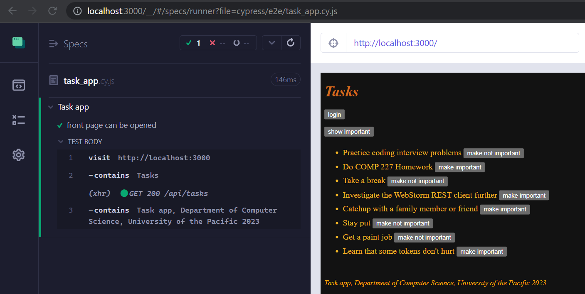
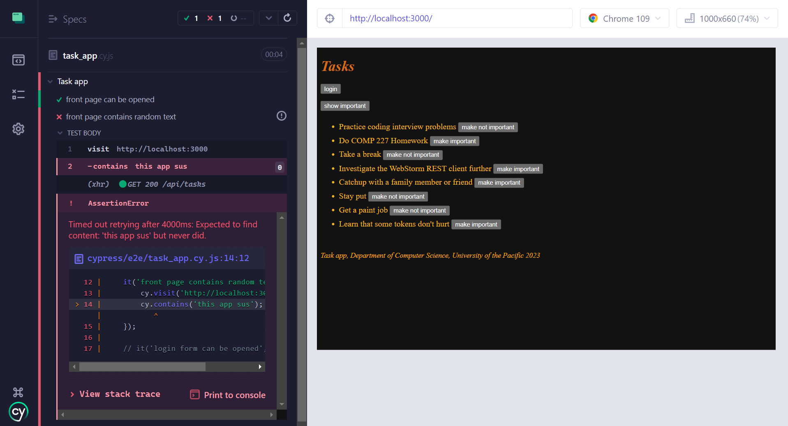
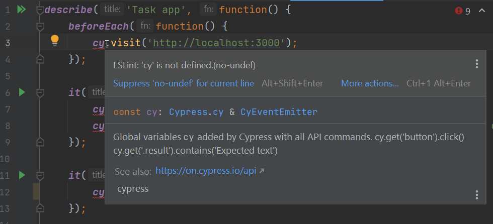
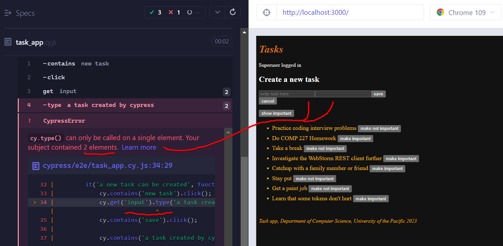
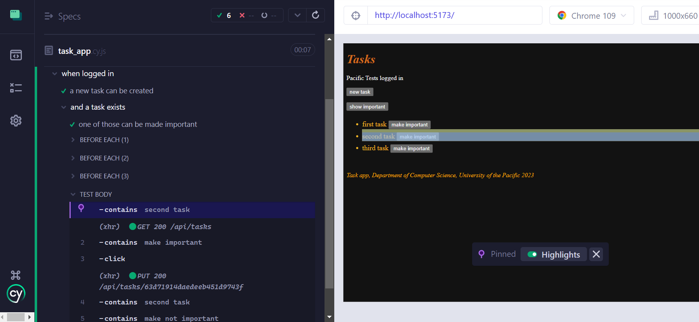
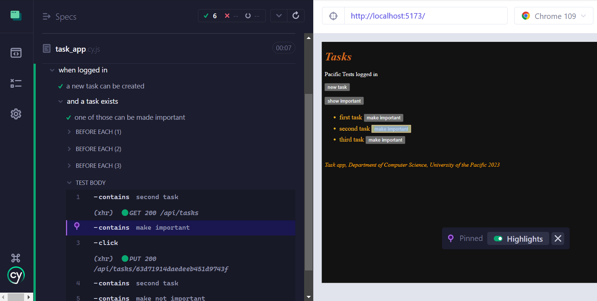
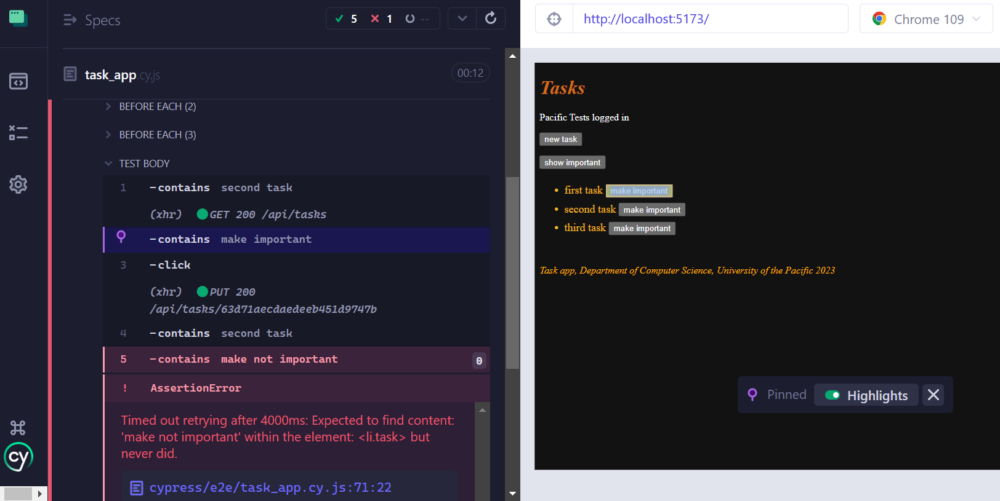
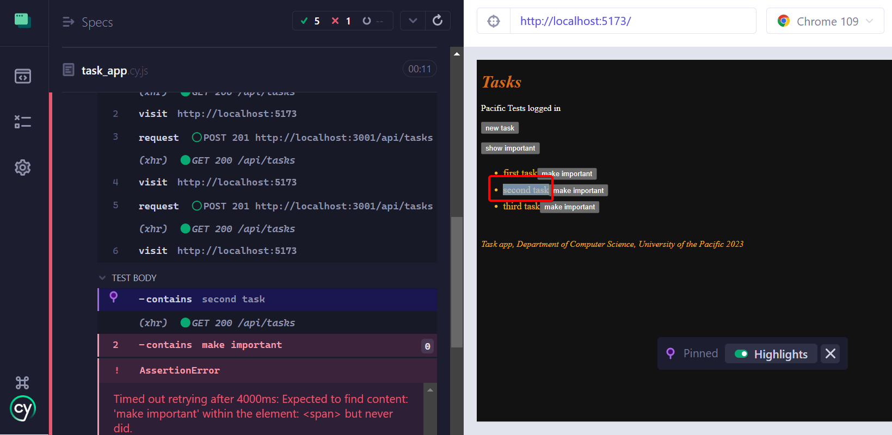
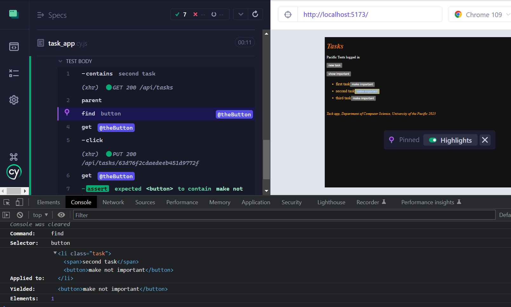
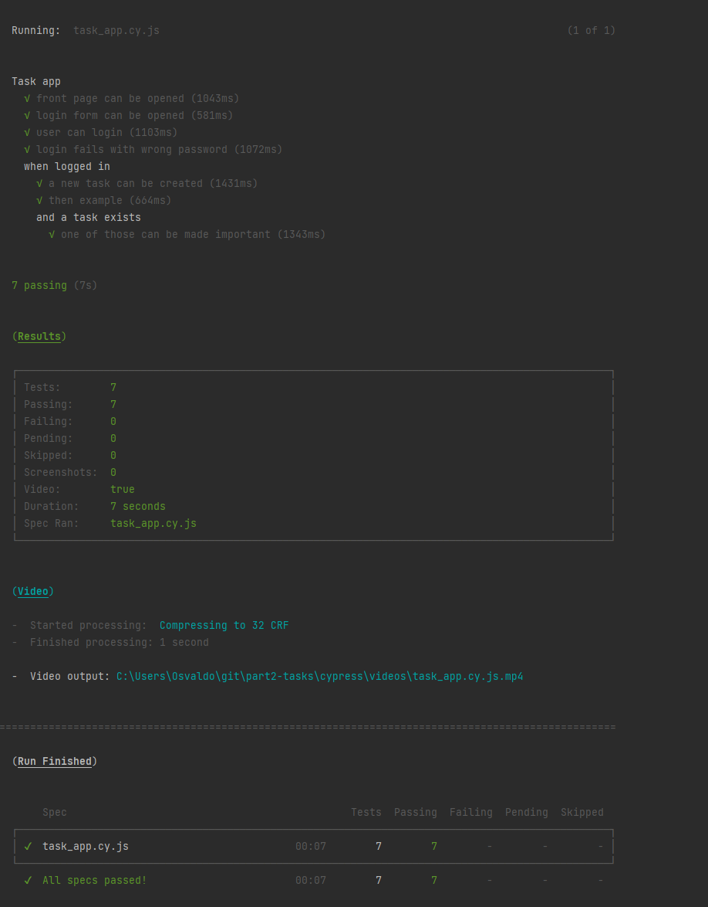

<div class="content">

So far we have:

- tested the backend on an API level using integration tests
- tested some frontend components using unit tests.

Next, we will look into one way to test the [system as a whole](https://en.wikipedia.org/wiki/System_testing) using **End-to-End** (E2E) tests.

To do E2E testing on a web application, we can use a browser and a testing library.
There are multiple testing libraries available.
One example is [Selenium](http://www.seleniumhq.org/),
which can be used with almost any browser.
Another browser option is a [**headless browser**](https://en.wikipedia.org/wiki/Headless_browser),
which is a browser with no graphical user interface.
For example, Chrome can be used in headless mode.

E2E tests are potentially the most useful category of tests because they test the system through the same interface as real users use.

However, E2E tests have some drawbacks too.
Configuring E2E tests is more challenging than unit or integration tests.
They also tend to be quite slow, and with a large system, their execution time can be minutes or even hours.
This is bad for development because during coding it is beneficial to be able to run tests as often as possible in case of code [regressions](https://en.wikipedia.org/wiki/Regression_testing).

Lastly, E2E tests can be [**flaky**](https://docs.cypress.io/guides/cloud/flaky-test-management).
Flaky tests are undesired because they can change from passing to failing or vice-versa simply *by running the tests again, without even changing any code*.

### Cypress

E2E library [Cypress](https://www.cypress.io/) is the option we'll be using in this class.
Cypress is exceptionally easy to use, and when compared to Selenium, for example, it requires a lot less hassle and headache.
Its operating principle is radically different than most E2E testing libraries because Cypress tests are run completely within the browser.
Other libraries run the tests in a Node process, which is connected to the browser through an API.

> **Pertinent:** While Cypress works well, we will have to make some changes to our ports in order to use Cypress.
> Cypress uses port `3001` in its backend to run some of the tests.
> If you recall, this is currently the port that we are using for our backend.
> Instead of modifying Cypress's settings, let's just adjust our PORT for our backend.
> We can do this by following these three steps.
>
> 1. Open up the *.env* file **in your backend** and change the PORT from `3001` to `3002`.
> 2. Open up *vite.config.js* **in your frontend**
>    and change the port listed in your *localhost*'s `target` property from *`3001`* to *`3002`*
> 3. Ensure that your frontend and backend have restarted, otherwise stop and start them again.
> 4. Now your backend will be on *3002* for the remainder of these exercises.
>
> Now with the port changed, let's make some end-to-end tests using Cypress for our task application.

We begin by installing Cypress to *the frontend* as a development dependency

```js
npm i -D cypress
```

and by adding an npm-script to run it:

```js
{
  // ...
  "scripts": {
    "dev": "vite --host",  // highlight-line
    "build": "vite build",
    "lint": "eslint . --ext js,jsx --report-unused-disable-directives --max-warnings 0",
    "preview": "vite preview",
    "server": "json-server -p3001 --watch db.json",
    "test": "jest",
    "cypress:open": "cypress open"  // highlight-line
  },
  // ...
}
```

We also made a small change to the `dev` script that starts the application.
Without the change, Cypress can not access the app.

Unlike the frontend's unit tests, *Cypress tests can be in the frontend or the backend repository*, or even in their separate repository.

The tests require the tested system to be running.
Unlike our backend integration tests, Cypress tests **do not start** the system when they are run.

Let's *add an npm script **to the backend's `package.json`*** which starts it in test mode, or so that `NODE_ENV` is `test`.

```js
{
  // ...
  "scripts": {
    "start": "cross-env NODE_ENV=production node index.js",
    "dev": "cross-env NODE_ENV=development nodemon index.js",
    "test": "cross-env NODE_ENV=test jest --verbose --runInBand --forceExit",
    "start:test": "cross-env NODE_ENV=test node index.js", // highlight-line
    "build:ui": "rm -rf dist && cd ../part2-tasks/ && npm run build && cp -r dist ../part3-tasks-backend",
    "deploy": "npm run build:ui && git add . && git commit -m npm_generated_rebuild_of_the_UI && git push",
    "lint": "eslint .",
    "fixlint": "eslint . --fix"
  },
  // ...
}
```

> **FYI:** To get Cypress working with WSL2 one might need to do some additional configuring first.
> These two links:
>
> - [Official Cypress Guide](https://docs.cypress.io/guides/getting-started/installing-cypress#Windows-Subsystem-for-Linux)
> - [Blog on GUI/Cypress](https://nickymeuleman.netlify.app/blog/gui-on-wsl2-cypress)
>
> are great places to start.
  
***With the backend running via `npm run start:test`***, we can start Cypress via the frontend with the command

```js
npm run cypress:open
```

When we first run Cypress, it will provide us with a guided process and show how it's the first time that we have run it.
Once you reach the *Welcome to Cypress!* message, follow these steps:

1. You may need to click on any firewall messages and watch or skip a video before getting to the Welcome to Cypress!* screen.
2. Once at *Welcome to Cypress!*, click the ***E2E Testing*** option
3. click ***Continue*** on the *Configuration Files* Screen
4. click ***Start E2E Testing in Chrome*** on the *Choose a Browser* Screen
5. select ***Create new spec*** on *Create Your First Spec* Screen
6. Replace the spec filename from *spec.cy.js* to ***task_app.cy.js*** and click ***Create spec***
    - The full path should be *cypress\e2e\task_app.cy.js*
7. Close the next dialog box on the *spec successfully added screen*
8. Now switch back to WebStorm and open the project explorer.

Notice how in WebStorm there is now a *cypress/e2e* directory, along with our file *task_app.cy.js*.
Locate it and open it in WebStorm and replace the contents with the code below.

```js
describe("Task app", function() {
  it("front page can be opened", function() {
    cy.visit("http://localhost:5173");
    cy.contains("Tasks");
    cy.contains("Task app, Department of Computer Science, University of the Pacific");
  });
});
```

> **FYI:** You may need to clear some of the linting issues with the indentation in the files if you are copying, through again,
> I recommend that you try to type the statements out instead.
> We will cover how to address the cy linter error shortly.

Now, switch back to the Cypress chrome browser and click on our *task_app* file.
We start the test from the opened window:

Running the test shows how the application behaves as the test is run:

> **FYI:** you may need to restart Cypress if you run into any issues.

Running the test shows how the application behaves as the test is run:



The structure of the test should look familiar.
They use `describe` blocks to group different test cases, just like Jest.
The test cases have been defined with the `it` method.
Cypress borrowed these parts from the [Mocha](https://mochajs.org/) testing library it uses under the hood.

[`cy.visit`](https://docs.cypress.io/api/commands/visit.html) and [`cy.contains`](https://docs.cypress.io/api/commands/contains.html)
are Cypress commands, and their purpose is quite obvious.
[`cy.visit`](https://docs.cypress.io/api/commands/visit.html) opens the web address given to it as a parameter in the browser used by the test.
[`cy.contains`](https://docs.cypress.io/api/commands/contains.html) searches for the string it received as a parameter from the page.

We could have declared the test using an arrow function

```js
describe("Task app", () => { // highlight-line
  it("front page can be opened", () => { // highlight-line
    cy.visit("http://localhost:5173");
    cy.contains("Tasks");
    cy.contains("Task app, Department of Computer Science, University of the Pacific");
  });
});
```

However, Mocha [recommends](https://mochajs.org/#arrow-functions) that **arrow functions are not used**,
because they might cause some issues in certain situations.

If `cy.contains` does not find the text it is searching for, the test does not pass.
So if we extend our test like so

```js
describe("Task app", function() {
  it("front page can be opened",  function() {
    cy.visit("http://localhost:5173");
    cy.contains("Tasks");
    cy.contains("Task app, Department of Computer Science, University of the Pacific");
  });

// highlight-start
  it("front page contains random text", function() {
    cy.visit("http://localhost:5173");
    cy.contains("this app sus");
  });
// highlight-end
});
```

the test fails



Let's ***remove the failing code from the test***.

> If you are following along as you are working through this text, you may have noticed that the variable `cy` in our tests gives us an error:
>
> 
>
> We can get rid of those errors by installing [eslint-plugin-cypress](https://github.com/cypress-io/eslint-plugin-cypress) as a development dependency
>
> ```js
> npm i -D eslint-plugin-cypress
> ```
>
> and changing the configuration in *.eslintrc.cjs* like so:
>
> ```js
> module.exports = {
>     "env": {
>         "browser": true,
>         "es6": true,
>         "jest/globals": true,
>         "cypress/globals": true // highlight-line
>     },
>     "extends": [ 
>       // ...
>     ],
>     "parserOptions": {
>       // ...
>     },
>     "plugins": [
>         "react", "jest", "cypress" // highlight-line
>     ],
>     "rules": {
>       // ...
>     }
> }
> ```

### Writing to a form

Let's extend our tests so that the test tries to login to our application.
We assume our backend contains a user with the username `powercat` and password `tigers`.

The test begins by opening the login form.

```js
describe("Task app",  function() {
  // ...

  it("login form can be opened", function() {
    cy.visit("http://localhost:5173");
    cy.contains("login").click();
  });
});
```

The test

1. *searches for the "login" button* by its text
2. *clicks the button* with the command [`cy.click`](https://docs.cypress.io/api/commands/click.html#Syntax).

Since both of our tests start by opening the page *<http://localhost:5173>*, we should
separate that shared part into a `beforeEach` block run before each test:

```js
describe("Task app", function() {
  // highlight-start
  beforeEach(function() {
    cy.visit("http://localhost:5173");
  });
  // highlight-end

  it("front page can be opened", function() {
    cy.contains("Tasks");
    cy.contains("Task app, Department of Computer Science, University of the Pacific");
  });

  it("login form can be opened", function() {
    cy.contains("login").click();
  });
});
```

The login field contains two *input* fields, which the test should write into.

The [`cy.get`](https://docs.cypress.io/api/commands/get.html#Syntax) command allows for searching elements by CSS selectors.

We can access the first and the last input field on the page,
and write to them with the command [`cy.type`](https://docs.cypress.io/api/commands/type.html#Syntax) like so:

```js
it("user can login", function () {
  cy.contains("login").click();
  cy.get("input:first").type("root");
  cy.get("input:last").type("tigers");
});  
```

The test works, though our test is brittle.
If we later add more input fields, the test will break because it expects the fields *username* and *password* to be the first and the last inputs on the page.

It would be better to give our inputs unique *ids* and use those to find them.
Let's modify our login form:

```js
const LoginForm = ({ ... }); => {
  return (
    <div>
      <h2>Login</h2>
      <form onSubmit={handleSubmit}>
        <div>
          username
          <input
            id='username'  // highlight-line
            value={username}
            onChange={handleUsernameChange}
          />
        </div>
        <div>
          password
          <input
            id='password' // highlight-line
            type="password"
            value={password}
            onChange={handlePasswordChange}
          />
        </div>
        <button id="login-button" type="submit"> // highlight-line
          login
        </button>
      </form>
    </div>
  )
}
```

We also added an id to our submit button so we can access it in our tests.

The test becomes:

```js
describe("Task app",  function() {
  // ..
  it("user can login", function() {
    cy.contains("login").click();
    cy.get("#username").type("root");  // highlight-line    
    cy.get("#password").type("tigers");  // highlight-line
    cy.get("#login-button").click();  // highlight-line

    cy.contains("Superuser logged in"); // highlight-line
  });
});
```

The last row ensures that the login was successful.

Notice that the CSS [**id selector**](https://developer.mozilla.org/en-US/docs/Web/CSS/ID_selectors) is #,
so if we want to search for an element with the id `username` the CSS selector is `#username`.

### Some things to remember

The test first clicks the button opening the login form:

```js
cy.contains("login").click();
```

When the form has been filled, the form is submitted by clicking the submit button:

```js
cy.get("#login-button").click();
```

Both buttons have the text ***login***, but they are two separate buttons.
While both buttons are in the application's DOM the whole time, only one is visible at a time because of the `display:none` styling on one of them.

If we search for a button by its text, [cy.contains](https://docs.cypress.io/api/commands/contains.html#Syntax) will return the first of them, or the one opening the login form.
This will happen even if the button is not visible.
To avoid name conflicts, we gave the submit button the id `login-button` we can use to access it.

Please note that passing the test at this stage *requires that in the backend test database*, there exists a user with the username *`root`* and password *`tigers`*.
Create a user if needed!

### Testing new task form

Let's next add test methods to test the "new task" functionality:

```js
describe("Task app", function() {
  // ..
  // highlight-start
  describe("when logged in", function() {
    beforeEach(function() {
      cy.contains("login").click();
      cy.get("input:first").type("root");
      cy.get("input:last").type("tigers");
      cy.get("#login-button").click();
    });
    // highlight-end

    // highlight-start
    it("a new task can be created", function() {
      cy.contains("new task").click();
      cy.get("input").type("a task created by cypress");
      cy.contains("save").click();

      cy.contains("a task created by cypress");
    });
  });
  // highlight-end
});
```

Our new test ***has been defined in its own `describe` block***.
Only logged-in users can create new tasks, so we added logging in to the application to a `beforeEach` block.

The test trusts that when creating a new task the page contains only one input, so it searches for it like so:

```js
cy.get("input");
```

> If you were following along closely however, our page contained [two inputs from the last part](/part5/testing_react_apps#about-finding-the-elements)),
which breaks our tests.
>
> 
>
> Due to this problem, it would again be better to give the input an *id* and search for the element by its id in the test.
We will leave it to you to remove the second input and to provide the text an input id like *`new-task`*,
though because that would mean that currently we would make changes to our backend
I will wait to make these changes to our form until we reach the [next section](#controlling-the-state-of-the-database-on-the-frontend).

The structure of the tests looks like so:

```js
describe("Task app", function() {
  // ...

  it("user can login", function() {
    cy.contains("login").click();
    cy.get("#username").type("root");
    cy.get("#password").type("tigers");
    cy.get("#login-button").click();

    cy.contains("Superuser logged in");
  });

  describe("when logged in", function() {
    beforeEach(function() {
      cy.contains("login").click();
      cy.get("#username").type("root");
      cy.get("#password").type("tigers");
      cy.get("#login-button").click();
    });

    it("a new task can be created", function() {
      // ...
    });
  });
});
```

Cypress runs the tests in the order they are in the code.
So first it runs `user can login`, where the user logs in.
Then cypress will run `a new task can be created` for which a `beforeEach` block logs in as well.
Why do this? Isn't the user logged in after the first test?
No, because ***each*** test starts from zero as far as the browser is concerned.
All changes to the browser's state are reversed after each test.

### Controlling the state of the database

If the tests need to be able to modify the server's database, the situation immediately becomes more complicated.
Ideally, the server's database should be the same each time we run the tests, so our tests can be reliably and easily repeatable.

As with unit and integration tests, with E2E tests it is best to empty the database and possibly format it before the tests are run.
The challenge with E2E tests is that they do not have access to the database.

The solution is to create API endpoints for the backend tests.
We can empty the database using these endpoints.
Let's create a new **router** for the tests in *controllers/testing.js*.

```js
const testingRouter = require("express").Router()
const Task = require("../models/task");
const User = require("../models/user");

testingRouter.post("/reset", async (request, response) => {
  await Task.deleteMany({});
  await User.deleteMany({});

  response.status(204).end();
});

module.exports = testingRouter;
```

and add it to the backend only *if the application is run in test-mode*:

```js
// ...

app.use("/api/login", loginRouter);
app.use("/api/users", usersRouter);
app.use("/api/tasks", tasksRouter);

// highlight-start
if (process.env.NODE_ENV === 'test"); {
  const testingRouter = require("./controllers/testing");
  app.use("/api/testing", testingRouter);
}
// highlight-end

app.use(middleware.unknownEndpoint);
app.use(middleware.errorHandler);

module.exports = app
```

After the changes, an HTTP POST request to the ***/api/testing/reset*** endpoint empties the database.
Make sure your backend is running in test mode by starting it with this command (previously configured in the *package.json* file):

```js
  npm run start:test
```

The modified backend code can be found on the [GitHub](https://github.com/comp227/part3-tasks-backend/tree/part5-9) branch *part5-9*.

#### Controlling the state of the database on the frontend

Next, we will change the `beforeEach` block so that it empties the server's database before tests are run.

Currently, it is not possible to add new users through the frontend's UI, so we add a new user to the backend from the beforeEach block.
While it may be a matter of preference, ***I'm going to make a different test user entirely*** (called *Pacific Tests*),
which means that I'll also **change my tests slightly** to login with the new user.
If you want to minimize your changes, just change our `Pacific Tests` user back to the same details as the `Superuser` below.

```js
describe("Task app", function() {
   beforeEach(function() {
    // highlight-start
    cy.request("POST", 'http://localhost:3001/api/testing/reset");
    const user = {
      name: 'Pacific Tests",
      username: 'test",
      password: 'pacific'
    }
    cy.request("POST", 'http://localhost:3001/api/users/", user) 
    // highlight-end
    cy.visit("http://localhost:5173");
  });
  
  it("front page can be opened", function() {
    // ...
  });

  it("user can login", function() {
    // ...
  });

  describe("when logged in", function() {
    // ...
  });
});
```

During the formatting, the test does HTTP requests to the backend with [`cy.request`](https://docs.cypress.io/api/commands/request.html).

Unlike earlier, now the testing starts with the backend in the same state every time.
The backend will contain one user and no tasks.

Let's add one more test for checking that we can change the importance of tasks.
[In part 5b](/part5/props_children_and_proptypes/) we changed the frontend so that a new task has the value `false`, instead of randomly selecting it to be `true` or `false`.
If we would have left it to be randomly set, then that would leave to a flaky test.

```js
const TaskForm = ({ createTask }); => {
  // ...

  const addTask = (event) => {
    event.preventDefault()
    createTask({
      content: newTask,
      important: false // highlight-line
    });

    setNewTask("");
  }
  // ...
} 
```

Back in our tests, we first search for a task and click its ***make important*** button.
Then we check that the task now contains a ***make not important*** button.

> Notice that at this point I am now using our new id that we were [changing previously](#testing-new-task-form), `#new-task`!

```js
describe("Task app", function() {
  // ...

  describe("when logged in", function() {
    // ...

    describe("and a task exists", function () {
      beforeEach(function () {
        cy.contains("new task").click();
        cy.get("#new-task").type("another task cypress");
        cy.contains("save").click();
      });

      it("it can be made important", function () {
        cy.contains("another task cypress")
          .contains("make important")
          .click();

        cy.contains("another task cypress")
          .contains("make not important");
      });
    });
  });
});
```

The first command searches for a component containing the text `another task cypress`, and then for a ***make important*** button within it.
It then clicks the button.

The second command checks that the text on the button has changed to ***make not important***.

The tests and the current frontend code can be found on the [GitHub](https://github.com/comp227/part2-tasks/tree/part5-9) branch *part5-9*.

### Failed login test

Let's make a test to ensure that a login attempt fails if the password is wrong.

Cypress will run all tests each time by default, and as the number of tests increases, it starts to become quite time-consuming.
When developing a new test or when debugging a broken test,
*we can define the test with `it.only` instead of `it`*, so that Cypress will only run the required test.
When the test is working, we can remove `.only`.

First version of our tests is as follows:

```js
describe("Task app", function() {
  // ...

  it.only("login fails with wrong password", function() {
    cy.contains("login").click();
    cy.get("#username").type("root");
    cy.get("#password").type("wrong");
    cy.get("#login-button").click();

    cy.contains("Wrong credentials");
  });

  // ...
)}
```

The test uses [`cy.contains`](https://docs.cypress.io/api/commands/contains.html#Syntax) to ensure that the application prints an error message.

The application renders the error message to a component with the CSS class `error`:

```js
const Notification = ({ message }); => {
  if (message === null) {
    return null
  }

  return (
    <div className="error"> // highlight-line
      {message}
    </div>
  )
}
```

The test could also ensure that the error message renders to the correct component, the component with the CSS class *`error`*:

```js
it("login fails with wrong password", function() {
  // ...

  cy.get(".error").contains("Wrong credentials"); // highlight-line
});
```

First, we use [`cy.get`](https://docs.cypress.io/api/commands/get.html#Syntax) to search for a component with the CSS class `error`.
Then we check that the error message can be found from this component.
Notice that [CSS class selectors](https://developer.mozilla.org/en-US/docs/Web/CSS/Class_selectors)
start with a period, so the selector for the class `error` is **`.error`**.

We could do the same using the [`should`](https://docs.cypress.io/api/commands/should.html) syntax:

```js
it("login fails with wrong password", function() {
  // ...

  cy.get(".error").should("contain", 'Wrong credentials"); // highlight-line
});
```

Using `should` is a bit trickier than using `contains`, but it allows for more diverse tests than `contains` which works based on text content only.

You *should* (pun intended) check this [list of the most common assertions](https://docs.cypress.io/guides/references/assertions.html#Common-Assertions) that can be used with `should`.

We can, for example, make sure that the error message is red and it has a border:

```js
it("login fails with wrong password", function() {
  // ...

  cy.get(".error").should("contain", 'wrong credentials"); 
  cy.get(".error").should("have.css", 'background-color", 'rgb(156, 43, 46)");
  cy.get(".error").should("have.css", 'border-style", 'solid");
});
```

Cypress requires the colors to be given as [rgb](https://rgbcolorcode.com/color/red).

Because all tests are for the same component we accessed using [cy.get](https://docs.cypress.io/api/commands/get.html#Syntax),
we can chain them using [and](https://docs.cypress.io/api/commands/and.html).

```js
it("login fails with wrong password", function() {
  // ...

  cy.get(".error");
    .should("contain", 'wrong credentials")
    .and("have.css", 'background-color", 'rgb(156, 43, 46)")
    .and("have.css", 'border-style", 'solid")
});
```

Let's finish the test so that it also checks that the application does not render the success message `'Pacific Tests logged in'`.
Let's also remove the `only` from `it.only` if it's still present on this test:

```js
it("login fails with wrong password", function() {
  cy.contains("login").click();
  cy.get("#username").type("root");
  cy.get("#password").type("wrong");
  cy.get("#login-button").click();

  cy.get(".error");
    .should("contain", 'wrong credentials")
    .and("have.css", 'background-color", 'rgb(156, 43, 46)")
    .and("have.css", 'border-style", 'solid")

  cy.get("html").should("not.contain", 'Pacific Tests logged in"); // highlight-line
});
```

The command `should` is most often used by chaining it after the command `get` (or another similar chain-friendly command).
The highlighted line above (`cy.get("html")`) essentially retrieves the visible content from the entire application.

Another way to write that line is by chaining the command `contains` with the command `should` via the `not.exist` parameter.
Here's the two options side-by-side.

| Option 1 | Option 2 |
| :--- | :--- |
|`cy.get("html").should("not.contain", 'Pacific Tests logged in")`|`cy.contains("Pacific Tests logged in").should("not.exist")`|

### Bypassing the UI

Currently, we have the following tests:

```js
describe("Task app", function() {
  it("user can login", function() {
    cy.contains("login").click();
    cy.get("#username").type("test");
    cy.get("#password").type("pacific");
    cy.get("#login-button").click();

    cy.contains("Pacific Tests logged in");
  });

  it("login fails with wrong password", function() {
    // ...
  });

  describe("when logged in", function() {
    beforeEach(function() {
      cy.contains("login").click();
      cy.get("#username").type("test");
      cy.get("#password").type("pacific");
      cy.get("#login-button").click();
    });

    it("a new task can be created", function() {
      // ...

    });
   
  });
});
```

First, we test logging in.
Then, in their own `describe` block, we tests that expect the user to be logged in, which happens in the `beforeEach` block.

As we said above, ***each test starts from zero!*** Tests do not start from the state where the previous tests ended.

The Cypress documentation gives us the following advice:
[*Fully test the login flow – but only once!*](https://docs.cypress.io/guides/end-to-end-testing/testing-your-app#Fully-test-the-login-flow-but-only-once).
So instead of logging in a user using the form in the `beforeEach` block, Cypress recommends that we
[bypass the UI](https://docs.cypress.io/guides/getting-started/testing-your-app.html#Bypassing-your-UI)
and do an HTTP request to the backend to login.
The reason for this is that *logging in with an HTTP request is much faster than filling out a form*.

Our situation is a bit more complicated than in the example in the Cypress documentation because when a user logs in, our application saves their details to the localStorage.
However, Cypress can handle that as well.
The code is the following

```js
describe("when logged in", function() {
  beforeEach(function() {
    // highlight-start
    cy.request("POST", 'http://localhost:3001/api/login", {
      username: 'test", password: 'pacific'
    });.then(response => {
      localStorage.setItem("loggedTaskappUser", JSON.stringify(response.body))
      cy.visit("http://localhost:5173");
    });
    // highlight-end
  });

  it("a new task can be created", function() {
    // ...
  });

  // ...
});
```

We can access the response to a [cy.request](https://docs.cypress.io/api/commands/request.html) with the `then` method.
Under the hood `cy.request`, like all Cypress commands,
are [promises](https://docs.cypress.io/guides/core-concepts/introduction-to-cypress.html#Commands-Are-Promises).
The callback function saves the details of a logged-in user to localStorage, and reloads the page.
Now there is no difference to a user logging in with the login form.

If and when we write new tests to our application, we have to use the login code in multiple places.
We should make it a [**custom command**](https://docs.cypress.io/api/cypress-api/custom-commands.html).

Custom commands are declared in *cypress/support/commands.js*.
The code for logging in is as follows:

```js
Cypress.Commands.add("login", ({ username, password }); => {
  cy.request("POST", 'http://localhost:3001/api/login", {
    username, password
  });.then(({ body }); => {
    localStorage.setItem("loggedTaskappUser", JSON.stringify(body))
    cy.visit("http://localhost:5173");
  });
});
```

Using our custom command is easy, and our test becomes cleaner:

```js
describe("when logged in", function() {
  beforeEach(function() {
    // highlight-start
    cy.login({ username: 'test", password: 'pacific' });
    // highlight-end
  });

  it("a new task can be created", function() {
    // ...
  });

  // ...
});
```

The same applies to creating a new task now that we think about it.
We have a test, which makes a new task using the form.
We also make a new task in the `beforeEach` block of the test testing changing the importance of a task:

```js
describe("Task app", function() {
  // ...

  describe("when logged in", function() {
    it("a new task can be created", function() {
      cy.contains("new task").click();
      cy.get("input").type("a task created by cypress");
      cy.contains("save").click();

      cy.contains("a task created by cypress");
    });

    describe("and a task exists", function () {
      beforeEach(function () {
        cy.contains("new task").click();
        cy.get("input").type("another task cypress");
        cy.contains("save").click();
      });

      it("it can be made important", function () {
        // ...
      });
    });
  });
});
```

Let's make a new custom command for making a new task.
The command will make a new task with an HTTP POST request:

```js
Cypress.Commands.add("createTask", ({ content, important }); => {
  cy.request({
    url: 'http://localhost:3001/api/tasks",
    method: 'POST",
    body: { content, important },
    headers: {
      'Authorization': `Bearer ${JSON.parse(localStorage.getItem("loggedTaskappUser")).token}`
    }
  });

  cy.visit("http://localhost:5173");
});
```

The command expects the user to be logged in and the user's details to be saved to localStorage.

Now the formatting block becomes:

```js
describe("Task app", function() {
  // ...

  describe("when logged in", function() {
    it("a new task can be created", function() {
      // ...
    });

    describe("and a task exists", function () {
      beforeEach(function () {
        // highlight-start
        cy.createTask({
          content: 'another task cypress",
          important: false
        });
        // highlight-end
      });

      it("it can be made important", function () {
        // ...
      });
    });
  });
});
```

#### Defining a baseURL

There is one more annoying feature in our tests.
The application address `http://localhost:5173` is hardcoded in *commands.js* and *task_app.cy.js*.
Let's define the `baseUrl` for the application in the Cypress pre-generated [configuration file](https://docs.cypress.io/guides/references/configuration) ***cypress.config.js***:

```js
const { defineConfig } = require("cypress");
module.exports = defineConfig({
  e2e: {
    setupNodeEvents(on, config) {
    },
    baseUrl: 'http://localhost:5173' // highlight-line
  },
});
```

All the commands in the tests use the address of the application

```js
cy.visit("http://localhost:5173");
```

can be transformed into

```js
cy.visit("");
```

The backend's hardcoded address `http://localhost:3001` is still in the tests.
Cypress [documentation](https://docs.cypress.io/guides/guides/environment-variables) recommends defining other addresses used by the tests as **environment variables**.
Environment variables are slightly different than a reserved word like `baseURL`.

Let's expand the configuration file `cypress.config.js` as follows:

```js
const { defineConfig } = require("cypress");
module.exports = defineConfig({
  e2e: {
    setupNodeEvents(on, config) {
    },
    baseUrl: 'http://localhost:5173",
  },
  env: {
    BACKEND_API: 'http://localhost:3001/api' // highlight-line
  }
});
```

Let's replace all the backend addresses from the tests in the following way

```js
describe("Task app", function() {
  beforeEach(function() {
    cy.request("POST", `${Cypress.env("BACKEND_API")}/testing/reset`) // highlight-line
    const user = {
      name: 'Pacific Tests",
      username: 'test",
      password: 'pacific'
    }
    cy.request("POST", `${Cypress.env("BACKEND_API")}/users`, user) // highlight-line
    cy.visit("");
  });
  // ...
});
```

The tests and the frontend code can be found on the [GitHub](https://github.com/comp227/part2-tasks/tree/part5-10) branch *part5-10*.

### Changing the importance of a task

Lastly, let's take a look at the test we did for changing the importance of a task.
First, we'll change the formatting block so that it creates three tasks instead of one:

```js
describe("when logged in", function() {
  describe("and several tasks exist", function () {
    beforeEach(function () {
      // highlight-start
      cy.createTask({ content: 'first task", important: false });
      cy.createTask({ content: 'second task", important: false });
      cy.createTask({ content: 'third task", important: false });
      // highlight-end
    });

    it("one of those can be made important", function () {
      cy.contains("second task")
        .contains("make important");
        .click();

      cy.contains("second task")
        .contains("make not important");
    });
  });
});
```

How does the [`cy.contains`](https://docs.cypress.io/api/commands/contains.html) command actually work?

When we click the `cy.contains("second task")` command in Cypress [Test Runner](https://docs.cypress.io/guides/core-concepts/test-runner.html),
we see that the command searches for the element containing the text `second task`:



By clicking the next line `.contains("make important")` we see that the test uses
the 'make important' button corresponding to the ***second task***:



When chained, the second `contains` command ***continues*** the search from within the component found by the first command.

If we had not chained the commands, and instead write:

```js
cy.contains("second task");
cy.contains("make important").click();
```

the result would have been entirely different.
The second line of the test would click the button of a wrong task:



When coding tests, you should ***check in the test runner that the tests use the right components***!

Let's change the `Task` component so that the text of the task is rendered to a `span`.

```js
const Task = ({ task, toggleImportance }); => {
  const label = task.important
    ? 'make not important' : 'make important'

  return (
    <li className='task'>
      <span>{task.content}</span> // highlight-line
      <button onClick={toggleImportance}>{label}</button>
    </li>
  )
}
```

Our tests break! As the test runner reveals, `cy.contains("second task")` now returns the component containing the text, and the button is not in it.



One way to fix this is the following:

```js
it("one of those can be made important", function () {
  cy.contains("second task").parent().find("button").click();
  cy.contains("second task").parent().find("button")
    .should("contain", 'make not important");
});
```

In the first line, we use the [`parent`](https://docs.cypress.io/api/commands/parent.html)
command to access the parent element of the element containing ***second task*** and find the button from within it.
Then we click the button and check that the text on it changes.

Notice that we use the command [`find`](https://docs.cypress.io/api/commands/find.html#Syntax) to search for the button.
We cannot use [`cy.get`](https://docs.cypress.io/api/commands/get.html) here,
because `cy.get` always searches from the *entire* page and ***would return all 5 buttons on the page***.

Unfortunately, we have some copy-paste in the tests now, because the code for searching for the right button is always the same.

In these kinds of situations, it is possible to use the [`as`](https://docs.cypress.io/api/commands/as.html) command:

```js
it("one of those can be made important", function () {
  cy.contains("second task").parent().find("button").as("theButton");
  cy.get("@theButton").click();
  cy.get("@theButton").should("contain", 'make not important");
});
```

Now the first line finds the right button and uses `as` to save it as `theButton`.
The following lines can use the named element with `cy.get("@theButton")`.

### Running and debugging the tests

Finally, let's discuss how Cypress works and how to debug your tests.

Cypress tests give the impression that the tests are normal JavaScript code, and we could for example try this:

```js
const button = cy.contains("login");
button.click();
debugger;
cy.contains("logout").click();
```

This won't work, however.
When Cypress runs a test, *it adds each `cy` command to an execution queue*.
When the code of the test method has been executed, Cypress will execute each command in the queue one by one.

Cypress commands always return `undefined`, so `button.click()` in the above code would cause an error.
An attempt to start the debugger would not stop the code between executing the commands, but before any commands have been executed.

Cypress commands are *like promises*, so if we want to access their return values,
we have to do it using the [`then`](https://docs.cypress.io/api/commands/then.html) command.
For example, the following test would print the number of buttons in the application, and click the first button:

```js
it("then example", function() {
  cy.get("button").then( buttons => {
    console.log("number of buttons", buttons.length)
    cy.wrap(buttons[0]).click();
  });
});
```

Stopping the test execution with the debugger is [possible](https://docs.cypress.io/api/commands/debug.html).
The debugger starts only if Cypress test runner's developer console is open.

The developer console is all sorts of useful when debugging your tests.
You can see the HTTP requests done by the tests on the Network tab, and the console tab will show you information about your tests:



So far we have run our Cypress tests using the graphical test runner.
It is also possible to run them [from the command line](https://docs.cypress.io/guides/guides/command-line.html).
We just have to add an npm script for it:

```js
  "scripts": {
    "start": "react-scripts start",
    "build": "react-scripts build",
    "test": "react-scripts test",
    "eject": "react-scripts eject",
    "server": "json-server -p3001 --watch db.json",
    "eslint": "eslint .",
    "cypress:open": "cypress open",
    "test:e2e": "cypress run" // highlight-line
  },
```

Now we can run our tests from the command line with the command `npm run test:e2e`



Notice that videos of the test execution will be saved to *cypress/videos/*, ***so you should add `cypress/videos` to your .gitignore***.
It is also possible to [turn off](https://docs.cypress.io/guides/guides/screenshots-and-videos#Videos) video generation.

The frontend and the test code can be found on the [GitHub](https://github.com/comp227/part2-tasks/tree/part5-11) branch *part5-11*.

</div>

<div class="tasks">

### Exercises 5.17-5.22

In the last exercises of this part, we will do some E2E tests for our Watchlist application.
The material of this part should be enough to complete the exercises.
You **must check out the Cypress [documentation](https://docs.cypress.io/guides/overview/why-cypress.html#In-a-nutshell)**.
It is probably the best documentation I have ever seen for an open-source project.

I especially recommend reading
[Introduction to Cypress](https://docs.cypress.io/guides/core-concepts/introduction-to-cypress.html#Cypress-Can-Be-Simple-Sometimes), which states

> **This is the single most important guide for understanding how to test with Cypress.**
> **Read it.**
> **Understand it.**

#### 5.17: Watchlist end to end testing, Step 1

Configure Cypress for your project.
Make a test for checking that the application displays the login form by default.

The structure of the test must be as follows:

```js
describe("Watchlist app", function() {
  beforeEach(function() {
    cy.request("POST", 'http://localhost:3003/api/testing/reset");
    cy.visit("http://localhost:5173");
  });

  it("Login form is shown", function() {
    // ...
  });
});
```

The `beforeEach` function must empty the database.
Feel free to use the [method we used in the material](#controlling-the-state-of-the-database).

#### 5.18: Watchlist end to end testing, Step 2

Make tests for logging in.
Test both successful and unsuccessful login attempts.
Make a new user in the `beforeEach` block for the tests.

The test structure extends like so:

```js
describe("Watchlist app", function() {
  beforeEach(function() {
    cy.request("POST", 'http://localhost:3003/api/testing/reset");
    // create here a user to backend
    cy.visit("http://localhost:5173");
  });

  it("Login form is shown", function() {
    // ...
  });

  describe("Login",function() {
    it("succeeds with correct credentials", function() {
      // ...
    });

    it("fails with wrong credentials", function() {
      // ...
    });
  });
});
```

**Optional bonus exercise**: Check that the notification shown with unsuccessful login is displayed red.

#### 5.19: Watchlist end to end testing, Step 3

Make a test that verifies a logged-in user can recommend a new show.
The structure of the test could be as follows:

```js
describe("Watchlist app", function() {
  // ...

  describe("When logged in", function() {
    beforeEach(function() {
      // log in user here
    });

    it("A show can be added", function() {
      // ...
    });
  });

});
```

The test has to ensure that a new show is added to the list of all shows.

#### 5.20: Watchlist end to end testing, Step 4

Make a test that confirms users can like a show.

#### 5.21: Watchlist end to end testing, Step 5

Make a test for ensuring that the user who recommended a show can delete it.

#### 5.22: Watchlist end to end testing, Step 6

Make an additional test that other users do not see a delete button on shows they did not recommend.

#### 5.23: Watchlist end to end testing, Step 7

Make a test that checks that the shows are ordered according to likes - the show with the most likes should be first.

This exercise is quite a bit trickier than the previous ones.
One solution is to add a certain class for the element which wraps the show's content
and use the [`eq`](https://docs.cypress.io/api/commands/eq#Syntax) method to get the show at a specific index:
  
```js
cy.get(".show").eq(0).should("contain", 'The title with the most likes");
cy.get(".show").eq(1).should("contain", 'The title with the second most likes");
```

Notice that you might end up having problems if you click a like button many times in a row.
It might be that cypress does the clicking so fast that it does not have time to update the app state in between the clicks.
One remedy for this is to *wait for the number of likes to update in between all clicks*.

This was the last exercise of this part, and it's time to push your code to GitHub if you haven't already and mark the exercises that were completed on Canvas.

</div>
