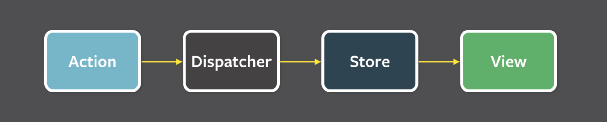
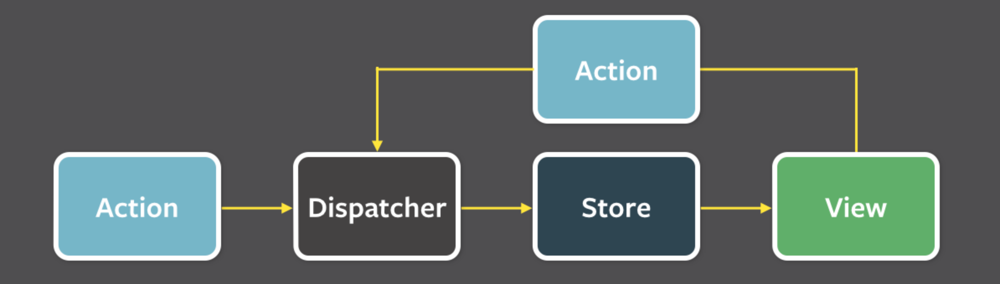
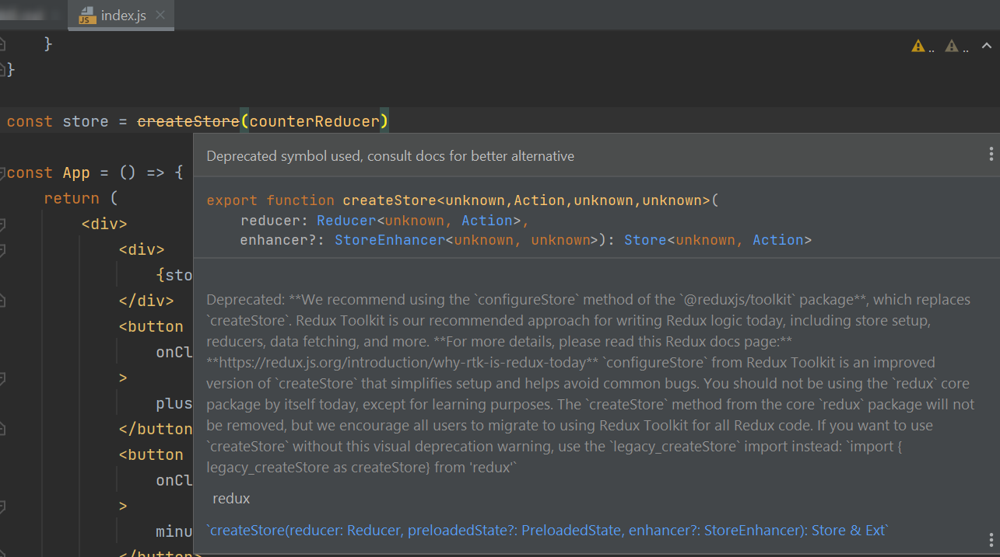
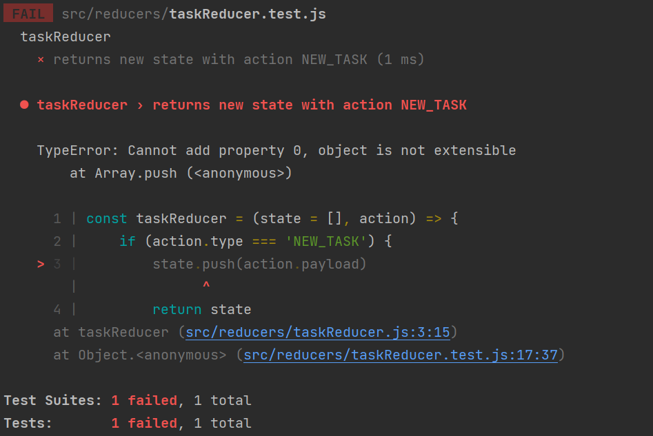
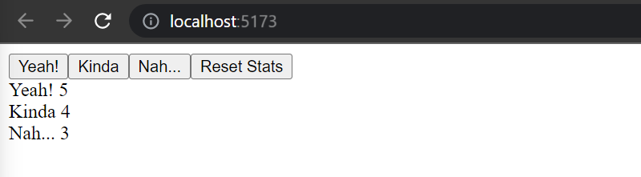
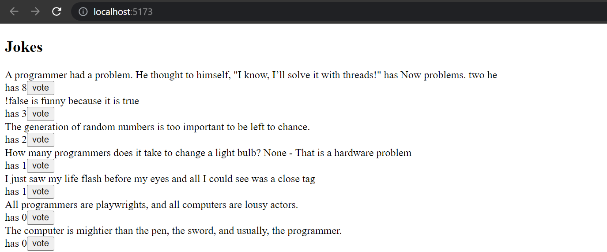

<div class="content">

So far, we have followed the state management conventions recommended by React.
We have placed the state and the functions for handling it in a [higher single component](https://react.dev/learn/sharing-state-between-components),
and then passed the state into the various components that use it.
Quite often most of the app state and state altering functions reside directly in the *`root`* component.
We then pass the state and its handlers to other components via *`props`*.
This works up to a certain point, but when applications grow larger, state management becomes challenging.

### Flux-architecture

A few years back Facebook developed the [***Flux***](https://facebook.github.io/flux/docs/in-depth-overview/) architecture to make state management of React apps easier.
In Flux, the state is separated from the React components and into its own **stores**.
State in the store is not changed directly, but with different **actions**.

When an ***action changes the state of the store, the views are re-rendered***:



For example, if you push a button that triggers the need to change the state, *that change will be made with an action*.
This causes re-rendering the view again:



Flux provides a standardized way to store and modify an application's state.

### Redux

Facebook has an implementation for Flux, but we will be using the [*Redux* library](https://redux.js.org).
It follows the same principles but is simpler to use.
Facebook also uses *Redux* now instead of their original *Flux*.

We will get to know Redux by implementing a counter application yet again:


Start with a new Vite application and then install *`redux`* with the command

```bash
npm i redux
```

#### Redux's Store and Actions

Like *Flux*, the state in *Redux* is housed in a [**store**](https://redux.js.org/basics/store).
You can think of the store as like a mini-database that redux uses to house information.

Unlike *Flux*, *Redux* stores this state in a ***single JavaScript object***.
Because our application only needs the value of the counter, we will save it straight to the store.
If the state were more complex, the different values would be saved as separate properties in the object.

The state of the store is changed with [**actions**](https://redux.js.org/basics/actions).
*Actions are objects*, which have at least a field determining the *type* of the action.
Our application will need for example the following action:

```js
{
  type: 'INCREMENT'
}
```

If there is data involved with the action, other fields can be declared as needed.
However, our counting app is so simple that the actions are fine with just the *`type`* field.

#### Reducers

The impact of the action to the state of the application is defined using a [reducer](https://redux.js.org/basics/reducers).
In practice, a **reducer** is a function that is given the current state and an action as parameters.
It ***returns*** a new state.

Let's now define a reducer for our application:

```js
const counterReducer = (state, action) => {
  if (action.type === 'INCREMENT') {
    return state + 1
  } else if (action.type === 'DECREMENT') {
    return state - 1
  } else if (action.type === 'ZERO') {
    return 0
  }

  return state
}
```

The first parameter is the `state` in the store.
The ***reducer returns a new state** based on the `action` type*.
So, here when the type of Action is *`INCREMENT`*, the state gets the *old value plus one*.
If the type of Action is *`ZERO`* the new value of state is *zero*.

Let's change the code a bit.
We have used *`if`*-*`else`* statements to build our reducer;
`counterReducer` responds to an action and changes the state.
However, the [`switch`](https://developer.mozilla.org/en-US/docs/Web/JavaScript/Reference/Statements/switch) statement is the most common approach to writing a reducer.

Let's also define a [default value](https://developer.mozilla.org/en-US/docs/Web/JavaScript/Reference/Functions/Default_parameters) of `0` for the parameter `state`.
Now the reducer works even if the state has not been initialized.

```js
const counterReducer = (state = 0, action) => { // highlight-line
  switch (action.type) {
    case 'INCREMENT':
      return state + 1
    case 'DECREMENT':
      return state - 1
    case 'ZERO':
      return 0
    default: // if none of the above matches, code comes here
      return state
  }
}
```

While `counterReducer` is a function, ***we are never supposed to call any reducer directly from our code***.
Instead, we pass the reducer into the older `createStore` function [(for now)](#a-notice-about-the-use-of-createstore),
which will handle calling the function:

```js
import { createStore } from 'redux' // highlight-line

const counterReducer = (state = 0, action) => {
  // ...
}

const store = createStore(counterReducer) // highlight-line
```

The `store` now uses the reducer to handle **actions**,
which are **dispatched** or '***sent***' to the *`store`* with its [`dispatch`](https://redux.js.org/api/store#dispatchaction) method.

```js
store.dispatch({ type: 'INCREMENT' })
```

You can find out the *state* of `store` using the method [`getState`](https://redux.js.org/api/store#getstate).

For example, the following code:

```js
const store = createStore(counterReducer)
console.log(store.getState())
store.dispatch({ type: 'INCREMENT' })
store.dispatch({ type: 'INCREMENT' })
store.dispatch({ type: 'INCREMENT' })
console.log(store.getState())
store.dispatch({ type: 'ZERO' })
store.dispatch({ type: 'DECREMENT' })
console.log(store.getState())
```

would print the following to the console

```shell
0
3
-1
```

At first, the *state* of `store` is ***`0`***.
After three `INCREMENT` actions, `store`'s state is ***`3`***.
In the end, after `ZERO` and `DECREMENT` actions, the `store`'s state is ***`-1`***.

In addition to `dispatch` and `getState`, `store` also has the [`subscribe`](https://redux.js.org/api/store#subscribelistener) method,
which is used to create callback functions the *`store`* calls whenever an *action is dispatched to it*.

If, for example, we would add the following function to `subscribe`, ***every change in the `store` would be printed to the console***.

```js
store.subscribe(() => {
  const storeNow = store.getState()
  console.log('breaking news! ', storeNow)
})
```

so the code

```js
const store = createStore(counterReducer)

store.subscribe(() => {
  const storeNow = store.getState()
  console.log('breaking news! ', storeNow)
})

store.dispatch({ type: 'INCREMENT' })
store.dispatch({ type: 'INCREMENT' })
store.dispatch({ type: 'INCREMENT' })
store.dispatch({ type: 'ZERO' })
store.dispatch({ type: 'DECREMENT' })
```

would cause the following to be printed

```shell
breaking news! 1
breaking news! 2
breaking news! 3
breaking news! 0
breaking news! -1
```

Let's now replace our hello world content with buttons and some visible HTML.
The entire code is below.
All of it has been written in *main.jsx*,
so `store` is directly available everywhere 👀.
Later on we will focus on properly structuring our React/Redux code.

```js
import React from 'react'
import ReactDOM from 'react-dom/client'

import { createStore } from 'redux'

const counterReducer = (state = 0, action) => {
  switch (action.type) {
    case 'INCREMENT':
      return state + 1
    case 'DECREMENT':
      return state - 1
    case 'ZERO':
      return 0
    default:
      return state
  }
}

const store = createStore(counterReducer)

const App = () => {
  return (
    <div>
      <div>
        {store.getState()} // highlight-line
      </div>
      <button 
        onClick={e => store.dispatch({ type: 'INCREMENT' })} // highlight-line
      >
        plus
      </button>
      <button
        onClick={e => store.dispatch({ type: 'DECREMENT' })} // highlight-line
      >
        minus
      </button>
      <button 
        onClick={e => store.dispatch({ type: 'ZERO' })} // highlight-line
      >
        zero
      </button>
    </div>
  )
}

const root = ReactDOM.createRoot(document.getElementById('root'))

// highlight-start
const renderApp = () => {
  root.render(<App />)
}

renderApp()
store.subscribe(renderApp)
// highlight-end
```

There are a few notable things in the code.
`App` renders the value of the counter by asking for it from the `store` with the method `store.getState()`.
The buttons' `onClick` handlers ***dispatch*** the right action object to the `store`.

When `store`'s state changes, *React cannot automatically re-render the application by itself*.
Thus we have registered a function `renderApp` with `store.subscribe`.
Now, ***`renderApp` will re-render the entire app anytime `store` changes***.
*Remember that we have to also directly call `renderApp()`.*
Otherwise, we would have only defined renderApp and so the first rendering of the app would never happen.

### A notice about the use of `createStore`

You may have noticed that in WebStorm, `createStore` has a strikethrough.
If you move the mouse over the name, an explanation will appear



Here's an official explanation:

>*We recommend using the `configureStore` method of the **@reduxjs/toolkit** package, which replaces `createStore`.*
>
>*Redux Toolkit is our recommended approach for writing Redux logic today, including store setup, reducers, data fetching, and more.*
>
>*For more details, please read this Redux docs page: <https://redux.js.org/introduction/why-rtk-is-redux-today>*
>
>*`configureStore` from Redux Toolkit is an improved version of `createStore` that simplifies setup and helps avoid common bugs.*
>
>*You should not be using the `redux` core package by itself today, except for learning purposes.
The `createStore` method from the core redux package will not be removed, but we encourage all users to migrate to using Redux Toolkit for all Redux code.*

So, since Redux recommends `configureStore` over `createStore`,
we will start using `configureStore` in the [next section](/part6/many_reducers),
*but we will continue using `createStore` here as we are still introducing redux concepts*.

> An Aside: `createStore` is defined as **deprecated**.
> Functions/features that are deprecated are sometimes removed in a future version of a library.
The explanation above and the discussion of [this one](https://stackoverflow.com/questions/71944111/redux-createstore-is-deprecated-cannot-get-state-from-getstate-in-redux-ac)
reveal that `createStore` will not be removed, and it has been given the status `deprecated`, perhaps to nudge people to use `configureStore` instead.

You can see the full code for the calculator on [GitHub](https://github.com/comp227/redux-tasks/tree/main) in the *main* branch.

### Redux-tasks

We aim to modify our task application to use Redux for state management.
However, let's first cover a few key concepts through a simplified task application.

The first version of our application is the following

```js
const taskReducer = (state = [], action) => {
  if (action.type === 'NEW_TASK') {
    state.push(action.payload)
    return state
  }

  return state
}

const store = createStore(taskReducer)

store.dispatch({
  type: 'NEW_TASK',
  payload: {
    content: 'learn more about how the app state is in redux store',
    important: true,
    id: 1
  }
})

store.dispatch({
  type: 'NEW_TASK',
  payload: {
    content: 'understand more fully how state changes are made with actions',
    important: false,
    id: 2
  }
})

const App = () => {
  return(
    <div>
      <ul>
        {store.getState().map(task=>
          <li key={task.id}>
            {task.content} <strong>{task.important ? '- important' : ''}</strong>
          </li>
        )}
        </ul>
    </div>
  )
}
```

So far the application does not have the functionality for adding new tasks, *although it is possible to do so by dispatching `NEW_TASK` actions*.

Notice how the actions have a `type` and a `payload`, the latter containing the task to be added:

```js
{
  type: 'NEW_TASK',
  payload: {
    content: 'understand more fully how state changes are made with actions',
    important: false,
    id: 2
  }
}
```

The general convention is that actions have exactly two fields:

1. `type` referring to the type of Action (ie *`NEW_TASK`*)
2. `payload` containing the data to include with the Action.

### Pure functions, immutable

If we remember the goal of a [reducer](#reducers), then our initial version of `taskReducer` is straightforward:

```js
const taskReducer = (state = [], action) => {
  if (action.type === 'NEW_TASK') {
    state.push(action.payload)
    return state
  }

  return state
}
```

The `state` here is an Array.
*`NEW_TASK`* actions cause a new task to be added to the `state` with the [`push` method](https://developer.mozilla.org/en-US/docs/Web/JavaScript/Reference/Global_Objects/Array/push).

While the application seems to work, our `taskReducer` implementation is unacceptable.
Unfortunately, `taskReducer` breaks a [basic assumption](https://redux.js.org/tutorials/essentials/part-1-overview-concepts#reducers)
that Redux reducers must be [**pure functions**](https://en.wikipedia.org/wiki/Pure_function).

Pure functions must:

- ***not cause any side effects***
- *always return the same response when called with the same parameters*

We added a new task to the `state` with the method `state.push(action.payload)`.
Calling `state.push` ***changes our `state` object** which is a **side-effect***.
This is not allowed.
The problem is easily solved by using the
[`concat` method](https://developer.mozilla.org/en-US/docs/Web/JavaScript/Reference/Global_Objects/Array/concat).
Calling `state.concat` *creates a new array* that contains all the elements of the old array along with the new element:

```js
const taskReducer = (state = [], action) => {
  if (action.type === 'NEW_TASK') {
    return state.concat(action.payload) // highlight-line
  }

  return state
}
```

**A reducer state must be composed of [*immutable objects*](https://en.wikipedia.org/wiki/Immutable_object)**.
If there is a change in the state, the old object is not changed, but it is ***replaced with a new, changed, object***.
This is exactly what we did with our revised `taskReducer`: the old `state` array is replaced with the new one.

Let's expand our reducer so that it can handle the change of a task's importance:

```js
{
  type: 'TOGGLE_IMPORTANCE',
  payload: {
    id: 2
  }
}
```

### TDD with Redux setup

Since we do not have any code which uses this functionality yet,
let's expand the reducer via [Test-Driven Development (TDD)](https://en.wikipedia.org/wiki/Test-driven_development).
Let's start by creating a test for handling the action *`NEW_TASK`*.

In short, TDD follows this three-step process:

1. Make a test that causes the existing code to fail (***red***)
2. Change the code so that it passes all the tests again (***green***)
3. Refactor the code while ensuring the tests still pass (***refactor***)

To follow TDD, we'll need to configure the [Jest](https://jestjs.io/) testing library for the project.
First, install the following dependencies:

```js
npm i -D jest @babel/preset-env @babel/preset-react eslint-plugin-jest 
```

Next we'll create the file *.babelrc*, with the following content:

```json
{
    "presets": [
        "@babel/preset-env",
        ["@babel/preset-react", { "runtime": "automatic" }]
    ]
}
```

Let us expand *package.json* with a script for running the tests:

```json
{
    // ...
    "scripts": {
        "dev": "vite",
        "build": "vite build",
        "lint": "eslint . --ext js,jsx --report-unused-disable-directives --max-warnings 0",
        "preview": "vite preview",
        "test": "jest" // highlight-line
    },
    // ...
}
```

And finally, *.eslintrc.cjs* needs to be altered as follows:

```js
module.exports = {
    root: true,
    env: { 
        browser: true,
        es2020: true,
        "jest/globals": true // highlight-line
    },
    // ...
}
```

### Testing and Deep Freeze

To make testing easier, we'll first move the reducer's code to its own module to file *src/reducers/taskReducer.js*.
We'll also add the library [deep-freeze](https://www.npmjs.com/package/deep-freeze),
which can help ensure that our reducer has been correctly defined as an immutable function.
Let's install the library as a development dependency

```js
npm i -D deep-freeze
```

The test, which we define in file *src/reducers/taskReducer.test.js*, has the following content:

```js
import taskReducer from './taskReducer'
import deepFreeze from 'deep-freeze'

describe('taskReducer', () => {
  test('returns new state with action NEW_TASK', () => {
    const state = []
    const action = {
      type: 'NEW_TASK',
      payload: {
        content: 'learn more about how the app state is in redux store',
        important: true,
        id: 1
      }
    }

    deepFreeze(state) // highlight-line
    const newState = taskReducer(state, action)

    expect(newState).toHaveLength(1)
    expect(newState).toContainEqual(action.payload)
  })
})
```

The `deepFreeze(state)` command ensures that the reducer does not change the state of the store given to it as a parameter.
If the reducer uses the `push` command to manipulate the state, the test will not pass



### Our first redux test - toggling importance

Now that we setup our first step, let's start with TDD.
We have yet to implement the functionality for toggling the importance of a task.
Let's then create a test for the `TOGGLE_IMPORTANCE` action:

```js
test('returns new state with action TOGGLE_IMPORTANCE', () => {
  const state = [
    {
      content: 'learn more about how the app state is in redux store',
      important: true,
      id: 1
    },
    {
      content: 'understand more fully how state changes are made with actions',
      important: false,
      id: 2
    }]

  const action = {
    type: 'TOGGLE_IMPORTANCE',
    payload: {
      id: 2
    }
  }

  deepFreeze(state)
  const newState = taskReducer(state, action)

  expect(newState).toHaveLength(2)

  expect(newState).toContainEqual(state[0])

  expect(newState).toContainEqual({
    content: 'understand more fully how state changes are made with actions',
    important: true,
    id: 2
  })
})
```

So the following action

```js
{
  type: 'TOGGLE_IMPORTANCE',
  payload: {
    id: 2
  }
}
```

has to change the importance of the task with the `id` *`2`*.

If you were to run the test, it would fail, because we have yet to implement anything related to `TOGGLE_IMPORTANCE`.
With our failing test, we can now work on the reducer.
Below is our expanded reducer:

```js
const taskReducer = (state = [], action) => {
  switch(action.type) {
    case 'NEW_TASK':
      return state.concat(action.payload)
    case 'TOGGLE_IMPORTANCE': {
      const id = action.payload.id
      const taskToChange = state.find(t => t.id === id)
      const changedTask = { 
        ...taskToChange, 
        important: !taskToChange.important 
      }
      return state.map(task =>
        task.id !== id ? task : changedTask 
      )
     }
    default:
      return state
  }
}
```

We create `changedTask`, a copy of the task but with the `important` field flipped, utilizing [the code we implemented in part 2](/part2/altering_data_in_server#the-toggleimportanceof-code).
We then replace the `state` with a new object containing the unchanged tasks along with our `changedTask`.

Let's recap what goes on in the code.
First, we search for a specific task object, the importance of which we want to change:

```js
const taskToChange = state.find(t => t.id === id)
```

then we create a new object, which is a *copy* of the original task, only the value of the ***important*** field has been flipped to the opposite of what it was:

```js
const changedTask = { 
  ...taskToChange, 
  important: !taskToChange.important 
}
```

We create a new state by taking all of the tasks from the old state (via `map`) except for the desired task, which we replace with its slightly altered copy:

```js
state.map(task =>
  task.id !== id ? task : changedTask 
)
```

Our reducer then returns that new array of tasks.

### Array spread syntax

Because we now have a reducer that passes our tests, we can follow TDD and move to *refactor* the code.

Currently in `NEW_TASK`, the code creates a copy of `state` via the Array's `concat` function.
Let's take a look at how we can achieve the same
by using JavaScript's [*spread operator syntax*](https://developer.mozilla.org/en-US/docs/Web/JavaScript/Reference/Operators/Spread_operator):

```js
const taskReducer = (state = [], action) => {
  switch(action.type) {
    case 'NEW_TASK':
      return [...state, action.payload] // highlight-line
    case 'TOGGLE_IMPORTANCE':
      // ...
    default:
    return state
  }
}
```

Here's how the spread syntax works.
If we declare:

```js
const my_physics_midterm_scores = [35, 34, 31]
```

`...my_midterm_scores` breaks the array up into individual elements, which can be placed in another array.

```js
[...my_physics_midterm_scores, 23, 13]
```

and the result is an array `[35, 34, 31, 23, 13]`.

If we would have placed the array into another array without the spread operator

```js
[numbers, 34, 35]
```

the result would have been `[ [35, 34, 31] , 23, 13]`.

When we take elements from an array by [destructuring](https://developer.mozilla.org/en-US/docs/Web/JavaScript/Reference/Operators/Destructuring_assignment),
a similar-looking syntax is used to *gather* the rest of the elements:

```js
const my_physics_midterm_scores = [35, 34, 31, 23, 13, 7]

const [first, second, ...rest] = my_physics_midterm_scores

console.log(first)     // prints 35
console.log(second)   // prints 34
console.log(rest)     // prints [31, 23, 13, 7]
```

</div>

<div class="tasks">

### Exercises 6.1-6.2

For this part's exercises, please accept the assignment from <http://go.djosv.com/227lab6>.
Once it's been setup, make sure to clone the repository.
Here we will have three projects in the same folder.
*Remember that you'll need to run `npm install` in the correct subfolder before being able to work on that particular project.*

Let's make a simplified version of the studytracker exercise from part 1.
Let's handle the state management with Redux.

#### 6.1: studytracker revisited, Step 1

Before implementing the functionality of the UI, let's implement the functionality required by the store.

We have to save the number of each kind of feedback to the store, so the form of the state in the store is:

```js
{
  yeah: 5,
  kinda: 4,
  nah: 2
}
```

The project has the following base for a reducer:

```js
const initialState = {
  yeah: 0,
  kinda: 0,
  nah: 0
}

const counterReducer = (state = initialState, action) => {
  console.log(action)
  switch (action.type) {
    case 'YEAH':
      return state
    case 'KINDA':
      return state
    case 'NAH':
      return state
    case 'ZERO':
      return state
    default: return state
  }

}

export default counterReducer
```

and a base for its tests

```js
import deepFreeze from 'deep-freeze'
import counterReducer from './reducer'

describe('studytracker reducer', () => {
  const initialState = {
    yeah: 0,
    kinda: 0,
    nah: 0
  }

  test('should return a proper initial state when called with undefined state', () => {
    const state = {}
    const action = {
      type: 'DO_NOTHING'
    }

    const newState = counterReducer(undefined, action)
    expect(newState).toEqual(initialState)
  })

  test('yeah is incremented', () => {
    const action = {
      type: 'YEAH'
    }
    const state = initialState

    deepFreeze(state)
    const newState = counterReducer(state, action)
    expect(newState).toEqual({
      yeah: 1,
      kinda: 0,
      nah: 0
    })
  })
})
```

**Implement the reducer and its tests.**

You can run the tests via `npm test`.
In the tests, make sure that the reducer is an **immutable function** with the ***deep-freeze*** library.
Ensure that the provided first test passes, because Redux expects that the reducer returns a sensible original state when it is called so that the first parameter `state`,
which represents the previous state, is `undefined`.

Start by expanding the reducer so that both tests pass.
Then add the rest of the tests, and finally the functionality that they are testing.

A good model for the reducer is the [redux-tasks](/part6/flux_architecture_and_redux#pure-functions-immutable)
example above.

#### 6.2: studytracker revisited, Step 2

Now implement the actual functionality of the application.

Your application can have a modest appearance, nothing else is needed but buttons and the number of reviews for each type:



</div>

<div class="content">

### Uncontrolled form

Let's add the functionality for adding new tasks and changing their importance:

```js
const generateId = () => Number((Math.random() * 1000000).toFixed(0)) // highlight-line

const App = () => {
  // highlight-start
  const addTask = (event) => {
    event.preventDefault()
    const content = event.target.task.value
    event.target.task.value = ''
    store.dispatch({
      type: 'NEW_TASK',
      payload: {
        content,
        important: false,
        id: generateId()
      }
    })
  }
  // highlight-end

  // highlight-start
  const toggleImportance = (id) => {
    store.dispatch({
      type: 'TOGGLE_IMPORTANCE',
      payload: { id }
    })
  }
  // highlight-end

  return (
    <div>
      // highlight-start
      <form onSubmit={addTask}>
        <input name="task" /> 
        <button type="submit">add</button>
      </form>
        // highlight-end
      <ul>
        {store.getState().map(task =>
          <li
            key={task.id} 
            onClick={() => toggleImportance(task.id)} // highlight-line
          >
            {task.content} <strong>{task.important ? '- important' : ''}</strong>
          </li>
        )}
      </ul>
    </div>
  )
}
```

The implementation of both actions is straightforward.
Notice that we ***have not bound the state of the form fields to the state of the `App` component*** like we have previously done.
React calls this kind of form [**uncontrolled**](https://react.dev/reference/react-dom/components/input#controlling-an-input-with-a-state-variable).

>***Uncontrolled forms*** have certain limitations (for example, *dynamic error messages* or *disabling the submit button based on an input* are not possible).
However uncontrolled forms are suitable enough for now.
>
>If interested, you can [read more about uncontrolled forms](https://goshakkk.name/controlled-vs-uncontrolled-inputs-react/).

Let's review the highlighted code above carefully.
The method handler `addTask`, mainly dispatches the action for adding tasks to our `store`:

```js
addTask = (event) => {
  event.preventDefault()
  const content = event.target.task.value  // highlight-line
  event.target.task.value = ''
  store.dispatch({
    type: 'NEW_TASK',
    payload: {
      content,
      important: false,
      id: generateId()
    }
  })
}
```

We can get the content of the new task straight from our form's `task` input field.
Because this field has a name, we access its content via the `event` object: `event.target.task.value`.

```js
<form onSubmit={addTask}>
  <input name="task" /> // highlight-line
  <button type="submit">add</button>
</form>
```

A `task`'s *importance* can be changed by clicking its name.
The event handler is modest:

```js
toggleImportance = (id) => {
  store.dispatch({
    type: 'TOGGLE_IMPORTANCE',
    payload: { id }
  })
}
```

### Action creators

We begin to notice that, even in applications as primitive as ours, using Redux can simplify the frontend code.
However, we can do a lot better.

*React components don't need to know the Redux action types and forms.*
**Let's separate the creation of action objects into functions**:

```js
const createTask = (content) => {
  return {
    type: 'NEW_TASK',
    payload: {
      content,
      important: false,
      id: generateId()
    }
  }
}

const toggleImportanceOf = (id) => {
  return {
    type: 'TOGGLE_IMPORTANCE',
    payload: { id }
  }
}
```

Functions that create these action objects are called [**action creators**](https://redux.js.org/advanced/async-actions#synchronous-action-creators).

The `App` component ***does not have to know anything about the inner representation of the actions anymore***, *it just gets the right action by calling the creator function*:

```js
const App = () => {
  const addTask = (event) => {
    event.preventDefault()
    const content = event.target.task.value
    event.target.task.value = ''
    store.dispatch(createTask(content)) // highlight-line
  }
  
  const toggleImportance = (id) => {
    store.dispatch(toggleImportanceOf(id))// highlight-line
  }

  // ...
}
```

### Forwarding Redux Store to various components

Aside from the reducer, our application is in one file. 🧐
We should separate `App` into its module.

But how can the `App` access the store after the move?
And more broadly, when a component is composed of many smaller components, ***there must be a way for all of the components to access the store***.
There are multiple ways to share the Redux store with components.
The newest (and possibly easiest) way of sharing the store is by using the [**hooks API**](https://react-redux.js.org/api/hooks) of the [react-redux](https://react-redux.js.org/) library.

First, let's install react-redux

```bash
npm i react-redux
```

Next, if you haven't done so already, move the `App` component into its own file *App.jsx*.
Let's see how this affects the rest of the application files.

*main.jsx* becomes:

```js
import React from 'react'
import ReactDOM from 'react-dom/client'
import { createStore } from 'redux'
import { Provider } from 'react-redux' // highlight-line

import App from './App'
import taskReducer from './reducers/taskReducer'

const store = createStore(taskReducer)

ReactDOM.createRoot(document.getElementById('root')).render(
  <Provider store={store}>  // highlight-line
    <App />
  </Provider>  // highlight-line
)
```

Notice that the application is now defined *as a child of* a [`Provider`](https://react-redux.js.org/api/provider) component provided by the react-redux library.
The application's *`store`* is given to the `Provider` as its attribute `store`.

Defining the action creators has been moved to the file *reducers/taskReducer.js* where the reducer is defined.
That file looks like this:

```js
const taskReducer = (state = [], action) => {
  // ...
}

const generateId = () =>
  Number((Math.random() * 1000000).toFixed(0))

export const createTask = (content) => { // highlight-line
  return {
    type: 'NEW_TASK',
    payload: {
      content,
      important: false,
      id: generateId()
    }
  }
}

export const toggleImportanceOf = (id) => { // highlight-line
  return {
    type: 'TOGGLE_IMPORTANCE',
    payload: { id }
  }
}

export default taskReducer
```

If the application has many components which need the `store`, the `App` component must pass *`store`* as props to all of those components.

The module now has multiple [`export`](https://developer.mozilla.org/en-US/docs/Web/JavaScript/Reference/Statements/export) commands.

A module can have only ***one default** export*, but *multiple **normal** exports*

```js
export const createTask = (content) => {
  // ...
}

export const toggleImportanceOf = (id) => { 
  // ...
}
```

The reducer function is still returned with the `export default` command, so the reducer can be imported the usual way:

```js
import taskReducer from './reducers/taskReducer'
```

In contrast, the normal exports (`createTask` and `toggleImportanceOf`) are imported via the curly brace syntax:

```js
import { createTask } from './../reducers/taskReducer'
```

Below is the revised code for our `App` component

```js
import { createTask, toggleImportanceOf } from './reducers/taskReducer' // highlight-line
import { useSelector, useDispatch } from 'react-redux'  // highlight-line

const App = () => {
  const dispatch = useDispatch()  // highlight-line
  const tasks = useSelector(state => state)  // highlight-line

  const addTask = (event) => {
    event.preventDefault()
    const content = event.target.task.value
    event.target.task.value = ''
    dispatch(createTask(content))  // highlight-line
  }

  const toggleImportance = (id) => {
    dispatch(toggleImportanceOf(id)) // highlight-line
  }

  return (
    <div>
      <form onSubmit={addTask}>
        <input name="task" /> 
        <button type="submit">add</button>
      </form>
      <ul>
        {tasks.map(task =>  // highlight-line
          <li
            key={task.id} 
            onClick={() => toggleImportance(task.id)}
          >
            {task.content} <strong>{task.important ? '- important' : ''}</strong>
          </li>
        )}
      </ul>
    </div>
  )
}

export default App
```

There are a few things to observe in the code.
Previously, the `App` dispatched actions by calling the `dispatch` method of the Redux `store`:

```js
store.dispatch({
  type: 'TOGGLE_IMPORTANCE',
  payload: { id }
})
```

Now it does it with the `dispatch` function from the [`useDispatch`](https://react-redux.js.org/api/hooks#usedispatch) hook.

```js
import { useSelector, useDispatch } from 'react-redux'  // highlight-line

const App = () => {
  const dispatch = useDispatch()  // highlight-line
  // ...

  const toggleImportance = (id) => {
    dispatch(toggleImportanceOf(id)) // highlight-line
  }

  // ...
}
```

The `useDispatch` hook provides ***any** React component access to **main.jsx**' `dispatch`'s `store`*.
This allows all components to make changes to the state of the Redux `store`.

The component can access the tasks stored in the `store` with the [*`useSelector`*](https://react-redux.js.org/api/hooks#useselector) hook of the react-redux library.

```js
import { useSelector, useDispatch } from 'react-redux'  // highlight-line

const App = () => {
  // ...
  const tasks = useSelector(state => state)  // highlight-line
  // ...
}
```

`useSelector` receives a function as a parameter.
The function either ***searches for*** or ***selects data*** from the Redux store.
Here *we need all of the tasks*, so our selector function returns the whole `state`:

```js
state => state
```

which is a shorthand for:

```js
(state) => {
  return state
}
```

Usually, selector functions are a bit more interesting and *return only selected parts of the contents of the Redux store*.
We could for example return only tasks marked as important:

```js
const importantTasks = useSelector(state => state.filter(task => task.important))  
```

The current version of the application can be found on [GitHub](https://github.com/comp227/redux-tasks/tree/part6-0), branch *part6-0*.

### More components

Let's separate creating a new task into a component (*components/NewTask.js*).

```js
import { useDispatch } from 'react-redux' // highlight-line
import { createTask } from '../reducers/taskReducer' // highlight-line

-const NewTask = () => {
  const dispatch = useDispatch() // highlight-line

  const addTask = (event) => {
    event.preventDefault()
    const content = event.target.task.value
    event.target.task.value = ''
    dispatch(createTask(content)) // highlight-line
  }

  return (
    <form onSubmit={addTask}>
      <input name="task" />
      <button type="submit">add</button>
    </form>
  )
}

export default NewTask
```

Unlike in the React code we did without Redux, the event handler for changing the state of the app (which now lives in Redux)
*has been moved away from the `App` to a child component*.
The logic for changing the state in Redux is still neatly separated from the whole React part of the application.

We'll also separate the list of tasks and displaying a single task into their own components (both of which will be placed in the *components/Tasks.js* file):

```js
import { useDispatch, useSelector } from 'react-redux' // highlight-line
import { toggleImportanceOf } from '../reducers/taskReducer' // highlight-line

const Task = ({ task, handleClick }) => {
  return(
    <li onClick={handleClick}>
      {task.content} 
      <strong> {task.important ? '- important' : ''}</strong>
    </li>
  )
}

const Tasks = () => {
  const dispatch = useDispatch() // highlight-line
  const tasks = useSelector(state => state) // highlight-line

  return(
    <ul>
      {tasks.map(task =>
        <Task
          key={task.id}
          task={task}
          handleClick={() => 
            dispatch(toggleImportanceOf(task.id))
          }
        />
      )}
    </ul>
  )
}

export default Tasks
```

The logic for changing the importance of a task is now in the component managing the list of tasks.

With this refactoring, there is not much code left in `App`:

```js
const App = () => {

  return (
    <div>
      <NewTask />
      <Tasks />
    </div>
  )
}
```

`Task`, responsible for rendering a single task, is very simple and is not aware that the event handler it gets as props dispatches an action.
These kinds of components are called [***presentational***](https://medium.com/@dan_abramov/smart-and-dumb-components-7ca2f9a7c7d0) in React terminology.

`Tasks`, on the other hand, is a
[**container component**](https://medium.com/@dan_abramov/smart-and-dumb-components-7ca2f9a7c7d0),
as it contains some application logic:
it defines what the event handlers of the `Task` components do and coordinates the configuration of **presentational** components, that is, the `Task`s.

We will return to the presentational/container division later on.

The code of the Redux application can be found on
[GitHub](https://github.com/comp227/redux-tasks/tree/part6-1), branch *part6-1*.

</div>

<div class="tasks">

### Exercises 6.3-6.8

Let's move on to a new version of the joke voting application from [part 1](/part1/a_more_complex_state_debugging_react_apps#exercises-1-6-1-14).
The project you cloned at the beginning of [part6](/part6/flux_architecture_and_redux#exercises-6-1-6-2) has the *jokes* folder with everything you need to start.

Remember, to install the dependencies first before trying to run the application

```bash
npm i
npm run dev
```

After completing the exercises below, your application should look like this:



#### 6.3: jokes, Step 1

Implement the functionality for voting jokes.
The number of votes must be saved to a Redux store.

#### 6.4: jokes, Step 2

Implement the functionality for adding new jokes.

You can keep the form uncontrolled like we did [earlier](/part6/flux_architecture_and_redux#uncontrolled-form).

#### 6.5: jokes, Step 3

Make sure that the jokes are ordered by the number of votes.

#### 6.6: jokes, Step 4

If you haven't done so already, separate the creation of action-objects to [*action creator functions*](https://read.reduxbook.com/markdown/part1/04-action-creators.html)
functions and place them in the *src/reducers/jokeReducer.js* file,
so do what we have been doing since the chapter [action creators](/part6/flux_architecture_and_redux#action-creators).

#### 6.7: jokes, Step 5

Separate the creation of new jokes into a component called `JokeForm`.
Move all logic for creating a new joke into this new component.

#### 6.8: jokes, Step 6

Separate the rendering of the list of jokes into a component called `Jokes`.
Move all logic related to voting for a joke into this new component.

Now the `App` component should look like this:

```js
import JokeForm from './components/JokeForm'
import Jokes from './components/Jokes'

const App = () => {
  return (
    <div>
      <h2>Jokes</h2>
      <JokeForm />
      <Jokes />
    </div>
  )
}

export default App
```

</div>
