<div class="content">

Let's continue building a simplified [redux version](/part6/flux_architecture_and_redux#redux-tasks) of our tasks application.

As a reminder, the Redux [*store*](https://redux.js.org/tutorials/fundamentals/part-4-store) brings together:

- data ([*state*](https://redux.js.org/tutorials/fundamentals/part-2-concepts-data-flow#state-management))
- events ([*actions*](https://redux.js.org/tutorials/fundamentals/part-2-concepts-data-flow#actions))
- event handlers that are given those events and data ([*reducers*](https://redux.js.org/tutorials/fundamentals/part-2-concepts-data-flow#reducers))

To ease development, let's initialize our redux `store`'s `state` in *reducers/taskReducer.js*.
Let's change `taskReducer`'s default `state` from an empty array *`[]`* to an array of task objects *`initialState`*:

```js
const initialState = [
  {
    content: 'remind myself that the reducer defines how the redux store works',
    important: true,
    id: 1,
  },
  {
    content: 'repeat the words: a redux store can contain any data',
    important: false,
    id: 2,
  },
]

const taskReducer = (state = initialState, action) => { // highlight-line
  // ...
}

// ...
export default taskReducer
```

### Store with complex state

Let's implement filtering for the tasks that are displayed to the user.
The user interface for the filters will be implemented with [radio buttons](https://developer.mozilla.org/en-US/docs/Web/HTML/Element/input/radio):

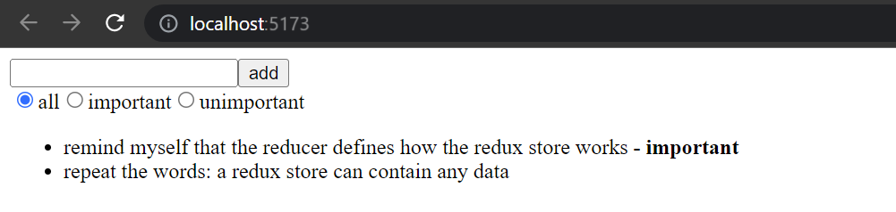

Let's start with a very simple and straightforward implementation in *App.js*:

```js
import NewTask from './components/NewTask'
import Tasks from './components/Tasks'

const App = () => {
//highlight-start
  const filterSelected = (value) => {
    console.log(value)
  }
//highlight-end

  return (
    <div>
      <NewTask />
        //highlight-start
      <div>
        <input type="radio" name="filter"
                onChange={() => filterSelected('ALL')} />all
        <input type="radio" name="filter"
                onChange={() => filterSelected('IMPORTANT')} />important
        <input type="radio" name="filter"
                onChange={() => filterSelected('UNIMPORTANT')} />unimportant
      </div>
      //highlight-end
      <Tasks />
    </div>
  )
}
```

Since the `name` attribute of all the radio buttons is the same, the three options form a **button group** where only one option can be selected.

The buttons have a *change handler* that currently only prints the string associated with the clicked button to the console.

We decide to implement the filter functionality by storing *the value of the filter* in the redux store in addition to the tasks themselves.
The state of the store should look like this after we finish making the changes in the next section:

```js
{
  tasks: [
    { content: 'remind myself that the reducer defines how the redux store works', important: true, id: 1},
    { content: 'repeat the words: a redux store can contain any data', important: false, id: 2}
  ],
  filter: 'IMPORTANT'
}
```

Currently, our application only stores the array of tasks.
In the new implementation, the state object will have two properties:

- `tasks` that contains the array of tasks
- `filter` that contains a string indicating which tasks should be displayed to the user.

### Combined reducers

To handle our new filter data, we could modify `taskReducer` to deal with the filter data as well.
However, a better solution in this situation is to separate the filter into a new file *src/reducers/filterReducer.js*:

```js
const filterReducer = (state = 'ALL', action) => {
  switch (action.type) {
    case 'SET_FILTER':
      return action.payload
    default:
      return state
  }
}
```

The actions for changing the filter's state look like this:

```js
{
  type: 'SET_FILTER',
  payload: 'IMPORTANT'
}
```

Let's also *create a new **action creator** function*.
We will write the code for the action creator after our `filterReducer`:

```js
const filterReducer = (state = 'ALL', action) => {
  // ...
}

export const filterChange = filter => {
  return {
    type: 'SET_FILTER',
    payload: filter,
  }
}

export default filterReducer
```

We can *create the actual reducer for our application by combining the two existing reducers with the [`combineReducers`](https://redux.js.org/api/combinereducers) function*.

Let's define the combined reducer in the *index.js* file:

```js
import React from 'react'
import ReactDOM from 'react-dom/client'
import { createStore, combineReducers } from 'redux' // highlight-line
import { Provider } from 'react-redux' 
import App from './App'

import taskReducer from './reducers/taskReducer'
import filterReducer from './reducers/filterReducer' // highlight-line

 // highlight-start
const reducer = combineReducers({
  tasks: taskReducer,
  filter: filterReducer
})
 // highlight-end

const store = createStore(reducer) //highlight-line

console.log(store.getState())

ReactDOM.createRoot(document.getElementById('root')).render(
  <Provider store={store}>
    {/*<App />*/}
    <div/>
  </Provider>
)
```

> *Since our application breaks at this point, we render a `<div/>` element, commenting out our `<App/>`.* Remember that you can toggle comments with ***Ctrl-/***.

The state of the store gets printed to the console:

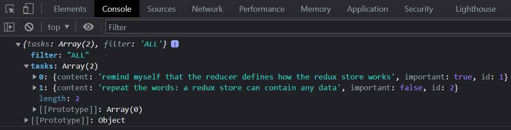

As we can see from the output, the store has the exact form we wanted it to!

>Let's review how we were able to get this object by examining the `reducer` we passed to `createStore`, **`combineReducers`**
>
>```js
>const reducer = combineReducers({
>  tasks: taskReducer,
>  filter: filterReducer,
>})
>```
>
>`combineReducers` helped us create a state object with two properties: `tasks` and `filter`.
The value of the `tasks` property is defined by the `taskReducer`, which does not have to deal with the other properties of the state.
Likewise, the `filter` property is managed by the `filterReducer`.

#### Combined reducers in action

In this section we're going to take a step back from our project to investigate how the combined reducer works.
Let' simulate changing the filter and creating a task by adding the following to the *index.js* file:

```js
import { createTask } from './reducers/taskReducer'
import { filterChange } from './reducers/filterReducer'
//...
store.subscribe(() => console.log(store.getState()))
store.dispatch(filterChange('IMPORTANT'))
store.dispatch(createTask('remember that combineReducers forms one reducer from many simple reducers'))
```

Notice that with our `subscribe` call above, the store's state gets logged to the console after every change:

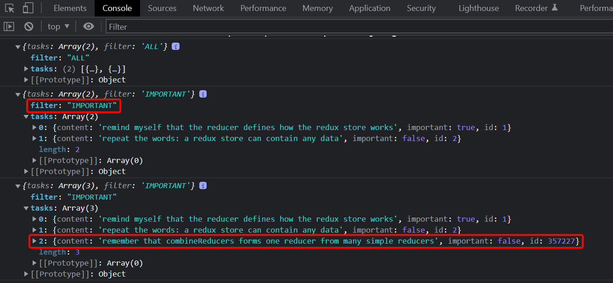

At this point, it is good to become aware of a tiny but important detail.
If we add a `console.log` statement *to the beginning of both reducers*:

```js
const filterReducer = (state = 'ALL', action) => {
  console.log('ACTION: ', action)
  // ...
}
```

Based on the console output one might think that every action gets duplicated:

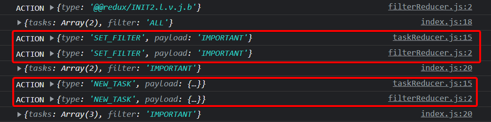

Is there a bug in our code? No.
The combined reducer works in such a way that ***every `action` gets handled in every part of the combined reducer***.
Typically only one reducer is interested in any given action,
but there are situations where *multiple reducers change their respective parts of the state based on the same action*.

### Finishing the filters

Let's finish the application so that it uses the combined reducer.
We start by changing the rendering of the application and hooking up the store to the application in the *index.js* file:

```js
ReactDOM.createRoot(document.getElementById('root')).render(
  <Provider store={store}>
    <App />
  </Provider>
)
```

Next, let's fix a bug that is caused by the code expecting the application store to be an array of tasks:

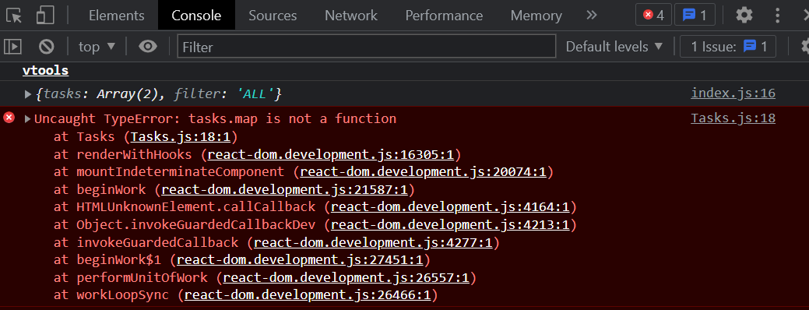

Because the tasks are now [embedded further into the state object](#combined-reducers), let's tweak the selector function:

```js
const Tasks = () => {
  const dispatch = useDispatch()
  const tasks = useSelector(state => state.tasks) // highlight-line

  return(
    <ul>
      {tasks.map(task =>
        <Task
          key={task.id}
          task={task}
          handleClick={() => 
            dispatch(toggleImportanceOf(task.id))
          }
        />
      )}
    </ul>
  )
}
```

Previously the selector function returned the whole state of the store:

```js
const tasks = useSelector(state => state)
```

And now it returns only its field `tasks`

```js
const tasks = useSelector(state => state.tasks)
```

#### Visibility Filter

Let's extract the visibility/importance filter into its own *src/components/VisibilityFilter.js* component:

```js
import { filterChange } from '../reducers/filterReducer'
import { useDispatch } from 'react-redux'

const VisibilityFilter = (props) => {
  const dispatch = useDispatch()

  return (
    <div>    
      <input 
        type="radio" 
        name="filter" 
        onChange={() => dispatch(filterChange('ALL'))}
      />
      all
      <input
        type="radio"
        name="filter"
        onChange={() => dispatch(filterChange('IMPORTANT'))}
      />
      important   
      <input
        type="radio"
        name="filter"
        onChange={() => dispatch(filterChange('UNIMPORTANT'))}
      />
      unimportant 
    </div>
  )
}

export default VisibilityFilter
```

With the new component `App` can be simplified as follows:

```js
import Tasks from './components/Tasks'
import NewTask from './components/NewTask'
import VisibilityFilter from './components/VisibilityFilter'

const App = () => {
  return (
    <div>
      <NewTask />
      <VisibilityFilter />
      <Tasks />
    </div>
  )
}

export default App
```

Now, clicking the different radio buttons changes the state of the store's `filter` property via the `dispatch` call.

Let's change the `Tasks` component's `useSelector` from this:

```js
useSelector(state => state.tasks)
```

to incorporating our visibility filter, which we'll embed in the `useSelector` directly.

```js
const Tasks = () => {
  const dispatch = useDispatch()
  // highlight-start
  const tasks = useSelector(state => {
    if ( state.filter === 'ALL' ) {
      return state.tasks
    }
    return state.filter  === 'IMPORTANT' 
      ? state.tasks.filter(task => task.important)
      : state.tasks.filter(task => !task.important)
  })
  // highlight-end

  return(
    <ul>
      {tasks.map(task =>
        <Task
          key={task.id}
          task={task}
          handleClick={() => 
            dispatch(toggleImportanceOf(task.id))
          }
        />
      )}
    </ul>
  )
```

We can simplify `useSelector` even further by ***destructuring `state`'s parameters***:

```js
const tasks = useSelector(({ filter, tasks }) => {
  if ( filter === 'ALL' ) {
    return tasks
  }
  return filter  === 'IMPORTANT' 
    ? tasks.filter(task => task.important)
    : tasks.filter(task => !task.important)
})
```

There is a slight cosmetic flaw in our application.
Even though the filter is set to *`ALL`* by default, the associated radio button is not selected.
Naturally, this issue can be fixed, but since this is relatively harmless we will save the fix for later.

The current version of the application can be found on [GitHub](https://github.com/comp227/redux-tasks/tree/part6-2), branch *part6-2*.

</div>

<div class="tasks">

### Exercise 6.9

#### 6.9 Better jokes, step7

Implement filtering for the jokes that are displayed to the user.

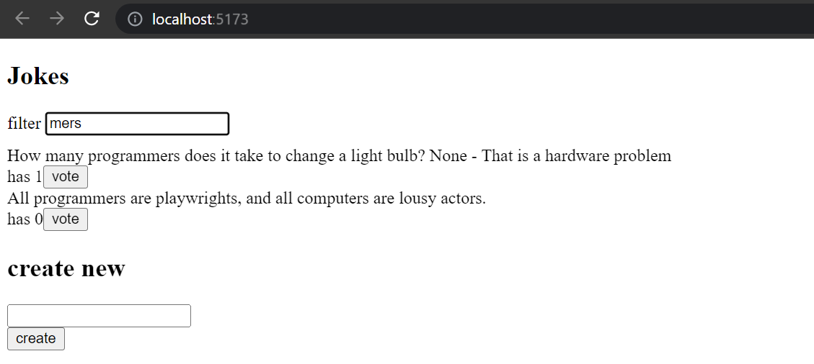

Store the state of the filter in the redux store.
It is recommended to create for the store:

1. a new reducer
2. action creators
3. a combined reducer

Make sure you use the `combineReducers` function.

Create a new `Filter` component for displaying the filter.
You can use the following code as a template for the component:

```js
const Filter = () => {
  const handleChange = (event) => {
    // input-field value is in variable event.target.value
  }
  const style = {
    marginBottom: 10
  }

  return (
    <div style={style}>
      filter <input onChange={handleChange} />
    </div>
  )
}

export default Filter
```

</div>

<div class="content">

### Redux Toolkit

As we have seen so far, Redux's configuration and state management implementation requires some effort.
For example, the reducer and action creator-related code has somewhat repetitive boilerplate code.
[Redux Toolkit](https://redux-toolkit.js.org/) is a library that solves these common Redux-related problems.
This library simplifies the Redux store's configuration and offers a large variety of tools to ease state management.

Let's start using Redux Toolkit in our application by refactoring the existing code.
First, we will need to install the library:

```bash
npm install @reduxjs/toolkit
```

Next, open the *index.js* file which currently creates the Redux store.
Instead of Redux's `createStore` function, let's create the store using Redux Toolkit's [`configureStore`](https://redux-toolkit.js.org/api/configureStore) function in *index.js*:

```js
import React from 'react'
import ReactDOM from 'react-dom/client'
import { Provider } from 'react-redux'
import { configureStore } from '@reduxjs/toolkit' // highlight-line
import App from './App'

import taskReducer from './reducers/taskReducer'
import filterReducer from './reducers/filterReducer'

 // highlight-start
const store = configureStore({
  reducer: {
    tasks: taskReducer,
    filter: filterReducer
  }
})
// highlight-end

console.log(store.getState())

ReactDOM.createRoot(document.getElementById('root')).render(
  <Provider store={store}>
    <App />
  </Provider>
)
```

We already got rid of a few lines of code now that we don't need the `combineReducers` function to create the reducer for the store.
We will soon see that the `configureStore` function has many additional benefits such as the effortless integration of development tools
and many commonly used libraries *without the need for additional configuration*.

#### Refactoring our Reducers with Redux Toolkit

With Redux Toolkit, we can easily create reducer and related action creators using the [`createSlice`](https://redux-toolkit.js.org/api/createSlice) function.
Let's use `createSlice` to refactor the reducer and action creators in the *reducers/taskReducer.js* file:

```js
import { createSlice } from '@reduxjs/toolkit' // highlight-line

const initialState = [
  {
    content: 'remind myself that the reducer defines how the redux store works',
    important: true,
    id: 1,
  },
  {
    content: 'repeat the words: a redux store can contain any data',
    important: false,
    id: 2,
  },
]

const generateId = () =>
  Number((Math.random() * 1000000).toFixed(0))

// highlight-start
const taskSlice = createSlice({
  name: 'tasks',
  initialState,
  reducers: {
    createTask(state, action) {
      const content = action.payload

      state.push({
        content,
        important: false,
        id: generateId(),
      })
    },
    toggleImportanceOf(state, action) {
      const id = action.payload

      const taskToChange = state.find(t => t.id === id)

      const changedTask = { 
        ...taskToChange, 
        important: !taskToChange.important 
      }

      return state.map(task =>
        task.id !== id ? task : changedTask 
      )     
    }
  },
})
// highlight-end
```

The `createSlice` function's `name` parameter defines the prefix which is used in the action's type values.
From the code above, notice our object has `name: 'tasks'`; thus the `createTask` action will have the type value of *`tasks/createTask`*.
It is a good practice to give a unique `name` property.
That way there won't be unexpected collisions between the application's action type values.
The *`initialState`* parameter defines the reducer's *initial state*.
The *`reducers`* parameter takes the reducer itself as an object, where we define how functions handle state changes caused by certain actions.
Notice that the `action.payload` in the function contains the argument provided by calling the action creator:

```js
dispatch(createTask('Preach about how awesome Redux Toolkit is!'))
```

This dispatch call responds to dispatching the following object:

```js
dispatch({ type: 'tasks/createTask', payload: 'Preach about how awesome Redux Toolkit is!' })
```

#### Redux Toolkit and Immutability

If you followed closely, you might have noticed that inside the `createTask` action,
we see code that seems to violate the reducers' immutability principle mentioned earlier:

```js
createTask(state, action) {
  const content = action.payload

  state.push({
    content,
    important: false,
    id: generateId(),
  })
}
```

*We are mutating `state` argument's array by calling the `push` method instead of returning a new instance of the array.* 😱
What's this all about?

Redux Toolkit utilizes the [**Immer**](https://immerjs.github.io/immer/) library with reducers created by the `createSlice` function.
Using this library makes it possible to mutate the `state` argument inside of `createSlice`.
Immer uses the mutated state to produce a new, immutable state and ***thus the state changes remain immutable***.
Notice that `state` can be changed without *mutating* it, as we have done with the `toggleImportanceOf` action.
In this case, the function ***returns*** the new state.
Nevertheless, mutating the state will often come in handy especially when a complex state needs to be updated.

The `createSlice` function *returns an object containing the reducer as well as the action creators defined by the `reducers` parameter*.
We can access the reducer via `taskSlice.reducer` and the action creators via `taskSlice.actions`.
We can produce the file's exports in the following way:

```js
const taskSlice = createSlice(/* ... */)

// highlight-start
export const { createTask, toggleImportanceOf } = taskSlice.actions

export default taskSlice.reducer
// highlight-end
```

Now, the imports in the other files will work just like before:

```js
import taskReducer, { createTask, toggleImportanceOf } from './reducers/taskReducer'
```

Nonetheless, we need to alter the action type names in the tests due to the conventions of ReduxToolkit:

```js
import taskReducer from './taskReducer'
import deepFreeze from 'deep-freeze'

describe('taskReducer', () => {
  test('returns new state with action tasks/createTask', () => {
    const state = []
    const action = {
      type: 'tasks/createTask', // highlight-line
      payload: 'learn more about how the app state is in redux store', // highlight-line
    }

    deepFreeze(state)
    const newState = taskReducer(state, action)

    expect(newState).toHaveLength(1)
    expect(newState.map(s => s.content)).toContainEqual(action.payload)
  })

  test('returns new state with action tasks/toggleImportanceOf', () => {
    const state = [
      {
        content: 'learn more about how the app state is in redux store',
        important: true,
        id: 1
      },
      {
        content: 'understand more fully how state changes are made with actions',
        important: false,
        id: 2
      }]
  
    const action = {
      type: 'tasks/toggleImportanceOf', // highlight-line
      payload: 2 
    }
  
    deepFreeze(state)
    const newState = taskReducer(state, action)
  
    expect(newState).toHaveLength(2)
  
    expect(newState).toContainEqual(state[0])
  
    expect(newState).toContainEqual({
      content: 'understand more fully how state changes are made with actions',
      important: true,
      id: 2
    })
  })
})
```

### Redux Toolkit and console.log

As we have learned, `console.log` has been a handy tool.

Let's try to print the state of the Redux Store to the console in the middle of the reducer created with the function `createSlice`:

```js
const taskSlice = createSlice({
  name: 'tasks',
  initialState,
  reducers: {
    // ...
    toggleImportanceOf(state, action) {
      const id = action.payload

      const taskToChange = state.find(n => n.id === id)

      const changedTask = { 
        ...taskToChange, 
        important: !taskToChange.important 
      }

      console.log(state) // highlight-line

      return state.map(task =>
        task.id !== id ? task : changedTask 
      )     
    }
  },
})
```

The following is printed to the console

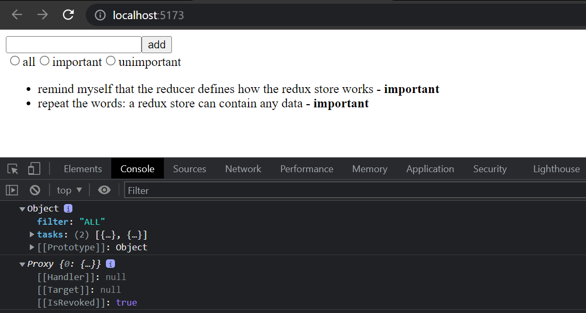

The output is interesting but not very useful.
The reason we don't see any nice information is because of the Immer library used by the Redux Toolkit, which is now used internally to save the state of the Store.

The status can be converted to a human-readable format by converting `state` to a `string` and then back to a JavaScript object as follows:

```js
console.log(JSON.parse(JSON.stringify(state))) // highlight-line
```

Console output is now human-readable

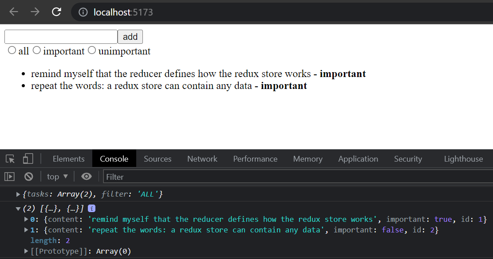

### Redux DevTools

[Redux DevTools](https://chrome.google.com/webstore/detail/redux-devtools/lmhkpmbekcpmknklioeibfkpmmfibljd) is a Chrome addon that offers useful development tools for Redux.
It can be used to inspect the Redux store's state and dispatch actions through the browser's console.
When the store is created using Redux Toolkit's `configureStore` function, no additional configuration is needed for Redux DevTools to work.

Once the addon is installed, clicking the ***Redux*** tab in the browser's console should open the development tools:

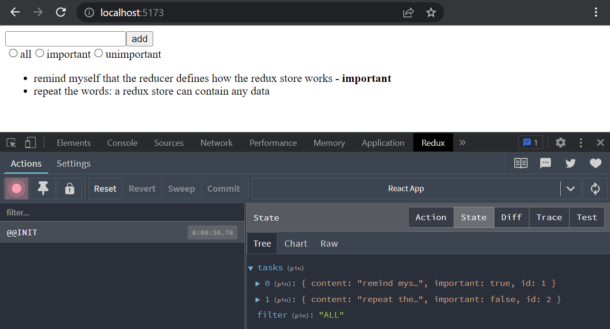

You can inspect how dispatching a certain action changes the state by clicking the action:

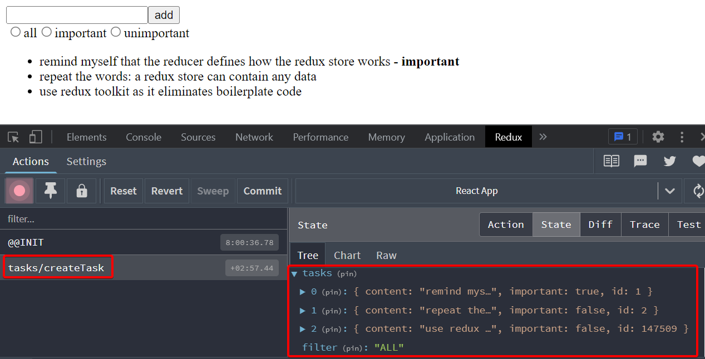

It is also possible to dispatch actions to the store using the development tools:

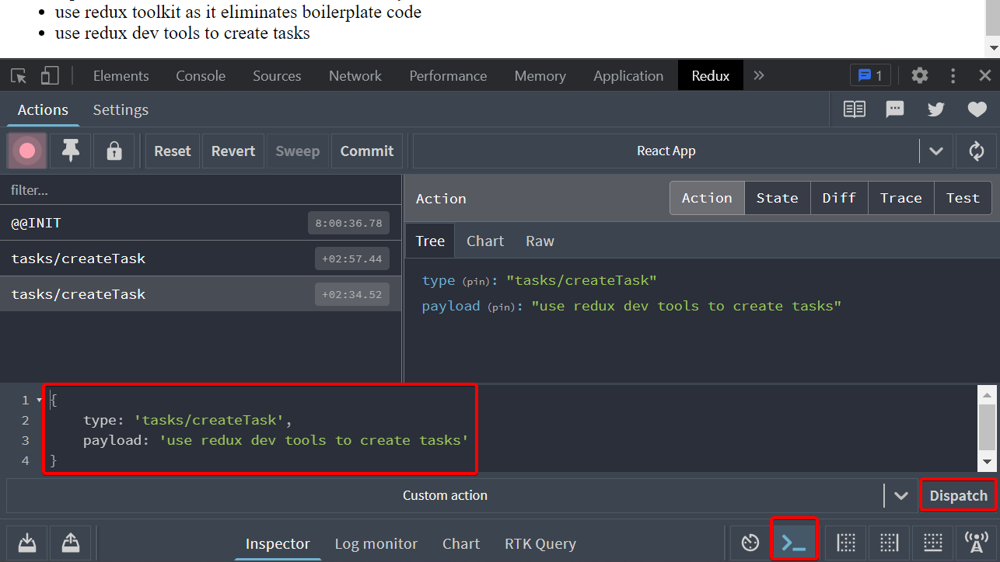

You can find the code for our current application in its entirety in the *part6-3* branch of [this GitHub repository](https://github.com/comp227/redux-tasks/tree/part6-3).

</div>

<div class="tasks">

### Exercises 6.10-6.13

Let's continue working on the joke application using Redux that we started in exercise 6.3.

#### 6.10 Better jokes, step8

Install Redux Toolkit for the project.
Move the Redux store creation into the file *store.js* and use Redux Toolkit's `configureStore` to create the store.

Change the definition of the ***filter reducer and action creators*** to use the Redux Toolkit's `createSlice` function.

Also, start using Redux DevTools to debug the application's state more easily.

#### 6.11 Better jokes, step9

Change the definition of the ***joke reducer and action creators*** to use Redux Toolkit's `createSlice` function.

#### 6.12 Better jokes, step10

The application has a ready-made body for the `Notification` component:

```js
const Notification = () => {
  const style = {
    padding: 10,
    backgroundColor: "lavender",
    marginBottom: 10
  }
  return (
    <div style={style}>
      render here notification...
    </div>
  )
}

export default Notification
```

Extend the component so that it renders the message stored in the Redux store, making the component take the following form:

```js
import { useSelector } from 'react-redux' // highlight-line

const Notification = () => {
  const notification = useSelector(/* something here */) // highlight-line
  const style = {
    padding: 10,
    backgroundColor: "lavender",
    marginBottom: 10
  }
  return (
    <div style={style}>
      {notification} // highlight-line
    </div>
  )
}
```

You will have to make changes to the application's existing reducer.
Create a separate reducer for the new functionality by using the Redux Toolkit's `createSlice` function.

The application does not have to use the `Notification` component intelligently at this point in the exercises.
It is enough for the application to display the initial value set for the message in the `notificationReducer`.

#### 6.13 Better jokes, step11

Extend the application so that it uses the `Notification` component to display a message for five seconds when the user votes for a joke or creates a new joke:

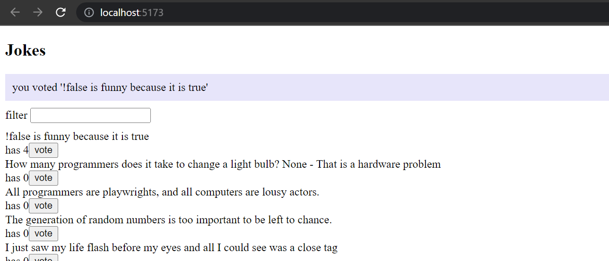

It's recommended to create separate [action creators](https://redux-toolkit.js.org/api/createSlice#reducers) for setting and removing notifications.

</div>
