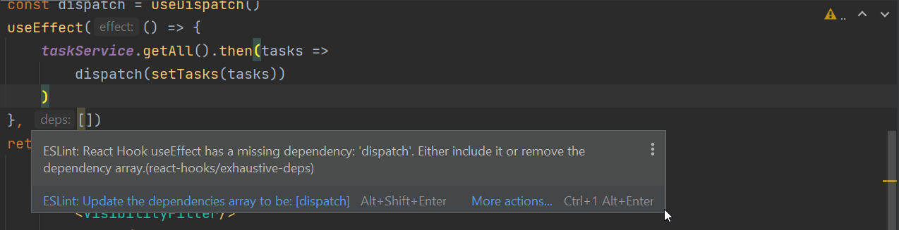

<div class="content">

Let's expand the application so that the tasks are stored in the backend.
We'll use [json-server](/part2/getting_data_from_server),
familiar from part 2.

The initial state of the database is stored in the file *db.json*, which is placed in the root of the project:

```json
{
  "tasks": [
    {
      "content": "the app state is in redux store",
      "important": true,
      "id": 1
    },
    {
      "content": "state changes are made with actions",
      "important": false,
      "id": 2
    }
  ]
}
```

We'll install json-server for the project...

```js
npm install json-server --save-dev
```

and add the following line to the `scripts` part of the file *package.json*

```js
"scripts": {
  "server": "json-server -p3001 --watch db.json",
  // ...
}
```

Now let's launch json-server with the command `npm run server`.

Next, we'll create a method into the file *services/tasks.js*, which uses `axios` to fetch data from the backend

```js
import axios from 'axios'

const baseUrl = 'http://localhost:3001/tasks'

const getAll = async () => {
  const response = await axios.get(baseUrl)
  return response.data
}

export default { getAll }
```

We'll add axios to the project

```bash
npm install axios
```

We'll change the initialization of the state in `taskReducer`, so that by default there are no tasks:

```js
const taskSlice = createSlice({
  name: 'tasks',
  initialState: [], // highlight-line
  // ...
})
```

Let's also add a new action `appendTask` for adding a task object:

```js
const taskSlice = createSlice({
  name: 'tasks',
  initialState: [],
  reducers: {
    createTask(state, action) {
      const content = action.payload

      state.push({
        content,
        important: false,
        id: generateId(),
      })
    },
    toggleImportanceOf(state, action) {
      const id = action.payload

      const taskToChange = state.find(t => t.id === id)

      const changedTask = { 
        ...taskToChange, 
        important: !taskToChange.important 
      }

      return state.map(task =>
        task.id !== id ? task : changedTask 
      )     
    },
    // highlight-start
    appendTask(state, action) {
      state.push(action.payload)
    }
    // highlight-end
  },
})

export const { createTask, toggleImportanceOf, appendTask } = taskSlice.actions // highlight-line

export default taskSlice.reducer
```

A quick way to initialize the tasks state based on the data received from the server is to fetch the tasks in the *index.js* file
and dispatch an action using the `appendTask` action creator for each individual task object:

```js
// ...
import taskService from './services/tasks' // highlight-line
import taskReducer, { appendTask } from './reducers/taskReducer' // highlight-line

const store = configureStore({
  reducer: {
    tasks: taskReducer,
    filter: filterReducer,
  }
})

// highlight-start
taskService.getAll().then(tasks =>
  tasks.forEach(task => {
    store.dispatch(appendTask(task))
  })
)
// highlight-end

// ...
```

Dispatching multiple actions seems a bit impractical.
Let's add an action creator `setTasks` which can be used to directly replace the tasks array.
We'll get the action creator from the `createSlice` function by implementing the `setTasks` action:

```js
// ...

const taskSlice = createSlice({
  name: 'tasks',
  initialState: [],
  reducers: {
    createTask(state, action) {
      const content = action.payload

      state.push({
        content,
        important: false,
        id: generateId(),
      })
    },
    toggleImportanceOf(state, action) {
      const id = action.payload

      const taskToChange = state.find(t => t.id === id)

      const changedTask = { 
        ...taskToChange, 
        important: !taskToChange.important 
      }

      return state.map(task =>
        task.id !== id ? task : changedTask 
      )     
    },
    appendTask(state, action) {
      state.push(action.payload)
    },
    // highlight-start
    setTasks(state, action) {
      return action.payload
    }
    // highlight-end
  },
})

export const { createTask, toggleImportanceOf, appendTask, setTasks } = taskSlice.actions // highlight-line

export default taskSlice.reducer
```

Now, the code in the *index.js* file looks a lot better:

```js
// ...
import taskService from './services/tasks'
import taskReducer, { setTasks } from './reducers/taskReducer' // highlight-line

const store = configureStore({
  reducer: {
    tasks: taskReducer,
    filter: filterReducer,
  }
})

taskService.getAll().then(tasks =>
  store.dispatch(setTasks(tasks)) // highlight-line
)
```

> **NB:** why didn't we use await in place of promises and event handlers (registered to `then` methods)?
>
> Await only works inside `async` functions, and the code in *index.js* is not inside a function,
so due to the simple nature of the operation, we'll abstain from using `async` this time.

We do, however, decide to move the initialization of the tasks into the `App` component,
and, as usual, when fetching data from a server, we'll use the **effect hook**.

```js
import { useEffect } from 'react' // highlight-line
import NewTask from './components/NewTask'
import Tasks from './components/Tasks'
import VisibilityFilter from './components/VisibilityFilter'
import taskService from './services/tasks'  // highlight-line
import { setTasks } from './reducers/taskReducer' // highlight-line
import { useDispatch } from 'react-redux' // highlight-line

const App = () => {
    // highlight-start
  const dispatch = useDispatch()
  useEffect(() => {
    taskService
      .getAll().then(tasks => dispatch(setTasks(tasks)))
  }, [])
  // highlight-end

  return (
    <div>
      <NewTask />
      <VisibilityFilter />
      <Tasks />
    </div>
  )
}

export default App
```

Using the useEffect hook causes an eslint warning:



We can get rid of it by doing the following:

```js
const App = () => {
  const dispatch = useDispatch()
  useEffect(() => {
    taskService
      .getAll().then(tasks => dispatch(setTasks(tasks)))
  }, [dispatch]) // highlight-line

  // ...
}
```

Now the variable `dispatch` we define in the `App` component,
which practically is the `dispatch` function of the redux store, has been added to the array `useEffect` receives as a parameter.
**If** the value of the dispatch variable would change during runtime,
the effect would be executed again.
This however cannot happen in our application, so the warning is unnecessary.

Another way to get rid of the warning would be to disable ESlint on that line:

```js
const App = () => {
  const dispatch = useDispatch()
  useEffect(() => {
    taskService
      .getAll().then(tasks => dispatch(setTasks(tasks)))   
  }, []) // eslint-disable-line react-hooks/exhaustive-deps  

  // ...
}
```

Generally disabling ESlint when it throws a warning is not a good idea.
Even though the ESlint rule in question has caused some [arguments](https://github.com/facebook/create-react-app/issues/6880),
we will use the first solution.

More about the need to define the hooks dependencies in [the react documentation](https://reactjs.org/docs/hooks-faq.html#is-it-safe-to-omit-functions-from-the-list-of-dependencies).

### Sending data to the backend

We can do the same thing when it comes to creating a new task.
Let's expand the code communicating with the server as follows:

```js
const baseUrl = 'http://localhost:3001/tasks'

const getAll = async () => {
  const response = await axios.get(baseUrl)
  return response.data
}

// highlight-start
const createNew = async (content) => {
  const object = { content, important: false }
  const response = await axios.post(baseUrl, object)
  return response.data
}
// highlight-end

export default {
  getAll,
  createNew, // highlight-line
}
```

The method `addTask` of the component `NewTask` changes slightly:

```js
import { useDispatch } from 'react-redux'
import { createTask } from '../reducers/taskReducer'
import taskService from '../services/tasks' // highlight-line

const NewTask = (props) => {
  const dispatch = useDispatch()
  
  const addTask = async (event) => { // highlight-line
    event.preventDefault()
    const content = event.target.task.value
    event.target.task.value = ''
    const newTask = await taskService.createNew(content) // highlight-line
    dispatch(createTask(newTask)) // highlight-line
  }

  return (
    <form onSubmit={addTask}>
      <input name="task" />
      <button type="submit">add</button>
    </form>
  )
}

export default NewTask
```

Because the backend generates ids for the tasks, we'll change the action creator `createTask` in the file *taskReducer.js* accordingly:

```js
const taskSlice = createSlice({
  name: 'tasks',
  initialState: [],
  reducers: {
    createTask(state, action) {
      state.push(action.payload) // highlight-line
    },
    // ..
  },
})
```

Changing the importance of tasks could be implemented using the same principle,
by making an asynchronous method call to the server and then dispatching an appropriate action.

The current state of the code for the application can be found on [GitHub](https://github.com/comp227/redux-tasks/tree/part6-3) in the branch *part6-3*.

</div>

<div class="tasks">

### Exercises 6.14-6.15

#### 6.14 Jokes and the backend, step1

When the application launches, fetch the jokes from the backend implemented using json-server.

As the initial backend data, you can use, e.g. [this](https://github.com/comp227/misc/blob/main/jokes.json).

#### 6.15 Jokes and the backend, step2

Modify the creation of new jokes, so that the jokes are stored in the backend.

</div>

<div class="content">

### Asynchronous actions and Redux thunk

Our approach is quite good, but it is not great that the communication with the server happens inside the functions of the components.
It would be better if the communication could be abstracted away from the components
so that they don't have to do anything else but call the appropriate ***action creator***.
As an example, `App` would initialize the state of the application as follows:

```js
const App = () => {
  const dispatch = useDispatch()

  useEffect(() => {
    dispatch(initializeTasks()))  
  }, [dispatch]) 

  // ...
}
```

and `NewTask` would create a new task as follows:

```js
const NewTask = () => {
  const dispatch = useDispatch()
  
  const addTask = async (event) => {
    event.preventDefault()
    const content = event.target.task.value
    event.target.task.value = ''
    dispatch(createTask(content))
  }

  // ...
}
```

In this implementation, both components would dispatch an action without the need to know about the communication between the server that happens behind the scenes.
These kinds of **async actions** can be implemented using the [Redux Thunk](https://github.com/reduxjs/redux-thunk) library.
The use of the library doesn't need any additional configuration or even installation when the Redux store is created using the Redux Toolkit's `configureStore` function.

With Redux Thunk it is possible to implement **action creators** which return a function instead of an object.
The function receives Redux store's `dispatch` and `getState` methods as parameters.
This allows for example implementations of asynchronous action creators,
which first wait for the completion of a certain asynchronous operation
and after that dispatch some action, which changes the store's state.

We can define an action creator `initializeTasks` which initializes the tasks based on the data received from the server:

```js
// ...
import taskService from '../services/tasks' // highlight-line

const taskSlice = createSlice(/* ... */)

export const { createTask, toggleImportanceOf, setTasks, appendTask } = taskSlice.actions

// highlight-start
export const initializeTasks = () => {
  return async dispatch => {
    const tasks = await taskService.getAll()
    dispatch(setTasks(tasks))
  }
}
// highlight-end

export default taskSlice.reducer
```

In the inner function, meaning the **asynchronous action**, the operation first fetches all the tasks from the server
and then ***dispatches*** the `setTasks` action, which adds them to the store.

The component `App` can now be defined as follows:

```js
// ...
import { initializeTasks } from './reducers/taskReducer' // highlight-line

const App = () => {
  const dispatch = useDispatch()

  // highlight-start
  useEffect(() => {
    dispatch(initializeTasks()) 
  }, [dispatch]) 
  // highlight-end

  return (
    <div>
      <NewTask />
      <VisibilityFilter />
      <Tasks />
    </div>
  )
}
```

The solution is elegant.
The initialization logic for the tasks has been completely separated from the React component.

Next, let's replace the `createTask` action creator created by the `createSlice` function with an asynchronous action creator:

```js
// ...
import taskService from '../services/tasks'

const taskSlice = createSlice({
  name: 'tasks',
  initialState: [],
  reducers: {
    toggleImportanceOf(state, action) {
      const id = action.payload

      const taskToChange = state.find(t => t.id === id)

      const changedTask = { 
        ...taskToChange, 
        important: !taskToChange.important 
      }

      return state.map(task =>
        task.id !== id ? task : changedTask 
      )     
    },
    appendTask(state, action) {
      state.push(action.payload)
    },
    setTasks(state, action) {
      return action.payload
    }
    // createTask definition removed from here!
  },
})

export const { toggleImportanceOf, appendTask, setTasks } = taskSlice.actions // highlight-line

export const initializeTasks = () => {
  return async dispatch => {
    const tasks = await taskService.getAll()
    dispatch(setTasks(tasks))
  }
}

// highlight-start
export const createTask = content => {
  return async dispatch => {
    const newTask = await taskService.createNew(content)
    dispatch(appendTask(newTask))
  }
}
// highlight-end

export default taskSlice.reducer
```

The principle here is the same: first, an asynchronous operation is executed, after which the action changing the state of the store is **dispatched**.

The component `NewTask` changes as follows:

```js
// ...
import { createTask } from '../reducers/taskReducer' // highlight-line

const NewTask = () => {
  const dispatch = useDispatch()
  
  const addTask = async (event) => {
    event.preventDefault()
    const content = event.target.task.value
    event.target.task.value = ''
    dispatch(createTask(content)) //highlight-line
  }

  return (
    <form onSubmit={addTask}>
      <input name="task" />
      <button type="submit">add</button>
    </form>
  )
}
```

Finally, let's clean up the *index.js* file a bit by moving the code related to the creation of the Redux store into its own, *store.js* file:

```js
import { configureStore } from '@reduxjs/toolkit'

import taskReducer from './reducers/taskReducer'
import filterReducer from './reducers/filterReducer'

const store = configureStore({
  reducer: {
    tasks: taskReducer,
    filter: filterReducer
  }
})

export default store
```

After the changes, the content of the *index.js* is the following:

```js
import React from 'react'
import ReactDOM from 'react-dom/client'
import { Provider } from 'react-redux' 
import store from './store' // highlight-line
import App from './App'

ReactDOM.createRoot(document.getElementById('root')).render(
  <Provider store={store}>
    <App />
  </Provider>
)
```

The current state of the code for the application can be found on [GitHub](https://github.com/comp127/redux-tasks/tree/part6-4) in the branch *part6-4*.

Redux Toolkit offers a multitude of tools to simplify asynchronous state management.
Suitable tools for this use case are for example the [createAsyncThunk](https://redux-toolkit.js.org/api/createAsyncThunk) function
and the [RTK Query](https://redux-toolkit.js.org/rtk-query/overview) API.

</div>

<div class="tasks">

### Exercises 6.16-6.19

#### 6.16 Jokes and the backend, step3

Modify the initialization of the Redux store to happen using asynchronous action creators, which are made possible by the Redux Thunk library.

#### 6.17 Jokes and the backend, step4

Also modify the creation of a new joke to happen using asynchronous action creators, made possible by the Redux Thunk library.

#### 6.18 Jokes and the backend, step5

Voting does not yet save changes to the backend.
Fix the situation with the help of the Redux Thunk library.

#### 6.19 Jokes and the backend, step6

The creation of notifications is still a bit tedious since one has to do two actions and use the `setTimeout` function:

```js
dispatch(setNotification(`new joke '${content}'`))
setTimeout(() => {
  dispatch(clearNotification())
}, 5000)
```

Make an action creator, which enables one to provide the notification as follows:

```js
dispatch(setNotification(`you voted '${joke.content}'`, 10))
```

The first parameter is the text to be rendered and the second parameter is the time to display the notification given in seconds.

Implement the use of this improved notification in your application.

</div>
