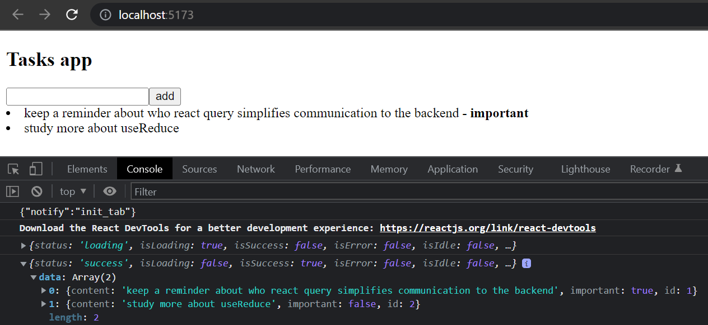
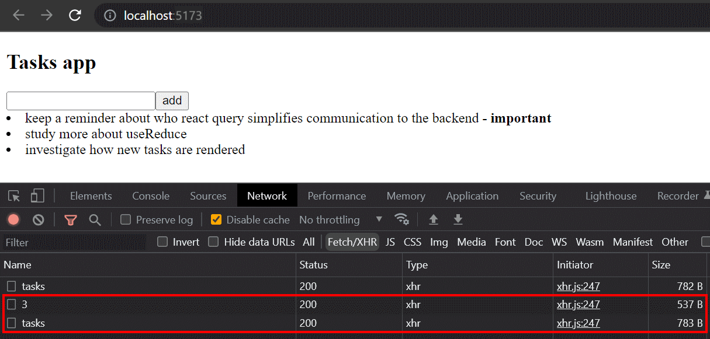
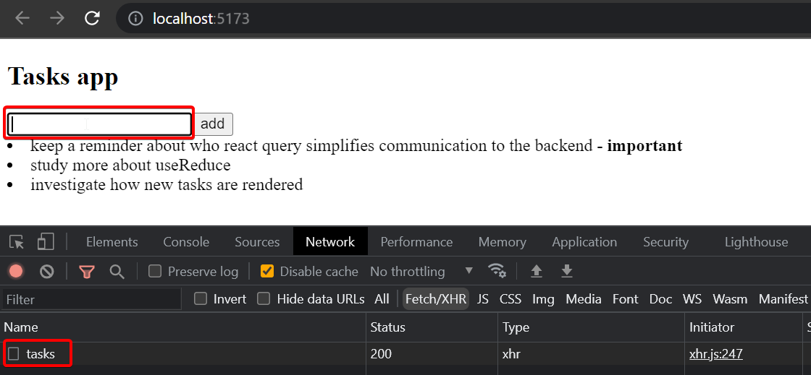
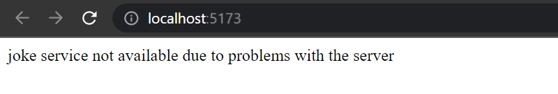
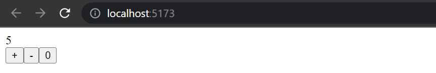
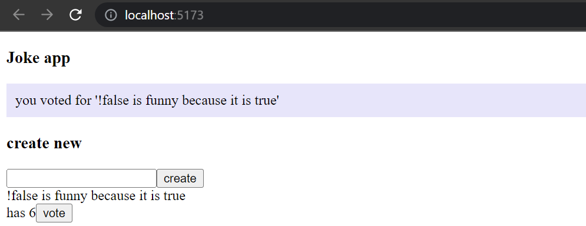
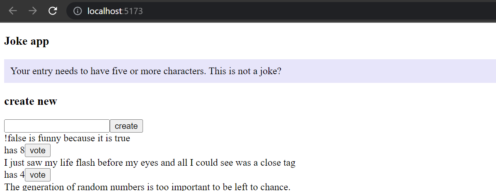
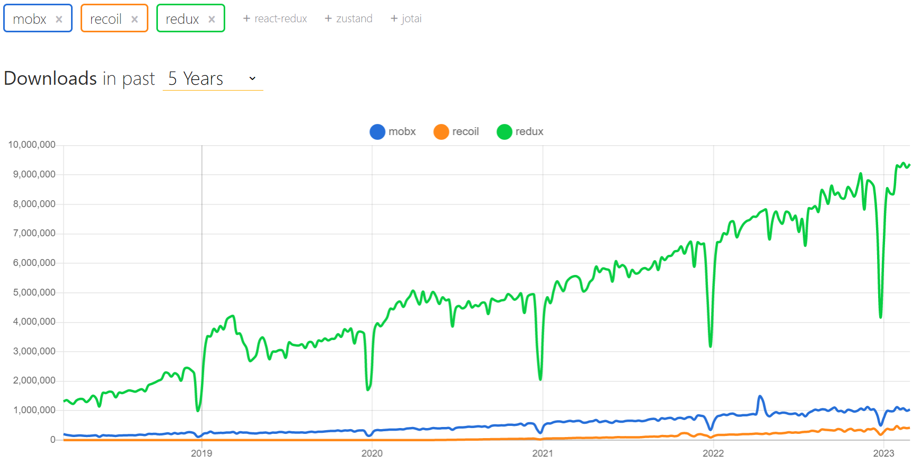

<div class="content">

At the end of this part, we will look at a few more different ways to manage the state of an application.

Let's continue with the task application.
We will focus on communication with the server.
Let's start the application from scratch.
The first version is as follows:

```js
const App = () => {
  const addTask = async (event) => {
    event.preventDefault()
    const content = event.target.task.value
    event.target.task.value = ''
    console.log(content)
  }

  const toggleImportance = (task) => {
    console.log('toggle importance of', task.id)
  }

  const tasks = []

  return(
    <div>
      <h2>Tasks app</h2>
      <form onSubmit={addTask}>
        <input name="task" />
        <button type="submit">add</button>
      </form>
      {tasks.map(task =>
        <li key={task.id} onClick={() => toggleImportance(task)}>
          {task.content} 
          <strong> {task.important ? 'important' : ''}</strong>
        </li>
      )}
    </div>
  )
}

export default App
```

The initial code is on GitHub in the repository [https://github.com/comp227/query-tasks](https://github.com/comp227/query-tasks/tree/part6-0) in branch *part6-0*.

### Managing data on the server with the React Query library

We shall now use the [React Query](https://react-query-v3.tanstack.com/) library to store and manage data retrieved from the server.

Install the library with the command

```bash
npm install react-query
```

A few additions to the file *index.js* are needed to pass the library functions to the entire application:

```js
import React from 'react'
import ReactDOM from 'react-dom/client'
import { QueryClient, QueryClientProvider } from 'react-query' // highlight-line

import App from './App'

const queryClient = new QueryClient() // highlight-line

ReactDOM.createRoot(document.getElementById('root')).render(
  <QueryClientProvider client={queryClient}> // highlight-line
    <App />
  </QueryClientProvider> // highlight-line
)
```

We can now retrieve the tasks in the `App` component.
The code expands as follows:

```js
import { useQuery } from 'react-query'  // highlight-line
import axios from 'axios'  // highlight-line

const App = () => {
  // ...

   // highlight-start
  const result = useQuery(
    'tasks',
    () => axios.get('http://localhost:3001/tasks').then(res => res.data)
  )

  console.log(result)
  // highlight-end

  // highlight-start
  if ( result.isLoading ) {
    return <div>loading data...</div>
  }
  // highlight-end

  const tasks = result.data  // highlight-line

  return (
    // ...
  )
}
```

Retrieving data from the server is still done in the familiar way with the Axios `get` method.
However, the Axios method call is now wrapped in a [query](https://react-query-v3.tanstack.com/guides/queries)
formed with the [useQuery](https://react-query-v3.tanstack.com/reference/useQuery) function.
The first parameter of the function call is a string `tasks` which acts as a [key](https://react-query-v3.tanstack.com/guides/query-keys) to the query defined, i.e. the list of tasks.

The return value of the `useQuery` function is an object that indicates the status of the query.
The output to the console illustrates the situation:



That is, the first time the component is rendered, the query is still in *`loading`* state, i.e. the associated HTTP request is pending.
At this stage, only the following is rendered:

```js
<div>loading data...</div>
```

However, the HTTP request is completed so quickly that even the most astute will not be able to see the text.
When the request is completed, the component is rendered again.
The query is in the state *`success`* on the second rendering, and the field `data` of the query object contains the data returned by the request,
i.e. the list of tasks that is rendered on the screen.

So the application retrieves data from the server and renders it on the screen without using the React hooks `useState` and `useEffect` used in chapters 2-5 at all.
The data on the server is now entirely under the administration of the React Query library,
and the application does not need the state defined with React's `useState` hook at all!

Let's move the function making the actual HTTP request to its own file *requests.js*

```js
import axios from 'axios'

export const getTasks = () =>
  axios.get('http://localhost:3001/tasks').then(res => res.data)
```

The `App` component is now slightly simplified

```js
import { useQuery } from 'react-query' 
import { getTasks } from './requests' // highlight-line

const App = () => {
  // ...

  const result = useQuery('tasks', getTasks)  // highlight-line

  // ...
}
```

The current code for the application is in [GitHub](https://github.com/comp227/query-tasks/tree/part6-1) in the branch *part6-1*.

### Synchronizing data to the server using React Query

Data is already successfully retrieved from the server.
Next, we will make sure that the added and modified data is stored on the server.
Let's start by adding new tasks.

Let's make a function `createTask` to the file *requests.js* for saving new tasks:

```js
import axios from 'axios'

const baseUrl = 'http://localhost:3001/tasks'

export const getTasks = () =>
  axios.get(baseUrl).then(res => res.data)

export const createTask = newTask => // highlight-line
  axios.post(baseUrl, newTask).then(res => res.data) // highlight-line
```

The `App` component will change as follows

```js
import { useQuery, useMutation } from 'react-query' // highlight-line
import { getTasks, createTask } from './requests' // highlight-line

const App = () => {
  const newTaskMutation = useMutation(createTask) // highlight-line

  const addTask = async (event) => {
    event.preventDefault()
    const content = event.target.task.value
    event.target.task.value = ''
    newTaskMutation.mutate({ content, important: true }) // highlight-line
  }

  // 

}
```

To create a new task, a [mutation](https://react-query-v3.tanstack.com/guides/mutations) is defined using the function
[useMutation](https://react-query-v3.tanstack.com/reference/useMutation):

```js
const newTaskMutation = useMutation(createTask)
```

The parameter is the function we added to the file *requests.js*, which uses Axios to send a new task to the server.

The event handler `addTask` performs the mutation by calling the mutation object's function `mutate` and passing the new task as a parameter:

```js
newTaskMutation.mutate({ content, important: true })
```

Our solution is good.
Except it doesn't work.
The new task is saved on the server, but it is not updated on the screen.

In order to render a new task as well, we need to tell React Query that the old result of the query whose key is the string `tasks` should be
[invalidated](https://react-query-v3.tanstack.com/guides/invalidations-from-mutations).

Fortunately, invalidation is easy, it can be done by defining the appropriate `onSuccess` callback function to the mutation:

```js
import { useQuery, useMutation, useQueryClient } from 'react-query' // highlight-line
import { getTasks, createTask } from './requests'

const App = () => {
  const queryClient = useQueryClient() // highlight-line

  const newTaskMutation = useMutation(createTask, {
    onSuccess: () => {  // highlight-line
      queryClient.invalidateQueries('tasks')  // highlight-line
    },
  })

  // ...
}
```

Now that the mutation has been successfully executed, a function call is made to

```js
queryClient.invalidateQueries('tasks')
```

This in turn causes React Query to automatically update a query with the key `tasks`, i.e. fetch the tasks from the server.
As a result, the application renders the up-to-date state on the server, i.e. the added task is also rendered.

Let us also implement the change in the importance of tasks.
A function for updating tasks is added to the file *requests.js*:

```js
export const updateTask = updatedTask =>
  axios.put(`${baseUrl}/${updatedTask.id}`, updatedTask).then(res => res.data)
```

Updating the task is also done by mutation.
The `App` component expands as follows:

```js
import { useQuery, useMutation, useQueryClient } from 'react-query' 
import { getTasks, createTask, updateTask } from './requests' // highlight-line

const App = () => {
  // ...

  const updateTaskMutation = useMutation(updateTask, {
    onSuccess: () => {
      queryClient.invalidateQueries('tasks')
    },
  })

  const toggleImportance = (task) => {
    updateTaskMutation.mutate({...task, important: !task.important })
  }

  // ...
}
```

So again, a mutation was created that invalidated the query `tasks` so that the updated task is rendered correctly.
Using mutation is easy, the method *mutate* receives a task as a parameter, the importance of which has been changed to the negation of the old value.

The current code for the application is in [GitHub](https://github.com/comp227/query-tasks/tree/part6-2) in the branch *part6-2*.

### Optimizing the performance

The application works well, and the code is relatively simple.
The ease of making changes to the list of tasks is particularly surprising.
For example, when we change the importance of a task, invalidating the query `tasks` is enough for the application data to be updated:

```js
  const updateTaskMutation = useMutation(updateTask, {
    onSuccess: () => {
      queryClient.invalidateQueries('tasks') // highlight-line
    },
  })
```

The consequence of this, of course, is that after the PUT request that causes the task change,
the application makes a new GET request to retrieve the query data from the server:



If the amount of data retrieved by the application is not large, it doesn't really matter.
After all, from a browser-side functionality point of view, making an extra HTTP GET request doesn't really matter, but in some situations it might put a strain on the server.

If necessary, it is also possible to optimize performance
[by manually updating](https://react-query-v3.tanstack.com/guides/updates-from-mutation-responses) the query state maintained by React Query.

The change for the mutation adding a new task is as follows:

```js
const App = () => {
  const queryClient =  useQueryClient() 

  const newTaskMutation = useMutation(createTask, {
    onSuccess: (newTask) => {
      const tasks = queryClient.getQueryData('tasks') // highlight-line
      queryClient.setQueryData('tasks', tasks.concat(newTask)) // highlight-line
    }
  })
  // ...
}
```

That is, in the `onSuccess` callback, the `queryClient` object first reads the existing `tasks` state of the query and updates it by adding a new task,
which is obtained as a parameter of the callback function.
The value of the parameter is the value returned by the function `createTask`, defined in the file *requests.js* as follows:

```js
export const createTask = newTask =>
  axios.post(baseUrl, newTask).then(res => res.data)
```

It would be relatively easy to make a similar change to a mutation that changes the importance of the task, but we leave it as an optional exercise.

If we closely follow the browser's network tab, we notice that React Query retrieves all tasks as soon as we move the cursor to the input field:



What is going on?
By reading the [documentation](https://react-query-v3.tanstack.com/reference/useQuery),
we notice that the default functionality of React Query's queries is that the queries (whose status is ***stale***)
are updated when **window focus**, i.e. the active element of the application's user interface, changes.
If we want, we can turn off the functionality by creating a query as follows:

```js
const App = () => {
  // ...
  const result = useQuery('tasks', getTasks, {
    refetchOnWindowFocus: false  // highlight-line
  })

  // ...
}
```

If you put a console.log statement to the code, you can see from browser console how often React Query causes the application to be re-rendered.
The rule of thumb is that rerendering happens at least whenever there is a need for it, i.e. when the state of the query changes.
You can read more about it e.g. [here](https://tkdodo.eu/blog/react-query-render-optimizations).

The code for the application is in [GitHub](https://github.com/comp227/query-tasks/tree/part6-3) in the branch *part6-3*.

React Query is a versatile library that, based on what we have already seen, simplifies the application.
Does React Query make more complex state management solutions such as Redux unnecessary? No.
React Query can partially replace the state of the application in some cases,
but as the [documentation](https://react-query-v3.tanstack.com/guides/does-this-replace-client-state) states

- React Query is a **server-state library**, responsible for managing asynchronous operations between your server and client
- Redux, etc. are **client-state libraries** that can be used to store asynchronous data, albeit inefficiently when compared to a tool like React Query

So React Query is a library that maintains the **server state** in the frontend, i.e. acts as a cache for what is stored on the server.
React Query simplifies the processing of data on the server, and can in some cases eliminate the need for data on the server to be saved in the frontend state.

Most React applications need not only a way to temporarily store the served data,
but also some solution for how the rest of the frontend state (e.g. the state of forms or notifications) is handled.

</div>

<div class="tasks">

### Exercises 6.20-6.22

Now let's make a new version of the joke application that uses the React Query library.
Take [this project](https://github.com/comp227/query-jokes) as your starting point.
The project has a ready-installed JSON Server, the operation of which has been slightly modified.
Start the server with `npm run server`.

#### Exercise 6.20

Implement retrieving jokes from the server using React Query.

The application should work in such a way that if there are problems communicating with the server, only an error page will be displayed:



You can find [here](https://react-query-v3.tanstack.com/guides/queries) info how to detect the possible errors.

You can simulate a problem with the server by e.g. turning off the JSON Server.
Please beware that in a problem situation, the query is first in the state `isLoading` for a while, because if a request fails,
React Query tries the request a few times before it states that the request is not successful.
You can optionally specify that no retries are made:

```js
const result = useQuery(
  'jokes', getJokes, 
  {
    retry: false
  }
)
```

or that the request is retried e.g. only once:

```js
const result = useQuery(
  'jokes', getJokes, 
  {
    retry: 1
  }
)
```

#### Exercise 6.21

Implement adding new jokes to the server using React Query.
The application should render a new joke by default.
Notice that the content of the joke must be at least 5 characters long, otherwise the server will reject the POST request.
You don't have to worry about error handling now.

#### Exercise 6.22

Implement voting for jokes using again the React Query.
The application should automatically render the increased number of votes for the voted joke

</div>

<div class="content">

### useReducer

So even if the application uses React Query, some kind of solution is usually needed to manage the rest of the frontend state (for example, the state of forms).
Quite often, the state created with `useState` is a sufficient solution.
Using Redux is of course possible, but there are other alternatives.

Let's look at a simple counter application.
The application displays the counter value, and offers three buttons to update the counter status:



We shall now implement the counter state management using a Redux-like state management mechanism provided by React's built-in
[useReducer](https://beta.reactjs.org/reference/react/useReducer) hook.
Code looks like the following:

```js
import { useReducer } from 'react'

const counterReducer = (state, action) => {
  switch (action.type) {
    case "INC":
        return state + 1
    case "DEC":
        return state - 1
    case "ZERO":
        return 0
    default:
        return state
  }
}

const App = () => {
  const [counter, counterDispatch] = useReducer(counterReducer, 0)

  return (
    <div>
      <div>{counter}</div>
      <div>
        <button onClick={() => counterDispatch({ type: "INC"})}>+</button>
        <button onClick={() => counterDispatch({ type: "DEC"})}>-</button>
        <button onClick={() => counterDispatch({ type: "ZERO"})}>0</button>
      </div>
    </div>
  )
}

export default App
```

The hook [useReducer](https://beta.reactjs.org/reference/react/useReducer) provides a mechanism to create a state for an application.
The parameter for creating a state is the reducer function that handles state changes, and the initial value of the state:

```js
const [counter, counterDispatch] = useReducer(counterReducer, 0)
```

The reducer function that handles state changes is similar to Redux's reducers,
i.e. the function gets as parameters the current state and the action that changes the state.
The function returns the new state updated based on the type and possible contents of the action:

```js
const counterReducer = (state, action) => {
  switch (action.type) {
    case "INC":
        return state + 1
    case "DEC":
        return state - 1
    case "ZERO":
        return 0
    default:
        return state
  }
}
```

In our example, actions have nothing but a type.
If the action's type is `INC`, it increases the value of the counter by one, etc.
Like Redux's reducers, actions can also contain arbitrary data, which is usually put in the action's `payload` field.

The function `useReducer` returns an array that contains an element to access the current value of the state (first element of the array),
and a `dispatch` function (second element of the array) to change the state:

```js
const App = () => {
  const [counter, counterDispatch] = useReducer(counterReducer, 0)  // highlight-line

  return (
    <div>
      <div>{counter}</div> // highlight-line
      <div>
        <button onClick={() => counterDispatch({ type: "INC" })}>+</button> // highlight-line
        <button onClick={() => counterDispatch({ type: "DEC" })}>-</button>
        <button onClick={() => counterDispatch({ type: "ZERO" })}>0</button>
      </div>
    </div>
  )
}
```

As can be seen the state change is done exactly as in Redux, the dispatch function is given the appropriate state-changing action as a parameter:

```js
counterDispatch({ type: "INC" })
```

The current code for the application is in the repository
[https://github.com/comp227/hook-counter](https://github.com/comp227/hook-counter/tree/part6-1) in the branch *part6-1*.

### Using context for passing the state to components

If we want to split the application into several components,
the value of the counter and the dispatch function used to manage it must also be passed to the other components.
One solution would be to pass these as props in the usual way:

```js
const Display = ({ counter }) => {
  return <div>{counter}</div>
}

const Button = ({ dispatch, type, label }) => {
  return (
    <button onClick={() => dispatch({ type })}>
      {label}
    </button>
  )
}

const App = () => {
  const [counter, counterDispatch] = useReducer(counterReducer, 0)

  return (
    <div>
      <Display counter={counter}/> // highlight-line
      <div>
        // highlight-start
        <Button dispatch={counterDispatch} type='INC' label='+' />
        <Button dispatch={counterDispatch} type='DEC' label='-' />
        <Button dispatch={counterDispatch} type='ZERO' label='0' />
        // highlight-end
      </div>
    </div>
  )
}
```

The solution works, but is not optimal.
If the component structure gets complicated, e.g. the dispatcher should be forwarded using props through many components to the components that need it,
even though the components in between in the component tree do not need the dispatcher.
This phenomenon is called **prop drilling**.

React's built-in [Context API](https://beta.reactjs.org/learn/passing-data-deeply-with-context) provides a solution for us.
React's context is a kind of global state of the application, to which it is possible to give direct access to any component app.

Let us now create a context in the application that stores the state management of the counter.

The context is created with React's hook [createContext](https://beta.reactjs.org/reference/react/createContext).
Let's create a context in the file *CounterContext.js*:

```js
import { createContext } from 'react'

const CounterContext = createContext()

export default CounterContext
```

The `App` component can now ***provide*** a context to its child components as follows:

```js
import CounterContext from './CounterContext' // highlight-line

const App = () => {
  const [counter, counterDispatch] = useReducer(counterReducer, 0)

  return (
    <CounterContext.Provider value={[counter, counterDispatch]}>  // highlight-line
      <Display counter={counter}/>
      <div>
        <Button type='INC' label='+' />
        <Button type='DEC' label='-' />
        <Button type='ZERO' label='0' />
      </div>
    </CounterContext.Provider> // highlight-line
  )
}
```

As can be seen, providing the context is done by wrapping the child components inside the `CounterContext.Provider` component and setting a suitable value for the context.

The context value is now set to be an array containing the value of the counter, and the `dispatch` function.

Other components now access the context using the [useContext](https://beta.reactjs.org/reference/react/useContext) hook:

```js
import { useContext } from 'react' // highlight-line
import CounterContext from './CounterContext'

const Display = () => {
  const [counter, dispatch] = useContext(CounterContext) // highlight-line
  return <div>
    {counter}
  </div>
}

const Button = ({ type, label }) => {
  const [counter, dispatch] = useContext(CounterContext) // highlight-line
  return (
    <button onClick={() => dispatch({ type })}>
      {label}
    </button>
  )
}
```

The current code for the application is in [GitHub](https://github.com/comp227/hook-counter/tree/part6-2) in the branch *part6-2*.

### Defining the counter context in a separate file

Our application has an annoying feature, that the functionality of the counter state management is partly defined in the `App` component.
Now let's move everything related to the counter to *CounterContext.js*:

```js
import { createContext, useReducer } from 'react'

const counterReducer = (state, action) => {
  switch (action.type) {
    case "INC":
        return state + 1
    case "DEC":
        return state - 1
    case "ZERO":
        return 0
    default:
        return state
  }
}

const CounterContext = createContext()

export const CounterContextProvider = (props) => {
  const [counter, counterDispatch] = useReducer(counterReducer, 0)

  return (
    <CounterContext.Provider value={[counter, counterDispatch] }>
      {props.children}
    </CounterContext.Provider>
  )
}

export default CounterContext
```

The file now exports, in addition to the `CounterContext` object corresponding to the context, the `CounterContextProvider` component,
which is practically a context provider whose value is a counter and a dispatcher used for its state management.

Let's enable the context provider by making a change in *index.js*:

```js
import ReactDOM from 'react-dom/client'
import App from './App'
import { CounterContextProvider } from './CounterContext' // highlight-line

ReactDOM.createRoot(document.getElementById('root')).render(
  <CounterContextProvider>  // highlight-line
    <App />
  </CounterContextProvider>  // highlight-line
)
```

Now the context defining the value and functionality of the counter is available to ***all*** components of the application.

The `App` component is simplified to the following form:

```js
import Display from './components/Display'
import Button from './components/Button'

const App = () => {
  return (
    <div>
      <Display />
      <div>
        <Button type='INC' label='+' />
        <Button type='DEC' label='-' />
        <Button type='ZERO' label='0' />
      </div>
    </div>
  )
}

export default App
```

The context is still used in the same way, e.g. the component `Button` is defined as follows:

```js
import { useContext } from 'react'
import CounterContext from '../CounterContext'

const Button = ({ type, label }) => {
  const [counter, dispatch] = useContext(CounterContext)
  return (
    <button onClick={() => dispatch({ type })}>
      {label}
    </button>
  )
}

export default Button
```

The `Button` component only needs the `dispatch` function of the counter, but it also gets the value of the counter from the context using the function `useContext`:

```js
  const [counter, dispatch] = useContext(CounterContext)
```

This is not a big problem, but it is possible to make the code a bit more pleasant and expressive
by defining a couple of helper functions in the `CounterContext` file:

```js
import { createContext, useReducer, useContext } from 'react' // highlight-line

const CounterContext = createContext()

// ...

export const useCounterValue = () => {
  const counterAndDispatch = useContext(CounterContext)
  return counterAndDispatch[0]
}

export const useCounterDispatch = () => {
  const counterAndDispatch = useContext(CounterContext)
  return counterAndDispatch[1]
}

// ...
```

With the help of these helper functions, it is possible for the components that use the context to get hold of the part of the context that they need.
The `Display` component changes as follows:

```js
import { useCounterValue } from '../CounterContext' // highlight-line

const Display = () => {
  const counter = useCounterValue() // highlight-line
  return <div>
    {counter}
  </div>
}


export default Display
```

Component `Button` becomes:

```js
import { useCounterDispatch } from '../CounterContext' // highlight-line

const Button = ({ type, label }) => {
  const dispatch = useCounterDispatch() // highlight-line
  return (
    <button onClick={() => dispatch({ type })}>
      {label}
    </button>
  )
}

export default Button
```

The solution is quite elegant.
The entire state of the application, i.e. the value of the counter and the code for managing it, is now isolated in the file `CounterContext`,
which provides components with well-named and easy-to-use auxiliary functions for managing the state.

The final code for the application is in [GitHub](https://github.com/comp227/hook-counter/tree/part6-3) in the branch *part6-3*.

As a technical detail, notice that the helper functions `useCounterValue` and `useCounterDispatch` are defined as
[custom hooks](https://reactjs.org/docs/hooks-custom.html),
because calling the hook function `useContext` is [possible](https://reactjs.org/docs/hooks-rules.html) only from React components or custom hooks.
Custom Hooks, on the other hand, are JavaScript functions whose name must start with the string *use*.
We will return to custom hooks in a little more detail in [part 7](/part7/custom_hooks) of the course.

</div>

<div class="tasks">

### Exercises 6.23-6.24

#### Exercise 6.23

The application has a `Notification` component for displaying notifications to the user.

Implement the application's notification state management using the useReducer hook and context.
The notification should tell the user when a new joke is created or an joke is voted on:



The notification is displayed for five seconds.

#### Exercise 6.24

As stated in exercise 6.20, the server requires that the content of the joke to be added is at least 5 characters long.
Now implement error handling for the insertion.
In practice, it is sufficient to display a notification to the user in case of a failed POST request:



The error condition should be handled in the callback function registered for it, see
[here](https://react-query-v3.tanstack.com/reference/useMutation) how to register a function.

This was the last exercise for this part of the course and it's time to push your code to GitHub if you haven't already and mark the exercises that were completed on Canvas.

</div>

<div class="content">

### Which state management solution to choose?

In chapters 1-5, all state management of the application was done using React's hook `useState`.
Asynchronous calls to the backend required the use of the `useEffect` hook in some situations.
In principle, nothing else is needed.

A subtle problem with a solution based on a state created with the `useState` hook is that
if some part of the application's state is needed by multiple components of the application,
the state and the functions for manipulating it must be passed via props to all components that handle the state.
Sometimes props need to be passed through multiple components, and the components along the way may not even be interested in the state in any way.
This somewhat unpleasant phenomenon is called **prop drilling**.

Over the years, several alternative solutions have been developed for state management of React applications,
which can be used to ease problematic situations (e.g. prop drilling).
However, no solution has been "final", all have their own pros and cons, and new solutions are being developed all the time.

The situation may confuse a beginner and even an experienced web developer.
Which solution should be used?

For a simple application, `useState` is certainly a good starting point.
If the application is communicating with the server, the communication can be handled in the same way as in chapters 1-5, using the state of the application itself.
Recently, however, it has become more common to move the communication and associated state management at least partially under the control of React Query (or some other similar library).
If you are concerned about useState and the prop drilling it entails, using context may be a good option.
There are also situations where it may make sense to handle some of the state with useState and some with contexts.

The most comprehensive and robust state management solution is Redux, which is a way to implement the so-called [Flux](https://facebook.github.io/flux/) architecture.
Redux is slightly older than the solutions presented in this section.
The rigidity of Redux has been the motivation for many new state management solutions, such as React's `useReducer`.
Some of the criticisms of Redux's rigidity have already become obsolete thanks to the [Redux Toolkit](https://redux-toolkit.js.org/).

Over the years, there have also been other state management libraries developed that are similar to Redux,
such as the newer entrant [Recoil](https://recoiljs.org/) and the slightly older [MobX](https://mobx.js.org/).
However, according to [Npm trends](https://npmtrends.com/mobx-vs-recoil-vs-redux),
Redux still clearly dominates, and in fact seems to be increasing its lead:



Also, Redux does not have to be used in its entirety in an application.
It may make sense, for example, to manage the form state outside of Redux, especially in situations where the state of a form does not affect the rest of the application.
It is also perfectly possible to use Redux and React Query together in the same application.

The question of which state management solution should be used is not at all straightforward.
It is impossible to give a single correct answer.
It is also likely that the selected state management solution may turn out to be suboptimal
as the application grows to such an extent that the solution has to be changed even if the application has already been put into production use.

</div>
