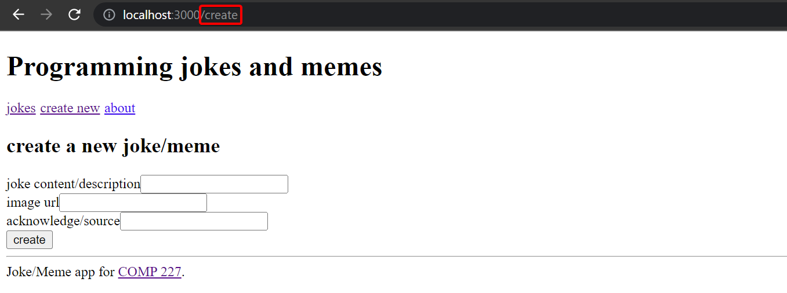

<div class="content">

The exercises in this seventh part of the course differ a bit from the ones before.
In this and the next chapter, as usual, there are [exercises related to the theory in the chapter](#exercises-71-73).

In addition to the exercises in this and the next chapter,
there are a series of exercises in which we'll be revising what we've learned during the whole course by expanding the Watchlist application,
which we worked on during parts 4 and 5.

### Application navigation structure

This part will continue from where we left off in [part 5](/part5).

It is very common for web applications to have a navigation bar, which enables switching the view of the application.

Our app could have a main page


and separate pages for showing information on tasks and users:


In an [old school web app](/part0/fundamentals_of_web_apps#traditional-web-applications),
changing the page shown by the application would be accomplished by the browser making an HTTP GET request to the server and rendering the HTML representing the view that was returned.

In single-page apps, we are, in reality, always on the same page.
The Javascript code run by the browser ***creates an illusion of different "pages"***.
If HTTP requests are made when switching views, they are only for fetching JSON-formatted data, which the new view might require for it to be shown.

The navigation bar and an application containing multiple views are very easy to implement using React.

Here is one way, which we will write into a **new repository's *index.js***:

```js
import { useState }  from 'react'
import ReactDOM from 'react-dom/client'

const Home = () => (
  <div> <h2>227 Tasks App</h2> </div>
)

const Tasks = () => (
  <div> <h2>Tasks</h2> </div>
)

const Users = () => (
  <div> <h2>Users</h2> </div>
)

const App = () => {
  const [page, setPage] = useState('home')

  const toPage = (page) => (event) => {
    event.preventDefault()
    setPage(page)
  }

  const content = () => {
    if (page === 'home') {
      return <Home />
    } else if (page === 'tasks') {
      return <Tasks />
    } else if (page === 'users') {
      return <Users />
    }
  }

  const padding = {
    padding: 5
  }

  return (
    <div>
      <div>
        <a href="" onClick={toPage('home')} style={padding}>
          home
        </a>
        <a href="" onClick={toPage('tasks')} style={padding}>
          tasks
        </a>
        <a href="" onClick={toPage('users')} style={padding}>
          users
        </a>
      </div>

      {content()}
    </div>
  )
}

ReactDOM.createRoot(document.getElementById('root')).render(<App />)
```

Each view is implemented as its own component.
We store the view component information in the application state called `page`.
This information tells us which component, representing a view, should be shown below the menu bar.

However, this method is not ideal for a variety of reasons.
As we can see from the pictures, the address stays the same even though at times we are in different views.
Each view should preferably have its own address, e.g. to make bookmarking possible.
The ***back*** button doesn't work as expected for our application either,
meaning that *back* doesn't move you to the previously displayed view of the application, but somewhere completely different.
If the application were to grow even bigger and we wanted to, for example, add separate views for each user and task,
then this self-made **routing**, which means the navigation management of the application, would get overly complicated.

### React Router

Luckily, React has the [**React Router**](https://reactrouter.com/) library
which provides an excellent solution for managing navigation in a React application.

Let's change the above application to use React Router.
First, we install React Router with the command

```bash
npm install react-router-dom
```

The routing provided by React Router is enabled by changing the application as follows:

```js
import {
  BrowserRouter as Router,
  Routes, Route, Link
} from "react-router-dom"

const App = () => {

  const padding = {
    padding: 5
  }

  return (
    <Router>
      <div>
        <Link style={padding} to="/">home</Link>
        <Link style={padding} to="/tasks">tasks</Link>
        <Link style={padding} to="/users">users</Link>
      </div>

      <Routes>
        <Route path="/tasks" element={<Tasks />} />
        <Route path="/users" element={<Users />} />
        <Route path="/" element={<Home />} />
      </Routes>

      <div>
        <em>Task app, Department of Computer Science 2023</em>
      </div>
    </Router>
  )
}
```

Routing, or the conditional rendering of components *based on the URL* in the browser,
is used by placing components as children of the `Router` component, meaning inside `Router` tags.

Notice that, even though the component is referred to by the name `Router`,
we are talking about [BrowserRouter](https://reactrouter.com/en/main/router-components/browser-router),
because here the import happens by renaming the imported object:

```js
import {
  BrowserRouter as Router, // highlight-line
  Routes, Route, Link
} from "react-router-dom"
```

According to the [v5 docs](https://v5.reactrouter.com/web/api/BrowserRouter):

> `BrowserRouter` is a `Router` that uses the HTML5 history API (pushState, replaceState and the popState event)
> to keep your UI in sync with the URL.

Normally the browser loads a new page when the URL in the address bar changes.
However, with the help of the [HTML5 history API](https://css-tricks.com/using-the-html5-history-api/),
`BrowserRouter` enables us to use the URL in the address bar of the browser for internal "routing" in a React application.
So, ***even if the URL in the address bar changes, the content of the page is only manipulated using Javascript, and the browser will not load new content from the server***.
Using the back and forward actions, as well as making bookmarks, is still logical like on a traditional web page.

Inside the router, we define *links* that modify the address bar with the help of the [`Link`](https://reactrouter.com/en/main/components/link) component.
For example,

```js
<Link to="/tasks">tasks</Link>
```

creates a link in the application with the text *`tasks`*, which when clicked changes the URL in the address bar to ***/tasks***.

Components rendered based on the URL of the browser are defined with the help of the component [`Route`](https://reactrouter.com/en/main/route/route).
For example,

```js
<Route path="/tasks" element={<Tasks />} />
```

defines that, if the browser address is ***/tasks***, we render the `Tasks` component.

We wrap the components to be rendered based on the URL with a [`Routes`](https://reactrouter.com/en/main/components/routes) component

```js
<Routes>
  <Route path="/tasks" element={<Tasks />} />
  <Route path="/users" element={<Users />} />
  <Route path="/" element={<Home />} />
</Routes>
```

The Routes works by rendering the first component whose *path* matches the URL in the browser's address bar.

### Parameterized route

Let's examine a slightly modified version from the previous example.
The complete code for this example can be found [here](https://github.com/comp227/misc/blob/main/router-app-v1.js).

The application now contains five different views whose display is controlled by the router.
In addition to the components from the previous example (*`Home`*, *`Tasks`* and *`Users`*),
we have `Login` representing the login view and `Task` representing the view of a single task.

`Home` and `Users` are unchanged from the previous exercise.
`Tasks` is a bit more complicated.
It renders the list of tasks passed to it as props in such a way that the name of each task is clickable.


The ability to click a name is implemented with the component `Link`,
and clicking the name of a task whose `id` is `3` would trigger an event that changes the address of the browser into ***tasks/3***:

```js
const Tasks = ({tasks}) => (
  <div>
    <h2>Tasks</h2>
    <ul>
      {tasks.map(task =>
        <li key={task.id}>
          <Link to={`/tasks/${task.id}`}>{task.content}</Link>
        </li>
      )}
    </ul>
  </div>
)
```

We define parameterized URLs in the routing in `App` component as follows:

```js
<Router>
  // ...

  <Routes>
    <Route path="/tasks/:id" element={<Task tasks={tasks} />} /> // highlight-line
    <Route path="/tasks" element={<Tasks tasks={tasks} />} />   
    <Route path="/users" element={user ? <Users /> : <Navigate replace to="/login" />} />
    <Route path="/login" element={<Login onLogin={login} />} />
    <Route path="/" element={<Home />} />      
  </Routes>
</Router>
```

We define the route rendering a specific task "express style" by marking the parameter with a colon - `:id`

```js
<Route path="/tasks/:id" element={<Task tasks={tasks} />} />
```

When a browser navigates to the URL for a specific task, for example, ***/tasks/3***, we render the `Task` component:

```js
import {
  // ...
  useParams  // highlight-line
} from "react-router-dom"

const Task = ({ tasks }) => {
  const id = useParams().id // highlight-line
  const task = tasks.find(t => t.id === Number(id)) 
  return (
    <div>
      <h2>{task.content}</h2>
      <div>{task.user}</div>
      <div><strong>{task.important ? 'important' : ''}</strong></div>
    </div>
  )
}
```

The `Task` component receives all of the tasks as props `tasks`, and it can access the URL parameter (the id of the task to be displayed)
with the [useParams](https://reactrouter.com/en/main/hooks/use-params) function of the React Router.

### useNavigate

We have also implemented a simple login function in our application.
If a user is logged in, information about a logged-in user is saved to the `user` field of the state of the `App` component.

The option to navigate to the `Login` view is rendered conditionally in the menu.

```js
<Router>
  <div>
    <Link style={padding} to="/">home</Link>
    <Link style={padding} to="/tasks">tasks</Link>
    <Link style={padding} to="/users">users</Link>
    // highlight-start
    {user
      ? <em>{user} logged in</em>
      : <Link style={padding} to="/login">login</Link>
    }
    // highlight-end
  </div>

  // ...
</Router>
```

So if the user is already logged in, instead of displaying the link `Login`, we show the username of the user:


The code of the component handling the login functionality is as follows:

```js
import {
  // ...
  useNavigate // highlight-line
} from 'react-router-dom'

const Login = (props) => {
  const navigate = useNavigate() // highlight-line

  const onSubmit = (event) => {
    event.preventDefault()
    props.onLogin('powercat')
    navigate('/') // highlight-line
  }

  return (
    <div>
      <h2>login</h2>
      <form onSubmit={onSubmit}>
        <div>
          username: <input />
        </div>
        <div>
          password: <input type='password' />
        </div>
        <button type="submit">login</button>
      </form>
    </div>
  )
}
```

What is interesting about this component is the use of the [`useNavigate`](https://reactrouter.com/en/main/hooks/use-navigate) function of the React Router.
With this function, the browser's URL can be changed programmatically.

With the user logs in, we call `navigate('/')` which causes the browser's URL to change to `/` and the application renders the corresponding component `Home`.

Both [`useParams`](https://reactrouter.com/en/main/hooks/use-params) and [`useNavigate`](https://reactrouter.com/en/main/hooks/use-navigate) are ***hook functions***,
just like `useState` and `useEffect` which we have used many times now.
As you remember from [part 1, there are some rules](/part1/a_more_complex_state_debugging_react_apps/#rules-of-hooks) to using hook functions.
Create-react-app has been configured to warn you if you break these rules, for example, *by calling a hook function from a conditional statement*.

### redirect

There is one more interesting detail about the `Users` route:

```js
<Route path="/users" element={user ? <Users /> : <Navigate replace to="/login" />} />
```

If a user *isn't* logged in, the `Users` component is not rendered.
Instead, the user is ***redirected*** using the component [`Navigate`](https://reactrouter.com/en/main/components/navigate) to the login view:

```js
<Navigate replace to="/login" />
```

In reality, it would perhaps be better to not even show links in the navigation bar requiring login if the user is not logged into the application.

Here is the `App` component in its entirety:

```js
const App = () => {
  const [tasks, setTasks] = useState([
    // ...
  ])

  const [user, setUser] = useState(null) 

  const login = (user) => {
    setUser(user)
  }

  const padding = {
    padding: 5
  }

  return (
    <div>
      <Router>
        <div>
          <Link style={padding} to="/">home</Link>
          <Link style={padding} to="/tasks">tasks</Link>
          <Link style={padding} to="/users">users</Link>
          {user
            ? <em>{user} logged in</em>
            : <Link style={padding} to="/login">login</Link>
          }
        </div>

        <Routes>
          <Route path="/tasks/:id" element={<Task tasks={tasks} />} />  
          <Route path="/tasks" element={<Tasks tasks={tasks} />} />   
          <Route path="/users" element={user ? <Users /> : <Navigate replace to="/login" />} />
          <Route path="/login" element={<Login onLogin={login} />} />
          <Route path="/" element={<Home />} />      
        </Routes>
      </Router>      
      <footer>
        <br />
        <em>Task app, Department of Computer Science 2023</em>
      </footer>
    </div>
  )
}
```

We define an element common for modern web apps called *`footer`* (notice the lowercase), which defines the part at the bottom of the screen, outside of the `Router`,
so that it is shown regardless of the component shown in the routed part of the application.

### Parameterized route revisited

Our application has a flaw.
The `Task` component receives all of the tasks, even though it only displays the one whose `id` matches the url (*/tasks/id*):

```js
const Task = ({ tasks }) => { 
  const id = useParams().id
  const task = tasks.find(t => t.id === Number(id))
  // ...
}
```

***Would it be possible to modify the application so that the `Task` component receives only the task that it should display?***

```js
const Task = ({ task }) => {
  return (
    <div>
      <h2>{task.content}</h2>
      <div>{task.user}</div>
      <div><strong>{task.important ? 'important' : ''}</strong></div>
    </div>
  )
}
```

One way to do this would be to use React Router's [`useMatch`](https://reactrouter.com/en/v6.3.0/api#usematch) hook
to figure out the id of the task to be displayed in the `App` component.

However, it is not possible to use the `useMatch` hook in the component which defines the routed part of the application.
Let's change it then and *move the `Router` components **outside of the `App`***:

```js
ReactDOM.createRoot(document.getElementById('root')).render(
  <Router> // highlight-line
    <App />
  </Router> // highlight-line
)
```

The `App` component becomes:

```js
import {
  // ...
  useMatch  // highlight-line
} from "react-router-dom"

const App = () => {
  // ...

 // highlight-start
  const match = useMatch('/tasks/:id')

  const task = match 
    ? tasks.find(task => task.id === Number(match.params.id))
    : null
  // highlight-end

  return (
    <div>
      <div>
        <Link style={padding} to="/">home</Link>
        // ...
      </div>

      <Routes>
        <Route path="/tasks/:id" element={<Task task={task} />} />   // highlight-line
        <Route path="/tasks" element={<Tasks tasks={tasks} />} />   
        <Route path="/users" element={user ? <Users /> : <Navigate replace to="/login" />} />
        <Route path="/login" element={<Login onLogin={login} />} />
        <Route path="/" element={<Home />} />      
      </Routes>   

      <div>
        <em>Task app, Department of Computer Science 2022</em>
      </div>
    </div>
  )
}  
```

Now, with the Task also in its ideal state, everytime the component is rendered, or practically every time the browser's URL changes, this command is executed:

```js
const match = useMatch('/tasks/:id')
```

If the URL matches ***/tasks/:id***, the match variable will contain an object from which we can access the parameterized part of the path,
the id of the task to be displayed, and we can then fetch the correct task to display.

```js
const task = match 
  ? tasks.find(task => task.id === Number(match.params.id))
  : null
```

The completed code can be found [here](https://github.com/comp227/misc/blob/main/router-app-v2.js).

</div>
<div class="tasks">

### Exercises 7.1-7.3

Let's work again with jokes, but we will start from scratch.
This time, we will add images to our application, so this can easily turn into storing memes, which we'll do.
Although we are mostly storing memes, we will refer to them as jokes.
This assignment is strictly for educational purposes, as such the url for the images may stop working if sites detect we are repeatedly taking their images.
Because the picture portion is merely cosmetic, we will leave it in to make the assignment feel a tad bit more fun.
However, we will **from now on refer to both *memes* and *jokes* as `jokes`**.

To start, please visit <http://go.djosv.com/227lab7-1>
We will use the repo there as the starting point for the exercises.

The application starts the usual way, but first, you need to install the dependencies of the application:

```bash
npm install
npm start
```

#### 7.1: routed jokes, step1

Add React Router to the application so that by clicking links in the `Menu` component the view can be changed.

At the root of the application, meaning the path `/`, shows the list of jokes:


The `Footer` component should always be visible at the bottom.

The creation of a new joke should happen e.g. in the path *create*:



#### 7.2: routed jokes, step2

Implement a view for showing a single joke:


Navigating to the page showing the single joke is done by clicking the name of that joke:


#### 7.3: routed jokes, step3

The default functionality of the creation form is quite confusing because nothing seems to be happening after creating a new joke using the form.

Improve the functionality such that after creating a new joke the application transitions automatically to showing the view for all jokes
**and** the user is shown a notification informing them of this successful creation for the next five seconds:


</div>
