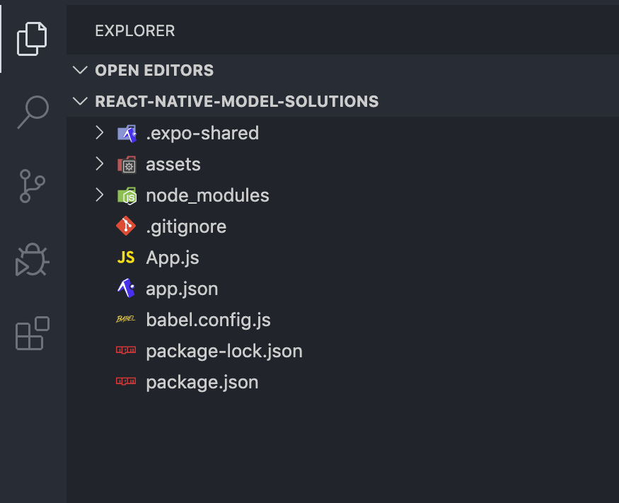
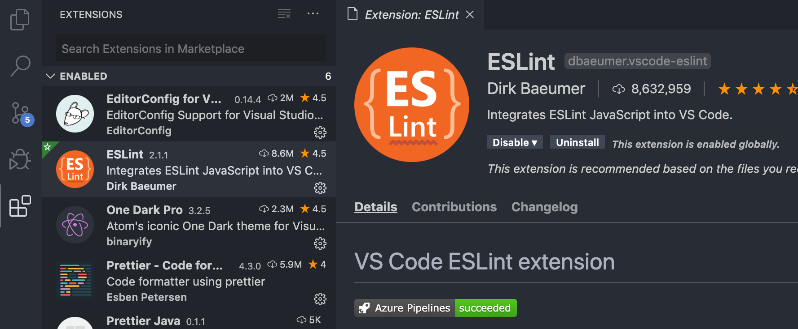

<div class="content">

Traditionally, developing native iOS and Android applications has required the developer to use platform-specific programming languages and development environments.
For iOS development, this means using Objective C or Swift and for Android development using JVM-based languages such as Java, Scala or Kotlin.
Releasing an application for both these platforms technically requires developing two separate applications with different programming languages.
This requires lots of development resources.

One of the popular approaches to unify the platform-specific development has been to utilize the browser as the rendering engine.
[Cordova](https://cordova.apache.org/) is one of the most popular platforms for building cross-platform applications.
It allows for developing multi-platform applications using standard web technologies - HTML5, CSS3, and JavaScript.
However, Cordova applications are running within an embedded browser window in the user's device.
That is why these applications can not achieve the performance nor the look-and-feel of native applications that utilize actual native user interface components.

[React Native](https://reactnative.dev/) is a framework for developing native Android and iOS applications using JavaScript and React.
It provides a set of cross-platform components that behind the scenes utilize the platform's native components.
Using React Native allows us to bring all the familiar features of React such as
JSX, components, props, state, and hooks into native application development.
On top of that, we can utilize many familiar libraries in the React ecosystem such as [react-redux](https://react-redux.js.org/),
[react-apollo](https://github.com/apollographql/react-apollo),
[react-router](https://reactrouter.com/en/6.4.5/start/tutorial) and many more.

The speed of development and gentle learning curve for developers familiar with React is one of the most important benefits of React Native.
Here's a motivational quote from Coinbase's article
[Onboarding thousands of users with React Native](https://benbronsteiny.wordpress.com/2020/02/27/onboarding-thousands-of-users-with-react-native/)
on the benefits of React Native:

> If we were to reduce the benefits of React Native to a single word, it would be “velocity”.
On average, our team was able to onboard engineers in less time, share more code (which we expect will lead to future productivity boosts),
and ultimately deliver features faster than if we had taken a purely native approach.

### About this part

During this part, we will learn how to build an actual React Native application from the bottom up.
We will learn concepts such as what are React Native's core components, how to create beautiful user interfaces,
how to communicate with a server and how to test a React Native application.

We will be developing an application for rating [GitHub](https://github.com/) repositories.
Our application will have features such as:

- sorting and filtering reviewed repositories
- registering a user
- logging in and
- creating a review for a repository.

The backend for the application will be provided for us so that we can solely focus on the React Native development.
The final version of our application will look something like this:


All the exercises in this part have to be submitted into *a single GitHub repository* which will eventually contain the entire source code of your application.
There will be model solutions available for each section of this part which you can use to fill in incomplete submissions.
This part is structured based on the idea that you develop your application as you progress in the material.
So **do not** wait until the exercises to start the development.
Instead, develop your application at the same pace as the material progresses.

This part will heavily rely on concepts covered in the previous parts.
Before starting this part you will need basic knowledge of JavaScript and React.
Deep knowledge of server-side development is not required and all the server-side code is provided for you.
The recommended parts to complete before this part are
[part 1](/part1), [part 2](/part2), [part 5](/part5), and [part 7](/part7).

### Submitting exercises

Exercises are submitted via GitHub just like in the previous parts.
Note that, exercises in this part are submitted *to a different course repo* than in parts 0-7.
This means that you will be submitting exercises a single section at a time starting with this section, "Introduction to React Native", which is part 1 on Canvas.

### Initializing the application

To get started with our application we need to set up our development environment.
We have learned from previous parts that there are useful tools for setting up React applications quickly such as Create React App.
Luckily React Native has these kinds of tools as well.

For the development of our application, we will be using [Expo](https://docs.expo.io/versions/latest/).
Expo is a platform that eases the setup, development, building, and deployment of React Native applications.
Let's get started with Expo by initializing our project with ***create-expo-app***:

```shell
npx create-expo-app rate-repository-app --template expo-template-blank@sdk-46
```
  
Note, that the `@sdk-46` sets the project's *Expo SDK version to 46*, which supports *React Native version 0.69*.
Using other Expo SDK versions might cause you trouble while following this material.
Also, Expo has a [few limitations](https://docs.expo.io/introduction/why-not-expo/) when compared to plain React Native CLI.
However, these limitations do not affect the application implemented in the material.

Next, let's navigate to the created *rate-repository-app* directory with the terminal and install a few dependencies we'll be needing soon:

```shell
npx expo install react-native-web@~0.18.7 react-dom@18.2.0 @expo/webpack-config@^0.17.0
```

Now that our application has been initialized, open the created *rate-repository-app* directory with an editor such as [Visual Studio Code](https://code.visualstudio.com/).
The structure should be more or less the following:



We might spot some familiar files and directories such as *package.json* and *node_modules*.
On top of those, the most relevant files are the *app.json* file which contains Expo-related configuration and *App.js* which is the root component of our application.
**Do not** rename or move the *App.js* file because by default Expo imports it to
[register the root component](https://docs.expo.io/versions/latest/sdk/register-root-component/).

Let's look at the *`scripts`* section of the *package.json* file which has the following scripts:

```javascript
{
  // ...
  "scripts": {
    "start": "expo start",
    "android": "expo start --android",
    "ios": "expo start --ios",
    "web": "expo start --web",
    "eject": "expo eject"
  },
  // ...
}
```

Running the script `npm start` starts the [Metro bundler](https://facebook.github.io/metro/) which is a JavaScript bundler for React Native.
It can be described as the [Webpack](https://webpack.js.org/) of the React Native ecosystem.
In addition to the Metro bundler, the Expo command-line interface should be open in the terminal window.
The command-line interface has a useful set of commands for viewing the application logs and starting the application in an emulator or in Expo's mobile application.
We will get to emulators and Expo's mobile application soon, but first, let's open our application.
  
Expo command-line interface suggests a few ways to open our application.
Let's press the "w" key in the terminal window to open the application in a browser.
We should soon see the text defined in the *App.js* file in a browser window.
Open the *App.js* file with an editor and make a small change to the text in the `Text` component.
After saving the file you should be able to see that the changes you have made in the code are visible in the browser window.

### Setting up the development environment

We have had the first glance of our application using the Expo's browser view.
Although the browser view is quite usable, it is still a quite poor simulation of the native environment.
Let's have a look at the alternatives we have regarding the development environment.

Android and iOS devices such as tablets and phones can be emulated in computers using specific ***emulators***.
This is very useful for developing native applications.
macOS users can use both Android and iOS emulators with their computers.
Users of other operating systems such as Linux or Windows have to settle for Android emulators.
Next, depending on your operating system follow one of these instructions on setting up an emulator:

- [Set up the Android emulator with Android Studio](https://docs.expo.dev/workflow/android-studio-emulator/) (any operating system)
- [Set up the iOS simulator with Xcode](https://docs.expo.dev/workflow/ios-simulator/) (macOS operating system)

After you have set up the emulator and it is running, start the Expo development tools as we did before, by running `npm start`.
Depending on the emulator you are running either press the corresponding key for the "open Android" or "open iOS simulator".
After pressing the key, Expo should connect to the emulator and you should eventually see the application in your emulator.
Be patient, this might take a while.

In addition to emulators, there is one extremely useful way to develop React Native applications with Expo, the Expo mobile app.
With the Expo mobile app, you can preview your application using your actual mobile device,
which provides a bit more concrete development experience compared to emulators.
To get started, install the Expo mobile app by following the instructions in
[Expo's documentation](https://docs.expo.io/get-started/installation/#2-expo-go-app-for-ios-and).
Note that the Expo mobile app can only open your application
if your mobile device is connected to *the same local network* (e.g. connected to the same Wi-Fi network)
as the computer you are using for development.

When the Expo mobile app has finished installing, open it up.
Next, if the Expo development tools are not already running, start them by running `npm start`.
You should be able to see a QR code at the beginning of the command output.
Within the Expo mobile app, press ***Scan QR Code*** and scan the QR code displayed in the development tools.
The Expo mobile app should start building the JavaScript bundle and after it is finished you should be able to see your application.
Now, every time you want to reopen your application in the Expo mobile app,
you should be able to access the application without scanning the QR code by pressing it in the ***Recently opened*** list in the ***Projects*** view.

</div>

<div class="tasks">

### Exercise 9.1

#### Exercise 9.1: initializing the application

Initialize your application with Expo command-line interface and set up the development environment either using an emulator or Expo's mobile app.
It is recommended to try both and find out which development environment is the most suitable for you.
The name of the application is not that relevant.
You can, for example, go with *rate-repository-app*.

To submit this exercise and all future exercises you need to make sure you have used the GitHub classroom link, which is listed on Canvas.

Finally, just commit and push your changes into the repository and you are all done.

</div>

<div class="content">

### ESLint

Now that we are somewhat familiar with the development environment let's enhance our development experience even further by configuring a linter.
We will be using [ESLint](https://eslint.org/) which is already familiar to us from the previous parts.
Let's get started by installing the dependencies:

```shell
npm install --save-dev eslint @babel/eslint-parser eslint-plugin-react eslint-plugin-react-native
```

Next, let's add the ESLint configuration into a *.eslintrc* file in the *rate-repository-app* directory with the following content:

```javascript
{
  "plugins": ["react", "react-native"],
  "settings": {
    "react": {
      "version": "detect"
    }
  },
  "extends": ["eslint:recommended", "plugin:react/recommended"],
  "parser": "@babel/eslint-parser",
  "env": {
    "react-native/react-native": true
  },
  "rules": {
    "react/prop-types": "off",
    "react/react-in-jsx-scope": "off"
  }
}
```

And finally, let's add a `lint` script to the *package.json* file to check the linting rules in specific files:

```javascript
{
  // ...
  "scripts": {
    "start": "expo start",
    "android": "expo start --android",
    "ios": "expo start --ios",
    "web": "expo start --web",
    "eject": "expo eject",
    "lint": "eslint ./src/**/*.{js,jsx} App.js --no-error-on-unmatched-pattern" // highlight-line
  },
  // ...
}
```

Now we can check that the linting rules are obeyed in JavaScript files in the *src* directory and in the *App.js* file by running `npm run lint`.
We will be adding our future code to the *src* directory but because we haven't added any files there yet, we need the `no-error-on-unmatched-pattern` flag.
Also if possible integrate ESLint with your editor.
If you are using Visual Studio Code you can do that by, going to the extensions section and checking that the ESLint extension is installed and enabled:



The provided ESLint configuration contains only the basis for the configuration.
Feel free to improve the configuration and add new plugins if you feel like it.

</div>

<div class="tasks">

### Exercise 9.2

#### Exercise 9.2: setting up the ESLint

Set up ESLint in your project so that you can perform linter checks by running `npm run lint`.
To get most of linting it is also recommended to integrate ESLint with your editor.

This was the last exercise in this section.
It's time to push your code to GitHub if you haven't already and mark the exercises that were completed on Canvas.
</div>

<div class="content">

### Debugging
  
When our application doesn't work as intended, we should immediately start **debugging** it.
In practice, this means that we'll need to reproduce the erroneous behavior and monitor the code execution to find out which part of the code behaves incorrectly.
During the course, we have already done a bunch of debugging by logging messages,
inspecting network traffic, and using specific development tools, such as ***React Development Tools***.
In general, debugging isn't that different in React Native, we'll just need the right tools for the job.
  
[React Native Debugger](https://docs.expo.io/workflow/debugging/#react-native-debugger)
is a tool that offers a similar set of debugging features as the browser's developer tools.
Let's get started by installing React Native Debugger with the help of the [installation instructions](https://github.com/jhen0409/react-native-debugger#installation).
If you are unsure which installation method to choose, downloading a pre-built binary from the
[release page](https://github.com/jhen0409/react-native-debugger/releases) is perhaps the easiest option.
On the release page, find the latest release which supports React Native version 0.69
and download the binary suitable for your operating system (for example *.dmg* file for macOS and *.exe* file for Windows) under the "Assets" section.
Once the installation is complete, start the React Native Debugger, open a new debugger window (shortcuts: ***Command+T*** on macOS,
***Ctrl+T*** on Linux/Windows) and set the React Native packager port to `19000`.

**NB:** If the debugger can't connect to the application and you see the error message "Another debugger is already connected",
make sure that *<http://localhost:19000/debugger-ui>* is not open in some browser tab.
  
Next, we need to start our application and connect to the debugger.
Start the application by running `npm start`.
Once the application is running, open it with either an emulator or the Expo mobile app.
Inside the emulator or the Expo mobile app, open the developer menu by following the
[instructions](https://docs.expo.io/workflow/debugging/#developer-menu) in the Expo's documentation.
From the developer menu, select ***Debug remote JS*** to connect to the debugger.
Now, you should be able to see the application's component tree in the debugger:


The debugger's ***Console*** tab displays the application's logs.
Like in the browser's development tools, error messages and messages logged with the `console.log` method are displayed there.
Try adding a message with the `console.log` method in the *App.js* file and see that it is displayed in the debugger.

You can use the debugger to inspect the component's state and props as well as *change* them.
Try finding the `Text` component rendered by the `App` component using the debugger.
You can either use the search or go through the component tree.
Once you have found the `Text` component in the tree, click it, and change the value of the `children` prop.
The change should be automatically visible in the application's preview.

For more useful React Native application debugging tools, head out to the Expo's [debugging documentation](https://docs.expo.io/workflow/debugging).

</div>
