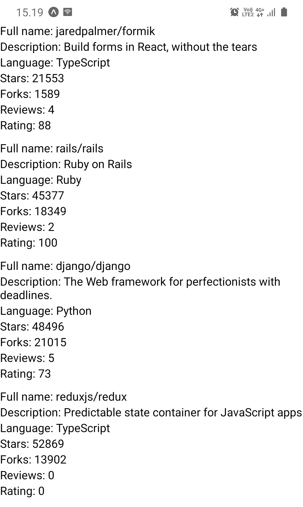
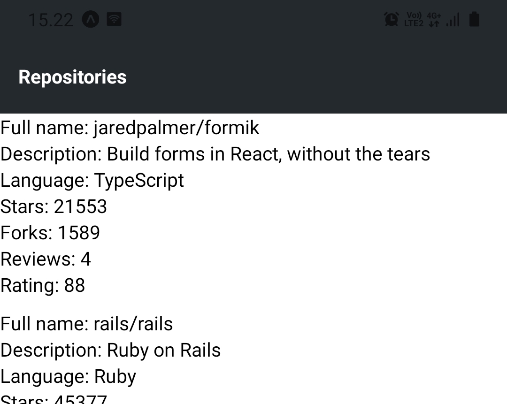
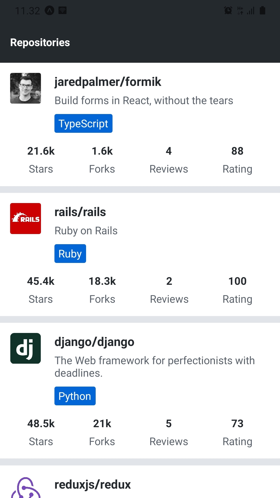
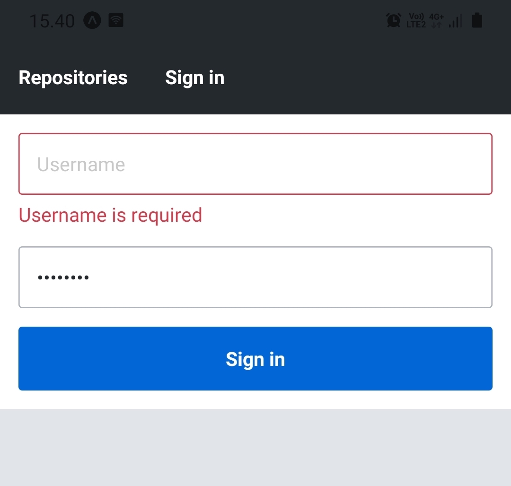

<div class="content">

Now that we have set up our development environment we can get into React Native basics and get started with the development of our application.
In this section, we will learn how to:

- build user interfaces with React Native's core components
- add style properties to these core components
- transition between views
- manage the form's state efficiently.

### Core components

In the previous parts, we have learned that we can use React to define components as functions,
which receive props as an argument and returns a tree of React elements.
This tree is usually represented with JSX syntax.
In the browser environment, we have used the [ReactDOM](https://reactjs.org/docs/react-dom.html) library
to turn these components into a DOM tree that can be rendered by a browser.
Here is a concrete example of a very simple component:

```javascript
const HelloWorld = props => {
  return <div>Hello world!</div>;
};
```

The `HelloWorld` component returns a single `div` element which is created using the JSX syntax.
We might remember that this JSX syntax is compiled into `React.createElement` method calls, such as this:

```javascript
React.createElement('div', null, 'Hello world!');
```

This line of code creates a `div` element without any props and with a single child element which is a string `"Hello world"`.
When we render this component into a root DOM element using the `ReactDOM.render` method the `div` element will be rendered as the corresponding DOM element.

As we can see, React is not bound to a certain environment, such as the browser environment.
Instead, there are libraries such as ReactDOM that can render *a set of predefined components*, such as DOM elements, in a specific environment.
In React Native these predefined components are called **core components**.

[Core components](https://reactnative.dev/docs/intro-react-native-components)
are a set of components provided by React Native, which behind the scenes utilize the platform's native components.
Let's implement the previous example using React Native:

```javascript
import { Text } from 'react-native'; // highlight-line

const HelloWorld = props => {
  return <Text>Hello world!</Text>; // highlight-line
};
```

So we import the [Text](https://reactnative.dev/docs/text) component from React Native and replace the `div` element with a `Text` element.
Many familiar DOM elements have their React Native "counterparts".
Here are some examples picked from React Native's [Core Components documentation](https://reactnative.dev/docs/components-and-apis):

- [Text](https://reactnative.dev/docs/text) component is ***the only*** React Native component that can have textual children.
It is similar to for example the `<strong>` and the `<h1>` elements.
- [View](https://reactnative.dev/docs/view) component is the basic user interface building block similar to the `<div>` element.
- [TextInput](https://reactnative.dev/docs/textinput) component is a text field component similar to the `<input>` element.
- [Pressable](https://reactnative.dev/docs/pressable) component is for capturing different press events.
It is similar to for example the `<button>` element.

There are a few notable differences between core components and DOM elements.
The first difference is that the `Text` component is ***the only*** React Native component that can have textual children.
This means that you can't, for example, replace the `Text` component with the `View` component in the previous example.

The second notable difference is related to the event handlers.
While working with the DOM elements we are used to adding event handlers such as `onClick` to basically any element such as `<div>` and `<button>`.
In React Native we have to carefully read the [API documentation](https://reactnative.dev/docs/components-and-apis)
to know what event handlers (as well as other props) a component accepts.
For example, the [Pressable](https://reactnative.dev/docs/pressable) component provides props for listening to different kinds of press events.
We can for example use the component's [onPress](https://reactnative.dev/docs/pressable) prop for listening to press events:

```javascript
import { Text, Pressable, Alert } from 'react-native';

const PressableText = props => {
  return (
    <Pressable
      onPress={() => Alert.alert('You pressed the text!')}
    >
      <Text>You can press me</Text>
    </Pressable>
  );
};
```

Now that we have a basic understanding of the core components, let's start to give our project some structure.
Create a *src* directory in the root directory of your project and in the *src* directory create a *components* directory.
In the *components* directory create a file *Main.jsx* with the following content:

```javascript
import Constants from 'expo-constants';
import { Text, StyleSheet, View } from 'react-native';

const styles = StyleSheet.create({
  container: {
    marginTop: Constants.statusBarHeight,
    flexGrow: 1,
    flexShrink: 1,
  },
});

const Main = () => {
  return (
    <View style={styles.container}>
      <Text>Rate Repository Application</Text>
    </View>
  );
};

export default Main;
```

Next, let's use the `Main` component in the `App` component in the *App.js* file which is located in our project's root directory.
Replace the current content of the file with this:

```javascript
import Main from './src/components/Main';

const App = () => {
  return <Main />;
};

export default App;
```

### Manually reloading the application

As we have seen, Expo will automatically reload the application when we make changes to the code.
However, there might be times when automatic reload isn't working and the application has to be reloaded manually.
This can be achieved through the in-app developer menu.

You can access the developer menu by shaking your device or by selecting "Shake Gesture" inside the Hardware menu in the iOS Simulator.
You can also use the ***⌘D*** keyboard shortcut when your app is running in the iOS Simulator,
or ***⌘M*** when running in an Android emulator on Mac OS and ***Ctrl+M*** on Windows and Linux.

Once the developer menu is open, simply press "Reload" to reload the application.
After the application has been reloaded, automatic reloads should work without the need for a manual reload.

</div>

<div class="tasks">

### Exercise 9.3

#### Exercise 9.3: the reviewed repositories list

In this exercise, we will implement the first version of the reviewed repositories list.
The list should contain the repository's
full name, description, language, number of forks, number of stars, rating average and number of reviews.
Luckily React Native provides a handy component for displaying a list of data,
which is the [FlatList](https://reactnative.dev/docs/flatlist) component.

Implement components `RepositoryList` and `RepositoryItem` in the *components* directory's files *RepositoryList.jsx* and *RepositoryItem.jsx*.
The `RepositoryList` component should render the `FlatList` component and `RepositoryItem` a single item on the list
(hint: use the `FlatList` component's [renderItem](https://reactnative.dev/docs/flatlist#required-renderitem) prop).
Use this as the basis for the *RepositoryList.jsx* file:

```javascript
import { FlatList, View, StyleSheet } from 'react-native';

const styles = StyleSheet.create({
  separator: {
    height: 10,
  },
});

const repositories = [
  {
    id: 'jaredpalmer.formik',
    fullName: 'jaredpalmer/formik',
    description: 'Build forms in React, without the tears',
    language: 'TypeScript',
    forksCount: 1589,
    stargazersCount: 21553,
    ratingAverage: 88,
    reviewCount: 4,
    ownerAvatarUrl: 'https://avatars2.githubusercontent.com/u/4060187?v=4',
  },
  {
    id: 'rails.rails',
    fullName: 'rails/rails',
    description: 'Ruby on Rails',
    language: 'Ruby',
    forksCount: 18349,
    stargazersCount: 45377,
    ratingAverage: 100,
    reviewCount: 2,
    ownerAvatarUrl: 'https://avatars1.githubusercontent.com/u/4223?v=4',
  },
  {
    id: 'django.django',
    fullName: 'django/django',
    description: 'The Web framework for perfectionists with deadlines.',
    language: 'Python',
    forksCount: 21015,
    stargazersCount: 48496,
    ratingAverage: 73,
    reviewCount: 5,
    ownerAvatarUrl: 'https://avatars2.githubusercontent.com/u/27804?v=4',
  },
  {
    id: 'reduxjs.redux',
    fullName: 'reduxjs/redux',
    description: 'Predictable state container for JavaScript apps',
    language: 'TypeScript',
    forksCount: 13902,
    stargazersCount: 52869,
    ratingAverage: 0,
    reviewCount: 0,
    ownerAvatarUrl: 'https://avatars3.githubusercontent.com/u/13142323?v=4',
  },
];

const ItemSeparator = () => <View style={styles.separator} />;

const RepositoryList = () => {
  return (
    <FlatList
      data={repositories}
      ItemSeparatorComponent={ItemSeparator}
      // other props
    />
  );
};

export default RepositoryList;
```

**Do not** alter the contents of the `repositories` variable, it should contain everything you need to complete this exercise.
Render the `RepositoryList` component in the `Main` component which we previously added to the *Main.jsx* file.
The reviewed repository list should roughly look something like this:



</div>

<div class="content">

### Style

Now that we have a basic understanding of how core components work and we can use them to build a simple user interface it is time to add some style.
In [part 2](/part2/adding_styles_to_react_app) we learned that in the browser environment we can define React component's style properties using CSS.
We had the option to either define these styles inline using the `style` prop or in a CSS file with a suitable selector.

There are many similarities in the way style properties are attached to React Native's core components and the way they are attached to DOM elements.
In React Native most of the core components accept a prop called `style`.
The `style` prop accepts an object with style properties and their values.
These style properties are in most cases the same as in CSS, however, property names are in *`camelCase`*.
This means that CSS properties such as *`padding-top`* and *`font-size`* are written as `paddingTop` and `fontSize`.
Here is a simple example of how to use the `style` prop:

```javascript
import { Text, View } from 'react-native';

const BigBlueText = () => {
  return (
    <View style={{ padding: 20 }}>
      <Text style={{ color: 'blue', fontSize: 24, fontWeight: '700' }}>
        Big blue text
      </Text>
    </View>
  );
};
```

On top of the property names, you might have noticed another difference in the example.
In CSS numerical property values commonly have a unit such as *`px`*, *`%`*, *`em`* or *`rem`*.
In React Native all dimension-related property values such as `width`, `height`, `padding`, and `margin` as well as font sizes are **unitless**.
These unitless numeric values represent **density-independent pixels**.
In case you are wondering what are the available style properties for certain core components,
check the [React Native Styling Cheat Sheet](https://github.com/vhpoet/react-native-styling-cheat-sheet).

In general, defining styles directly in the `style` prop is not considered such a great idea, because it makes components bloated and unclear.
Instead, we should define styles outside the component's render function using the [StyleSheet.create](https://reactnative.dev/docs/stylesheet#create) method.
The `StyleSheet.create` method accepts a single argument which is an object consisting of named style objects and it creates a StyleSheet style reference from the given object.
Here is an example of how to refactor the previous example using the `StyleSheet.create` method:

```javascript
import { Text, View, StyleSheet } from 'react-native'; // highlight-line

// highlight-start
const styles = StyleSheet.create({
  container: {
    padding: 20,
  },
  text: {
    color: 'blue',
    fontSize: 24,
    fontWeight: '700',
  },
});
// highlight-end

const BigBlueText = () => {
  return (
    <View style={styles.container}> // highlight-line
      <Text style={styles.text}> // highlight-line
        Big blue text
      <Text>
    </View>
  );
};
```

We create two named style objects, `styles.container` and `styles.text`.
Inside the component, we can access specific style objects the same way we would access any key in a plain object.

In addition to an object, the `style` prop also accepts an array of objects.
In the case of an array, the objects are merged from left to right so that latter-style properties take precedence.
This works recursively, so we can have for example an array containing an array of styles and so forth.
If an array contains values that evaluate to false, such as *`null`* or *`undefined`*, these values are ignored.
This makes it easy to define **conditional styles** for example, based on the value of a prop.
Here is an example of conditional styles:

```javascript
import { Text, View, StyleSheet } from 'react-native';

const styles = StyleSheet.create({
  text: {
    color: 'grey',
    fontSize: 14,
  },
  blueText: {
    color: 'blue',
  },
  bigText: {
    fontSize: 24,
    fontWeight: '700',
  },
});

const FancyText = ({ isBlue, isBig, children }) => {
  const textStyles = [
    styles.text,
    isBlue && styles.blueText,
    isBig && styles.bigText,
  ];

  return <Text style={textStyles}>{children}</Text>;
};

const Main = () => {
  return (
    <>
      <FancyText>Simple text</FancyText>
      <FancyText isBlue>Blue text</FancyText>
      <FancyText isBig>Big text</FancyText>
      <FancyText isBig isBlue>
        Big blue text
      </FancyText>
    </>
  );
};
```

In the example, we use the `&&` operator with the expression `condition && exprIfTrue`.
This expression yields *`exprIfTrue`* if the *`condition`* evaluates to true,
otherwise it will yield *`condition`*, which in that case is a value that evaluates to false.
This is an extremely widely used and handy shorthand.
Another option would be to use the [conditional operator](https://developer.mozilla.org/en-US/docs/Web/JavaScript/Reference/Operators/Conditional_Operator) like this:

```js
condition ? exprIfTrue : exprIfFalse
```

### Consistent user interface with theming

Let's stick with the concept of styling but with a bit wider perspective.
Most of us have used a multitude of different applications and might agree that one trait that makes a good user interface is ***consistency***.
This means that the appearance of user interface components such as their font size, font family and color follows a consistent pattern.
To achieve this we have to somehow ***parametrize*** the values of different style properties.
This method is commonly known as **theming**.

Users of popular user interface libraries such as [Bootstrap](https://getbootstrap.com/docs/4.4/getting-started/theming/)
and [Material UI](https://material-ui.com/customization/theming/) might already be quite familiar with theming.
Even though the theming implementations differ, the main idea is always to use variables such as *`colors.primary`*
instead of ["magic numbers"](<https://en.wikipedia.org/wiki/Magic_number_(programming)>) such as *`#0366d6`* when defining styles.
This leads to increased consistency and flexibility.

Let's see how theming could work in practice in our application.
We will be using a lot of text with different variations, such as different font sizes and colors.
Because React Native does not support global styles, we should create our own `Text` component to keep the textual content consistent.
Let's get started by adding the following theme configuration object in a *theme.js* file in the *src* directory:

```javascript
const theme = {
  colors: {
    textPrimary: '#24292e',
    textSecondary: '#586069',
    primary: '#0366d6',
  },
  fontSizes: {
    body: 14,
    subheading: 16,
  },
  fonts: {
    main: 'System',
  },
  fontWeights: {
    normal: '400',
    bold: '700',
  },
};

export default theme;
```

Next, we should create the actual `Text` component which uses this theme configuration.
Create a *Text.jsx* file in the *components* directory where we already have our other components.
Add the following content to the *Text.jsx* file:

```javascript
import { Text as NativeText, StyleSheet } from 'react-native';

import theme from '../theme';

const styles = StyleSheet.create({
  text: {
    color: theme.colors.textPrimary,
    fontSize: theme.fontSizes.body,
    fontFamily: theme.fonts.main,
    fontWeight: theme.fontWeights.normal,
  },
  colorTextSecondary: {
    color: theme.colors.textSecondary,
  },
  colorPrimary: {
    color: theme.colors.primary,
  },
  fontSizeSubheading: {
    fontSize: theme.fontSizes.subheading,
  },
  fontWeightBold: {
    fontWeight: theme.fontWeights.bold,
  },
});

const Text = ({ color, fontSize, fontWeight, style, ...props }) => {
  const textStyle = [
    styles.text,
    color === 'textSecondary' && styles.colorTextSecondary,
    color === 'primary' && styles.colorPrimary,
    fontSize === 'subheading' && styles.fontSizeSubheading,
    fontWeight === 'bold' && styles.fontWeightBold,
    style,
  ];

  return <NativeText style={textStyle} {...props} />;
};

export default Text;
```

Now we have implemented our text component.
 This text component has consistent color, font size and font weight variants that we can use anywhere in our application.
We can get different text variations using different props like this:

```javascript
import Text from './Text';

const Main = () => {
  return (
    <>
      <Text>Simple text</Text>
      <Text style={{ paddingBottom: 10 }}>Text with custom style</Text>
      <Text fontWeight="bold" fontSize="subheading">
        Bold subheading
      </Text>
      <Text color="textSecondary">Text with secondary color</Text>
    </>
  );
};

export default Main;
```

Feel free to extend or modify this component if you feel like it.
It might also be a good idea to create reusable text components such as *`Subheading`* which use the `Text` component.
Also, keep on extending and modifying the theme configuration as your application progresses.

### Using flexbox for layout

The last concept we will cover related to styling is implementing layouts with [flexbox](https://developer.mozilla.org/en-US/docs/Learn/CSS/CSS_layout/Flexbox).
Those who are more familiar with CSS know that flexbox is not related only to React Native, it has many use cases in web development as well.
Those who know how flexbox works in web development won't probably learn that much from this section.
Nevertheless, let's learn or revise the basics of flexbox.

Flexbox is a layout entity consisting of two separate components: a **flex container** and inside it a set of **flex items**.
A Flex container has a set of properties that control the flow of its items.
To make a component a flex container it must have the style property `display` set as *`flex`* which is the default value for the `display` property.
Here is an example of a flex container:

```javascript
import { View, StyleSheet } from 'react-native';

const styles = StyleSheet.create({
  flexContainer: {
    flexDirection: 'row',
  },
});

const FlexboxExample = () => {
  return <View style={styles.flexContainer}>{/* ...
*/}</View>;
};
```

Perhaps the most important properties of a flex container are the following:

- [flexDirection](https://css-tricks.com/almanac/properties/f/flex-direction/) property
  controls the direction in which the flex items are laid out within the container.
Possible values for this property are *`row`*, *`row-reverse`*, *`column`* (default value) and *`column-reverse`*.
Flex direction `row` will lay out the flex items from left to right, whereas `column` from top to bottom.
`*-reverse` directions will just reverse the order of the flex items.

- [justifyContent](https://css-tricks.com/almanac/properties/j/justify-content/) property
  controls the alignment of flex items along the main axis (defined by the `flexDirection` property).
Possible values for this property are *`flex-start`* (default value),
*`flex-end`*, *`center`*, *`space-between`*, *`space-around`* and *`space-evenly`*.
- [alignItems](https://css-tricks.com/almanac/properties/a/align-items/)
  property does the same as `justifyContent` but for the opposite axis.
Possible values for this property are *`flex-start`*, *`flex-end`*, *`center`*, *`baseline`* and *`stretch`* (default value).

Let's move on to flex items.
As mentioned, a flex container can contain one or many flex items.
Flex items have properties that control how they behave in respect of other flex items in the same flex container.
To make a component a flex item all you have to do is to set it as an immediate child of a flex container:

```javascript
import { View, Text, StyleSheet } from 'react-native';

const styles = StyleSheet.create({
  flexContainer: {
    display: 'flex',
  },
  flexItemA: {
    flexGrow: 0,
    backgroundColor: 'green',
  },
  flexItemB: {
    flexGrow: 1,
    backgroundColor: 'blue',
  },
});

const FlexboxExample = () => {
  return (
    <View style={styles.flexContainer}>
      <View style={styles.flexItemA}>
        <Text>Flex item A</Text>
      </View>
      <View style={styles.flexItemB}>
        <Text>Flex item B</Text>
      </View>
    </View>
  );
};
```

One of the most commonly used properties of flex items is the [flexGrow](https://css-tricks.com/almanac/properties/f/flex-grow/) property.
It accepts a unitless value which defines the ability for a flex item to grow if necessary.
If all flex items have a `flexGrow` of `1`, they will share all the available space evenly.
If a flex item has a `flexGrow` of `0`, it will only use the space its content requires and leave the rest of the space for other flex items.

Here is a more interactive and concrete example of how to use flexbox
to implement a simple card component with a header, body and footer: [Flexbox example](https://snack.expo.io/@kalleilv/3d045d).

Next, read the article [A Complete Guide to Flexbox](https://css-tricks.com/snippets/css/a-guide-to-flexbox/) which has comprehensive visual examples of flexbox.
It is also a good idea to play around with the flexbox properties in the [Flexbox Playground](https://flexbox.tech/) to see how different flexbox properties affect the layout.
Remember that in React Native the property names are the same as the ones in CSS except for the ***camelCase*** naming.
However, the **property values** such as *`flex-start`* and *`space-between`* are exactly the same.

> **NB:** React Native and CSS has some differences regarding the flexbox.
The most important difference is that in React Native the default value for the `flexDirection` property is *`column`*.
It is also worth noting that the *`flex`* shorthand doesn't accept multiple values in React Native.
More on React Native's flexbox implementation can be read in the [documentation](https://reactnative.dev/docs/flexbox).

</div>

<div class="tasks">

### Exercises 9.4-9.5

#### Exercise 9.4: the app bar

We will soon need to navigate between different views in our application.
That is why we need an [app bar](https://material.io/components/app-bars-top/) to display tabs for switching between different views.
Create a file *AppBar.jsx* in the *components* folder with the following content:

```javascript
import { View, StyleSheet } from 'react-native';
import Constants from 'expo-constants';

const styles = StyleSheet.create({
  container: {
    paddingTop: Constants.statusBarHeight,
    // ...
  },
  // ...
});

const AppBar = () => {
  return <View style={styles.container}>{/* ... */}</View>;
};

export default AppBar;
```

Now that the `AppBar` component will prevent the status bar from overlapping the content,
you can remove the *`marginTop`* style we added for the `Main` component earlier in the *Main.jsx* file.
The `AppBar` component should currently contain a tab with the text *`"Repositories"`*.
Make the tab pressable by using the [Pressable](https://reactnative.dev/docs/pressable) component
but you don't have to handle the `onPress` event in any way.
Add the `AppBar` component to the `Main` component so that it is the uppermost component on the screen.
The `AppBar` component should look something like this:



The background color of the app bar in the image is *`#24292e`* but you can use any other color as well.
It might be a good idea to add the app bar's background color into the theme configuration so that it is easy to change it if needed.
Another good idea might be to separate the app bar's tab into a component like `AppBarTab` so that it is easy to add new tabs in the future.

#### Exercise 9.5: polished reviewed repositories list

The current version of the reviewed repositories list looks quite grim.
Modify the `RepositoryItem` component so that it also displays the repository author's avatar image.
You can implement this by using the [Image](https://reactnative.dev/docs/image) component.
Counts, such as the number of stars and forks, larger than or equal to 1000 should be displayed in thousands with the precision of one decimal and with a "k" suffix.
This means that for example fork count of 8439 should be displayed as "8.4k".
Also, polish the overall look of the component so that the reviewed repositories list looks something like this:



In the image, the `Main` component's background color is set to *`#e1e4e8`* whereas `RepositoryItem` component's background color is set to *`white`*.
The language tag's background color is *`#0366d6`* which is the value of the `colors.primary` variable in the theme configuration.
Remember to exploit the `Text` component we implemented earlier.
Also when needed, split the `RepositoryItem` component into smaller components.

</div>

<div class="content">

### Routing

When we start to expand our application we will need a way to transition between different views such as the repositories view and the sign-in view.
In [part 7](/part7/react_router) we got familiar with [React router](https://reactrouter.com/) library
and learned how to use it to implement routing in a web application.

Routing in a React Native application is a bit different from routing in a web application.
The main difference is that we can't reference pages with URLs, which we type into the browser's address bar,
and can't navigate back and forth through the user's history using the browser's [history API](https://developer.mozilla.org/en-US/docs/Web/API/History_API).
However, this is just a matter of the router interface we are using.

With React Native we can use the entire React router's core, including the hooks and components.
The only difference to the browser environment is that we must replace the `BrowserRouter` with React Native compatible
[NativeRouter](https://reactrouter.com/en/6.4.5/router-components/native-router),
provided by the [react-router-native](https://www.npmjs.com/package/react-router-native) library.
Let's get started by installing the *react-router-native* library:

```shell
npm install react-router-native
```

Next, open the *App.js* file and add the `NativeRouter` component to the `App` component:

```javascript
import { StatusBar } from 'expo-status-bar';
import { NativeRouter } from 'react-router-native'; // highlight-line

import Main from './src/components/Main';

const App = () => {
  return (
    // highlight-start
    <>
      <NativeRouter>
        <Main />
      </NativeRouter>
      <StatusBar style="auto" />
    </>
    // highlight-end
  );
};

export default App;
```

Once the router is in place, let's add our first route to the `Main` component in the *Main.jsx* file:

```javascript
import { StyleSheet, View } from 'react-native';
import { Route, Routes, Navigate } from 'react-router-native'; // highlight-line

import RepositoryList from './RepositoryList';
import AppBar from './AppBar';
import theme from '../theme';

const styles = StyleSheet.create({
  container: {
    backgroundColor: theme.colors.mainBackground,
    flexGrow: 1,
    flexShrink: 1,
  },
});

const Main = () => {
  return (
    <View style={styles.container}>
      <AppBar />
      // highlight-start
      <Routes>
        <Route path="/" element={<RepositoryList />} exact />
        <Route path="*" element={<Navigate to="/" replace />} />
      </Routes>
      // highlight-end
    </View>
  );
};

export default Main;
```

That's it! The last `Route` inside the `Routes` is for catching paths that don't match any previously defined path.
In this case, we want to navigate to the home view.

</div>

<div class="tasks">

### Exercises 9.6-9.7

#### Exercise 9.6: the sign-in view

We will soon implement a form, that a user can use to ***sign in*** to our application.
Before that, we must implement a view that can be accessed from the app bar.
Create a file *SignIn.jsx* in the *components* directory with the following content:

```javascript
import Text from './Text';

const SignIn = () => {
  return <Text>The sign-in view</Text>;
};

export default SignIn;
```

Set up a route for this `SignIn` component in the `Main` component.
Also, add a tab with the text "Sign in" to the app bar next to the "Repositories" tab.
Users should be able to navigate between the two views by pressing the tabs
(hint: you can use the React router's [Link](https://reactrouter.com/en/6.4.5/components/link-native) component).

#### Exercise 9.7: scrollable app bar

As we are adding more tabs to our app bar, it is a good idea to allow horizontal scrolling once the tabs won't fit the screen.
The [ScrollView](https://reactnative.dev/docs/scrollview) component is just the right component for the job.

Wrap the tabs in the `AppBar` component's tabs with a `ScrollView` component:

```javascript
const AppBar = () => {
  return (
    <View style={styles.container}>
      <ScrollView horizontal>{/* ... */}</ScrollView> // highlight-line
    </View>
  );
};
```

Setting the [horizontal](https://reactnative.dev/docs/scrollview#horizontal) prop `true`
will cause the `ScrollView` component to scroll horizontally once the content won't fit the screen.
Notice that, you will need to add suitable style properties to the `ScrollView` component so that the tabs will be laid in a ***row*** inside the flex container.
You can make sure that the app bar can be scrolled horizontally by adding tabs until the last tab won't fit the screen.
Just remember to remove the extra tabs once the app bar is working as intended.

</div>

<div class="content">

### Form state management

Now that we have a placeholder for the sign-in view the next step would be to implement the sign-in form.
Before we get to that let's talk about forms from a wider perspective.

Implementation of forms relies heavily on state management.
Using React's `useState` hook for state management might get the job done for smaller forms.
However, it will quickly make state management for more complex forms quite tedious.
Luckily there are many good libraries in the React ecosystem that ease the state management of forms.
One of these libraries is [Formik](https://formik.org/).

The main concepts of Formik are the **context** and the **field**.
The Formik's context is provided by the [Formik](https://formik.org/docs/api/formik) component that contains the form's state.
The state consists of information on a form's fields.
This information includes for example the value and validation errors of each field.
State's fields can be referenced by their name using the [useField](https://formik.org/docs/api/useField) hook or the [Field](https://formik.org/docs/api/field) component.

Let's see how this works by creating a form for calculating the [body mass index](https://en.wikipedia.org/wiki/Body_mass_index):

```javascript
import { Text, TextInput, Pressable, View } from 'react-native';
import { Formik, useField } from 'formik';

const initialValues = {
  mass: '',
  height: '',
};

const getBodyMassIndex = (mass, height) => {
  return Math.round(mass / Math.pow(height, 2));
};

const BodyMassIndexForm = ({ onSubmit }) => {
  const [massField, massMeta, massHelpers] = useField('mass');
  const [heightField, heightMeta, heightHelpers] = useField('height');

  return (
    <View>
      <TextInput
        placeholder="Weight (kg)"
        value={massField.value}
        onChangeText={text => massHelpers.setValue(text)}
      />
      <TextInput
        placeholder="Height (m)"
        value={heightField.value}
        onChangeText={text => heightHelpers.setValue(text)}
      />
      <Pressable onPress={onSubmit}>
        <Text>Calculate</Text>
      </Pressable>
    </View>
  );
};

const BodyMassIndexCalculator = () => {
  const onSubmit = values => {
    const mass = parseFloat(values.mass);
    const height = parseFloat(values.height);

    if (!isNaN(mass) && !isNaN(height) && height !== 0) {
      console.log(`Your body mass index is: ${getBodyMassIndex(mass, height)}`);
    }
  };

  return (
    <Formik initialValues={initialValues} onSubmit={onSubmit}>
      {({ handleSubmit }) => <BodyMassIndexForm onSubmit={handleSubmit} />}
    </Formik>
  );
};
```

This example is not part of our application, so you don't need to add this code to the application.
You can however try it out for example in [Expo Snack](https://snack.expo.io/).
Expo Snack is an online editor for React Native, similar to [JSFiddle](https://jsfiddle.net/) and [CodePen](https://codepen.io/).
It is a useful platform for quickly trying out code.
You can share Expo Snacks with others using a link or embedding them as a *Snack Player* on a website.
You might have bumped into Snack Players for example in this material and React Native documentation.

In the example, we define the `Formik` context in the `BodyMassIndexCalculator` component and provide it with initial values and a submit callback.
Initial values are provided through the [initialValues](https://formik.org/docs/api/formik#initialvalues-values) prop
as an object with field names as keys and the corresponding initial values as values.
The submit callback is provided through the [onSubmit](https://formik.org/docs/api/formik#onsubmit-values-values-formikbag-formikbag--void--promiseany) prop
and it is called when the `handleSubmit` function is called, with the condition that there aren't any validation errors.
*Children* of the `Formik` component is a function that is called with [props](https://formik.org/docs/api/formik#formik-render-methods-and-props)
including state-related information and actions such as the `handleSubmit` function.

The `BodyMassIndexForm` component contains the state bindings between the context and text inputs.
We use the [useField](https://formik.org/docs/api/useField) hook to get the value of a field and to change it.
`useField` hooks have one argument which is the name of the field and it returns an array with three values, `[field, meta, helpers]`.
The [field object](https://formik.org/docs/api/useField#fieldinputpropsvalue) contains the value of the field,
the [meta object](https://formik.org/docs/api/useField#fieldmetapropsvalue)
contains field meta information such as a possible error message
and the [helpers object](https://formik.org/docs/api/useField#fieldhelperprops)
contains different actions for changing the state of the field such as the `setValue` function.
Notice that the component that uses the `useField` hook has to be ***within Formik's context***.
This means that the component has to be a descendant of the `Formik` component.

Here is an interactive version of our previous example: [Formik example](https://snack.expo.io/@kalleilv/formik-example).

In the previous example using the `useField` hook with the `TextInput` component causes repetitive code.
Let's extract this repetitive code into a `FormikTextInput` component and create a custom `TextInput` component to make text inputs a bit more visually pleasing.
First, let's install Formik:

```shell
npm install formik
```

Next, create a file *TextInput.jsx* in the *components* directory with the following content:

```javascript
import { TextInput as NativeTextInput, StyleSheet } from 'react-native';

const styles = StyleSheet.create({});

const TextInput = ({ style, error, ...props }) => {
  const textInputStyle = [style];

  return <NativeTextInput style={textInputStyle} {...props} />;
};

export default TextInput;
```

Let's move on to the `FormikTextInput` component that adds Formik's state bindings to the `TextInput` component.
Create a file *FormikTextInput.jsx* in the *components* directory with the following content:

```javascript
import { StyleSheet } from 'react-native';
import { useField } from 'formik';

import TextInput from './TextInput';
import Text from './Text';

const styles = StyleSheet.create({
  errorText: {
    marginTop: 5,
  },
});

const FormikTextInput = ({ name, ...props }) => {
  const [field, meta, helpers] = useField(name);
  const showError = meta.touched && meta.error;

  return (
    <>
      <TextInput
        onChangeText={value => helpers.setValue(value)}
        onBlur={() => helpers.setTouched(true)}
        value={field.value}
        error={showError}
        {...props}
      />
      {showError && <Text style={styles.errorText}>{meta.error}</Text>}
    </>
  );
};

export default FormikTextInput;
```

By using the `FormikTextInput` component we could refactor the `BodyMassIndexForm` component in the previous example like this:

```javascript
const BodyMassIndexForm = ({ onSubmit }) => {
  return (
    <View>
      <FormikTextInput name="mass" placeholder="Weight (kg)" /> // highlight-line
      <FormikTextInput name="height" placeholder="Height (m)" /> //highlight-line
      <Pressable onPress={onSubmit}>
        <Text>Calculate</Text>
      </Pressable>
    </View>
  );
};
```

As we can see, implementing the `FormikTextInput` component that handles the `TextInput` component's Formik bindings saves a lot of code.
If your Formik forms use other input components, it is a good idea to implement similar abstractions for them as well.

</div>

<div class="tasks">

### Exercise 9.8

#### Exercise 9.8: the sign-in form

Implement a sign-in form to the `SignIn` component we added earlier in the *SignIn.jsx* file.
The sign-in form should include two text fields, one for the username and one for the password.
There should also be a button for submitting the form.
You don't need to implement an `onSubmit` callback function, it is enough that the form values are logged using `console.log` when the form is submitted:

```javascript
const onSubmit = (values) => {
  console.log(values);
};
```

Remember to utilize the `FormikTextInput` component we implemented earlier.
You can use the [secureTextEntry](https://reactnative.dev/docs/textinput#securetextentry)
prop in the `TextInput` component to obscure the password input.

The sign-in form should look something like this:


</div>

<div class="content">

### Form validation

Formik offers two approaches to form validation: a validation function or a validation schema.
A validation function is a function provided for the `Formik` component as the value of the [validate](https://formik.org/docs/guides/validation#validate) prop.
It receives the form's values as an argument and returns an object containing possible field-specific error messages.

The second approach is the validation schema which is provided for the `Formik` component as the value of the
[validationSchema](https://formik.org/docs/guides/validation#validationschema) prop.
This validation schema can be created with a validation library called [Yup](https://github.com/jquense/yup).
Let's get started by installing Yup:

```shell
npm install yup
```

Next, as an example, let's create a validation schema for the body mass index form we implemented earlier.
We want to validate that both `mass` and `height` fields are present and they are numeric.
Also, the value of `mass` should be greater or equal to 1 and the value of `height` should be greater or equal to 0.5.
Here is how we define the schema:

```javascript
import * as yup from 'yup'; // highlight-line

// ...

// highlight-start
const validationSchema = yup.object().shape({
  mass: yup
    .number()
    .min(1, 'Weight must be greater or equal to 1')
    .required('Weight is required'),
  height: yup
    .number()
    .min(0.5, 'Height must be greater or equal to 0.5')
    .required('Height is required'),
});
// highlight-end

const BodyMassIndexCalculator = () => {
  // ...

  return (
    <Formik
      initialValues={initialValues}
      onSubmit={onSubmit}
      validationSchema={validationSchema} // highlight-line
    >
      {({ handleSubmit }) => <BodyMassIndexForm onSubmit={handleSubmit} />}
    </Formik>
  );
};
```

The validation is performed by default every time a field's value changes and when the `handleSubmit` function is called.
If the validation fails, the function provided for the `onSubmit` prop of the `Formik` component is not called.

The `FormikTextInput` component we previously implemented displays field's error message if it is present and the field is "touched",
meaning that the field has received and lost focus:

```javascript
const FormikTextInput = ({ name, ...props }) => {
  const [field, meta, helpers] = useField(name);

  // Check if the field is touched and the error message is present
  const showError = meta.touched && meta.error;

  return (
    <>
      <TextInput
        onChangeText={(value) => helpers.setValue(value)}
        onBlur={() => helpers.setTouched(true)}
        value={field.value}
        error={showError}
        {...props}
      />
      {/* Show the error message if the value of showError variable is true  */}
      {showError && <Text style={styles.errorText}>{meta.error}</Text>}
    </>
  );
};
```

</div>

<div class="tasks">

### Exercise 9.9

#### Exercise 9.9: validating the sign-in form

Validate the sign-in form so that both username and password fields are required.
Notice that the `onSubmit` callback implemented in the previous exercise, **should not be called** if the form validation fails.

The current implementation of the `FormikTextInput` component should display an error message if a touched field has an error.
Emphasize this error message by giving it a red color.

On top of the red error message, give an invalid field a visual indication of an error by giving it a red border color.
Remember that if a field has an error, the `FormikTextInput` component sets the `TextInput` component's `error` prop as `true`.
You can use the value of the `error` prop to attach conditional styles to the `TextInput` component.

Here's what the sign-in form should roughly look like with an invalid field:



The red color used in this implementation is `#d73a4a`.

</div>

<div class="content">

### Platform-specific code

A big benefit of React Native is that we don't need to worry about whether the application is run on an Android or iOS device.
However, there might be cases where we need to execute ***platform-specific code***.
Such cases could be for example using a different implementation of a component on a different platform.

We can access the user's platform through the `Platform.OS` constant:

```javascript
import { React } from 'react';
import { Platform, Text, StyleSheet } from 'react-native';

const styles = StyleSheet.create({
  text: {
    color: Platform.OS === 'android' ? 'green' : 'blue',
  },
});

const WhatIsMyPlatform = () => {
  return <Text style={styles.text}>Your platform is: {Platform.OS}</Text>;
};
```

Possible values for the `Platform.OS` constants are `android` and `ios`.
Another useful way to define platform-specific code branches is to use the `Platform.select` method.
Given an object where keys are one of `ios`, `android`, `native` and `default`,
the `Platform.select` method returns the most fitting value for the platform the user is currently running on.
We can rewrite the `styles` variable in the previous example using the `Platform.select` method like this:

```javascript
const styles = StyleSheet.create({
  text: {
    color: Platform.select({
      android: 'green',
      ios: 'blue',
      default: 'black',
    }),
  },
});
```

We can even use the `Platform.select` method to require a platform-specific component:

```javascript
const MyComponent = Platform.select({
  ios: () => require('./MyIOSComponent'),
  android: () => require('./MyAndroidComponent'),
})();

<MyComponent />;
```

However, a more sophisticated method for implementing and importing platform-specific components (or any other piece of code)
is to use the *.ios.jsx* and *.android.jsx* file extensions.
Notice that the *.jsx* extension can as well be any extension recognized by the bundler, such as *.js*.
We can for example have files *Button.ios.jsx* and *Button.android.jsx* which we can import like this:

```javascript
import Button from './Button';

const PlatformSpecificButton = () => {
  return <Button />;
};
```

Now, the Android bundle of the application will have the component defined in the *Button.android.jsx* whereas the iOS bundle the one defined in the *Button.ios.jsx* file.

</div>

<div class="tasks">

### Exercise 9.10

#### Exercise 9.10: a platform-specific font

Currently, the font family of our application is set to `System` in the theme configuration located in the *theme.js* file.
Instead of the *`System`* font, use a platform-specific [Sans-serif](https://en.wikipedia.org/wiki/Sans-serif) font.
On the Android platform, use the `Roboto` font and on the iOS platform, use the `Arial` font.
The default font can be *`System`*.

This was the last exercise in this section. It's time to push your code to GitHub if you haven't already and mark the exercises that were completed on Canvas.
</div>
